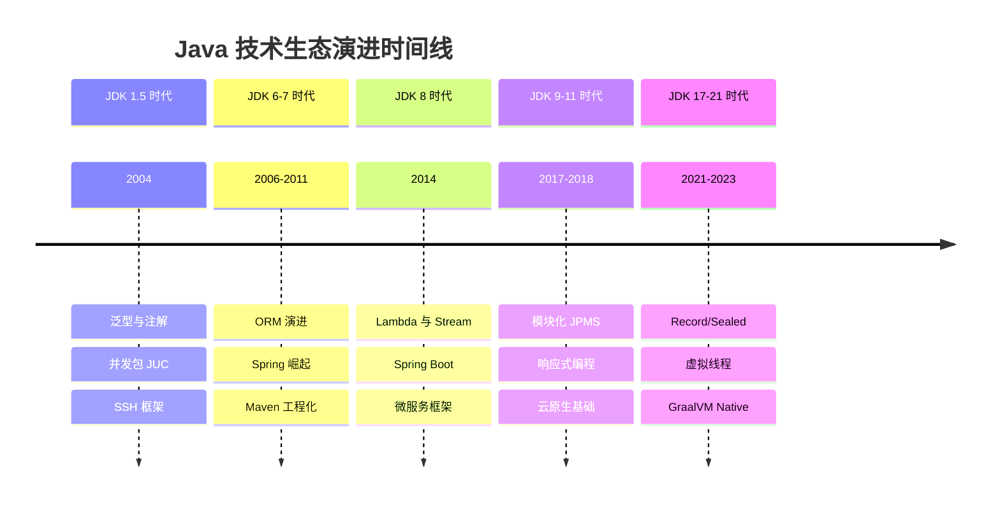

# ☕ Java 技术生态演进

  
  
  
  

欢迎来到 Java 技术生态演进系列！本系列将带你深入了解 Java 从 JDK 1.5 到 JDK 21 的技术演进历程，涵盖语言特性、框架生态、工程化实践与部署方式的全面演变。

---

## 📍 演进路线图

---

## 📚 文章目录

| 阶段 | 序号 | 标题 | 核心内容 | 时长 |
|:----:|:----:|------|----------|:----:|
| **开篇** | 1 | [Java技术生态全景图](./docs/01-全景概述/01-Java技术生态全景图.md) | 整体演进脉络、技术关联 | 30min |
| **JDK 1.5** | 2 | [泛型与注解革命](./docs/02-JDK5时代/01-泛型与注解革命.md) | 类型安全、元编程基础 | 45min |
| | 3 | [并发编程基石](./docs/02-JDK5时代/02-并发编程基石.md) | JUC包、Executor框架 | 50min |
| | 4 | [SSH框架黄金组合](./docs/02-JDK5时代/03-SSH框架黄金组合.md) | Struts/Spring/Hibernate | 40min |
| **JDK 6-7** | 5 | [ORM框架演进](./docs/03-JDK6-7时代/01-ORM框架演进.md) | Hibernate→MyBatis | 40min |
| | 6 | [Spring生态崛起](./docs/03-JDK6-7时代/02-Spring生态崛起.md) | Spring 3.x、Spring MVC | 45min |
| | 7 | [Maven与工程化](./docs/03-JDK6-7时代/03-Maven与工程化.md) | 依赖管理、构建生命周期 | 35min |
| **JDK 8** | 8 | [Lambda与Stream革命](./docs/04-JDK8时代/01-Lambda与Stream革命.md) | 函数式编程范式 | 50min |
| | 9 | [Spring Boot破茧而出](./docs/04-JDK8时代/02-SpringBoot破茧而出.md) | 自动配置、约定优于配置 | 45min |
| | 10 | [微服务框架涌现](./docs/04-JDK8时代/03-微服务框架涌现.md) | Dubbo、Spring Cloud | 50min |
| **JDK 9-11** | 11 | [模块化与新API](./docs/05-JDK9-11时代/01-模块化与新API.md) | JPMS、HttpClient | 40min |
| | 12 | [响应式编程崛起](./docs/05-JDK9-11时代/02-响应式编程崛起.md) | Reactor、WebFlux | 50min |
| | 13 | [云原生基础设施](./docs/05-JDK9-11时代/03-云原生基础设施.md) | Docker、Kubernetes | 40min |
| **JDK 17-21** | 14 | [现代语言特性](./docs/06-JDK17-21时代/01-现代语言特性.md) | Record、Sealed、Pattern | 45min |
| | 15 | [虚拟线程革命](./docs/06-JDK17-21时代/02-虚拟线程革命.md) | Project Loom | 55min |
| | 16 | [GraalVM与Native](./docs/06-JDK17-21时代/03-GraalVM与Native.md) | AOT编译、Native Image | 45min |
| **总结** | 17 | [并发模型演进专题](./docs/07-总结与展望/01-并发模型演进专题.md) | Thread→Virtual Thread | 50min |
| | 18 | [演进规律与未来展望](./docs/07-总结与展望/02-演进规律与未来展望.md) | 技术选型哲学 | 35min |

---

## 📋 前置要求

- 🔧 **Java 基础**：具备 Java 编程基础
- 📚 **开发经验**：有一定的项目开发经验更佳
- 🧠 **阅读兴趣**：对技术历史有探索兴趣

---

## 🛠️ 涵盖技术栈

**语言特性**
- 泛型、注解、Lambda、Stream、Record、Sealed、Virtual Thread

**框架生态**
- Servlet → Struts → Spring MVC → Spring Boot → WebFlux
- JDBC → Hibernate → MyBatis → Spring Data JPA
- Dubbo → Spring Cloud Netflix → Spring Cloud Alibaba

**工程化**
- Ant → Maven → Gradle
- WAR → Embedded Container → Docker → Kubernetes → Native Image

**并发模型**
- Thread → Executor → Fork/Join → CompletableFuture → Virtual Thread

---

## 🚀 快速开始

  <a href="./docs/01-全景概述/01-Java技术生态全景图.md">
    <strong>📖 开始阅读第一篇：Java技术生态全景图 →</strong>
  </a>

---

  <a href="../">⬅️ 返回博客主站</a>

