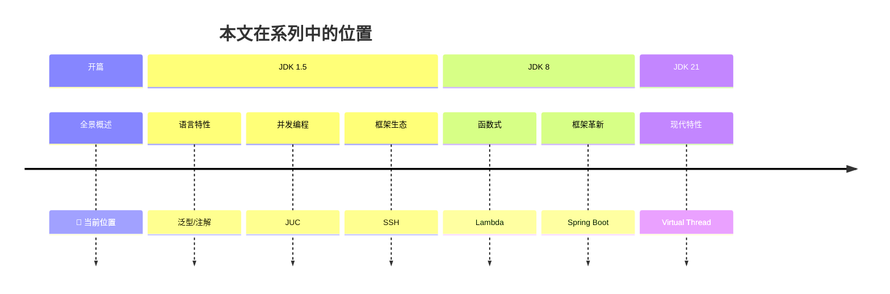
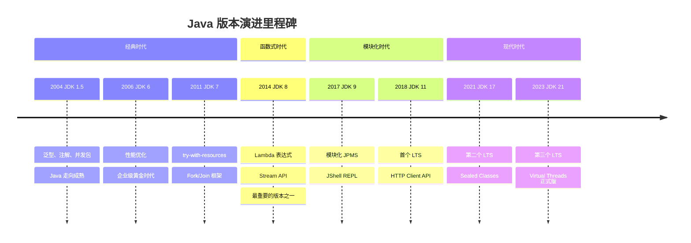
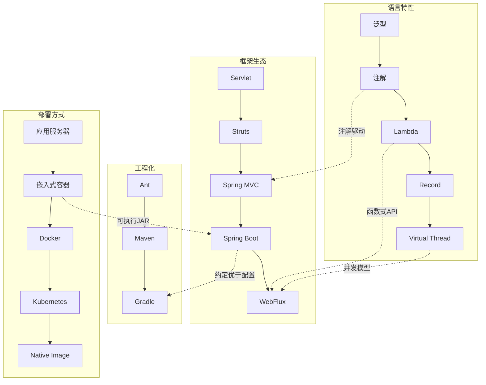
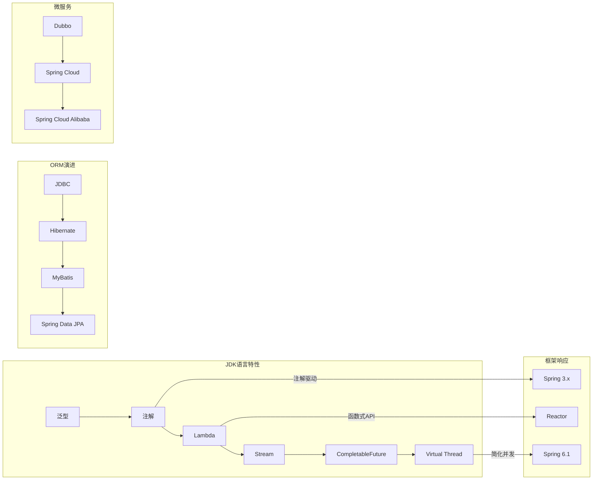
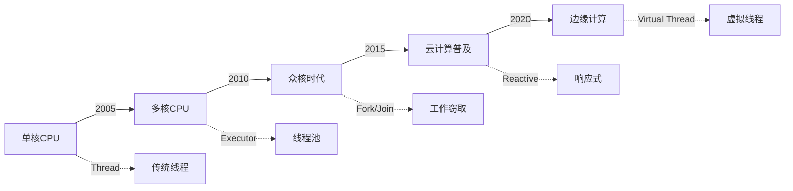
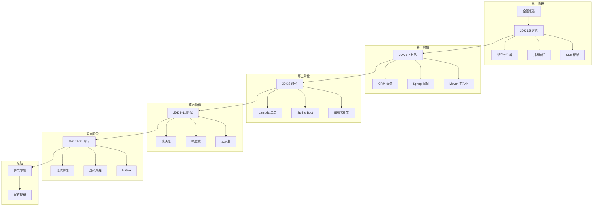

# Java 技术生态全景图

<p align="center">
  
  
  
</p>

---

## 📍 时间线定位



---

## 🎯 了解目标

- ✅ 理解 Java 技术生态的四大板块
- ✅ 掌握 JDK 版本演进的关键节点
- ✅ 了解技术演进背后的驱动力
- ✅ 建立本系列的阅读框架

---

## 📖 章节摘要

本文作为系列开篇，将为你勾勒 Java 技术生态 20 年演进的完整图景。从语言特性到框架生态，从工程化实践到部署方式，你将看到一个不断进化、持续创新的技术世界。

---

## 1. Java 25 年演进时间线

Java 从 1995 年诞生至今，已经走过了近 30 年的历程。但真正的"现代 Java"可以从 JDK 1.5（2004年）算起——这是 Java 历史上变化最大的一个版本。

### 1.1 关键版本里程碑



### 1.2 发布节奏的变化

| 时期 | 发布周期 | 特点 |
|------|----------|------|
| JDK 1.0 - 8 | 2-5 年 | 大版本，变化巨大 |
| JDK 9 - 21 | 6 个月 | 小步快跑，持续迭代 |

> 🏛️ **技术考古**：JDK 9 之前，Java 一直采用"大教堂"式的开发模式——每个版本都要积累足够多的特性才会发布。JDK 8 延期了多次，从最初计划的 2013 年推迟到 2014 年 3 月。这促使 Oracle 在 JDK 9 之后改为六个月一版的"集市"模式。

---

## 2. 技术生态四大板块

Java 技术生态可以划分为四个相互关联的板块：



### 2.1 语言特性演进

| 时期 | 核心特性 | 解决的问题 |
|------|----------|------------|
| JDK 1.5 | 泛型、注解 | 类型安全、消除配置地狱 |
| JDK 8 | Lambda、Stream | 代码简洁、并行处理 |
| JDK 14-16 | Record、Pattern | 数据建模、模式匹配 |
| JDK 21 | Virtual Thread | 高并发简化 |

### 2.2 框架生态演进

| 时期 | 主流框架 | 架构风格 |
|------|----------|----------|
| 2004-2008 | SSH（Struts+Spring+Hibernate） | 分层架构 |
| 2008-2014 | SSM（Spring MVC+Spring+MyBatis） | 注解驱动 |
| 2014-2018 | Spring Boot | 微服务基础 |
| 2018-现在 | Spring Cloud / WebFlux | 云原生 |

### 2.3 工程化演进

| 时期 | 构建工具 | 特点 |
|------|----------|------|
| 2000-2004 | Ant | 命令式、灵活但繁琐 |
| 2004-2014 | Maven | 约定优于配置、依赖管理 |
| 2012-现在 | Gradle | Groovy/Kotlin DSL、增量构建 |

### 2.4 部署方式演进

| 时期 | 部署方式 | 典型技术 |
|------|----------|----------|
| 2000-2010 | 应用服务器 | Tomcat、WebLogic、JBoss |
| 2014-2018 | 嵌入式容器 | Spring Boot 可执行 JAR |
| 2018-现在 | 容器化 | Docker、Kubernetes |
| 2021-现在 | Native | GraalVM Native Image |

---

## 3. 技术关联全景图

技术不是孤立存在的，它们之间存在着紧密的关联：



### 3.1 语言特性驱动框架演进

**案例：注解与 Spring**

JDK 1.5 引入注解后，Spring 2.5 率先支持 `@Autowired`、`@Component` 等注解，彻底改变了 Java 企业开发的方式：

```java
// Before: XML 配置 (Spring 1.x/2.0)
<bean id="userService" class="com.example.UserServiceImpl">
    <property name="userDao" ref="userDao"/>
</bean>

// After: 注解配置 (Spring 2.5+)
@Service
public class UserServiceImpl implements UserService {
    @Autowired
    private UserDao userDao;
}
```

**案例：Lambda 与函数式 API**

JDK 8 的 Lambda 表达式使得框架可以设计更流畅的 API：

```java
// Before: 匿名内部类
List<String> names = new ArrayList<>();
for (User user : users) {
    if (user.getAge() > 18) {
        names.add(user.getName());
    }
}

// After: Stream + Lambda
List<String> names = users.stream()
    .filter(u -> u.getAge() > 18)
    .map(User::getName)
    .collect(Collectors.toList());
```

---

## 4. 演进驱动力分析

Java 技术生态的演进并非偶然，背后有几个核心驱动力：

### 4.1 硬件发展



### 4.2 业务复杂度

| 时期 | 业务特点 | 技术响应 |
|------|----------|----------|
| 2000s | 单体应用 | SSH 分层架构 |
| 2010s | 互联网规模 | 微服务拆分 |
| 2015+ | 高并发 | 响应式编程 |
| 2020+ | 云原生 | Kubernetes + Service Mesh |

### 4.3 开发效率追求

每一代技术都在追求更高的开发效率：

| 痛点 | 解决方案 | 效果 |
|------|----------|------|
| XML 配置地狱 | 注解 + 自动配置 | 减少 80% 配置 |
| 样板代码 | Lombok + Record | 减少 50% 代码 |
| 部署复杂 | Docker + K8s | 一键部署 |
| 启动慢 | Native Image | 毫秒级启动 |

---

## 5. 本系列阅读路线

本系列将按照时间线，带你深入每个时代的核心技术：



### 5.1 阅读建议

1. **按顺序阅读**：技术演进有其内在逻辑，理解前因才能更好地理解后果
2. **关注代码演进**：每篇文章都会展示同一功能在不同时代的实现方式
3. **思考关联性**：注意语言特性与框架设计之间的相互影响
4. **总结规律**：每个阶段结束后回顾演进规律

---

## 6. 演进规律初探

在正式开始之前，先揭示几个贯穿整个系列的演进规律：

### 6.1 简洁化

```
冗长的代码 → 简洁的表达

匿名内部类 → Lambda 表达式
POJO + Getter/Setter → Record
XML 配置 → 注解 → 约定
```

### 6.2 声明式

```
命令式编程 → 声明式编程

for 循环遍历 → Stream 管道
手动事务管理 → @Transactional
XML Bean 定义 → @Component 扫描
```

### 6.3 异步化

```
同步阻塞 → 异步非阻塞

Thread.sleep() → CompletableFuture
Servlet 阻塞 → WebFlux 响应式
平台线程 → 虚拟线程
```

---

## 📚 参考资料

- [Java Version History - Wikipedia](https://en.wikipedia.org/wiki/Java_version_history)
- [Spring Framework History](https://spring.io/blog)
- [The Java Language Specification](https://docs.oracle.com/javase/specs/)

---

<p align="center">
  🏠 <a href="../../">返回目录</a> |
  <a href="../02-JDK5时代/01-泛型与注解革命.md">下一篇：泛型与注解革命</a> ➡️
</p>

