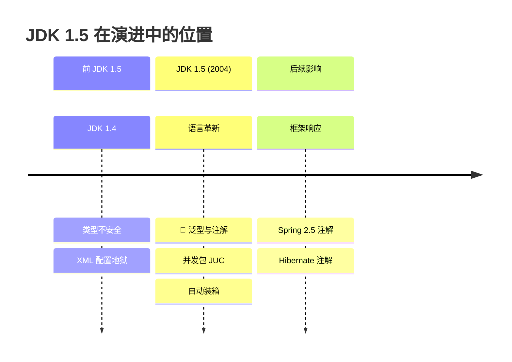
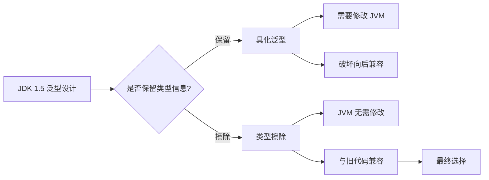
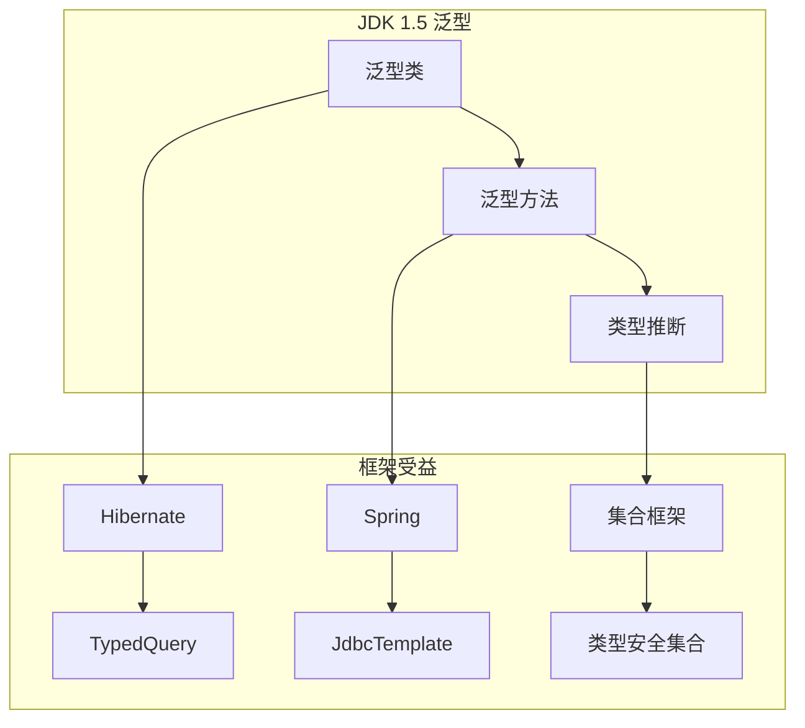
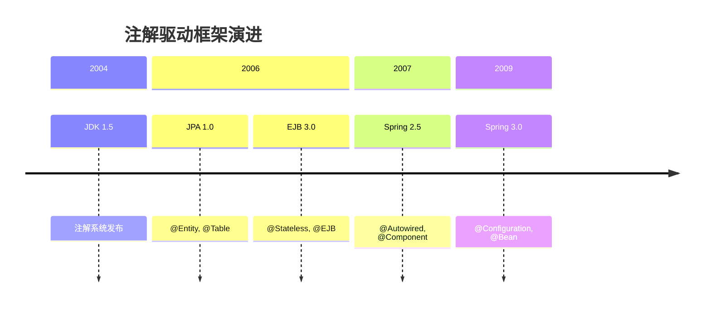

# 泛型与注解革命

<p align="center">
  
  
  
</p>

---

## 📍 时间线定位



---

## 🎯 了解目标

- ✅ 理解 JDK 1.4 时代的类型安全痛点
- ✅ 掌握泛型的核心概念与类型擦除机制
- ✅ 理解注解系统的设计与应用场景
- ✅ 了解这些特性对后续框架发展的深远影响

---

## 📖 章节摘要

JDK 1.5 引入的泛型和注解是 Java 历史上最重要的语言特性之一。泛型解决了集合类型安全问题，注解则为框架开发提供了元编程能力，彻底改变了 Java 企业开发的面貌。

---

## 1. 历史背景与痛点

### 1.1 JDK 1.4 的类型安全困境

在 JDK 1.5 之前，Java 集合是"原始类型"，没有泛型约束：

```java
// JDK 1.4: 集合没有类型安全
List users = new ArrayList();
users.add(new User("Alice"));
users.add("Not a user");  // 编译通过！运行时才会发现问题

// 取出时必须强制转换
for (int i = 0; i < users.size(); i++) {
    User user = (User) users.get(i);  // 可能抛出 ClassCastException
}
```

**问题分析**：

| 问题 | 影响 |
|------|------|
| 编译期无法发现类型错误 | Bug 延迟到运行时 |
| 大量显式类型转换 | 代码冗长且易出错 |
| IDE 无法提供智能提示 | 开发效率低 |

### 1.2 XML 配置地狱

JDK 1.5 之前的框架普遍依赖 XML 配置：

```xml
<!-- Spring 1.x 的典型配置 -->
<beans>
    <bean id="dataSource" class="org.apache.commons.dbcp.BasicDataSource">
        <property name="driverClassName" value="com.mysql.jdbc.Driver"/>
        <property name="url" value="jdbc:mysql://localhost:3306/mydb"/>
        <property name="username" value="root"/>
        <property name="password" value="password"/>
    </bean>
    
    <bean id="userDao" class="com.example.UserDaoImpl">
        <property name="dataSource" ref="dataSource"/>
    </bean>
    
    <bean id="userService" class="com.example.UserServiceImpl">
        <property name="userDao" ref="userDao"/>
    </bean>
    
    <!-- 更多配置... 一个项目可能有上千行 XML -->
</beans>
```

**痛点**：
- 配置与代码分离，跳转困难
- IDE 支持有限，重构风险高
- 容易出现拼写错误，只有运行时才能发现

---

## 2. 泛型：类型安全的革命

### 2.1 泛型基础

JDK 1.5 引入的泛型让集合拥有了编译期类型检查：

```java
// JDK 1.5+: 泛型集合
List<User> users = new ArrayList<User>();
users.add(new User("Alice"));
users.add("Not a user");  // 编译错误！

// 无需强制转换
for (User user : users) {  // 增强 for 循环也是 JDK 1.5 新增
    System.out.println(user.getName());
}
```

### 2.2 泛型的核心概念

#### 2.2.1 类型参数

```java
// 泛型类
public class Box<T> {
    private T content;
    
    public void set(T content) {
        this.content = content;
    }
    
    public T get() {
        return content;
    }
}

// 泛型方法
public <T> T getFirst(List<T> list) {
    return list.isEmpty() ? null : list.get(0);
}
```

#### 2.2.2 类型边界

```java
// 上界：T 必须是 Number 或其子类
public <T extends Number> double sum(List<T> numbers) {
    double sum = 0;
    for (T num : numbers) {
        sum += num.doubleValue();
    }
    return sum;
}

// 多重边界
public <T extends Comparable<T> & Serializable> void process(T item) {
    // T 必须同时实现 Comparable 和 Serializable
}
```

#### 2.2.3 通配符

```java
// 无界通配符：只读场景
public void printList(List<?> list) {
    for (Object item : list) {
        System.out.println(item);
    }
}

// 上界通配符：协变
public void processNumbers(List<? extends Number> numbers) {
    for (Number num : numbers) {
        System.out.println(num.doubleValue());
    }
}

// 下界通配符：逆变
public void addIntegers(List<? super Integer> list) {
    list.add(1);
    list.add(2);
}
```

### 2.3 类型擦除机制

> 💼 **面试考点**：Java 泛型采用类型擦除实现，这是面试高频考点。

Java 泛型是在编译期实现的，运行时类型信息被擦除：

```java
// 编译前
List<String> strings = new ArrayList<String>();
List<Integer> integers = new ArrayList<Integer>();

// 编译后（类型擦除）
List strings = new ArrayList();
List integers = new ArrayList();

// 验证：运行时类型相同
System.out.println(strings.getClass() == integers.getClass());  // true
```

**类型擦除的规则**：

| 泛型形式 | 擦除后 |
|----------|--------|
| `List<String>` | `List` |
| `T` | `Object` |
| `T extends Number` | `Number` |
| `T extends Comparable & Serializable` | `Comparable` |

**为什么选择类型擦除？**



> 🏛️ **技术考古**：Java 泛型的设计经历了漫长的讨论。JSR-14 提案从 1999 年开始，历时 5 年才最终发布。选择类型擦除而非具化泛型（如 C#）的主要原因是向后兼容——数十亿行的 Java 代码不能因为新特性而无法运行。

---

## 3. 注解：元编程的开端

### 3.1 注解基础

注解是一种特殊的接口，用于为代码添加元数据：

```java
// 定义注解
@Retention(RetentionPolicy.RUNTIME)
@Target(ElementType.METHOD)
public @interface Test {
    String value() default "";
    int timeout() default 0;
}

// 使用注解
public class MyTest {
    @Test(value = "测试用户登录", timeout = 1000)
    public void testLogin() {
        // 测试逻辑
    }
}
```

### 3.2 元注解

元注解是"注解的注解"，用于定义注解的行为：

```java
// @Retention: 注解的保留策略
@Retention(RetentionPolicy.SOURCE)   // 只在源码中，编译时丢弃
@Retention(RetentionPolicy.CLASS)    // 编译到 class 文件，运行时不可见（默认）
@Retention(RetentionPolicy.RUNTIME)  // 运行时可通过反射获取

// @Target: 注解可以应用的位置
@Target(ElementType.TYPE)            // 类、接口、枚举
@Target(ElementType.FIELD)           // 字段
@Target(ElementType.METHOD)          // 方法
@Target(ElementType.PARAMETER)       // 方法参数
@Target({ElementType.TYPE, ElementType.METHOD})  // 多个位置

// @Documented: 是否包含在 JavaDoc 中
// @Inherited: 子类是否继承父类的注解
```

### 3.3 反射获取注解

```java
// 通过反射读取注解
public class AnnotationProcessor {
    public void process(Class<?> clazz) {
        for (Method method : clazz.getDeclaredMethods()) {
            if (method.isAnnotationPresent(Test.class)) {
                Test test = method.getAnnotation(Test.class);
                System.out.println("发现测试方法: " + method.getName());
                System.out.println("描述: " + test.value());
                System.out.println("超时: " + test.timeout());
            }
        }
    }
}
```

### 3.4 JDK 内置注解

JDK 1.5 提供了三个重要的内置注解：

```java
// @Override: 标记重写方法，编译器会检查是否真的是重写
@Override
public String toString() {
    return "MyClass";
}

// @Deprecated: 标记已废弃的元素
@Deprecated
public void oldMethod() {
    // 不建议使用
}

// @SuppressWarnings: 抑制编译警告
@SuppressWarnings("unchecked")
public void useRawType() {
    List list = new ArrayList();  // 不会产生警告
}
```

---

## 4. 代码演进示例

### 4.1 集合使用演进

```java
// ========== JDK 1.4 写法 ==========
List users = new ArrayList();
users.add(new User("Alice", 25));
users.add(new User("Bob", 30));

// 遍历需要强制转换
Iterator it = users.iterator();
while (it.hasNext()) {
    User user = (User) it.next();
    if (user.getAge() > 20) {
        System.out.println(user.getName());
    }
}

// ========== JDK 1.5 写法 ==========
List<User> users = new ArrayList<User>();
users.add(new User("Alice", 25));
users.add(new User("Bob", 30));

// 类型安全，无需转换
for (User user : users) {
    if (user.getAge() > 20) {
        System.out.println(user.getName());
    }
}
```

### 4.2 配置方式演进

```java
// ========== JDK 1.4: 纯 XML 配置 ==========
// applicationContext.xml
<bean id="userService" class="com.example.UserServiceImpl">
    <property name="userDao" ref="userDao"/>
    <property name="emailService" ref="emailService"/>
</bean>

// Java 代码无任何配置信息
public class UserServiceImpl implements UserService {
    private UserDao userDao;
    private EmailService emailService;
    
    // setter 方法...
}

// ========== JDK 1.5+: 注解配置 ==========
// 注解标记（但此时 Spring 还未支持）
@Service
public class UserServiceImpl implements UserService {
    @Autowired
    private UserDao userDao;
    
    @Autowired
    private EmailService emailService;
}
// 注：Spring 2.5 (2007) 才开始支持注解
```

---

## 5. 技术关联分析

### 5.1 泛型与框架设计

泛型使得框架可以提供类型安全的 API：



```java
// Hibernate 利用泛型提供类型安全查询
TypedQuery<User> query = em.createQuery(
    "SELECT u FROM User u WHERE u.age > :age", User.class);
query.setParameter("age", 18);
List<User> users = query.getResultList();  // 无需强转

// Spring JdbcTemplate 利用泛型
public <T> List<T> query(String sql, RowMapper<T> rowMapper) {
    // ...
}
```

### 5.2 注解与框架演进



注解彻底改变了框架的配置方式：

| 框架 | 注解化版本 | 核心注解 |
|------|-----------|---------|
| JPA | 1.0 (2006) | `@Entity`, `@Id`, `@Column` |
| Spring | 2.5 (2007) | `@Autowired`, `@Component`, `@Service` |
| JUnit | 4.0 (2006) | `@Test`, `@Before`, `@After` |

---

## 6. 演进规律总结

### 6.1 从外部到内部

```
XML 配置（外部）→ 注解配置（内部）

配置信息从外部文件迁移到代码内部，
实现了"配置即代码"的理念。
```

### 6.2 从运行时到编译时

```
运行时类型检查 → 编译时类型检查

泛型将类型错误从运行时提前到编译时，
践行了"尽早失败"的原则。
```

### 6.3 从繁琐到简洁

```
显式类型转换 → 自动类型推断
for + Iterator → 增强 for 循环

每一次语言演进都在追求更简洁的表达。
```

---

## 7. 特殊元素

### 🏛️ 技术考古：泛型的诞生

Java 泛型的设计历程：

| 时间 | 事件 |
|------|------|
| 1998 | Martin Odersky 提出 Pizza 语言（泛型 Java 前身） |
| 1999 | JSR-14 提案提交 |
| 2001 | GJ (Generic Java) 编译器发布 |
| 2004 | JDK 1.5 正式包含泛型 |

Martin Odersky 后来创建了 Scala 语言，将泛型做到了极致。

### 💼 面试考点

**Q1: 为什么 Java 泛型使用类型擦除？**

答：主要原因是向后兼容。Java 选择在编译期实现泛型，运行时擦除类型信息，这样：
1. 不需要修改 JVM
2. 新旧代码可以互操作
3. 已有的字节码和类库无需重新编译

**Q2: `List<String>` 和 `List<Integer>` 是同一个类吗？**

答：是的。由于类型擦除，运行时它们都是 `List`，没有类型参数信息。可以通过 `list1.getClass() == list2.getClass()` 验证。

**Q3: 为什么不能创建泛型数组 `new T[]`？**

答：因为数组在运行时需要知道元素的实际类型来进行类型检查，但泛型类型在运行时已被擦除，无法获取 `T` 的实际类型。

---

## 📚 参考资料

- [JSR 14: Add Generic Types To The Java Programming Language](https://jcp.org/en/jsr/detail?id=14)
- [Java Generics FAQ by Angelika Langer](http://www.angelikalanger.com/GenericsFAQ/JavaGenericsFAQ.html)
- [Effective Java - Item 26-33: Generics](https://www.oreilly.com/library/view/effective-java-3rd/9780134686097/)

---

<p align="center">
  ⬅️ <a href="../01-全景概述/01-Java技术生态全景图.md">上一篇：Java技术生态全景图</a> |
  🏠 <a href="../../">返回目录</a> |
  <a href="./02-并发编程基石.md">下一篇：并发编程基石</a> ➡️
</p>

