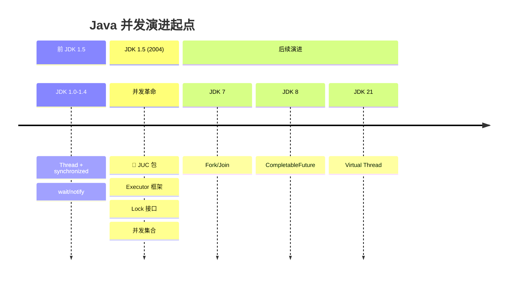
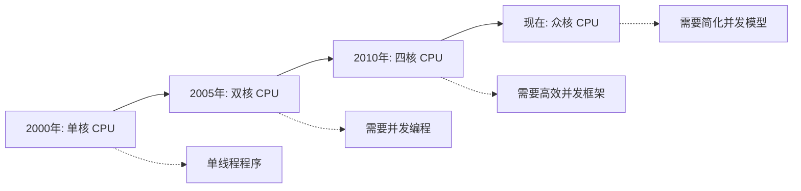
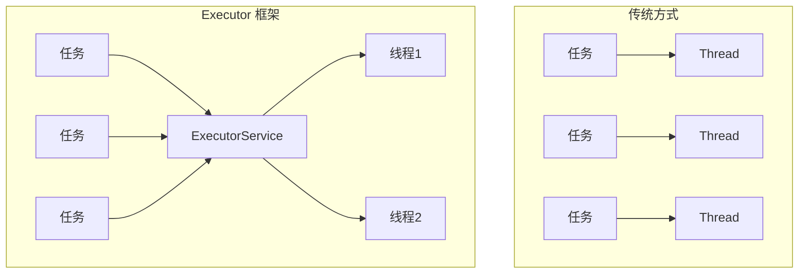
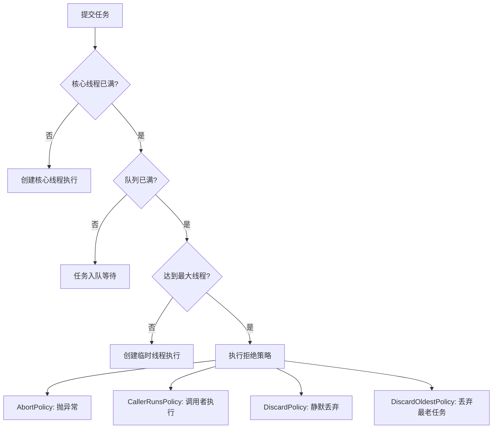
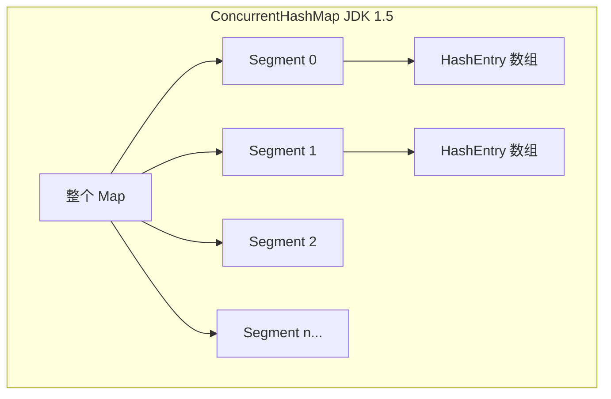
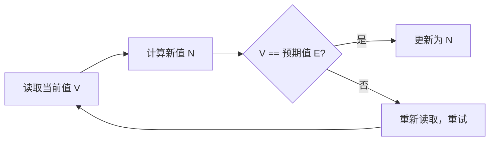
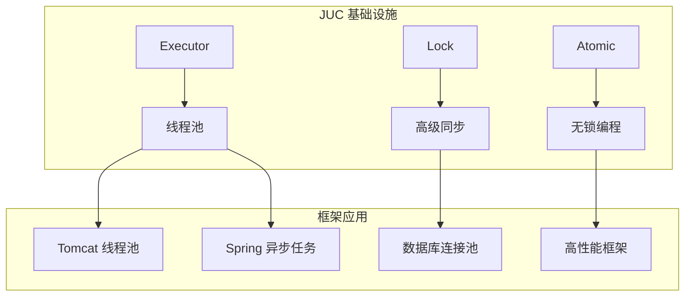
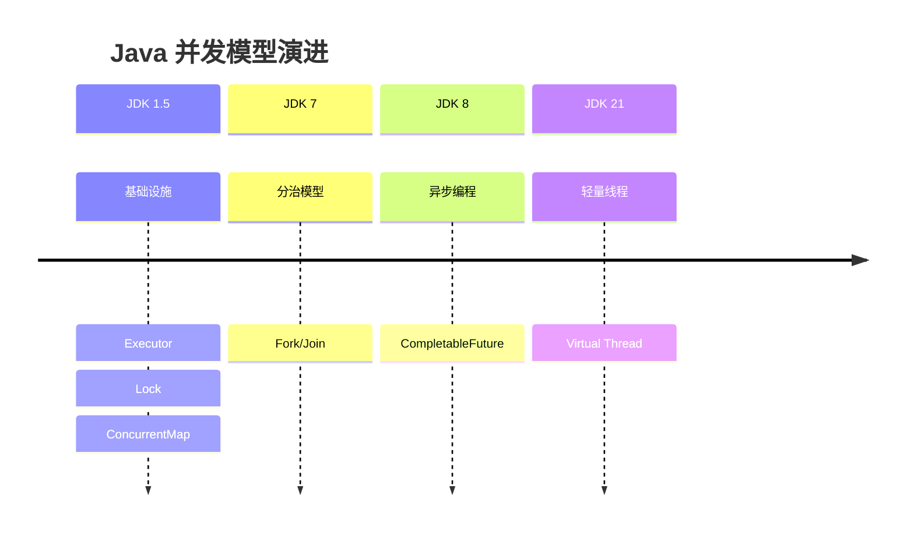

# 并发编程基石

<p align="center">
  
  
  
</p>

---

## 📍 时间线定位



---

## 🎯 了解目标

- ✅ 理解 JDK 1.4 并发编程的困境
- ✅ 掌握 Executor 框架的设计思想
- ✅ 理解 Lock 与 synchronized 的区别
- ✅ 了解并发集合的实现原理
- ✅ 认识 Doug Lea 对 Java 并发的贡献

---

## 📖 章节摘要

JDK 1.5 引入的 `java.util.concurrent`（JUC）包是 Java 并发编程的里程碑。它提供了 Executor 框架、Lock 接口、并发集合等核心组件，彻底改变了 Java 多线程编程的方式。

---

## 1. 历史背景与痛点

### 1.1 JDK 1.4 的并发困境

在 JUC 包出现之前，Java 并发编程只有基础工具：

```java
// JDK 1.4: 手动管理线程
public class OldStyleConcurrency {
    
    public void processTasksOldWay(List<Runnable> tasks) {
        // 问题1: 每个任务创建新线程，开销大
        for (Runnable task : tasks) {
            Thread t = new Thread(task);
            t.start();
        }
        // 问题2: 无法获取返回值
        // 问题3: 无法统一管理线程生命周期
        // 问题4: 无法控制并发数量
    }
    
    // 同步只有 synchronized，粒度粗
    private final Object lock = new Object();
    
    public void synchronizedMethod() {
        synchronized (lock) {
            // 问题: 无法尝试获取锁、无法设置超时
            // 无法实现公平锁、读写分离
        }
    }
}
```

**主要痛点**：

| 痛点 | 影响 |
|------|------|
| 线程创建开销大 | 每个任务一个线程，资源浪费 |
| 无法获取异步结果 | Runnable 没有返回值 |
| 同步手段单一 | 只有 synchronized，不够灵活 |
| 缺乏线程安全集合 | 只有 Vector、Hashtable，效率低 |
| 线程间协作困难 | wait/notify 易出错 |

### 1.2 多核时代的挑战



2005 年前后，CPU 厂商开始转向多核架构。单线程程序无法充分利用多核性能，Java 急需更好的并发编程支持。

---

## 2. Executor 框架

### 2.1 核心思想：任务与执行分离



### 2.2 核心接口

```java
// Executor: 最基础的执行器接口
public interface Executor {
    void execute(Runnable command);
}

// ExecutorService: 增强的执行器，支持生命周期管理
public interface ExecutorService extends Executor {
    void shutdown();                          // 优雅关闭
    List<Runnable> shutdownNow();             // 立即关闭
    boolean isShutdown();                     // 是否已关闭
    <T> Future<T> submit(Callable<T> task);   // 提交有返回值的任务
    <T> Future<T> submit(Runnable task, T result);
}

// Callable: 有返回值的任务
public interface Callable<V> {
    V call() throws Exception;
}

// Future: 异步计算的结果
public interface Future<V> {
    boolean cancel(boolean mayInterruptIfRunning);
    boolean isCancelled();
    boolean isDone();
    V get() throws InterruptedException, ExecutionException;
    V get(long timeout, TimeUnit unit) throws TimeoutException;
}
```

### 2.3 线程池实现

```java
// 创建线程池的常用方式
ExecutorService fixedPool = Executors.newFixedThreadPool(10);
ExecutorService cachedPool = Executors.newCachedThreadPool();
ExecutorService singlePool = Executors.newSingleThreadExecutor();
ScheduledExecutorService scheduledPool = Executors.newScheduledThreadPool(5);

// 推荐：直接使用 ThreadPoolExecutor 自定义参数
ThreadPoolExecutor executor = new ThreadPoolExecutor(
    5,                      // corePoolSize: 核心线程数
    10,                     // maximumPoolSize: 最大线程数
    60, TimeUnit.SECONDS,   // keepAliveTime: 空闲线程存活时间
    new LinkedBlockingQueue<>(100),  // workQueue: 任务队列
    new ThreadPoolExecutor.CallerRunsPolicy()  // 拒绝策略
);
```

### 2.4 线程池工作原理



### 2.5 代码演进示例

```java
// ========== JDK 1.4 写法 ==========
public class OldConcurrency {
    public void processTasks(List<Runnable> tasks) {
        List<Thread> threads = new ArrayList<>();
        
        // 手动创建线程
        for (Runnable task : tasks) {
            Thread t = new Thread(task);
            threads.add(t);
            t.start();
        }
        
        // 手动等待所有线程完成
        for (Thread t : threads) {
            try {
                t.join();
            } catch (InterruptedException e) {
                Thread.currentThread().interrupt();
            }
        }
    }
}

// ========== JDK 1.5 写法 ==========
public class NewConcurrency {
    private final ExecutorService executor = Executors.newFixedThreadPool(10);
    
    public void processTasks(List<Callable<String>> tasks) 
            throws InterruptedException {
        // 提交所有任务，获取 Future 列表
        List<Future<String>> futures = executor.invokeAll(tasks);
        
        // 获取结果
        for (Future<String> future : futures) {
            try {
                String result = future.get();  // 阻塞等待结果
                System.out.println("Result: " + result);
            } catch (ExecutionException e) {
                e.printStackTrace();
            }
        }
    }
    
    public void shutdown() {
        executor.shutdown();
    }
}
```

---

## 3. Lock 接口

### 3.1 Lock vs synchronized

```java
// synchronized: 隐式锁
public synchronized void syncMethod() {
    // 自动获取锁，方法结束自动释放
}

// Lock: 显式锁
private final Lock lock = new ReentrantLock();

public void lockMethod() {
    lock.lock();  // 显式获取锁
    try {
        // 临界区代码
    } finally {
        lock.unlock();  // 必须在 finally 中释放
    }
}
```

### 3.2 Lock 的优势

| 特性 | synchronized | Lock |
|------|:------------:|:----:|
| 尝试获取锁 | ❌ | ✅ `tryLock()` |
| 超时获取 | ❌ | ✅ `tryLock(time, unit)` |
| 可中断获取 | ❌ | ✅ `lockInterruptibly()` |
| 公平锁 | ❌ | ✅ `new ReentrantLock(true)` |
| 多条件变量 | ❌ | ✅ `newCondition()` |
| 读写分离 | ❌ | ✅ `ReadWriteLock` |

### 3.3 ReentrantLock 示例

```java
public class BankAccount {
    private final Lock lock = new ReentrantLock();
    private double balance;
    
    // 尝试转账，失败立即返回
    public boolean tryTransfer(BankAccount target, double amount) {
        // 尝试获取锁，避免死锁
        if (lock.tryLock()) {
            try {
                if (target.lock.tryLock()) {
                    try {
                        if (balance >= amount) {
                            balance -= amount;
                            target.balance += amount;
                            return true;
                        }
                    } finally {
                        target.lock.unlock();
                    }
                }
            } finally {
                lock.unlock();
            }
        }
        return false;
    }
}
```

### 3.4 ReadWriteLock 读写锁

```java
public class CachedData {
    private final ReadWriteLock rwLock = new ReentrantReadWriteLock();
    private final Lock readLock = rwLock.readLock();
    private final Lock writeLock = rwLock.writeLock();
    private Object data;
    
    // 多个线程可以同时读
    public Object read() {
        readLock.lock();
        try {
            return data;
        } finally {
            readLock.unlock();
        }
    }
    
    // 写操作互斥
    public void write(Object newData) {
        writeLock.lock();
        try {
            data = newData;
        } finally {
            writeLock.unlock();
        }
    }
}
```

---

## 4. 并发集合

### 4.1 ConcurrentHashMap

> 💼 **面试考点**：ConcurrentHashMap 的分段锁机制是面试高频题。

JDK 1.5 的 ConcurrentHashMap 使用分段锁实现：



```java
// 线程安全的使用方式
ConcurrentHashMap<String, Integer> map = new ConcurrentHashMap<>();

// 原子操作
map.putIfAbsent("key", 1);           // 不存在才放入
map.remove("key", 1);                 // 值匹配才删除
map.replace("key", 1, 2);             // 值匹配才替换

// 对比旧方案
// Hashtable: 整个表一把锁，效率低
// Collections.synchronizedMap(): 也是整表加锁
```

**分段锁原理（JDK 1.5-1.7）**：

| 操作 | 锁范围 |
|------|--------|
| get | 无锁（volatile 读） |
| put | 锁定对应的 Segment |
| size | 先尝试无锁，失败则锁全部 Segment |

### 4.2 CopyOnWriteArrayList

适用于读多写少的场景：

```java
CopyOnWriteArrayList<String> list = new CopyOnWriteArrayList<>();

// 写操作：复制整个数组
list.add("item");  // 创建新数组，复制旧数据，添加新元素

// 读操作：无锁直接读
String item = list.get(0);  // 直接访问当前数组

// 迭代安全：快照迭代
for (String s : list) {
    // 迭代期间其他线程修改不影响本次迭代
}
```

### 4.3 阻塞队列

```java
// BlockingQueue: 线程间传递数据的利器
BlockingQueue<Task> queue = new LinkedBlockingQueue<>(100);

// 生产者
queue.put(task);      // 队列满时阻塞
queue.offer(task);    // 队列满时返回 false
queue.offer(task, 1, TimeUnit.SECONDS);  // 超时版本

// 消费者
Task task = queue.take();   // 队列空时阻塞
Task task = queue.poll();   // 队列空时返回 null
Task task = queue.poll(1, TimeUnit.SECONDS);  // 超时版本
```

常用阻塞队列：

| 队列 | 特点 |
|------|------|
| `ArrayBlockingQueue` | 有界数组队列 |
| `LinkedBlockingQueue` | 可选有界链表队列 |
| `PriorityBlockingQueue` | 优先级队列 |
| `SynchronousQueue` | 不存储元素，直接传递 |

---

## 5. 原子类与 CAS

### 5.1 CAS 原理

CAS（Compare And Swap）是无锁并发的基础：



### 5.2 原子类使用

```java
// AtomicInteger: 原子整数
AtomicInteger counter = new AtomicInteger(0);
counter.incrementAndGet();     // ++i
counter.getAndIncrement();     // i++
counter.compareAndSet(0, 1);   // CAS 操作

// AtomicReference: 原子引用
AtomicReference<User> userRef = new AtomicReference<>();
userRef.compareAndSet(oldUser, newUser);

// AtomicStampedReference: 带版本号，解决 ABA 问题
AtomicStampedReference<Integer> ref = 
    new AtomicStampedReference<>(100, 0);
ref.compareAndSet(100, 101, 0, 1);  // 值和版本号都要匹配
```

### 5.3 代码演进

```java
// ========== synchronized 方式 ==========
public class SyncCounter {
    private int count = 0;
    
    public synchronized int increment() {
        return ++count;
    }
}

// ========== 原子类方式 ==========
public class AtomicCounter {
    private final AtomicInteger count = new AtomicInteger(0);
    
    public int increment() {
        return count.incrementAndGet();  // 无锁，性能更高
    }
}
```

---

## 6. 线程间协作工具

### 6.1 CountDownLatch

一次性门栓，等待多个事件完成：

```java
// 等待 3 个任务完成
CountDownLatch latch = new CountDownLatch(3);

for (int i = 0; i < 3; i++) {
    executor.execute(() -> {
        try {
            doWork();
        } finally {
            latch.countDown();  // 完成一个任务
        }
    });
}

latch.await();  // 等待所有任务完成
System.out.println("All tasks completed!");
```

### 6.2 CyclicBarrier

可重用的屏障，多线程相互等待：

```java
// 3 个线程相互等待
CyclicBarrier barrier = new CyclicBarrier(3, () -> {
    System.out.println("All threads reached barrier!");
});

for (int i = 0; i < 3; i++) {
    executor.execute(() -> {
        doPhase1();
        barrier.await();  // 等待其他线程
        
        doPhase2();
        barrier.await();  // 可重复使用
    });
}
```

### 6.3 Semaphore

信号量，控制并发访问数量：

```java
// 限制最多 10 个并发
Semaphore semaphore = new Semaphore(10);

public void accessResource() {
    semaphore.acquire();  // 获取许可
    try {
        useResource();
    } finally {
        semaphore.release();  // 释放许可
    }
}
```

---

## 7. 技术关联分析

### 7.1 JUC 对框架的影响



### 7.2 并发模型演进预览



---

## 8. 演进规律总结

### 8.1 从手动到框架

```
手动创建 Thread → Executor 框架管理

将线程的创建、管理、销毁交给框架，
开发者只关注任务本身。
```

### 8.2 从粗粒度到细粒度

```
synchronized（对象级）→ Lock（更灵活）
Hashtable（整表锁）→ ConcurrentHashMap（分段锁）

锁的粒度越细，并发度越高。
```

### 8.3 从阻塞到非阻塞

```
synchronized 等待 → tryLock 尝试
锁竞争 → CAS 无锁

减少线程阻塞，提高系统吞吐量。
```

---

## 9. 特殊元素

### 👤 关键人物：Doug Lea

Doug Lea 是 Java 并发编程的奠基人：

| 贡献 | 影响 |
|------|------|
| 设计 JUC 包 | 成为 Java 并发编程标准 |
| 编写 ConcurrentHashMap | 高并发场景必备 |
| Fork/Join 框架 | JDK 7 引入 |
| 《Java并发编程实战》参与 | 经典并发书籍 |

> 他是纽约州立大学奥斯威戈分校的教授，JUC 包几乎完全由他一人设计和实现。

### 💼 面试考点

**Q1: ConcurrentHashMap 如何保证线程安全？**

答：JDK 1.5-1.7 使用分段锁（Segment），每个 Segment 是一个独立的 HashTable，不同 Segment 可以并发操作。JDK 1.8 改为 CAS + synchronized，锁粒度更细（桶级别）。

**Q2: 线程池的核心参数有哪些？**

答：
- corePoolSize：核心线程数
- maximumPoolSize：最大线程数
- keepAliveTime：空闲线程存活时间
- workQueue：任务队列
- threadFactory：线程工厂
- handler：拒绝策略

**Q3: CountDownLatch 和 CyclicBarrier 的区别？**

答：
- CountDownLatch：一次性的，计数到 0 后不能重置；一个线程等待多个事件
- CyclicBarrier：可重用的；多个线程相互等待，到达屏障点后一起继续

---

## 📚 参考资料

- [JSR 166: Concurrency Utilities](https://jcp.org/en/jsr/detail?id=166)
- [Java Concurrency in Practice](https://jcip.net/)
- [Doug Lea's Home Page](http://gee.cs.oswego.edu/dl/)

---

<p align="center">
  ⬅️ <a href="./01-泛型与注解革命.md">上一篇：泛型与注解革命</a> |
  🏠 <a href="../../">返回目录</a> |
  <a href="./03-SSH框架黄金组合.md">下一篇：SSH框架黄金组合</a> ➡️
</p>

