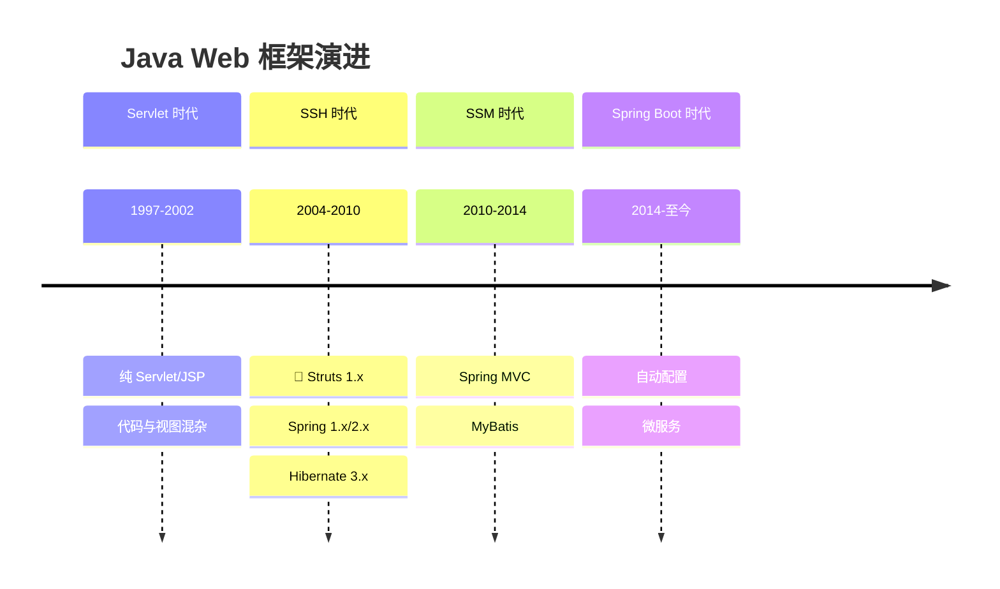
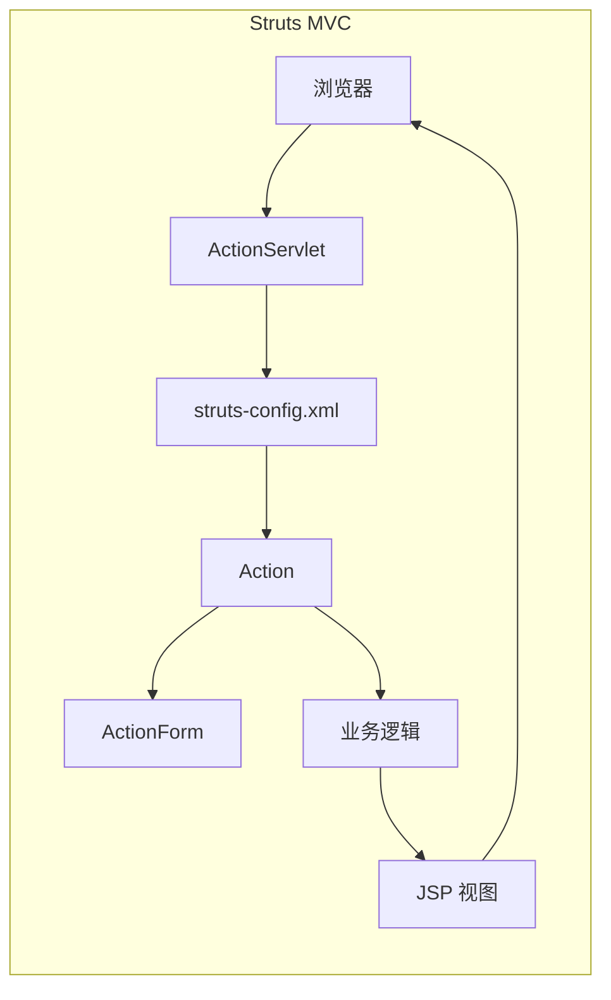
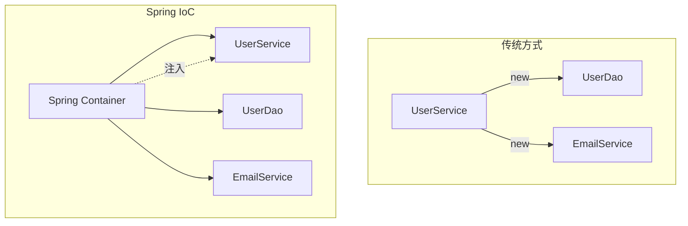
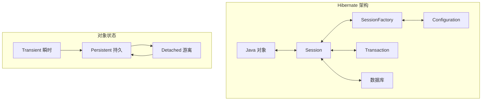
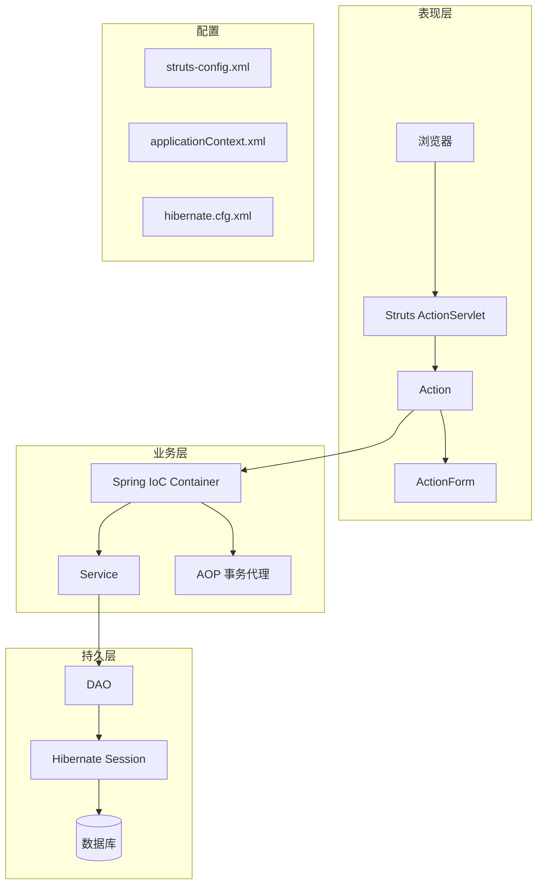
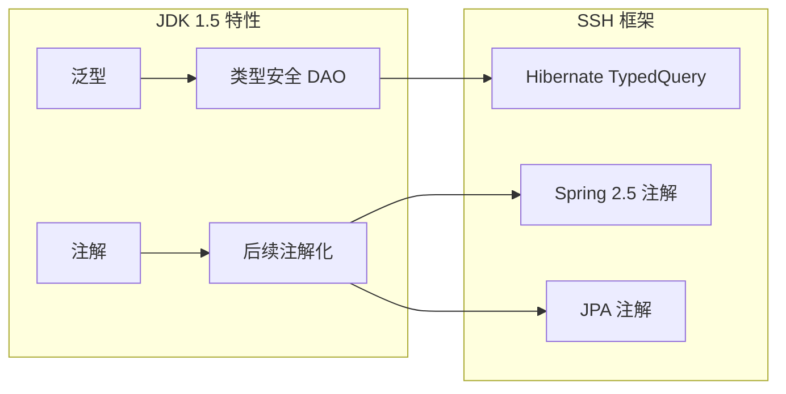

# SSH 框架黄金组合

<p align="center">
  
  
  
</p>

---

## 📍 时间线定位



---

## 🎯 了解目标

- ✅ 理解 Servlet 时代的 Web 开发痛点
- ✅ 了解 Struts、Spring、Hibernate 各自解决的问题
- ✅ 掌握 SSH 框架的整合架构
- ✅ 理解 SSH 架构的历史地位与兴衰

---

## 📖 章节摘要

SSH（Struts + Spring + Hibernate）是 2004-2010 年间 Java 企业开发的标准组合。这套框架组合首次实现了 MVC 架构、依赖注入和 ORM 的完美整合，奠定了 Java 企业开发的基本模式。

---

## 1. 历史背景与痛点

### 1.1 纯 Servlet/JSP 的困境

在框架出现之前，Java Web 开发是这样的：

```java
// Servlet 处理请求（1990s-2000s）
public class UserServlet extends HttpServlet {
    
    protected void doGet(HttpServletRequest request, 
                         HttpServletResponse response) 
            throws ServletException, IOException {
        
        String action = request.getParameter("action");
        
        // 问题1: 大量 if-else 判断
        if ("list".equals(action)) {
            // 问题2: 业务逻辑与请求处理混杂
            Connection conn = null;
            try {
                conn = DriverManager.getConnection(url, user, password);
                Statement stmt = conn.createStatement();
                ResultSet rs = stmt.executeQuery("SELECT * FROM users");
                
                List<User> users = new ArrayList<>();
                while (rs.next()) {
                    User user = new User();
                    user.setId(rs.getLong("id"));
                    user.setName(rs.getString("name"));
                    users.add(user);
                }
                
                request.setAttribute("users", users);
                
            } catch (SQLException e) {
                // 问题3: 异常处理繁琐
                throw new ServletException(e);
            } finally {
                // 问题4: 资源管理麻烦
                if (conn != null) conn.close();
            }
            
            // 问题5: 视图耦合
            request.getRequestDispatcher("/users.jsp").forward(request, response);
            
        } else if ("add".equals(action)) {
            // 更多重复代码...
        }
    }
}
```

```jsp
<%-- JSP 视图（问题：Java 代码与 HTML 混杂）--%>
<%@ page import="java.util.List, com.example.User" %>
<html>
<body>
    <table>
    <% 
        List<User> users = (List<User>) request.getAttribute("users");
        for (User user : users) {
    %>
        <tr>
            <td><%= user.getId() %></td>
            <td><%= user.getName() %></td>
        </tr>
    <% } %>
    </table>
</body>
</html>
```

**痛点汇总**：

| 问题 | 影响 |
|------|------|
| 请求分发手动处理 | if-else 泛滥 |
| 业务逻辑散落各处 | 难以维护和测试 |
| JDBC 样板代码多 | 重复、易出错 |
| 资源管理手动 | 容易泄漏 |
| 视图与代码混杂 | 难以分工协作 |
| 对象创建硬编码 | 耦合度高 |

---

## 2. Struts：MVC 模式引入

### 2.1 Struts 1.x 的革命

Struts 是第一个广泛使用的 Java MVC 框架：



### 2.2 核心组件

```java
// ActionForm: 表单数据封装
public class UserForm extends ActionForm {
    private String username;
    private String password;
    // getter/setter...
}

// Action: 请求处理
public class LoginAction extends Action {
    
    public ActionForward execute(ActionMapping mapping,
                                 ActionForm form,
                                 HttpServletRequest request,
                                 HttpServletResponse response) {
        
        UserForm userForm = (UserForm) form;
        
        // 业务逻辑
        if (userService.login(userForm.getUsername(), 
                              userForm.getPassword())) {
            return mapping.findForward("success");
        } else {
            return mapping.findForward("failure");
        }
    }
}
```

```xml
<!-- struts-config.xml: 集中配置 -->
<struts-config>
    <form-beans>
        <form-bean name="userForm" type="com.example.UserForm"/>
    </form-beans>
    
    <action-mappings>
        <action path="/login"
                type="com.example.LoginAction"
                name="userForm"
                scope="request">
            <forward name="success" path="/welcome.jsp"/>
            <forward name="failure" path="/login.jsp"/>
        </action>
    </action-mappings>
</struts-config>
```

### 2.3 Struts 解决的问题

| 问题 | Struts 方案 |
|------|-------------|
| 请求分发 | ActionServlet + 配置文件 |
| 表单数据绑定 | ActionForm 自动填充 |
| 视图导航 | ActionForward 配置化 |
| 代码结构 | MVC 分层 |

---

## 3. Spring：IoC 与 AOP

### 3.1 Spring 诞生背景

> 🏛️ **技术考古**：Spring 的诞生源于 Rod Johnson 的著作《Expert One-on-One J2EE Design and Development》(2002)。书中批评了 EJB 的复杂性，提出了轻量级容器的理念。

EJB（Enterprise JavaBeans）的问题：

| EJB 问题 | 影响 |
|----------|------|
| 配置复杂 | 大量部署描述符 |
| 侵入性强 | 必须实现特定接口 |
| 测试困难 | 依赖容器环境 |
| 性能开销 | 重量级组件 |

### 3.2 IoC 容器

控制反转（Inversion of Control）是 Spring 的核心：



```java
// 传统方式：硬编码依赖
public class UserService {
    private UserDao userDao = new UserDaoImpl();  // 耦合具体实现
    private EmailService emailService = new EmailServiceImpl();
}

// Spring 方式：依赖注入
public class UserService {
    private UserDao userDao;           // 只依赖接口
    private EmailService emailService;
    
    // setter 注入
    public void setUserDao(UserDao userDao) {
        this.userDao = userDao;
    }
    
    public void setEmailService(EmailService emailService) {
        this.emailService = emailService;
    }
}
```

```xml
<!-- Spring 配置 -->
<beans>
    <bean id="dataSource" class="org.apache.commons.dbcp.BasicDataSource">
        <property name="driverClassName" value="com.mysql.jdbc.Driver"/>
        <property name="url" value="jdbc:mysql://localhost:3306/mydb"/>
    </bean>
    
    <bean id="userDao" class="com.example.UserDaoImpl">
        <property name="dataSource" ref="dataSource"/>
    </bean>
    
    <bean id="userService" class="com.example.UserServiceImpl">
        <property name="userDao" ref="userDao"/>
        <property name="emailService" ref="emailService"/>
    </bean>
</beans>
```

### 3.3 AOP 面向切面

```java
// 横切关注点：事务、日志、安全等
public class TransactionInterceptor implements MethodInterceptor {
    
    public Object invoke(MethodInvocation invocation) throws Throwable {
        TransactionStatus status = txManager.getTransaction(def);
        try {
            Object result = invocation.proceed();  // 执行业务方法
            txManager.commit(status);
            return result;
        } catch (Exception e) {
            txManager.rollback(status);
            throw e;
        }
    }
}
```

```xml
<!-- AOP 配置 -->
<bean id="transactionInterceptor" 
      class="org.springframework.transaction.interceptor.TransactionInterceptor">
    <property name="transactionManager" ref="transactionManager"/>
    <property name="transactionAttributes">
        <props>
            <prop key="save*">PROPAGATION_REQUIRED</prop>
            <prop key="update*">PROPAGATION_REQUIRED</prop>
            <prop key="delete*">PROPAGATION_REQUIRED</prop>
            <prop key="*">PROPAGATION_REQUIRED,readOnly</prop>
        </props>
    </property>
</bean>
```

### 3.4 Spring 解决的问题

| 问题 | Spring 方案 |
|------|-------------|
| 对象耦合 | IoC 依赖注入 |
| 横切关注点 | AOP 切面编程 |
| 事务管理 | 声明式事务 |
| 测试困难 | Mock 注入 |

---

## 4. Hibernate：ORM 革命

### 4.1 JDBC 的痛苦

```java
// 纯 JDBC: 大量样板代码
public User findById(Long id) {
    Connection conn = null;
    PreparedStatement stmt = null;
    ResultSet rs = null;
    
    try {
        conn = dataSource.getConnection();
        stmt = conn.prepareStatement("SELECT * FROM users WHERE id = ?");
        stmt.setLong(1, id);
        rs = stmt.executeQuery();
        
        if (rs.next()) {
            User user = new User();
            user.setId(rs.getLong("id"));
            user.setName(rs.getString("name"));
            user.setEmail(rs.getString("email"));
            user.setAge(rs.getInt("age"));
            // 更多字段...
            return user;
        }
        return null;
        
    } catch (SQLException e) {
        throw new RuntimeException(e);
    } finally {
        // 繁琐的资源关闭
        if (rs != null) try { rs.close(); } catch (SQLException e) {}
        if (stmt != null) try { stmt.close(); } catch (SQLException e) {}
        if (conn != null) try { conn.close(); } catch (SQLException e) {}
    }
}
```

### 4.2 Hibernate ORM

```java
// Hibernate: 对象关系映射
@Entity
@Table(name = "users")
public class User {
    @Id
    @GeneratedValue(strategy = GenerationType.IDENTITY)
    private Long id;
    
    @Column(name = "name")
    private String name;
    
    @Column(name = "email")
    private String email;
    
    @ManyToOne
    @JoinColumn(name = "department_id")
    private Department department;
    
    // getter/setter...
}

// DAO 简化
public class UserDaoImpl implements UserDao {
    private SessionFactory sessionFactory;
    
    public User findById(Long id) {
        return sessionFactory.getCurrentSession().get(User.class, id);
    }
    
    public void save(User user) {
        sessionFactory.getCurrentSession().save(user);
    }
    
    public List<User> findByName(String name) {
        return sessionFactory.getCurrentSession()
            .createQuery("FROM User WHERE name = :name", User.class)
            .setParameter("name", name)
            .list();
    }
}
```

### 4.3 Hibernate 核心概念



### 4.4 Hibernate 解决的问题

| 问题 | Hibernate 方案 |
|------|----------------|
| JDBC 样板代码 | ORM 自动映射 |
| SQL 硬编码 | HQL/Criteria |
| 资源管理 | Session 管理 |
| 关联关系 | 对象导航 |
| 缓存 | 一级/二级缓存 |

---

## 5. SSH 整合架构

### 5.1 整体架构图



### 5.2 典型项目结构

```
project/
├── src/
│   ├── com/example/
│   │   ├── action/           # Struts Action
│   │   │   └── UserAction.java
│   │   ├── form/             # ActionForm
│   │   │   └── UserForm.java
│   │   ├── service/          # 业务层
│   │   │   ├── UserService.java
│   │   │   └── impl/
│   │   │       └── UserServiceImpl.java
│   │   ├── dao/              # 数据访问层
│   │   │   ├── UserDao.java
│   │   │   └── impl/
│   │   │       └── UserDaoImpl.java
│   │   └── entity/           # 实体类
│   │       └── User.java
├── WebContent/
│   ├── WEB-INF/
│   │   ├── web.xml
│   │   ├── struts-config.xml
│   │   ├── applicationContext.xml
│   │   └── classes/
│   │       └── hibernate.cfg.xml
│   └── jsp/
│       └── user/
│           ├── list.jsp
│           └── edit.jsp
└── lib/                      # 大量 JAR 包
```

### 5.3 代码示例

```java
// Action 层
public class UserAction extends Action {
    private UserService userService;  // Spring 注入
    
    public ActionForward list(ActionMapping mapping, ...) {
        List<User> users = userService.findAll();
        request.setAttribute("users", users);
        return mapping.findForward("list");
    }
}

// Service 层
public class UserServiceImpl implements UserService {
    private UserDao userDao;  // Spring 注入
    
    @Transactional
    public void save(User user) {
        userDao.save(user);
    }
    
    public List<User> findAll() {
        return userDao.findAll();
    }
}

// DAO 层
public class UserDaoImpl extends HibernateDaoSupport implements UserDao {
    
    public void save(User user) {
        getHibernateTemplate().save(user);
    }
    
    public List<User> findAll() {
        return getHibernateTemplate().find("from User");
    }
}
```

---

## 6. 代码演进示例

### 6.1 从 Servlet 到 SSH

```java
// ========== 纯 Servlet 时代 ==========
public class UserServlet extends HttpServlet {
    protected void doGet(HttpServletRequest req, HttpServletResponse resp) {
        Connection conn = DriverManager.getConnection(...);
        Statement stmt = conn.createStatement();
        ResultSet rs = stmt.executeQuery("SELECT * FROM users");
        // 手动映射、手动关闭资源...
        req.getRequestDispatcher("/list.jsp").forward(req, resp);
    }
}

// ========== SSH 时代 ==========
// Action（只处理请求转发）
public class UserAction extends Action {
    private UserService userService;
    
    public ActionForward list(ActionMapping mapping, ...) {
        request.setAttribute("users", userService.findAll());
        return mapping.findForward("list");
    }
}

// Service（业务逻辑）
@Transactional(readOnly = true)
public List<User> findAll() {
    return userDao.findAll();
}

// DAO（数据访问）
public List<User> findAll() {
    return getHibernateTemplate().find("from User");
}
```

---

## 7. 技术关联分析

### 7.1 SSH 与 JDK 特性



### 7.2 SSH 到 SSM 的过渡

| 变化 | SSH | SSM |
|------|-----|-----|
| MVC 框架 | Struts 1.x | Spring MVC |
| ORM 框架 | Hibernate | MyBatis |
| 配置方式 | 主要 XML | XML + 注解 |
| 时间 | 2004-2010 | 2010-2014 |

---

## 8. 演进规律总结

### 8.1 分层架构确立

```
单一 Servlet → MVC 三层 → 多层架构

表现层 → 业务层 → 持久层 → 数据库
```

### 8.2 配置与代码分离

```
硬编码 → XML 配置 → 注解配置

配置信息从代码中剥离，实现解耦。
```

### 8.3 声明式编程兴起

```
编程式事务 → 声明式事务
手动资源管理 → 框架自动管理

告诉框架"做什么"，而不是"怎么做"。
```

---

## 9. 特殊元素

### 🏛️ 技术考古：Spring 框架诞生

| 时间 | 事件 |
|------|------|
| 2002 | Rod Johnson 出版《Expert One-on-One J2EE》 |
| 2003 | Spring Framework 0.9 发布 |
| 2004 | Spring 1.0 正式发布 |
| 2006 | Spring 2.0 引入 XML Schema 配置 |
| 2007 | Spring 2.5 支持注解配置 |

Rod Johnson 的理念："J2EE 不需要 EJB"，倡导 POJO（Plain Old Java Object）编程。

### 👤 关键人物

| 人物 | 贡献 |
|------|------|
| Rod Johnson | Spring 框架创始人 |
| Gavin King | Hibernate 创始人 |
| Craig McClanahan | Struts 创始人 |

### 🤔 争议与反思：SSH 的兴衰

**SSH 的成功原因**：
1. 解决了实际痛点（MVC、IoC、ORM）
2. 开源免费，社区活跃
3. 技术资料丰富

**SSH 被淘汰的原因**：
1. Struts 1.x 设计缺陷（ActionForm 笨重、线程不安全）
2. XML 配置地狱（三个框架各一套配置）
3. Hibernate 在复杂查询场景不够灵活
4. Spring MVC 后来居上

> 💡 **启示**：技术框架的生命周期通常是 5-10 年。解决当下痛点的方案，可能会成为未来的包袱。

---

## 📚 参考资料

- [Spring Framework Reference](https://docs.spring.io/spring-framework/docs/)
- [Hibernate Documentation](https://hibernate.org/orm/documentation/)
- 《Expert One-on-One J2EE Design and Development》 - Rod Johnson

---

<p align="center">
  ⬅️ <a href="./02-并发编程基石.md">上一篇：并发编程基石</a> |
  🏠 <a href="../../README.md">返回目录</a> |
  <a href="../03-JDK6-7时代/01-ORM框架演进.md">下一篇：ORM框架演进</a> ➡️
</p>

