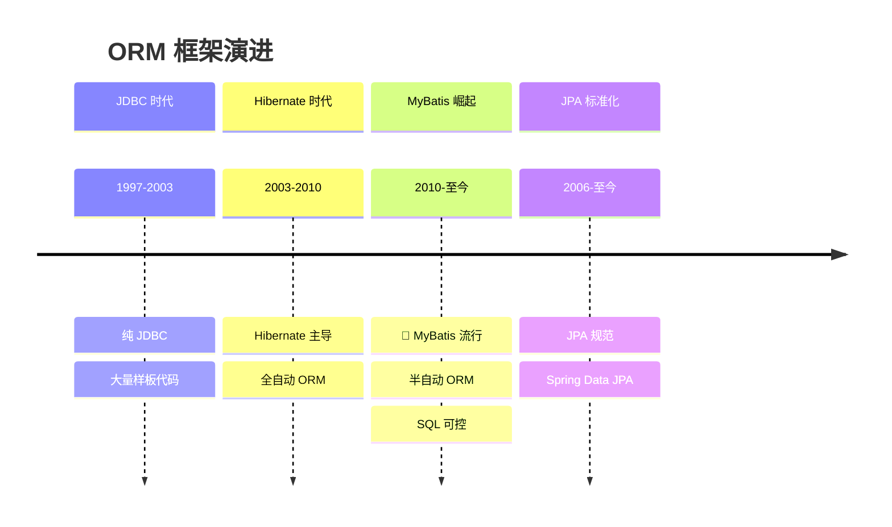
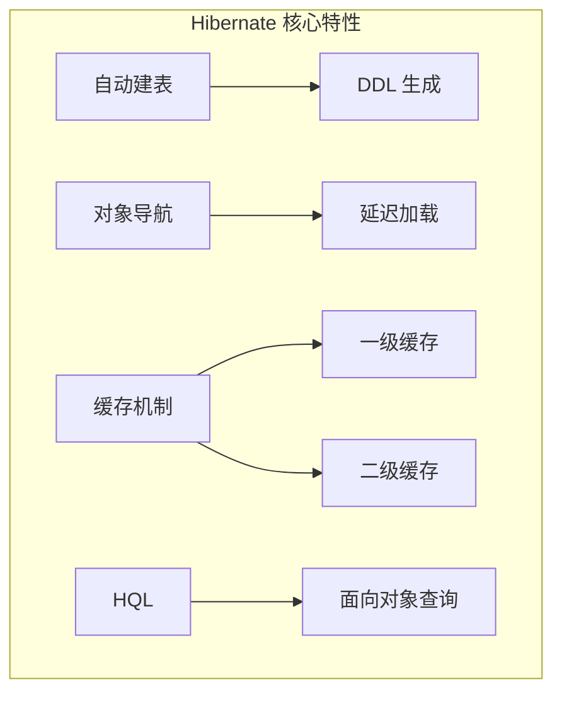
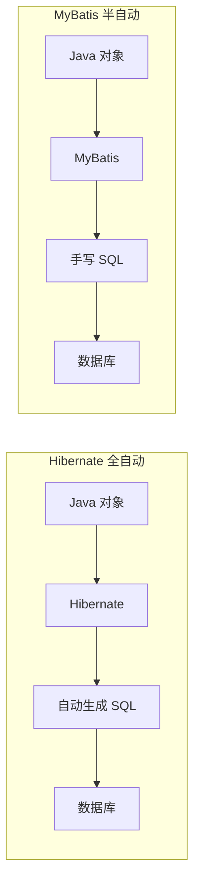
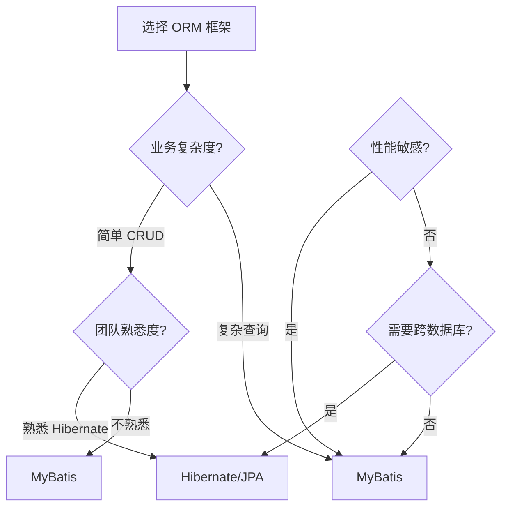
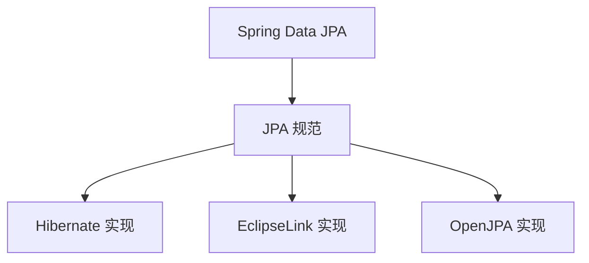
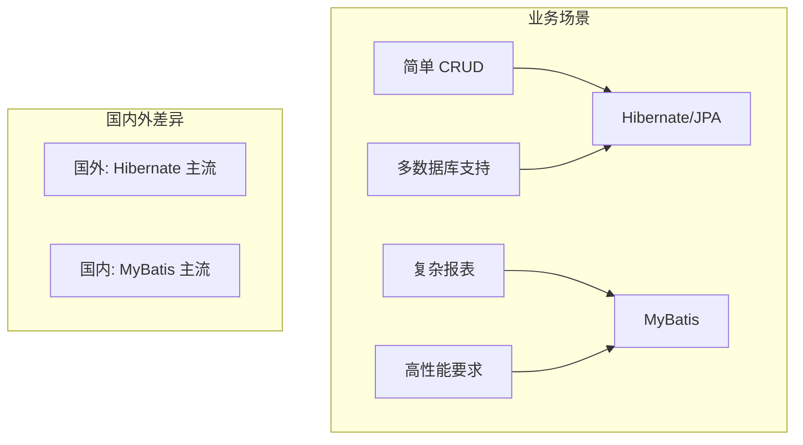

# ORM 框架演进

<p align="center">
  
  
  
</p>

---

## 📍 时间线定位



---

## 🎯 了解目标

- ✅ 理解 Hibernate 的成功与局限
- ✅ 掌握 MyBatis 的设计理念
- ✅ 了解两种 ORM 的适用场景
- ✅ 认识 JPA 规范的统一作用

---

## 📖 章节摘要

ORM（Object-Relational Mapping）框架经历了从 Hibernate 全自动化到 MyBatis 半自动化的演变。这种转变反映了国内互联网业务对 SQL 控制权的需求。

---

## 1. Hibernate 的成功与挑战

### 1.1 Hibernate 的革命性

Hibernate 实现了真正的对象关系映射：

```java
// Hibernate: 面向对象的数据访问
@Entity
public class User {
    @Id
    @GeneratedValue
    private Long id;
    
    private String name;
    
    @ManyToOne(fetch = FetchType.LAZY)
    private Department department;
    
    @OneToMany(mappedBy = "user", cascade = CascadeType.ALL)
    private List<Order> orders;
}

// 查询就像操作对象
User user = session.get(User.class, 1L);
Department dept = user.getDepartment();  // 透明的延迟加载
List<Order> orders = user.getOrders();   // 对象导航
```

### 1.2 Hibernate 的强大功能



### 1.3 Hibernate 的痛点

随着互联网业务复杂化，Hibernate 的问题逐渐显现：

```java
// 问题1: 复杂查询难以优化
// HQL 生成的 SQL 可能不是最优的
String hql = "SELECT u FROM User u WHERE u.department.name = :deptName";
// 实际生成可能包含不必要的 JOIN

// 问题2: 批量操作效率低
for (User user : users) {
    session.update(user);  // 每个对象一条 UPDATE
}

// 问题3: N+1 问题
List<User> users = session.createQuery("FROM User").list();
for (User user : users) {
    System.out.println(user.getDepartment().getName());
    // 每次访问 department 都可能触发一条查询
}
```

**Hibernate 痛点汇总**：

| 问题 | 影响 |
|------|------|
| SQL 不可控 | 难以针对性优化 |
| N+1 问题 | 性能隐患 |
| 上手难度高 | 团队门槛高 |
| 复杂场景支持差 | 报表、统计查询困难 |

---

## 2. MyBatis：SQL 可控的半自动 ORM

### 2.1 MyBatis 设计理念

> MyBatis 的前身是 iBatis（2004），2010 年迁移到 Google Code 后更名为 MyBatis。



### 2.2 MyBatis 核心概念

```java
// 实体类：普通 POJO，无需注解
public class User {
    private Long id;
    private String name;
    private Long departmentId;
    // getter/setter...
}

// Mapper 接口
public interface UserMapper {
    User selectById(Long id);
    List<User> selectByName(String name);
    int insert(User user);
    int update(User user);
    int delete(Long id);
}
```

```xml
<!-- UserMapper.xml: SQL 映射文件 -->
<?xml version="1.0" encoding="UTF-8"?>
<!DOCTYPE mapper PUBLIC "-//mybatis.org//DTD Mapper 3.0//EN"
    "http://mybatis.org/dtd/mybatis-3-mapper.dtd">

<mapper namespace="com.example.mapper.UserMapper">
    
    <!-- 结果映射 -->
    <resultMap id="userResultMap" type="User">
        <id property="id" column="id"/>
        <result property="name" column="name"/>
        <result property="departmentId" column="department_id"/>
    </resultMap>
    
    <!-- SQL 完全可控 -->
    <select id="selectById" resultMap="userResultMap">
        SELECT id, name, department_id
        FROM users
        WHERE id = #{id}
    </select>
    
    <!-- 动态 SQL -->
    <select id="selectByCondition" resultMap="userResultMap">
        SELECT id, name, department_id
        FROM users
        <where>
            <if test="name != null">
                AND name LIKE CONCAT('%', #{name}, '%')
            </if>
            <if test="departmentId != null">
                AND department_id = #{departmentId}
            </if>
        </where>
        ORDER BY id DESC
        LIMIT #{offset}, #{limit}
    </select>
    
    <insert id="insert" useGeneratedKeys="true" keyProperty="id">
        INSERT INTO users (name, department_id)
        VALUES (#{name}, #{departmentId})
    </insert>
    
</mapper>
```

### 2.3 动态 SQL

MyBatis 的动态 SQL 是其核心优势：

```xml
<!-- 复杂动态查询 -->
<select id="selectUsers" resultType="User">
    SELECT * FROM users
    <where>
        <if test="name != null and name != ''">
            AND name = #{name}
        </if>
        <if test="status != null">
            AND status = #{status}
        </if>
        <if test="ids != null and ids.size() > 0">
            AND id IN
            <foreach item="id" collection="ids" open="(" separator="," close=")">
                #{id}
            </foreach>
        </if>
    </where>
</select>

<!-- 批量插入 -->
<insert id="batchInsert">
    INSERT INTO users (name, department_id) VALUES
    <foreach item="user" collection="list" separator=",">
        (#{user.name}, #{user.departmentId})
    </foreach>
</insert>

<!-- SQL 片段复用 -->
<sql id="userColumns">
    id, name, email, department_id, created_at
</sql>

<select id="selectAll" resultType="User">
    SELECT <include refid="userColumns"/>
    FROM users
</select>
```

---

## 3. Hibernate vs MyBatis 对比

### 3.1 设计理念对比

| 维度 | Hibernate | MyBatis |
|------|-----------|---------|
| 理念 | 对象优先 | SQL 优先 |
| 映射 | 全自动 | 半自动 |
| SQL 控制 | 框架生成 | 开发者编写 |
| 上手难度 | 陡峭 | 平缓 |
| 适用场景 | CRUD 简单业务 | 复杂查询、性能敏感 |

### 3.2 代码对比

```java
// ========== Hibernate 方式 ==========
// 简单查询
User user = session.get(User.class, 1L);

// 复杂查询需要 HQL 或 Criteria
CriteriaBuilder cb = session.getCriteriaBuilder();
CriteriaQuery<User> query = cb.createQuery(User.class);
Root<User> root = query.from(User.class);
query.where(
    cb.and(
        cb.like(root.get("name"), "%张%"),
        cb.equal(root.get("status"), 1)
    )
);
List<User> users = session.createQuery(query).getResultList();

// ========== MyBatis 方式 ==========
// 简单查询
User user = userMapper.selectById(1L);

// 复杂查询：直接写 SQL
List<User> users = userMapper.selectByCondition(params);
// SQL 在 XML 中，完全可控、可优化
```

### 3.3 选型决策树



---

## 4. JPA 规范统一

### 4.1 JPA 简介

JPA（Java Persistence API）是 Java 官方的 ORM 规范：



### 4.2 JPA 注解

```java
@Entity
@Table(name = "users")
public class User {
    
    @Id
    @GeneratedValue(strategy = GenerationType.IDENTITY)
    private Long id;
    
    @Column(name = "user_name", length = 50, nullable = false)
    private String name;
    
    @ManyToOne(fetch = FetchType.LAZY)
    @JoinColumn(name = "dept_id")
    private Department department;
    
    @OneToMany(mappedBy = "user", cascade = CascadeType.ALL)
    private List<Order> orders;
    
    @Temporal(TemporalType.TIMESTAMP)
    @Column(name = "created_at")
    private Date createdAt;
}
```

### 4.3 Spring Data JPA

Spring Data JPA 大大简化了数据访问层：

```java
// 接口即实现
public interface UserRepository extends JpaRepository<User, Long> {
    
    // 方法名自动解析为 SQL
    List<User> findByName(String name);
    
    List<User> findByNameContainingAndStatus(String name, Integer status);
    
    @Query("SELECT u FROM User u WHERE u.department.id = :deptId")
    List<User> findByDepartmentId(@Param("deptId") Long deptId);
    
    @Modifying
    @Query("UPDATE User u SET u.status = :status WHERE u.id = :id")
    int updateStatus(@Param("id") Long id, @Param("status") Integer status);
}

// 使用
@Service
public class UserService {
    @Autowired
    private UserRepository userRepository;
    
    public List<User> findUsers(String name) {
        return userRepository.findByNameContaining(name);
    }
}
```

---

## 5. 代码演进示例

```java
// ========== JDBC 时代 (2000s) ==========
public User findById(Long id) {
    String sql = "SELECT * FROM users WHERE id = ?";
    Connection conn = dataSource.getConnection();
    PreparedStatement ps = conn.prepareStatement(sql);
    ps.setLong(1, id);
    ResultSet rs = ps.executeQuery();
    // 手动映射... 手动关闭资源...
}

// ========== Hibernate 时代 (2003-2010) ==========
public User findById(Long id) {
    return session.get(User.class, id);  // 全自动
}

// ========== MyBatis 时代 (2010+) ==========
// Mapper 接口
User selectById(Long id);

// XML 中的 SQL
<select id="selectById" resultType="User">
    SELECT id, name, dept_id FROM users WHERE id = #{id}
</select>

// ========== Spring Data JPA (2011+) ==========
public interface UserRepository extends JpaRepository<User, Long> {
    // 继承即拥有 CRUD 方法
}
```

---

## 6. 技术关联分析

### 6.1 ORM 与业务场景



### 6.2 为什么国内偏爱 MyBatis

| 因素 | 说明 |
|------|------|
| 互联网业务复杂 | 需要精细控制 SQL |
| DBA 文化 | 注重 SQL 审核与优化 |
| 上手门槛 | MyBatis 更易上手 |
| 历史原因 | 阿里等大厂推动 |

---

## 7. 演进规律总结

### 7.1 从全自动到可控

```
JDBC（手动） → Hibernate（全自动） → MyBatis（半自动）

"自动化"不总是最优解，"可控"有时更重要。
```

### 7.2 规范化趋势

```
私有 API → JPA 规范 → Spring Data 抽象

框架竞争最终趋向标准化。
```

---

## 8. 特殊元素

### 💼 面试考点

**Q1: Hibernate 一级缓存和二级缓存的区别？**

答：
- 一级缓存：Session 级别，默认开启，生命周期与 Session 相同
- 二级缓存：SessionFactory 级别，需要配置开启，可跨 Session 共享

**Q2: MyBatis 的 `#{}` 和 `${}` 区别？**

答：
- `#{}`：预编译参数，防止 SQL 注入，推荐使用
- `${}`：字符串替换，有 SQL 注入风险，仅用于动态表名/列名

**Q3: 如何解决 Hibernate N+1 问题？**

答：
- 使用 `@BatchSize` 批量加载
- 使用 `JOIN FETCH` 查询
- 设置 `FetchType.LAZY` 延迟加载
- 使用 DTO 投影避免关联查询

---

## 📚 参考资料

- [MyBatis 官方文档](https://mybatis.org/mybatis-3/)
- [Hibernate ORM Documentation](https://hibernate.org/orm/documentation/)
- [Spring Data JPA Reference](https://docs.spring.io/spring-data/jpa/docs/current/reference/html/)

---

<p align="center">
  ⬅️ <a href="../02-JDK5时代/03-SSH框架黄金组合.md">上一篇：SSH框架黄金组合</a> |
  🏠 <a href="../../">返回目录</a> |
  <a href="./02-Spring生态崛起.md">下一篇：Spring生态崛起</a> ➡️
</p>

