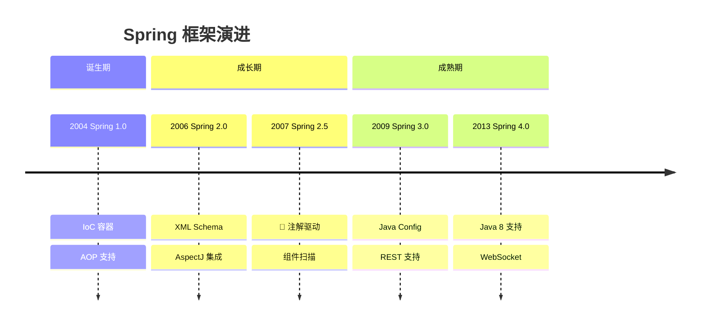
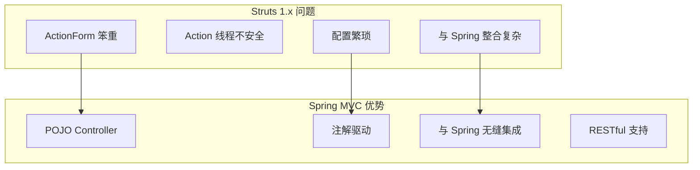
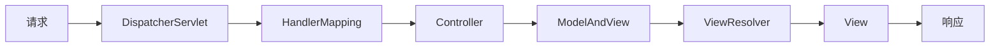
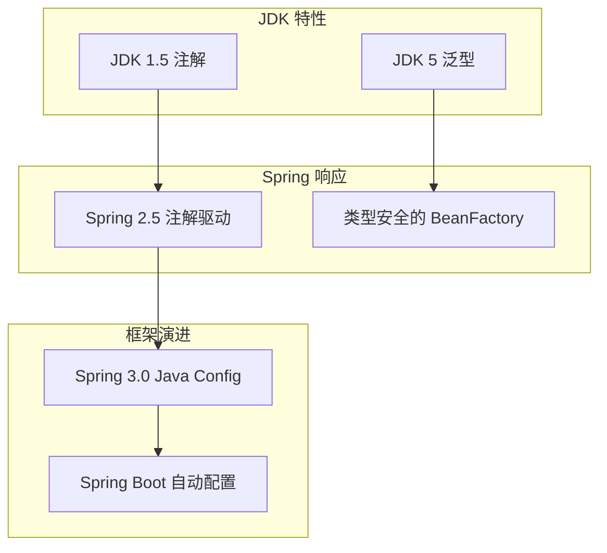
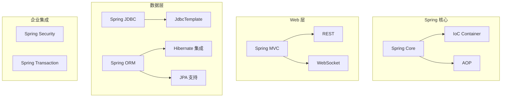

# Spring 生态崛起

<p align="center">
  
  
  
</p>

---

## 📍 时间线定位



---

## 🎯 了解目标

- ✅ 理解 Spring 从 XML 到注解的演进历程
- ✅ 掌握 Spring 2.5 注解驱动的核心概念
- ✅ 了解 Spring 3.0 Java Config 的设计思想
- ✅ 认识 Spring MVC 如何取代 Struts

---

## 📖 章节摘要

Spring 2.5 引入注解支持是框架历史上的重要转折点。从 XML 配置到注解驱动，Spring 大大提升了开发效率，并最终取代 Struts 成为 Web 开发的事实标准。

---

## 1. Spring 2.x → 3.x 的重大变化

### 1.1 Spring 版本演进

| 版本 | 年份 | 重要特性 |
|------|------|----------|
| 1.0 | 2004 | IoC、AOP 基础 |
| 2.0 | 2006 | XML Schema、AspectJ |
| 2.5 | 2007 | 注解驱动、组件扫描 |
| 3.0 | 2009 | Java Config、REST |
| 3.1 | 2011 | 环境抽象、缓存 |
| 3.2 | 2012 | Servlet 3.0、异步 |

### 1.2 配置方式对比

```mermaid
graph LR
    subgraph Spring 1.x-2.0
        A[纯 XML 配置] --> B[applicationContext.xml]
    end
    
    subgraph Spring 2.5
        C[XML + 注解] --> D[组件扫描]
        D --> E[@Component 系列]
    end
    
    subgraph Spring 3.0
        F[Java Config] --> G[@Configuration]
        G --> H[@Bean]
    end
```

---

## 2. Spring 2.5：注解驱动的开端

### 2.1 组件扫描

```xml
<!-- Spring 2.5: 开启组件扫描 -->
<context:component-scan base-package="com.example"/>
```

```java
// 使用注解标记组件
@Component
public class EmailService {
    // ...
}

@Service  // 语义化的 @Component
public class UserService {
    // ...
}

@Repository  // DAO 层
public class UserDao {
    // ...
}

@Controller  // Web 层
public class UserController {
    // ...
}
```

### 2.2 依赖注入注解

```java
// ========== Spring 2.0: XML 配置 ==========
<bean id="userService" class="com.example.UserServiceImpl">
    <property name="userDao" ref="userDao"/>
    <property name="emailService" ref="emailService"/>
</bean>

// ========== Spring 2.5: 注解注入 ==========
@Service
public class UserServiceImpl implements UserService {
    
    @Autowired  // 按类型注入
    private UserDao userDao;
    
    @Autowired
    @Qualifier("smtpEmailService")  // 指定 Bean 名称
    private EmailService emailService;
    
    @Value("${app.name}")  // 注入配置值
    private String appName;
}
```

### 2.3 生命周期注解

```java
@Service
public class CacheService {
    
    @PostConstruct  // Bean 初始化后调用
    public void init() {
        System.out.println("缓存服务初始化");
        loadCache();
    }
    
    @PreDestroy  // Bean 销毁前调用
    public void destroy() {
        System.out.println("缓存服务关闭");
        clearCache();
    }
}
```

---

## 3. Spring 3.0：Java Config 革命

### 3.1 纯 Java 配置

```java
// 告别 XML，使用 Java 类配置
@Configuration
@ComponentScan("com.example")
@PropertySource("classpath:application.properties")
public class AppConfig {
    
    @Value("${db.url}")
    private String dbUrl;
    
    @Bean
    public DataSource dataSource() {
        HikariDataSource ds = new HikariDataSource();
        ds.setJdbcUrl(dbUrl);
        ds.setUsername("root");
        ds.setPassword("password");
        return ds;
    }
    
    @Bean
    public JdbcTemplate jdbcTemplate(DataSource dataSource) {
        return new JdbcTemplate(dataSource);
    }
}
```

### 3.2 配置方式演进对比

```java
// ========== Spring 1.x: 纯 XML ==========
<beans>
    <bean id="dataSource" class="...">
        <property name="url" value="jdbc:mysql://..."/>
    </bean>
    
    <bean id="userDao" class="com.example.UserDaoImpl">
        <property name="dataSource" ref="dataSource"/>
    </bean>
    
    <bean id="userService" class="com.example.UserServiceImpl">
        <property name="userDao" ref="userDao"/>
    </bean>
</beans>

// ========== Spring 2.5: XML + 注解 ==========
<context:component-scan base-package="com.example"/>

@Service
public class UserServiceImpl {
    @Autowired
    private UserDao userDao;
}

// ========== Spring 3.0: 纯 Java ==========
@Configuration
@ComponentScan("com.example")
public class AppConfig {
    @Bean
    public DataSource dataSource() {
        return new HikariDataSource();
    }
}
```

### 3.3 Java Config 的优势

| 优势 | 说明 |
|------|------|
| 类型安全 | 编译期检查，IDE 提示 |
| 重构友好 | 改名自动同步 |
| 条件化配置 | 可以使用 if/for 逻辑 |
| 无需掌握 XML Schema | Java 开发者更熟悉 |

---

## 4. Spring MVC：取代 Struts

### 4.1 为什么 Spring MVC 取代了 Struts



### 4.2 Spring MVC 核心组件



### 4.3 Spring MVC 代码示例

```java
// Spring MVC Controller（对比 Struts Action）
@Controller
@RequestMapping("/users")
public class UserController {
    
    @Autowired
    private UserService userService;
    
    // RESTful 风格的 URL 映射
    @GetMapping
    public String list(Model model) {
        model.addAttribute("users", userService.findAll());
        return "user/list";  // 视图名
    }
    
    @GetMapping("/{id}")
    public String detail(@PathVariable Long id, Model model) {
        model.addAttribute("user", userService.findById(id));
        return "user/detail";
    }
    
    @PostMapping
    public String create(@ModelAttribute User user) {
        userService.save(user);
        return "redirect:/users";
    }
    
    // JSON 响应
    @GetMapping("/api")
    @ResponseBody
    public List<User> listJson() {
        return userService.findAll();
    }
}
```

### 4.4 Struts vs Spring MVC

```java
// ========== Struts 1.x ==========
public class UserAction extends Action {
    public ActionForward execute(ActionMapping mapping,
                                 ActionForm form,
                                 HttpServletRequest request,
                                 HttpServletResponse response) {
        UserForm userForm = (UserForm) form;
        // 处理逻辑
        return mapping.findForward("success");
    }
}

// 配置
<action path="/user"
        type="com.example.UserAction"
        name="userForm"
        scope="request">
    <forward name="success" path="/user.jsp"/>
</action>

// ========== Spring MVC ==========
@Controller
public class UserController {
    
    @GetMapping("/user")
    public String show(@RequestParam Long id, Model model) {
        // 直接使用参数，无需 Form 类
        model.addAttribute("user", userService.findById(id));
        return "user";  // 视图名
    }
}
```

---

## 5. 技术关联分析

### 5.1 Spring 与 JDK 特性



### 5.2 Spring 生态系统



---

## 6. 代码演进示例

### 6.1 事务管理演进

```java
// ========== 编程式事务 (Spring 1.x) ==========
public void transfer(Long fromId, Long toId, BigDecimal amount) {
    TransactionDefinition def = new DefaultTransactionDefinition();
    TransactionStatus status = txManager.getTransaction(def);
    try {
        accountDao.debit(fromId, amount);
        accountDao.credit(toId, amount);
        txManager.commit(status);
    } catch (Exception e) {
        txManager.rollback(status);
        throw e;
    }
}

// ========== XML 声明式事务 (Spring 2.0) ==========
<tx:advice id="txAdvice" transaction-manager="txManager">
    <tx:attributes>
        <tx:method name="transfer*" propagation="REQUIRED"/>
    </tx:attributes>
</tx:advice>

// ========== 注解声明式事务 (Spring 2.5+) ==========
@Service
public class AccountService {
    
    @Transactional
    public void transfer(Long fromId, Long toId, BigDecimal amount) {
        accountDao.debit(fromId, amount);
        accountDao.credit(toId, amount);
        // 异常自动回滚
    }
    
    @Transactional(readOnly = true)
    public Account findById(Long id) {
        return accountDao.findById(id);
    }
}
```

---

## 7. 演进规律总结

### 7.1 从 XML 到注解

```
XML 配置 → XML + 注解 → 纯 Java Config

配置信息从外部文件回归到代码内部，
"配置即代码" 理念逐步实现。
```

### 7.2 从繁琐到简洁

```
Struts ActionForm → Spring POJO
显式配置 → 约定优于配置

框架在不断减少样板代码。
```

### 7.3 从侵入到非侵入

```
继承框架类 → 实现框架接口 → 使用注解

对业务代码的侵入性越来越低。
```

---

## 8. 特殊元素

### 👤 关键人物：Rod Johnson

| 事件 | 时间 | 影响 |
|------|------|------|
| 出版《Expert One-on-One J2EE》| 2002 | 提出轻量级容器理念 |
| 创建 Spring Framework | 2003 | 改变 Java 企业开发 |
| 创立 SpringSource 公司 | 2004 | Spring 商业化 |
| VMware 收购 SpringSource | 2009 | Spring 获得企业级支持 |

> 💡 Rod Johnson 的名言："J2EE without EJB"

### 📝 版本迁移要点：Spring 2 → 3

1. **XML 命名空间变化**
   - `http://www.springframework.org/schema/beans` 保持不变
   - 建议升级 XSD 版本

2. **废弃的 API**
   - `SimpleFormController` → `@Controller`
   - `AbstractCommandController` → `@Controller`

3. **新增的注解**
   - `@Configuration`
   - `@Bean`
   - `@PropertySource`

### 💼 面试考点

**Q1: Spring IoC 容器的启动过程？**

答：
1. 加载配置（XML/注解/Java Config）
2. 解析 Bean 定义
3. 实例化 Bean
4. 依赖注入
5. 调用初始化方法（@PostConstruct）
6. Bean 就绪

**Q2: @Autowired 和 @Resource 的区别？**

答：
- `@Autowired`：Spring 注解，按类型注入，配合 `@Qualifier` 按名称
- `@Resource`：JSR-250 规范，默认按名称注入

**Q3: Spring AOP 的实现原理？**

答：
- JDK 动态代理：基于接口，使用 `Proxy.newProxyInstance()`
- CGLIB 代理：基于继承，生成目标类的子类
- Spring 默认：有接口用 JDK 代理，无接口用 CGLIB

---

## 📚 参考资料

- [Spring Framework Documentation](https://docs.spring.io/spring-framework/docs/)
- 《Spring in Action》
- [Rod Johnson 的博客](https://blog.springsource.com/)

---

<p align="center">
  ⬅️ <a href="./01-ORM框架演进.md">上一篇：ORM框架演进</a> |
  🏠 <a href="../../README.md">返回目录</a> |
  <a href="./03-Maven与工程化.md">下一篇：Maven与工程化</a> ➡️
</p>

