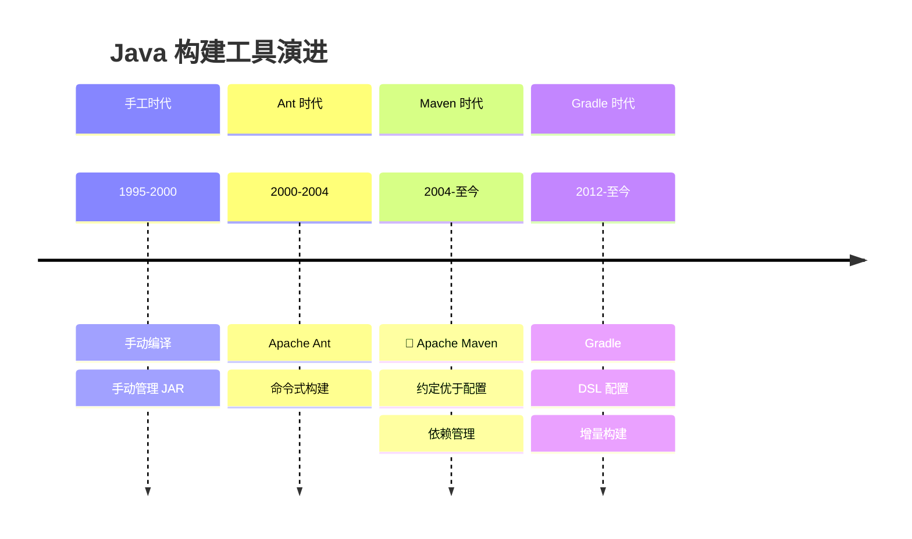
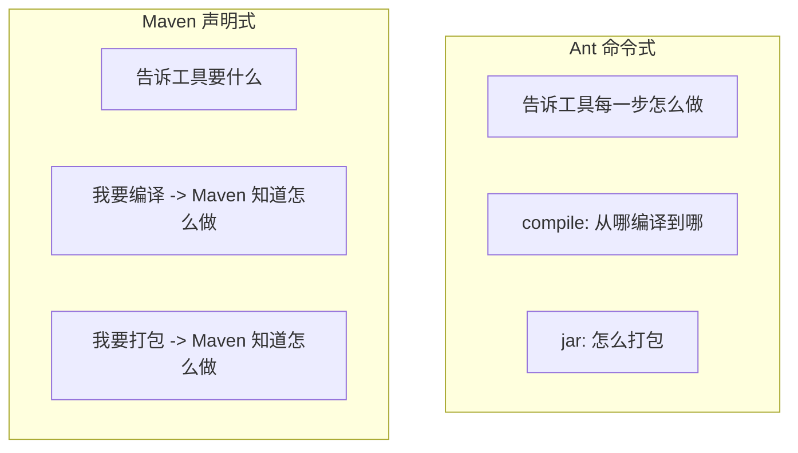
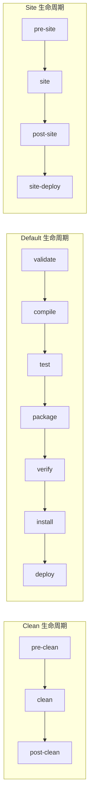
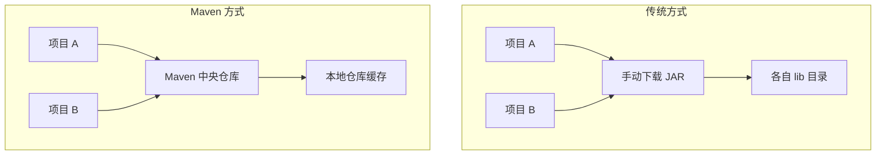
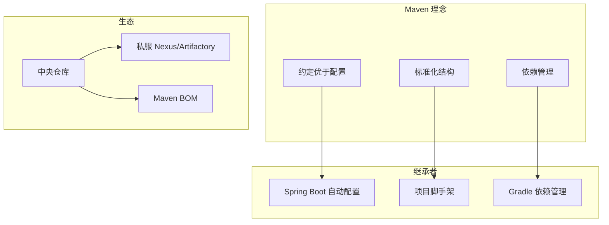

# Maven 与工程化

<p align="center">
  
  
  
</p>

---

## 📍 时间线定位



---

## 🎯 了解目标

- ✅ 理解 Ant 时代的构建痛点
- ✅ 掌握 Maven 的核心理念和生命周期
- ✅ 了解依赖管理和中央仓库的革命性意义
- ✅ 认识 Maven 对 Java 工程化的影响

---

## 📖 章节摘要

Maven 不仅仅是一个构建工具，它定义了 Java 项目的标准结构和工程化实践。"约定优于配置"的理念深刻影响了后续所有 Java 框架的设计。

---

## 1. 历史背景与痛点

### 1.1 手工管理时代

```bash
# 早期 Java 项目构建（手工时代）
# 1. 手动下载 JAR 包
# 2. 手动放入项目 lib 目录
# 3. 手动设置 classpath
# 4. 手动执行编译命令

javac -cp lib/a.jar:lib/b.jar:lib/c.jar -d build src/**/*.java
jar cvf myapp.jar -C build .

# 问题：
# - JAR 版本冲突
# - 依赖的依赖（传递依赖）难以管理
# - 每个项目结构不同
# - 团队协作困难
```

### 1.2 Ant 时代

Apache Ant（2000年）带来了自动化构建：

```xml
<!-- Ant build.xml - 命令式构建 -->
<project name="myapp" default="build">
    
    <property name="src.dir" value="src"/>
    <property name="build.dir" value="build"/>
    <property name="lib.dir" value="lib"/>
    
    <path id="classpath">
        <fileset dir="${lib.dir}" includes="*.jar"/>
    </path>
    
    <target name="clean">
        <delete dir="${build.dir}"/>
    </target>
    
    <target name="compile" depends="clean">
        <mkdir dir="${build.dir}/classes"/>
        <javac srcdir="${src.dir}" 
               destdir="${build.dir}/classes"
               classpathref="classpath"/>
    </target>
    
    <target name="jar" depends="compile">
        <jar destfile="${build.dir}/myapp.jar">
            <fileset dir="${build.dir}/classes"/>
        </jar>
    </target>
    
    <target name="build" depends="jar"/>
</project>
```

**Ant 的问题**：

| 问题 | 影响 |
|------|------|
| 每个项目配置不同 | 上手成本高 |
| 没有依赖管理 | 仍需手动管理 JAR |
| 没有标准结构 | 项目间难以统一 |
| 配置冗长 | 大量重复代码 |

---

## 2. Maven：约定优于配置

### 2.1 Maven 的革命性理念



### 2.2 标准目录结构

```
my-project/
├── pom.xml                    # 项目配置文件
├── src/
│   ├── main/
│   │   ├── java/              # 主代码
│   │   │   └── com/example/
│   │   │       └── App.java
│   │   └── resources/         # 主资源
│   │       └── application.properties
│   └── test/
│       ├── java/              # 测试代码
│       │   └── com/example/
│       │       └── AppTest.java
│       └── resources/         # 测试资源
└── target/                    # 构建输出（自动生成）
    ├── classes/
    └── myapp-1.0.jar
```

### 2.3 最简 pom.xml

```xml
<?xml version="1.0" encoding="UTF-8"?>
<project xmlns="http://maven.apache.org/POM/4.0.0"
         xmlns:xsi="http://www.w3.org/2001/XMLSchema-instance"
         xsi:schemaLocation="http://maven.apache.org/POM/4.0.0 
                             http://maven.apache.org/xsd/maven-4.0.0.xsd">
    
    <modelVersion>4.0.0</modelVersion>
    
    <!-- 项目坐标 -->
    <groupId>com.example</groupId>
    <artifactId>my-app</artifactId>
    <version>1.0.0</version>
    <packaging>jar</packaging>
    
    <!-- 依赖声明 -->
    <dependencies>
        <dependency>
            <groupId>junit</groupId>
            <artifactId>junit</artifactId>
            <version>4.13.2</version>
            <scope>test</scope>
        </dependency>
    </dependencies>
    
</project>
```

> 就这么简单！Maven 自动知道如何编译、测试、打包。

---

## 3. Maven 生命周期

### 3.1 三大生命周期



### 3.2 常用命令

```bash
# 清理
mvn clean                  # 删除 target 目录

# 编译
mvn compile               # 编译主代码
mvn test-compile          # 编译测试代码

# 测试
mvn test                  # 运行测试

# 打包
mvn package               # 打包（JAR/WAR）

# 安装
mvn install               # 安装到本地仓库

# 部署
mvn deploy                # 部署到远程仓库

# 组合使用
mvn clean install         # 清理后重新安装
mvn clean package -DskipTests  # 跳过测试打包
```

---

## 4. 依赖管理

### 4.1 中央仓库的革命



> 🏛️ **技术考古**：Maven 中央仓库（repo.maven.apache.org）于 2003 年建立，目前托管超过 800 万个构件，是世界上最大的 Java 库仓库。

### 4.2 依赖声明

```xml
<dependencies>
    <!-- 运行时依赖 -->
    <dependency>
        <groupId>org.springframework</groupId>
        <artifactId>spring-core</artifactId>
        <version>5.3.20</version>
    </dependency>
    
    <!-- 测试依赖 -->
    <dependency>
        <groupId>junit</groupId>
        <artifactId>junit</artifactId>
        <version>4.13.2</version>
        <scope>test</scope>  <!-- 只在测试时使用 -->
    </dependency>
    
    <!-- 编译时依赖，运行时由容器提供 -->
    <dependency>
        <groupId>javax.servlet</groupId>
        <artifactId>servlet-api</artifactId>
        <version>2.5</version>
        <scope>provided</scope>
    </dependency>
</dependencies>
```

### 4.3 依赖范围（Scope）

| Scope | 编译 | 测试 | 运行 | 示例 |
|-------|:----:|:----:|:----:|------|
| compile | ✅ | ✅ | ✅ | Spring 核心包 |
| test | ❌ | ✅ | ❌ | JUnit |
| provided | ✅ | ✅ | ❌ | Servlet API |
| runtime | ❌ | ✅ | ✅ | JDBC 驱动 |
| system | ✅ | ✅ | ❌ | 本地 JAR |

### 4.4 传递依赖

```xml
<!-- 你只需要声明 spring-webmvc -->
<dependency>
    <groupId>org.springframework</groupId>
    <artifactId>spring-webmvc</artifactId>
    <version>5.3.20</version>
</dependency>

<!-- Maven 自动引入传递依赖：
     spring-webmvc
     ├── spring-aop
     ├── spring-beans
     ├── spring-context
     ├── spring-core
     ├── spring-expression
     └── spring-web
-->
```

### 4.5 依赖冲突解决

```xml
<!-- 排除传递依赖 -->
<dependency>
    <groupId>org.springframework</groupId>
    <artifactId>spring-core</artifactId>
    <version>5.3.20</version>
    <exclusions>
        <exclusion>
            <groupId>commons-logging</groupId>
            <artifactId>commons-logging</artifactId>
        </exclusion>
    </exclusions>
</dependency>

<!-- 使用 dependencyManagement 统一版本 -->
<dependencyManagement>
    <dependencies>
        <dependency>
            <groupId>com.fasterxml.jackson.core</groupId>
            <artifactId>jackson-databind</artifactId>
            <version>2.13.3</version>
        </dependency>
    </dependencies>
</dependencyManagement>
```

---

## 5. 插件体系

### 5.1 常用插件

```xml
<build>
    <plugins>
        <!-- 编译插件 -->
        <plugin>
            <groupId>org.apache.maven.plugins</groupId>
            <artifactId>maven-compiler-plugin</artifactId>
            <version>3.10.1</version>
            <configuration>
                <source>11</source>
                <target>11</target>
            </configuration>
        </plugin>
        
        <!-- 打包可执行 JAR -->
        <plugin>
            <groupId>org.apache.maven.plugins</groupId>
            <artifactId>maven-shade-plugin</artifactId>
            <version>3.3.0</version>
            <executions>
                <execution>
                    <phase>package</phase>
                    <goals>
                        <goal>shade</goal>
                    </goals>
                    <configuration>
                        <transformers>
                            <transformer implementation="...ManifestResourceTransformer">
                                <mainClass>com.example.Main</mainClass>
                            </transformer>
                        </transformers>
                    </configuration>
                </execution>
            </executions>
        </plugin>
    </plugins>
</build>
```

---

## 6. 代码演进示例

```xml
<!-- ========== Ant 时代：build.xml ==========  -->
<project name="myapp" default="build">
    <property name="src" value="src"/>
    <property name="lib" value="lib"/>
    <property name="build" value="build"/>
    
    <path id="cp">
        <fileset dir="${lib}" includes="*.jar"/>
    </path>
    
    <target name="clean">
        <delete dir="${build}"/>
    </target>
    
    <target name="compile" depends="clean">
        <mkdir dir="${build}/classes"/>
        <javac srcdir="${src}" destdir="${build}/classes" 
               classpathref="cp"/>
    </target>
    
    <target name="test" depends="compile">
        <junit>
            <classpath refid="cp"/>
            <batchtest>
                <fileset dir="${src}" includes="**/*Test.java"/>
            </batchtest>
        </junit>
    </target>
    
    <target name="jar" depends="test">
        <jar destfile="${build}/myapp.jar">
            <fileset dir="${build}/classes"/>
        </jar>
    </target>
    
    <target name="build" depends="jar"/>
</project>

<!-- ========== Maven 时代：pom.xml ========== -->
<project>
    <modelVersion>4.0.0</modelVersion>
    <groupId>com.example</groupId>
    <artifactId>myapp</artifactId>
    <version>1.0.0</version>
    
    <dependencies>
        <dependency>
            <groupId>junit</groupId>
            <artifactId>junit</artifactId>
            <version>4.13.2</version>
            <scope>test</scope>
        </dependency>
    </dependencies>
</project>

<!-- 运行 mvn clean package 即可完成 Ant 的所有工作 -->
```

---

## 7. 技术关联分析

### 7.1 Maven 对后续技术的影响



### 7.2 构建工具对比

| 特性 | Ant | Maven | Gradle |
|------|-----|-------|--------|
| 配置方式 | XML 命令式 | XML 声明式 | Groovy/Kotlin DSL |
| 约定 | 无 | 强约定 | 灵活约定 |
| 依赖管理 | 无（需 Ivy） | 内置 | 内置 |
| 增量构建 | 手动 | 部分 | 完善 |
| 上手难度 | 中等 | 低 | 较高 |

---

## 8. 演进规律总结

### 8.1 从命令式到声明式

```
Ant: 告诉工具每一步怎么做
Maven: 告诉工具想要什么结果

声明式编程减少了配置量，提高了可维护性。
```

### 8.2 约定优于配置

```
每个项目自定义结构 → 统一的标准结构

约定降低了沟通成本，新人可以快速上手任何 Maven 项目。
```

### 8.3 中心化依赖管理

```
各自管理 JAR → 中央仓库统一托管

解决了依赖版本混乱、传递依赖等问题。
```

---

## 9. 特殊元素

### 🏛️ 技术考古：Maven 中央仓库

| 时间 | 事件 |
|------|------|
| 2003 | Maven 1.0 发布，中央仓库建立 |
| 2005 | Maven 2.0 发布，依赖管理成熟 |
| 2010 | Sonatype 接管中央仓库 |
| 2023 | 仓库托管超过 800 万个构件 |

### 🤔 争议与反思：Maven 的 XML 地狱

Maven 的 XML 配置曾被诟病：

```xml
<!-- 一个简单的配置可能需要大量 XML -->
<plugin>
    <groupId>org.apache.maven.plugins</groupId>
    <artifactId>maven-compiler-plugin</artifactId>
    <version>3.10.1</version>
    <configuration>
        <source>11</source>
        <target>11</target>
    </configuration>
</plugin>

<!-- Gradle 中只需要 -->
<!-- java { sourceCompatibility = JavaVersion.VERSION_11 } -->
```

这促使 Gradle 采用 Groovy/Kotlin DSL，提供更简洁的配置方式。

### 💼 面试考点

**Q1: Maven 的依赖冲突如何解决？**

答：Maven 使用"最近优先"原则：
1. 路径最短的依赖优先
2. 路径相同时，先声明的优先
3. 可以使用 `<exclusions>` 排除依赖
4. 可以使用 `<dependencyManagement>` 统一版本

**Q2: Maven 和 Gradle 的区别？**

答：
- 配置语言：Maven 用 XML，Gradle 用 Groovy/Kotlin
- 构建速度：Gradle 支持增量构建和缓存，更快
- 灵活性：Gradle 更灵活，Maven 更规范
- 生态：Maven 生态更成熟，Gradle 在 Android 领域主导

---

## 📚 参考资料

- [Apache Maven Documentation](https://maven.apache.org/guides/)
- [Maven Repository](https://mvnrepository.com/)
- 《Maven 实战》- 许晓斌

---

<p align="center">
  ⬅️ <a href="./02-Spring生态崛起.md">上一篇：Spring生态崛起</a> |
  🏠 <a href="../../README.md">返回目录</a> |
  <a href="../04-JDK8时代/01-Lambda与Stream革命.md">下一篇：Lambda与Stream革命</a> ➡️
</p>

