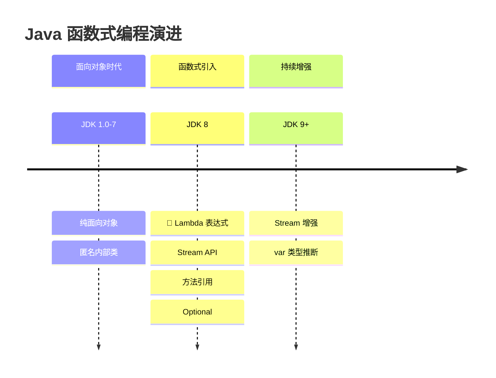
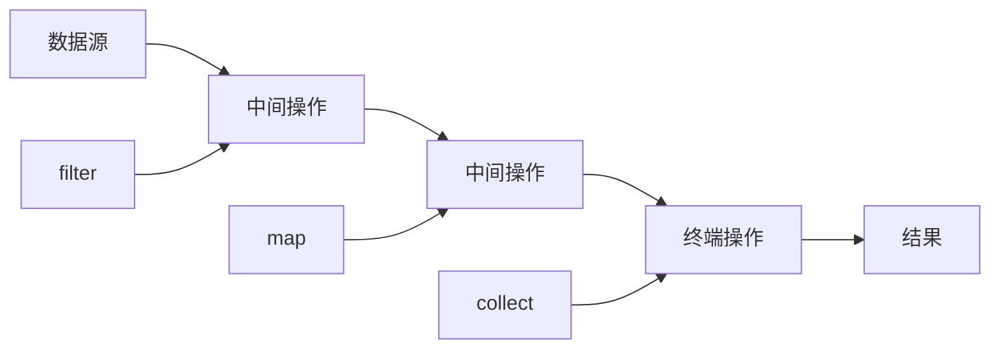
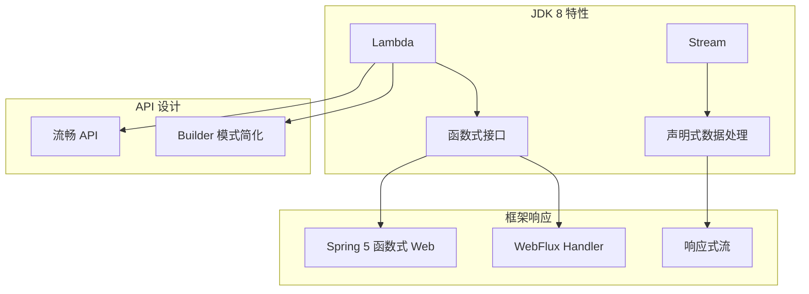

# Lambda 与 Stream 革命

<p align="center">
  
  
  
</p>

---

## 📍 时间线定位



---

## 🎯 了解目标

- ✅ 理解 Lambda 表达式的设计动机
- ✅ 掌握函数式接口与方法引用
- ✅ 深入理解 Stream API 的原理与最佳实践
- ✅ 了解 Optional 的正确使用方式

---

## 📖 章节摘要

JDK 8 引入的 Lambda 表达式和 Stream API 是 Java 拥抱函数式编程的里程碑。这些特性让 Java 代码更加简洁、表达力更强，并为并行处理提供了原生支持。

---

## 1. 历史背景与痛点

### 1.1 匿名内部类的冗长

```java
// JDK 7: 匿名内部类处理事件
button.addActionListener(new ActionListener() {
    @Override
    public void actionPerformed(ActionEvent e) {
        System.out.println("Button clicked!");
    }
});

// JDK 7: 线程创建
new Thread(new Runnable() {
    @Override
    public void run() {
        System.out.println("Running in thread");
    }
}).start();

// JDK 7: 集合排序
Collections.sort(users, new Comparator<User>() {
    @Override
    public int compare(User u1, User u2) {
        return u1.getName().compareTo(u2.getName());
    }
});
```

**痛点**：一个简单的行为需要大量样板代码。

### 1.2 集合处理的繁琐

```java
// JDK 7: 过滤并处理集合
List<User> adults = new ArrayList<>();
for (User user : users) {
    if (user.getAge() >= 18) {
        adults.add(user);
    }
}

List<String> names = new ArrayList<>();
for (User user : adults) {
    names.add(user.getName());
}

Collections.sort(names);
```

---

## 2. Lambda 表达式

### 2.1 基本语法

```java
// Lambda 语法: (参数) -> { 方法体 }

// 完整形式
(Integer x, Integer y) -> { return x + y; }

// 简化：类型推断
(x, y) -> { return x + y; }

// 简化：单行表达式省略 return 和大括号
(x, y) -> x + y

// 简化：单参数省略括号
x -> x * 2

// 无参数
() -> System.out.println("Hello")
```

### 2.2 代码对比

```java
// ========== JDK 7: 匿名内部类 ==========
Collections.sort(users, new Comparator<User>() {
    @Override
    public int compare(User u1, User u2) {
        return u1.getAge() - u2.getAge();
    }
});

// ========== JDK 8: Lambda ==========
Collections.sort(users, (u1, u2) -> u1.getAge() - u2.getAge());

// ========== JDK 8: 方法引用 ==========
users.sort(Comparator.comparing(User::getAge));
```

### 2.3 函数式接口

Lambda 表达式需要函数式接口作为目标类型：

```java
// 函数式接口：只有一个抽象方法的接口
@FunctionalInterface
public interface Runnable {
    void run();
}

// JDK 8 内置的函数式接口
// java.util.function 包

// Predicate<T>: T -> boolean
Predicate<User> isAdult = user -> user.getAge() >= 18;

// Function<T, R>: T -> R  
Function<User, String> getName = User::getName;

// Consumer<T>: T -> void
Consumer<User> print = user -> System.out.println(user);

// Supplier<T>: () -> T
Supplier<User> createUser = User::new;

// BiFunction<T, U, R>: (T, U) -> R
BiFunction<Integer, Integer, Integer> add = (a, b) -> a + b;
```

### 2.4 方法引用

```java
// 四种方法引用形式

// 1. 静态方法引用: 类名::静态方法
Function<String, Integer> parseInt = Integer::parseInt;

// 2. 实例方法引用（特定对象）: 对象::实例方法
User user = new User();
Supplier<String> getName = user::getName;

// 3. 实例方法引用（任意对象）: 类名::实例方法
Function<User, String> getNameFunc = User::getName;

// 4. 构造方法引用: 类名::new
Supplier<User> newUser = User::new;
Function<String, User> newUserWithName = User::new;
```

---

## 3. Stream API

### 3.1 Stream 概念



### 3.2 创建 Stream

```java
// 从集合创建
List<User> users = Arrays.asList(user1, user2, user3);
Stream<User> stream = users.stream();

// 从数组创建
String[] array = {"a", "b", "c"};
Stream<String> stream = Arrays.stream(array);

// 直接创建
Stream<String> stream = Stream.of("a", "b", "c");

// 无限流
Stream<Integer> infinite = Stream.iterate(0, n -> n + 1);
Stream<Double> randoms = Stream.generate(Math::random);
```

### 3.3 中间操作

```java
List<User> users = getUsers();

// filter: 过滤
users.stream()
    .filter(u -> u.getAge() >= 18)
    
// map: 转换
users.stream()
    .map(User::getName)
    
// flatMap: 扁平化
users.stream()
    .flatMap(u -> u.getOrders().stream())
    
// sorted: 排序
users.stream()
    .sorted(Comparator.comparing(User::getAge))
    
// distinct: 去重
users.stream()
    .map(User::getDepartment)
    .distinct()
    
// limit/skip: 截取
users.stream()
    .skip(10)
    .limit(20)
    
// peek: 调试（查看中间状态）
users.stream()
    .peek(u -> System.out.println("Processing: " + u))
    .filter(u -> u.getAge() > 18)
```

### 3.4 终端操作

```java
// collect: 收集到集合
List<String> names = users.stream()
    .map(User::getName)
    .collect(Collectors.toList());

Map<Long, User> userMap = users.stream()
    .collect(Collectors.toMap(User::getId, u -> u));

Map<String, List<User>> byDept = users.stream()
    .collect(Collectors.groupingBy(User::getDepartment));

// forEach: 遍历
users.stream().forEach(System.out::println);

// reduce: 聚合
int totalAge = users.stream()
    .map(User::getAge)
    .reduce(0, Integer::sum);

// count/min/max
long count = users.stream().count();
Optional<User> youngest = users.stream()
    .min(Comparator.comparing(User::getAge));

// anyMatch/allMatch/noneMatch
boolean hasAdult = users.stream().anyMatch(u -> u.getAge() >= 18);

// findFirst/findAny
Optional<User> first = users.stream()
    .filter(u -> u.getAge() > 30)
    .findFirst();
```

### 3.5 完整示例

```java
// ========== JDK 7 写法 ==========
List<User> users = getUsers();
List<String> result = new ArrayList<>();

for (User user : users) {
    if (user.getAge() >= 18) {
        result.add(user.getName());
    }
}
Collections.sort(result);
result = result.subList(0, Math.min(10, result.size()));

// ========== JDK 8 Stream 写法 ==========
List<String> result = users.stream()
    .filter(u -> u.getAge() >= 18)    // 过滤成年人
    .map(User::getName)                // 提取姓名
    .sorted()                          // 排序
    .limit(10)                         // 取前10个
    .collect(Collectors.toList());     // 收集结果
```

### 3.6 并行流

```java
// 并行处理（自动使用 ForkJoinPool）
List<String> result = users.parallelStream()
    .filter(u -> u.getAge() >= 18)
    .map(User::getName)
    .collect(Collectors.toList());

// 注意：并行流适用于
// - 数据量大
// - 操作是无状态的
// - 操作是 CPU 密集型的
```

---

## 4. Optional

### 4.1 Optional 的设计目的

```java
// 问题：null 检查地狱
public String getCityName(User user) {
    if (user != null) {
        Address address = user.getAddress();
        if (address != null) {
            City city = address.getCity();
            if (city != null) {
                return city.getName();
            }
        }
    }
    return "Unknown";
}

// Optional 解决方案
public String getCityName(User user) {
    return Optional.ofNullable(user)
        .map(User::getAddress)
        .map(Address::getCity)
        .map(City::getName)
        .orElse("Unknown");
}
```

### 4.2 Optional 正确使用

```java
// 创建 Optional
Optional<User> opt1 = Optional.of(user);        // 非空，null 会抛异常
Optional<User> opt2 = Optional.ofNullable(user); // 可能为空
Optional<User> opt3 = Optional.empty();          // 空 Optional

// 获取值
User user = opt.get();                    // 不推荐，可能抛异常
User user = opt.orElse(defaultUser);      // 有默认值
User user = opt.orElseGet(User::new);     // 懒加载默认值
User user = opt.orElseThrow();            // 无值抛异常

// 条件操作
opt.ifPresent(u -> System.out.println(u));
opt.ifPresentOrElse(
    u -> System.out.println(u),
    () -> System.out.println("Empty")
);

// 链式操作
Optional<String> name = opt
    .filter(u -> u.getAge() > 18)
    .map(User::getName);
```

### 4.3 Optional 反模式

```java
// ❌ 错误：作为字段类型
public class User {
    private Optional<String> nickname;  // 不推荐
}

// ❌ 错误：作为方法参数
public void process(Optional<User> user) {  // 不推荐
}

// ❌ 错误：用 isPresent + get
if (opt.isPresent()) {
    User user = opt.get();  // 回到了 null 检查模式
}

// ✅ 正确：作为返回值
public Optional<User> findById(Long id) {
    return Optional.ofNullable(userMap.get(id));
}
```

---

## 5. 技术关联分析

### 5.1 Lambda 对框架的影响



### 5.2 编程范式转变

| 范式 | 特点 | 示例 |
|------|------|------|
| 命令式 | 告诉计算机怎么做 | for 循环 |
| 声明式 | 告诉计算机要什么 | Stream API |
| 函数式 | 函数作为一等公民 | Lambda |

---

## 6. 演进规律总结

### 6.1 从冗长到简洁

```
匿名内部类（5行）→ Lambda（1行）

样板代码大幅减少，代码表达力提升。
```

### 6.2 从命令式到声明式

```
for 循环 + if 判断 → filter + map + collect

关注"做什么"而不是"怎么做"。
```

### 6.3 从串行到并行

```
手动多线程 → parallelStream()

并行处理变得简单，但需要理解适用场景。
```

---

## 7. 特殊元素

### 💼 面试考点

**Q1: Stream 的惰性求值是什么意思？**

答：Stream 的中间操作（filter、map 等）不会立即执行，只有遇到终端操作（collect、forEach 等）才会真正执行整个管道。这允许优化，如短路操作。

**Q2: parallelStream 的底层实现？**

答：使用 ForkJoinPool.commonPool()，默认线程数为 CPU 核心数 - 1。可以通过系统属性 `java.util.concurrent.ForkJoinPool.common.parallelism` 调整。

**Q3: Lambda 表达式中能修改外部变量吗？**

答：不能修改，只能访问 effectively final 的变量（即使没有 final 修饰符，但实际上不再被修改的变量）。

### 🤔 争议与反思：Lambda 滥用

```java
// ❌ 过度使用导致可读性下降
result = items.stream()
    .filter(i -> i.getType() == 1)
    .map(i -> new Pair<>(i.getId(), i.getValues().stream()
        .filter(v -> v.isActive())
        .mapToInt(Value::getAmount)
        .sum()))
    .collect(Collectors.toMap(Pair::getKey, Pair::getValue));

// ✅ 适当提取方法，保持可读性
result = items.stream()
    .filter(this::isTypeOne)
    .map(this::calculateItemSum)
    .collect(Collectors.toMap(Pair::getKey, Pair::getValue));
```

---

## 📚 参考资料

- [Java 8 in Action](https://www.manning.com/books/java-8-in-action)
- [Oracle Java 8 Documentation](https://docs.oracle.com/javase/8/docs/)
- [Effective Java - Item 42-48: Lambdas and Streams](https://www.oreilly.com/library/view/effective-java-3rd/9780134686097/)

---

<p align="center">
  ⬅️ <a href="../03-JDK6-7时代/03-Maven与工程化.md">上一篇：Maven与工程化</a> |
  🏠 <a href="../../">返回目录</a> |
  <a href="./02-SpringBoot破茧而出.md">下一篇：Spring Boot破茧而出</a> ➡️
</p>

