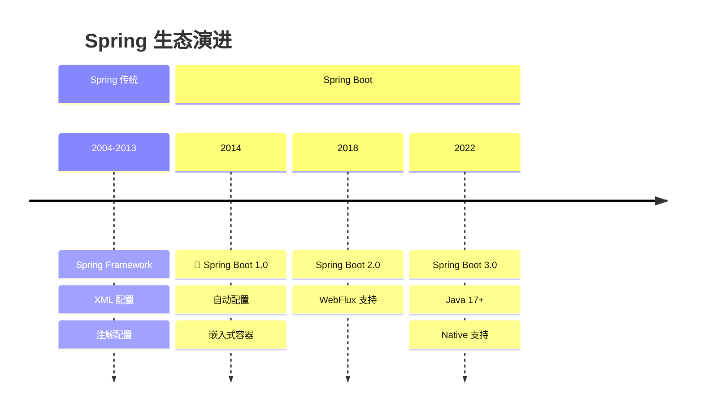
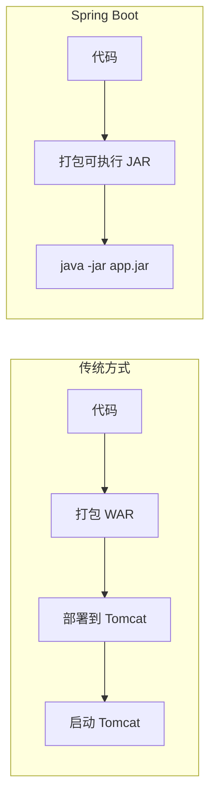
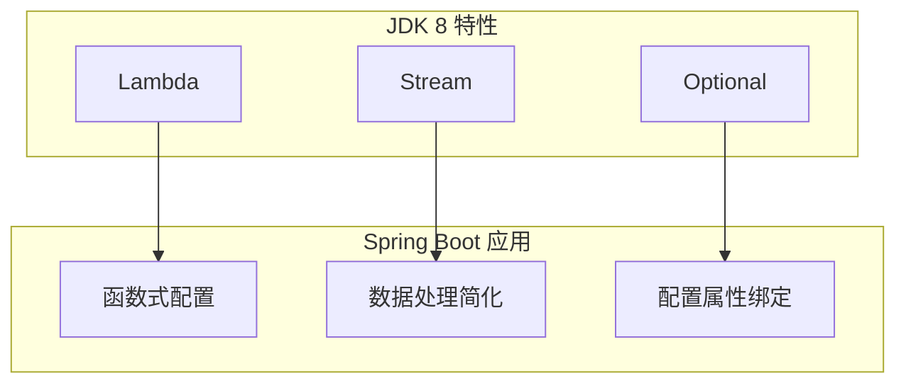
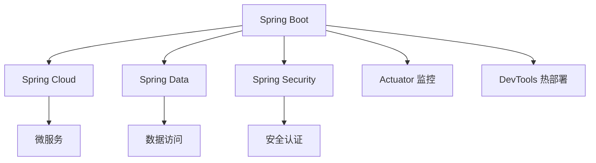

# Spring Boot 破茧而出

<p align="center">
  
  
  
</p>

---

## 📍 时间线定位



---

## 🎯 学习目标

- ✅ 理解 Spring 配置地狱问题
- ✅ 掌握 Spring Boot 自动配置原理
- ✅ 了解 Starter 机制的设计思想
- ✅ 认识嵌入式容器带来的变革

---

## 📖 章节摘要

Spring Boot 是 Spring 生态最重要的里程碑之一。它通过"约定优于配置"和自动配置机制，让 Spring 应用的创建和部署变得前所未有的简单。

---

## 1. 历史背景与痛点

### 1.1 Spring 配置地狱

传统 Spring 项目需要大量配置：

```xml
<!-- web.xml -->
<web-app>
    <listener>
        <listener-class>
            org.springframework.web.context.ContextLoaderListener
        </listener-class>
    </listener>
    
    <servlet>
        <servlet-name>dispatcher</servlet-name>
        <servlet-class>
            org.springframework.web.servlet.DispatcherServlet
        </servlet-class>
        <init-param>
            <param-name>contextConfigLocation</param-name>
            <param-value>/WEB-INF/spring-mvc.xml</param-value>
        </init-param>
        <load-on-startup>1</load-on-startup>
    </servlet>
    
    <servlet-mapping>
        <servlet-name>dispatcher</servlet-name>
        <url-pattern>/</url-pattern>
    </servlet-mapping>
</web-app>

<!-- applicationContext.xml -->
<beans>
    <context:component-scan base-package="com.example"/>
    
    <bean id="dataSource" class="...">
        <property name="driverClassName" value="..."/>
        <property name="url" value="..."/>
        <!-- 更多配置... -->
    </bean>
    
    <bean id="transactionManager" class="...">
        <property name="dataSource" ref="dataSource"/>
    </bean>
    
    <tx:annotation-driven/>
    
    <!-- 视图解析器、消息转换器、拦截器... -->
</beans>
```

### 1.2 传统 Spring 项目的痛点

| 痛点 | 影响 |
|------|------|
| 大量 XML 配置 | 难以维护 |
| 依赖版本冲突 | 每个项目都要调试 |
| 部署到外部容器 | 依赖 Tomcat/JBoss |
| 项目启动慢 | 开发效率低 |
| 入门门槛高 | 新人学习成本大 |

---

## 2. Spring Boot 核心理念

### 2.1 约定优于配置

```java
// Spring Boot: 最小化配置
@SpringBootApplication
public class MyApplication {
    public static void main(String[] args) {
        SpringApplication.run(MyApplication.class, args);
    }
}

// 就这么简单！Spring Boot 会：
// - 自动扫描组件
// - 自动配置数据源（如果有相关依赖）
// - 自动配置 Web 服务器
// - 自动配置 JSON 转换
```

### 2.2 application.properties/yml

```yaml
# application.yml - 简洁的配置
server:
  port: 8080

spring:
  datasource:
    url: jdbc:mysql://localhost:3306/mydb
    username: root
    password: password
    
  jpa:
    hibernate:
      ddl-auto: update
    show-sql: true
    
logging:
  level:
    com.example: DEBUG
```

---

## 3. 自动配置原理

### 3.1 @SpringBootApplication 解析

```java
@SpringBootApplication
// 等价于以下三个注解的组合：

@SpringBootConfiguration    // 标记为配置类
@EnableAutoConfiguration    // 开启自动配置
@ComponentScan              // 组件扫描
public class MyApplication {
}
```

### 3.2 自动配置机制

```mermaid
graph TB
    A[SpringApplication.run] --> B[加载 META-INF/spring.factories]
    B --> C[获取 EnableAutoConfiguration 配置]
    C --> D[过滤条件注解]
    D --> E[加载符合条件的配置类]
    
    subgraph 条件注解
        F[@ConditionalOnClass]
        G[@ConditionalOnMissingBean]
        H[@ConditionalOnProperty]
    end
    
    D --> F
    D --> G
    D --> H
```

### 3.3 条件注解

```java
// 自动配置类示例
@Configuration
@ConditionalOnClass(DataSource.class)  // 类路径存在 DataSource
@ConditionalOnProperty(name = "spring.datasource.url")  // 配置了 URL
public class DataSourceAutoConfiguration {
    
    @Bean
    @ConditionalOnMissingBean  // 用户没有自定义 DataSource
    public DataSource dataSource(DataSourceProperties properties) {
        return DataSourceBuilder.create()
            .url(properties.getUrl())
            .username(properties.getUsername())
            .password(properties.getPassword())
            .build();
    }
}
```

**常用条件注解**：

| 注解 | 条件 |
|------|------|
| `@ConditionalOnClass` | 类路径存在指定类 |
| `@ConditionalOnMissingClass` | 类路径不存在指定类 |
| `@ConditionalOnBean` | 容器存在指定 Bean |
| `@ConditionalOnMissingBean` | 容器不存在指定 Bean |
| `@ConditionalOnProperty` | 配置属性满足条件 |
| `@ConditionalOnWebApplication` | 是 Web 应用 |

### 3.4 自定义自动配置

```java
// 1. 创建配置类
@Configuration
@ConditionalOnClass(MyService.class)
@EnableConfigurationProperties(MyProperties.class)
public class MyAutoConfiguration {
    
    @Bean
    @ConditionalOnMissingBean
    public MyService myService(MyProperties properties) {
        return new MyService(properties.getEndpoint());
    }
}

// 2. 配置属性类
@ConfigurationProperties(prefix = "my.service")
public class MyProperties {
    private String endpoint = "http://localhost";
    // getter/setter...
}

// 3. 注册到 META-INF/spring.factories
org.springframework.boot.autoconfigure.EnableAutoConfiguration=\
com.example.MyAutoConfiguration
```

---

## 4. Starter 机制

### 4.1 Starter 的革命性

```xml
<!-- 传统方式：手动引入所有依赖 -->
<dependencies>
    <dependency>
        <groupId>org.springframework</groupId>
        <artifactId>spring-web</artifactId>
        <version>5.3.20</version>
    </dependency>
    <dependency>
        <groupId>org.springframework</groupId>
        <artifactId>spring-webmvc</artifactId>
        <version>5.3.20</version>
    </dependency>
    <dependency>
        <groupId>com.fasterxml.jackson.core</groupId>
        <artifactId>jackson-databind</artifactId>
        <version>2.13.3</version>
    </dependency>
    <!-- 还有更多... 版本还要自己管理 -->
</dependencies>

<!-- Spring Boot 方式：一个 Starter 搞定 -->
<dependencies>
    <dependency>
        <groupId>org.springframework.boot</groupId>
        <artifactId>spring-boot-starter-web</artifactId>
        <!-- 版本由 parent 管理 -->
    </dependency>
</dependencies>
```

### 4.2 常用 Starter

| Starter | 功能 |
|---------|------|
| `spring-boot-starter-web` | Web 开发 |
| `spring-boot-starter-data-jpa` | JPA 数据访问 |
| `spring-boot-starter-data-redis` | Redis |
| `spring-boot-starter-security` | 安全 |
| `spring-boot-starter-test` | 测试 |
| `spring-boot-starter-actuator` | 监控 |

### 4.3 Starter 的组成

```
spring-boot-starter-web
├── spring-boot-starter (核心)
│   ├── spring-boot
│   ├── spring-boot-autoconfigure
│   └── spring-core
├── spring-web
├── spring-webmvc
├── jackson-databind (JSON)
└── tomcat-embed (嵌入式 Tomcat)
```

---

## 5. 嵌入式容器

### 5.1 从 WAR 到 JAR



### 5.2 嵌入式容器配置

```yaml
# application.yml
server:
  port: 8080
  servlet:
    context-path: /api
  tomcat:
    max-threads: 200
    max-connections: 10000
    
# 切换到 Undertow
# 排除 Tomcat，引入 Undertow Starter
```

```xml
<!-- 切换容器 -->
<dependency>
    <groupId>org.springframework.boot</groupId>
    <artifactId>spring-boot-starter-web</artifactId>
    <exclusions>
        <exclusion>
            <groupId>org.springframework.boot</groupId>
            <artifactId>spring-boot-starter-tomcat</artifactId>
        </exclusion>
    </exclusions>
</dependency>
<dependency>
    <groupId>org.springframework.boot</groupId>
    <artifactId>spring-boot-starter-undertow</artifactId>
</dependency>
```

---

## 6. 代码演进示例

### 6.1 项目结构对比

```
// ========== 传统 Spring 项目 ==========
my-app/
├── src/main/java/
├── src/main/resources/
│   └── spring/
│       ├── applicationContext.xml
│       ├── spring-mvc.xml
│       └── spring-mybatis.xml
├── src/main/webapp/
│   └── WEB-INF/
│       ├── web.xml
│       └── views/
└── pom.xml (需要打包为 WAR)

// ========== Spring Boot 项目 ==========
my-app/
├── src/main/java/
│   └── com/example/
│       └── MyApplication.java
├── src/main/resources/
│   └── application.yml
└── pom.xml (打包为 JAR)
```

### 6.2 Controller 对比

```java
// ========== 传统 Spring MVC ==========
// 需要在 spring-mvc.xml 中配置视图解析器、消息转换器等

@Controller
public class UserController {
    
    @Autowired
    private UserService userService;
    
    @RequestMapping(value = "/users", method = RequestMethod.GET)
    @ResponseBody
    public List<User> list() {
        return userService.findAll();
    }
}

// ========== Spring Boot ==========
// 自动配置好了一切

@RestController
@RequestMapping("/users")
public class UserController {
    
    @Autowired
    private UserService userService;
    
    @GetMapping
    public List<User> list() {
        return userService.findAll();
    }
}
```

---

## 7. 技术关联分析

### 7.1 Spring Boot 与 JDK 8



### 7.2 Spring Boot 生态



---

## 8. 演进规律总结

### 8.1 从繁琐到简单

```
大量 XML 配置 → 约定 + 少量 YAML

"能省则省"，让开发者专注于业务。
```

### 8.2 从外部到内嵌

```
外部 Tomcat 容器 → 嵌入式容器

"Build once, run anywhere"真正实现。
```

### 8.3 从手动到自动

```
手动配置 Bean → 自动配置 + 条件装配

框架智能判断需要什么，自动配置好。
```

---

## 9. 特殊元素

### 🏛️ 技术考古：Pivotal 的诞生

| 时间 | 事件 |
|------|------|
| 2009 | VMware 收购 SpringSource |
| 2013 | EMC、VMware、GE 合资成立 Pivotal |
| 2014 | Pivotal 发布 Spring Boot 1.0 |
| 2019 | VMware 收购 Pivotal |

Spring Boot 的诞生源于 Pivotal 对云原生应用的愿景。

### 📝 版本迁移要点：传统 Spring → Spring Boot

1. **删除 web.xml**：不再需要
2. **删除 XML 配置**：迁移到 Java Config 或 application.yml
3. **修改打包方式**：WAR → JAR
4. **修改部署方式**：`java -jar` 运行
5. **调整依赖**：使用 Starter 替代单独依赖

### 💼 面试考点

**Q1: Spring Boot 自动配置原理？**

答：
1. `@EnableAutoConfiguration` 注解触发自动配置
2. 扫描 `META-INF/spring.factories` 文件
3. 加载 `EnableAutoConfiguration` 对应的配置类
4. 条件注解（`@ConditionalOn*`）决定是否生效
5. 最终将符合条件的 Bean 注册到容器

**Q2: Spring Boot 如何实现热部署？**

答：
- 使用 `spring-boot-devtools`
- 监听类路径变化，自动重启（比完全重启快）
- 原理：使用两个 ClassLoader，base 加载不变的类，restart 加载变化的类

**Q3: Spring Boot 配置优先级？**

答（从高到低）：
1. 命令行参数
2. `application-{profile}.yml`
3. `application.yml`
4. `@PropertySource` 注解
5. 默认属性

---

## 📚 参考资料

- [Spring Boot Documentation](https://docs.spring.io/spring-boot/docs/current/reference/html/)
- [Spring Boot in Action](https://www.manning.com/books/spring-boot-in-action)
- [Spring Boot GitHub](https://github.com/spring-projects/spring-boot)

---

<p align="center">
  ⬅️ <a href="./01-Lambda与Stream革命.md">上一篇：Lambda与Stream革命</a> |
  🏠 <a href="../../README.md">返回目录</a> |
  <a href="./03-微服务框架涌现.md">下一篇：微服务框架涌现</a> ➡️
</p>

