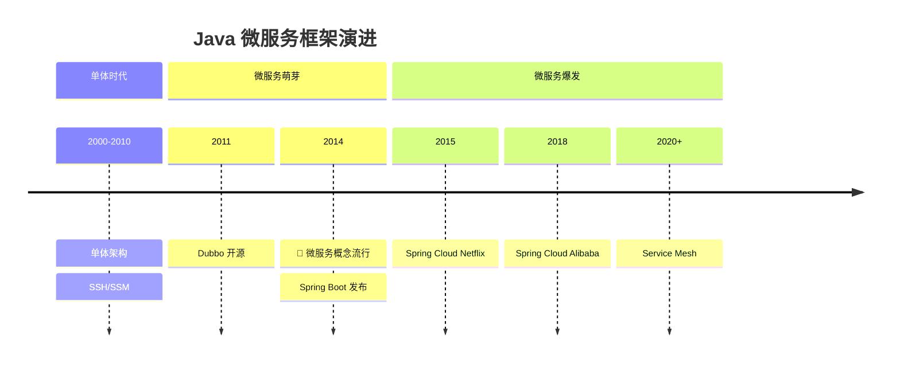
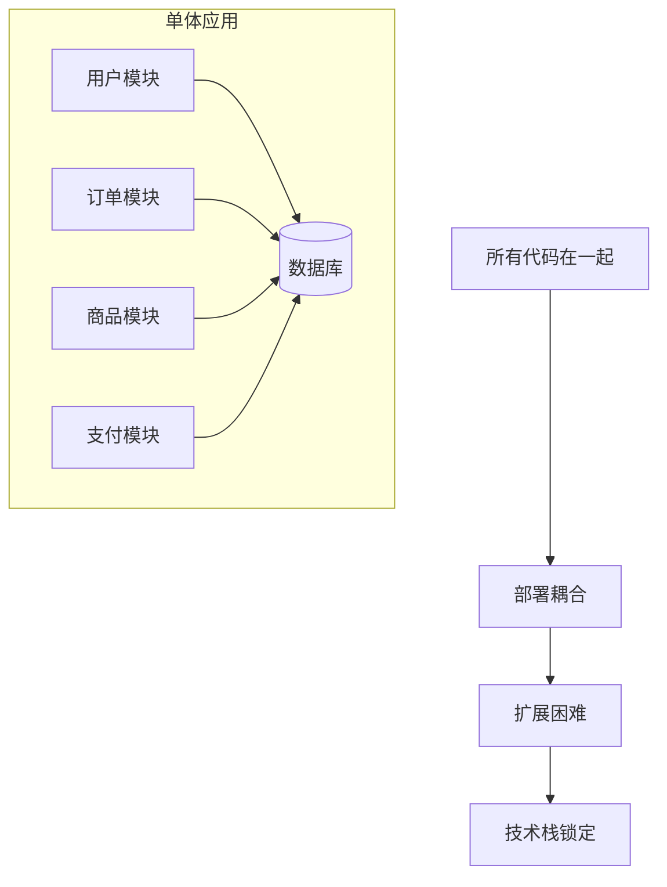
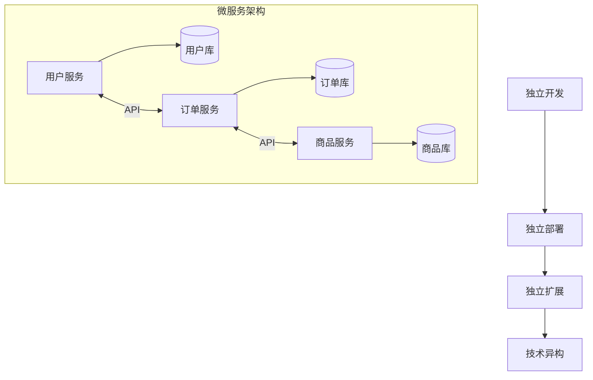
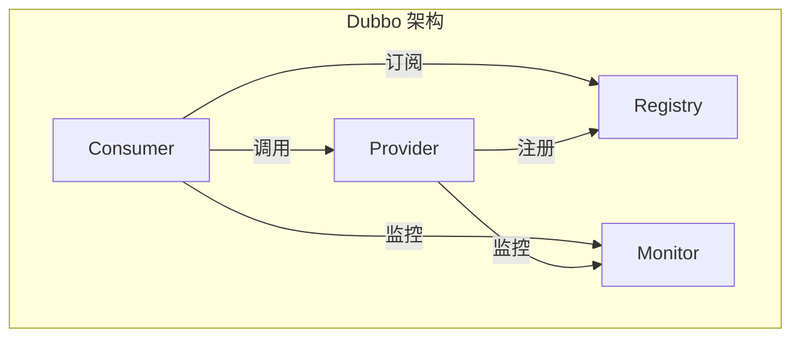
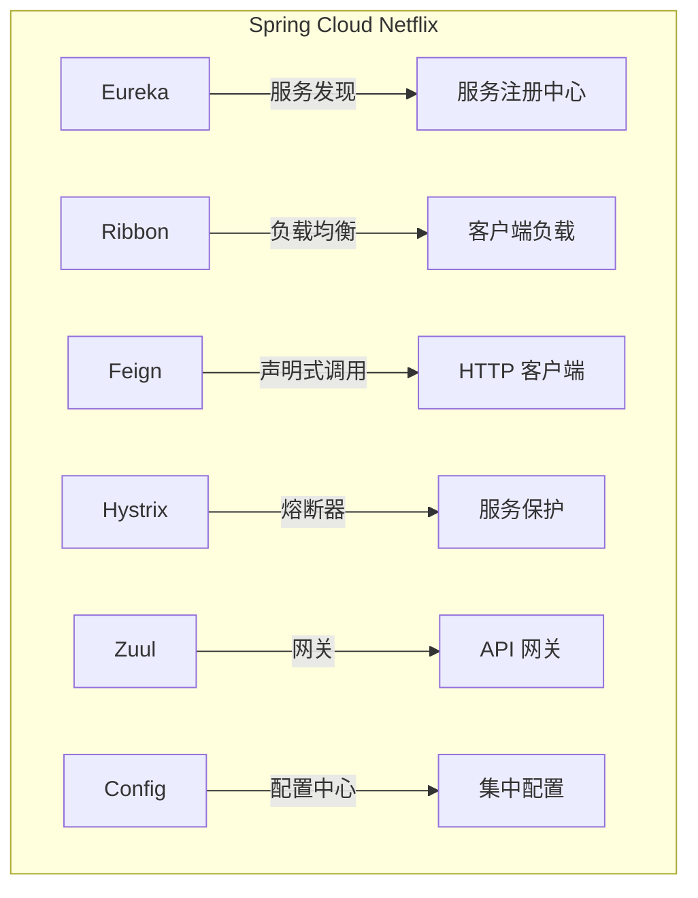
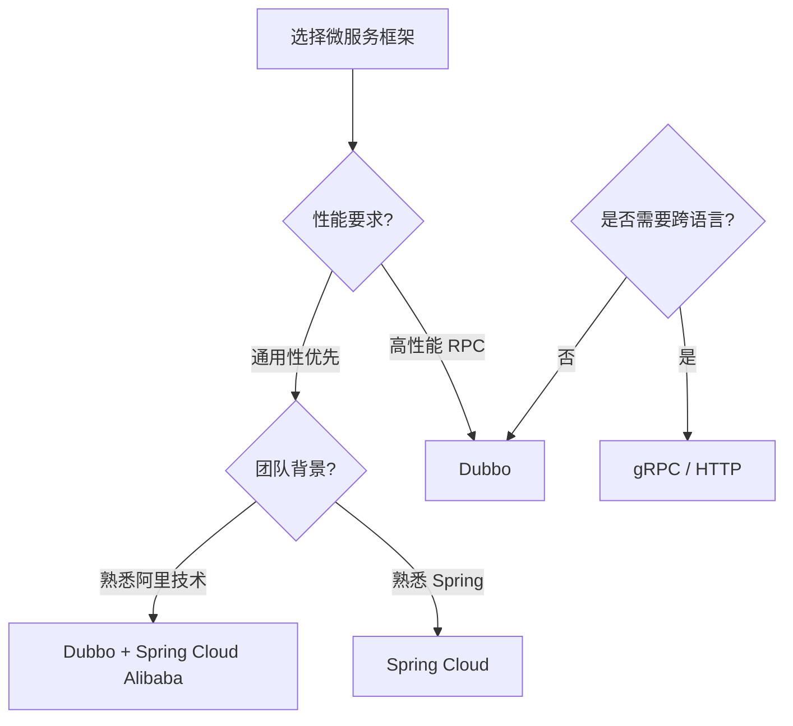
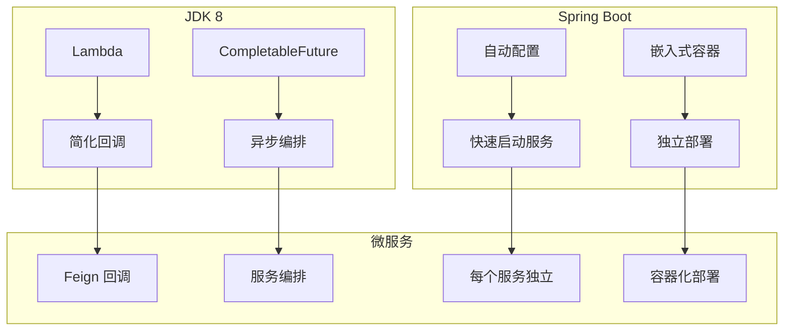
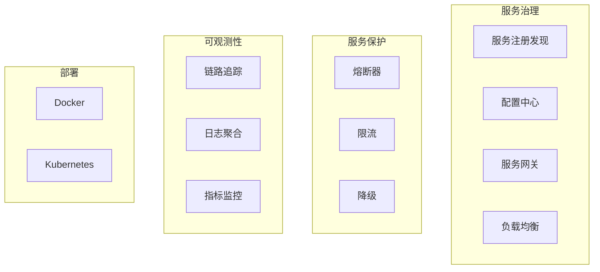
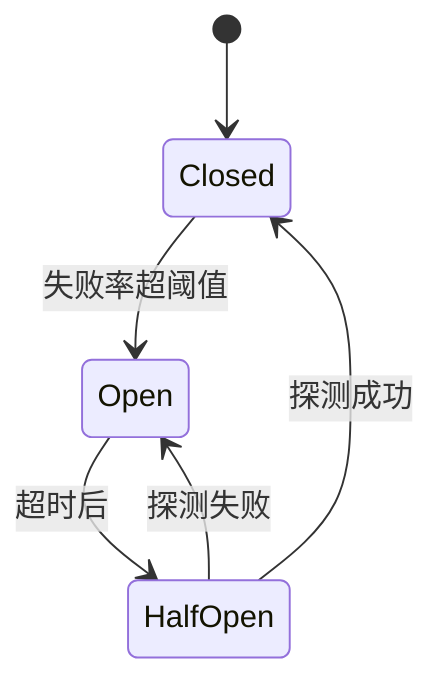

# 微服务框架涌现

<p align="center">
  
  
  
</p>

---

## 📍 时间线定位



---

## 🎯 学习目标

- ✅ 理解单体架构的瓶颈与微服务的兴起
- ✅ 了解 Dubbo 的设计理念与核心组件
- ✅ 掌握 Spring Cloud 的服务治理全家桶
- ✅ 对比 Dubbo 与 Spring Cloud 的选型策略

---

## 📖 章节摘要

随着互联网业务规模的增长，单体架构的局限性日益明显。Dubbo 和 Spring Cloud 代表了两种微服务解决方案的思路：RPC 框架 vs 服务治理全家桶。

---

## 1. 历史背景与痛点

### 1.1 单体架构的瓶颈



**单体架构的问题**：

| 问题 | 影响 |
|------|------|
| 代码耦合 | 修改一处影响全局 |
| 部署耦合 | 小改动需要全量部署 |
| 扩展困难 | 只能整体扩展，无法按需扩展 |
| 技术栈锁定 | 所有模块必须使用相同技术 |
| 团队协作难 | 多团队在同一代码库冲突 |

### 1.2 微服务理念

> 👤 **关键人物**：Martin Fowler 在 2014 年发表的文章《Microservices》正式定义了微服务架构。



---

## 2. Dubbo：国产 RPC 框架

### 2.1 Dubbo 简介

Dubbo 是阿里巴巴开源的高性能 RPC 框架：



### 2.2 核心特性

```java
// Provider: 服务提供者
@DubboService(version = "1.0.0")
public class UserServiceImpl implements UserService {
    
    @Override
    public User findById(Long id) {
        return userDao.findById(id);
    }
}

// Consumer: 服务消费者
@Component
public class OrderService {
    
    @DubboReference(version = "1.0.0")
    private UserService userService;  // 像本地调用一样
    
    public void createOrder(Long userId) {
        User user = userService.findById(userId);  // 远程调用
        // ...
    }
}
```

### 2.3 Dubbo 核心组件

| 组件 | 作用 |
|------|------|
| Provider | 服务提供者 |
| Consumer | 服务消费者 |
| Registry | 注册中心（ZooKeeper/Nacos） |
| Monitor | 监控中心 |
| Container | 服务容器 |

### 2.4 Dubbo 的优势

- **高性能**：自定义 Dubbo 协议，比 HTTP 更快
- **服务治理**：负载均衡、熔断、限流
- **扩展性强**：SPI 机制，可扩展协议、序列化等

---

## 3. Spring Cloud：服务治理全家桶

### 3.1 Spring Cloud Netflix

2015 年，Spring Cloud Netflix 带来了完整的微服务解决方案：



### 3.2 核心组件

#### 3.2.1 Eureka 服务注册

```java
// Eureka Server
@SpringBootApplication
@EnableEurekaServer
public class EurekaServerApplication {
    public static void main(String[] args) {
        SpringApplication.run(EurekaServerApplication.class, args);
    }
}

// Eureka Client
@SpringBootApplication
@EnableEurekaClient
public class UserServiceApplication {
    public static void main(String[] args) {
        SpringApplication.run(UserServiceApplication.class, args);
    }
}
```

```yaml
# Eureka Client 配置
eureka:
  client:
    service-url:
      defaultZone: http://localhost:8761/eureka/
  instance:
    prefer-ip-address: true
```

#### 3.2.2 Feign 声明式调用

```java
// 定义 Feign Client
@FeignClient(name = "user-service")
public interface UserClient {
    
    @GetMapping("/users/{id}")
    User findById(@PathVariable Long id);
    
    @PostMapping("/users")
    User create(@RequestBody User user);
}

// 使用
@Service
public class OrderService {
    
    @Autowired
    private UserClient userClient;
    
    public void createOrder(Long userId) {
        User user = userClient.findById(userId);  // HTTP 调用
        // ...
    }
}
```

#### 3.2.3 Hystrix 熔断器

```java
@FeignClient(name = "user-service", fallback = UserClientFallback.class)
public interface UserClient {
    @GetMapping("/users/{id}")
    User findById(@PathVariable Long id);
}

// 降级实现
@Component
public class UserClientFallback implements UserClient {
    @Override
    public User findById(Long id) {
        return new User(-1L, "Default User");  // 降级返回
    }
}
```

### 3.3 Spring Cloud Alibaba

2018 年，Spring Cloud Alibaba 提供了更适合国内场景的组件：

| Netflix 组件 | Alibaba 替代 | 说明 |
|-------------|-------------|------|
| Eureka | Nacos | 服务发现 + 配置中心 |
| Hystrix | Sentinel | 熔断 + 限流 |
| Zuul | Gateway | API 网关 |
| Config | Nacos Config | 配置中心 |

---

## 4. Dubbo vs Spring Cloud

### 4.1 对比分析

| 维度 | Dubbo | Spring Cloud |
|------|-------|--------------|
| 定位 | RPC 框架 | 微服务全家桶 |
| 协议 | Dubbo 协议（高性能） | HTTP/REST（通用性） |
| 注册中心 | ZooKeeper/Nacos | Eureka/Nacos/Consul |
| 服务调用 | 接口代理 | Feign 声明式 |
| 熔断限流 | Sentinel | Hystrix/Sentinel |
| 配置中心 | 需整合 | Spring Cloud Config |
| 网关 | 需整合 | Zuul/Gateway |
| 学习曲线 | 较低 | 较高 |
| 生态 | 阿里生态 | Spring 生态 |

### 4.2 选型建议



---

## 5. 代码演进示例

### 5.1 从单体到微服务

```java
// ========== 单体架构 ==========
@Service
public class OrderService {
    @Autowired
    private UserDao userDao;  // 直接访问同库
    
    @Autowired
    private ProductDao productDao;
    
    public void createOrder(OrderDTO dto) {
        User user = userDao.findById(dto.getUserId());
        Product product = productDao.findById(dto.getProductId());
        // 创建订单...
    }
}

// ========== 微服务架构 ==========
@Service
public class OrderService {
    @Autowired
    private UserClient userClient;  // 远程调用
    
    @Autowired
    private ProductClient productClient;
    
    public void createOrder(OrderDTO dto) {
        User user = userClient.findById(dto.getUserId());
        Product product = productClient.findById(dto.getProductId());
        // 创建订单...
    }
}
```

### 5.2 服务治理演进

```java
// ========== V1: 硬编码调用 ==========
String url = "http://192.168.1.100:8080/users/" + userId;
User user = restTemplate.getForObject(url, User.class);

// ========== V2: 服务发现 ==========
@Autowired
private DiscoveryClient discoveryClient;

List<ServiceInstance> instances = discoveryClient.getInstances("user-service");
String url = instances.get(0).getUri() + "/users/" + userId;

// ========== V3: 负载均衡 ==========
@LoadBalanced
@Bean
public RestTemplate restTemplate() {
    return new RestTemplate();
}

// 使用服务名调用
User user = restTemplate.getForObject(
    "http://user-service/users/" + userId, User.class);

// ========== V4: 声明式调用 ==========
@FeignClient("user-service")
public interface UserClient {
    @GetMapping("/users/{id}")
    User findById(@PathVariable Long id);
}

User user = userClient.findById(userId);  // 最简洁
```

---

## 6. 技术关联分析

### 6.1 微服务与 JDK/框架



### 6.2 微服务技术栈全景



---

## 7. 演进规律总结

### 7.1 从紧耦合到松耦合

```
单体架构（紧耦合）→ 微服务（松耦合）

服务边界清晰，团队可以独立开发部署。
```

### 7.2 从同步到异步

```
同步 HTTP 调用 → 消息队列异步解耦

提高系统吞吐量和可靠性。
```

### 7.3 从手动到自动

```
手动运维 → 服务治理平台

注册发现、负载均衡、熔断限流自动化。
```

---

## 8. 特殊元素

### 👤 关键人物

| 人物/团队 | 贡献 |
|----------|------|
| Martin Fowler | 微服务概念定义 |
| Netflix OSS 团队 | Eureka、Hystrix、Zuul |
| 阿里中间件团队 | Dubbo、Nacos、Sentinel |

### 💼 面试考点

**Q1: 微服务的优缺点？**

优点：
- 独立开发、部署、扩展
- 技术栈灵活
- 故障隔离

缺点：
- 分布式复杂性
- 网络延迟
- 数据一致性挑战
- 运维成本高

**Q2: CAP 理论与服务发现？**

答：
- Eureka：AP（可用性 + 分区容错），弱一致性
- ZooKeeper：CP（一致性 + 分区容错），可能不可用
- Nacos：支持 AP 和 CP 模式切换

**Q3: 熔断器的工作原理？**

答（以 Hystrix 为例）：
1. **Closed**（关闭）：正常调用
2. **Open**（打开）：失败率超阈值，快速失败
3. **Half-Open**（半开）：尝试恢复，成功则关闭，失败则继续打开



---

## 📚 参考资料

- [Microservices - Martin Fowler](https://martinfowler.com/articles/microservices.html)
- [Dubbo 官方文档](https://dubbo.apache.org/)
- [Spring Cloud 官方文档](https://spring.io/projects/spring-cloud)
- [Spring Cloud Alibaba](https://github.com/alibaba/spring-cloud-alibaba)

---

<p align="center">
  ⬅️ <a href="./02-SpringBoot破茧而出.md">上一篇：Spring Boot破茧而出</a> |
  🏠 <a href="../../README.md">返回目录</a> |
  <a href="../05-JDK9-11时代/01-模块化与新API.md">下一篇：模块化与新API</a> ➡️
</p>

