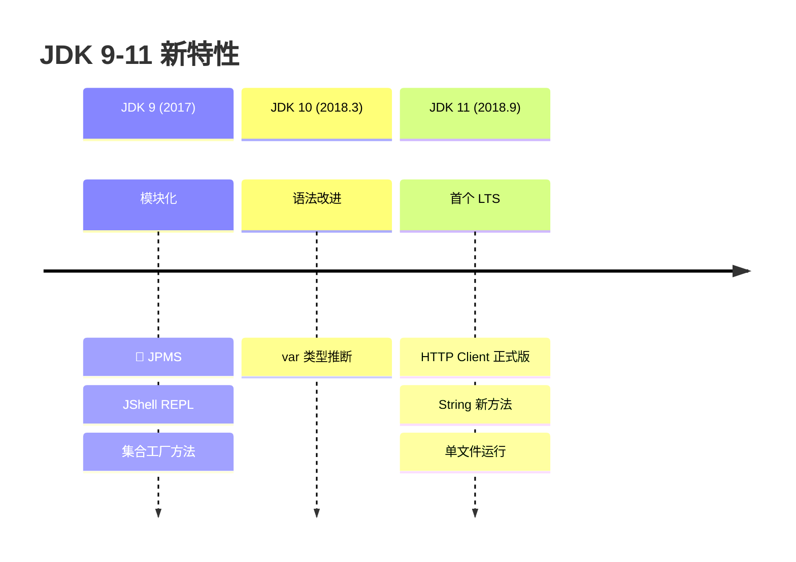
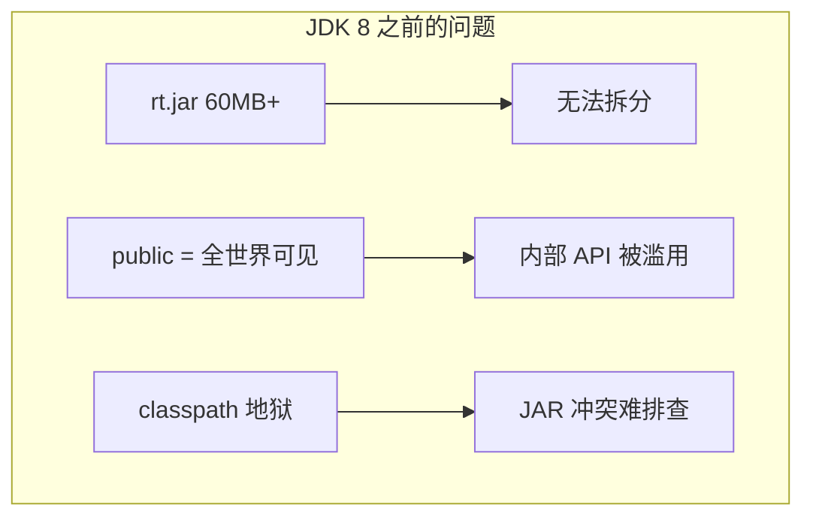
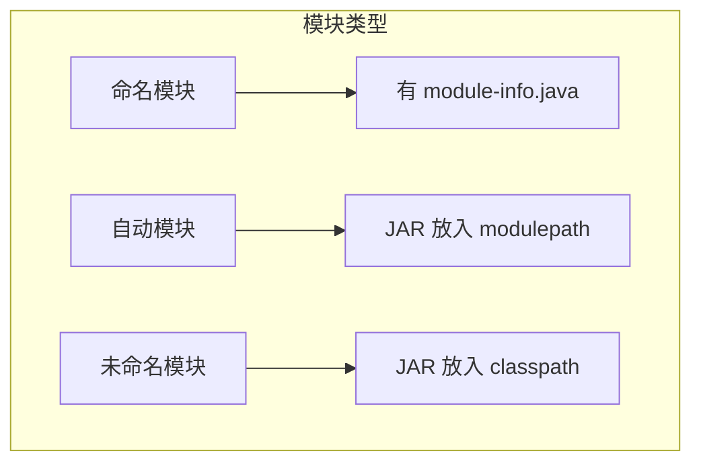
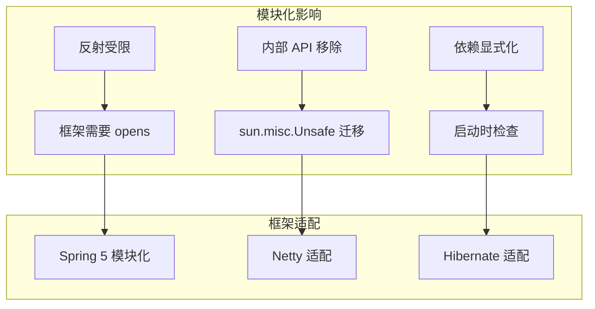

# 模块化与新 API

<p align="center">
  
  
  
</p>

---

## 📍 时间线定位



---

## 🎯 学习目标

- ✅ 理解 Java 模块化的背景与目标
- ✅ 掌握 module-info.java 的基本语法
- ✅ 了解 JDK 9-11 的重要新 API
- ✅ 认识模块化对框架的影响

---

## 📖 章节摘要

JDK 9 的模块化系统（JPMS）是 Java 平台最大的架构变革，历时十年磨一剑。虽然采用率不高，但它重新定义了 Java 的封装边界。

---

## 1. 模块化背景

### 1.1 为什么需要模块化



**核心问题**：

| 问题 | 具体表现 |
|------|----------|
| JDK 臃肿 | rt.jar 包含所有类，IoT 设备难以运行 |
| 封装不足 | `sun.misc.Unsafe` 等内部 API 被广泛使用 |
| 依赖混乱 | classpath 下 JAR 顺序影响行为 |

### 1.2 模块化目标

- **强封装**：明确哪些包对外可见
- **可靠配置**：声明式依赖，启动时检查
- **可扩展平台**：按需定制 JDK

---

## 2. JPMS 模块系统

### 2.1 module-info.java

```java
// 模块描述符：src/module-info.java
module com.example.myapp {
    // 依赖其他模块
    requires java.sql;
    requires java.logging;
    
    // 传递依赖（使用者也能访问）
    requires transitive com.example.common;
    
    // 导出包（对外可见）
    exports com.example.myapp.api;
    
    // 仅对特定模块导出
    exports com.example.myapp.internal to com.example.test;
    
    // 开放反射访问
    opens com.example.myapp.model to com.fasterxml.jackson.databind;
    
    // 提供服务实现
    provides com.example.spi.Service 
        with com.example.myapp.ServiceImpl;
    
    // 使用服务
    uses com.example.spi.Service;
}
```

### 2.2 模块类型



### 2.3 代码演进

```java
// ========== JDK 8: classpath ==========
java -cp lib/*:myapp.jar com.example.Main

// ========== JDK 9+: modulepath ==========
java --module-path lib:myapp.jar \
     --module com.example.myapp/com.example.Main
```

---

## 3. JDK 9-11 新 API

### 3.1 集合工厂方法（JDK 9）

```java
// JDK 8: 创建不可变集合
List<String> list = Collections.unmodifiableList(
    Arrays.asList("a", "b", "c"));

// JDK 9: 简洁的工厂方法
List<String> list = List.of("a", "b", "c");
Set<String> set = Set.of("a", "b", "c");
Map<String, Integer> map = Map.of("a", 1, "b", 2);

// 注意：返回的是不可变集合
list.add("d");  // 抛出 UnsupportedOperationException
```

### 3.2 var 类型推断（JDK 10）

```java
// JDK 8
Map<String, List<String>> map = new HashMap<String, List<String>>();
BufferedReader reader = new BufferedReader(new FileReader("file.txt"));

// JDK 10: var 局部变量类型推断
var map = new HashMap<String, List<String>>();
var reader = new BufferedReader(new FileReader("file.txt"));

// 注意：只能用于局部变量
// var field = "error";  // 编译错误
```

### 3.3 HTTP Client（JDK 11）

```java
// JDK 11: 新的 HTTP Client API
HttpClient client = HttpClient.newBuilder()
    .connectTimeout(Duration.ofSeconds(10))
    .build();

// 同步请求
HttpRequest request = HttpRequest.newBuilder()
    .uri(URI.create("https://api.example.com/users"))
    .header("Content-Type", "application/json")
    .GET()
    .build();

HttpResponse<String> response = client.send(
    request, HttpResponse.BodyHandlers.ofString());

System.out.println(response.statusCode());
System.out.println(response.body());

// 异步请求
client.sendAsync(request, HttpResponse.BodyHandlers.ofString())
    .thenApply(HttpResponse::body)
    .thenAccept(System.out::println);
```

### 3.4 String 新方法（JDK 11）

```java
// isBlank: 空白检测
"  ".isBlank();  // true

// lines: 按行分割
"a\nb\nc".lines().forEach(System.out::println);

// strip: 去除首尾空白（支持 Unicode）
" hello ".strip();  // "hello"

// repeat: 重复
"ab".repeat(3);  // "ababab"
```

### 3.5 单文件运行（JDK 11）

```bash
# JDK 11 之前
javac Hello.java
java Hello

# JDK 11: 直接运行
java Hello.java
```

---

## 4. 技术关联分析

### 4.1 模块化对框架的影响



### 4.2 为什么模块化采用率低

| 原因 | 说明 |
|------|------|
| 迁移成本高 | 大量库需要添加 module-info |
| 反射受限 | 框架依赖反射，需要 opens |
| classpath 仍可用 | 无模块化也能运行 |
| 收益不明显 | 普通应用感知不到好处 |

---

## 5. 演进规律总结

### 5.1 六个月发布周期

```
大版本（2-5年）→ 小版本（6个月）

快速迭代，预览特性逐步稳定。
```

### 5.2 渐进式增强

```
模块化可选 → 新 API 渐进引入

向后兼容，平滑过渡。
```

---

## 6. 特殊元素

### 🏛️ 技术考古：Project Jigsaw

| 时间 | 事件 |
|------|------|
| 2008 | Project Jigsaw 启动 |
| 2011 | 计划 JDK 7 发布（推迟） |
| 2014 | 计划 JDK 8 发布（再次推迟） |
| 2017 | JDK 9 正式发布模块化 |

十年磨一剑，但最终采用率并不理想。

### 🤔 争议与反思

**模块化的价值**：
- 对 JDK 自身：成功瘦身，可定制运行时
- 对普通应用：收益有限，迁移成本高
- 对库作者：需要适配，但能提供更好封装

### 💼 面试考点

**Q1: Java 模块化的作用？**

答：
1. 强封装：控制哪些包对外可见
2. 可靠配置：启动时检查依赖
3. 定制运行时：jlink 创建最小 JRE

**Q2: requires 和 requires transitive 的区别？**

答：
- `requires`：只有当前模块能访问依赖
- `requires transitive`：传递依赖，使用当前模块的模块也能访问

---

## 📚 参考资料

- [The State of the Module System](https://openjdk.org/projects/jigsaw/spec/sotms/)
- [JDK 11 Release Notes](https://www.oracle.com/java/technologies/javase/11-relnote-issues.html)

---

<p align="center">
  ⬅️ <a href="../04-JDK8时代/03-微服务框架涌现.md">上一篇：微服务框架涌现</a> |
  🏠 <a href="../../README.md">返回目录</a> |
  <a href="./02-响应式编程崛起.md">下一篇：响应式编程崛起</a> ➡️
</p>

