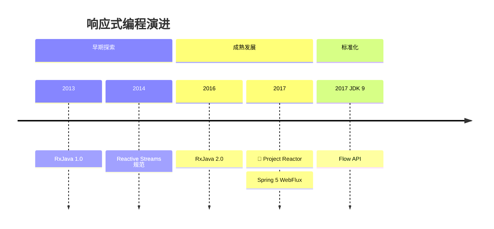
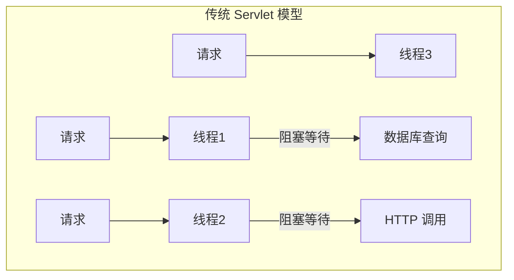
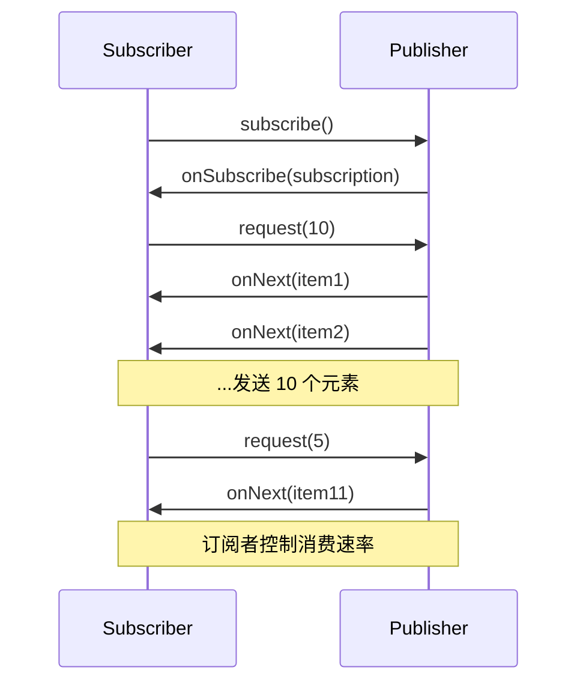
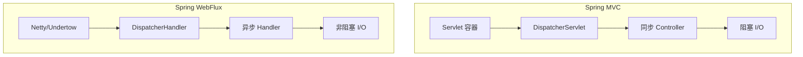
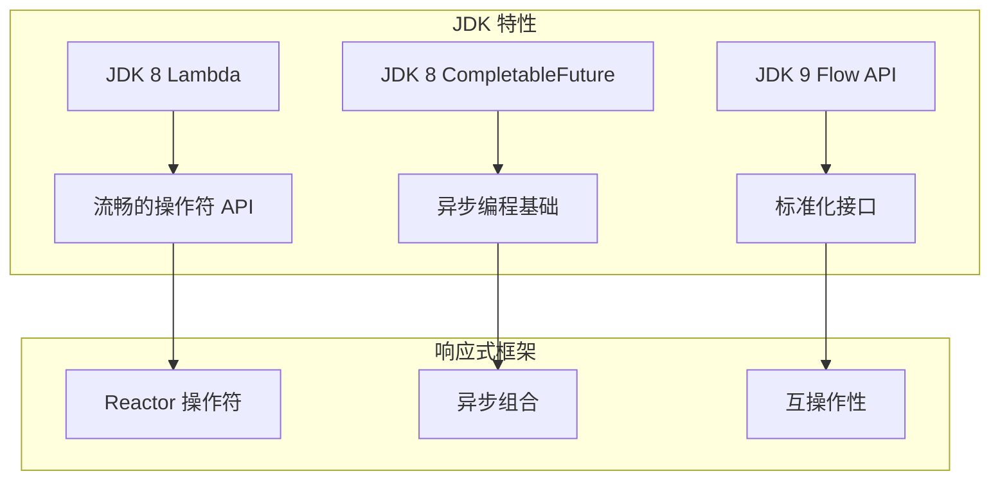

# 响应式编程崛起

<p align="center">
  
  
  
</p>

---

## 📍 时间线定位



---

## 🎯 学习目标

- ✅ 理解响应式编程的背景与动机
- ✅ 掌握 Reactive Streams 规范的核心概念
- ✅ 了解 Project Reactor 的基本使用
- ✅ 认识 Spring WebFlux 的架构设计

---

## 📖 章节摘要

响应式编程是应对高并发场景的新范式。通过非阻塞 I/O 和背压机制，它能以更少的线程处理更多的并发请求。

---

## 1. 历史背景与痛点

### 1.1 传统阻塞模型的问题



**问题**：
- 每个请求占用一个线程
- I/O 等待时线程被阻塞
- 高并发需要大量线程
- 线程上下文切换开销大

### 1.2 C10K 问题

```java
// 传统模型：10000 并发需要 10000 线程
// 每个线程约 1MB 栈内存 = 10GB 内存

// 响应式模型：少量线程处理大量连接
// 事件驱动，非阻塞 I/O
```

---

## 2. Reactive Streams 规范

### 2.1 核心接口

```java
// Publisher: 发布者
public interface Publisher<T> {
    void subscribe(Subscriber<? super T> s);
}

// Subscriber: 订阅者
public interface Subscriber<T> {
    void onSubscribe(Subscription s);
    void onNext(T t);
    void onError(Throwable t);
    void onComplete();
}

// Subscription: 订阅关系
public interface Subscription {
    void request(long n);  // 背压：请求 n 个元素
    void cancel();
}

// Processor: 处理器（既是发布者又是订阅者）
public interface Processor<T, R> extends Subscriber<T>, Publisher<R> {
}
```

### 2.2 背压机制



---

## 3. Project Reactor

### 3.1 核心类型

```java
// Mono: 0 或 1 个元素
Mono<User> user = userRepository.findById(1L);

// Flux: 0 到 N 个元素
Flux<User> users = userRepository.findAll();
```

### 3.2 创建流

```java
// 从值创建
Mono<String> mono = Mono.just("Hello");
Flux<String> flux = Flux.just("a", "b", "c");

// 从集合创建
Flux<Integer> fromList = Flux.fromIterable(List.of(1, 2, 3));

// 从范围创建
Flux<Integer> range = Flux.range(1, 10);

// 动态生成
Flux<Long> interval = Flux.interval(Duration.ofSeconds(1));

// 空流和错误
Mono<String> empty = Mono.empty();
Mono<String> error = Mono.error(new RuntimeException("Error"));
```

### 3.3 操作符

```java
Flux<String> result = Flux.just("Alice", "Bob", "Charlie")
    // 转换
    .map(String::toUpperCase)
    
    // 过滤
    .filter(name -> name.length() > 3)
    
    // 扁平化
    .flatMap(name -> getUserByName(name))
    
    // 合并
    .mergeWith(Flux.just("David"))
    
    // 错误处理
    .onErrorResume(e -> Flux.just("Default"))
    
    // 日志
    .log()
    
    // 订阅执行
    .subscribe(
        item -> System.out.println("Received: " + item),
        error -> System.err.println("Error: " + error),
        () -> System.out.println("Completed")
    );
```

### 3.4 调度器

```java
Flux.range(1, 10)
    .publishOn(Schedulers.parallel())    // 下游在并行线程执行
    .map(i -> processItem(i))
    .subscribeOn(Schedulers.boundedElastic())  // 订阅在弹性线程池
    .subscribe();

// 调度器类型
Schedulers.immediate()       // 当前线程
Schedulers.single()          // 单一复用线程
Schedulers.parallel()        // 并行线程池（CPU 核心数）
Schedulers.boundedElastic()  // 弹性线程池（I/O 操作）
```

---

## 4. Spring WebFlux

### 4.1 架构对比



### 4.2 WebFlux Controller

```java
@RestController
@RequestMapping("/users")
public class UserController {
    
    @Autowired
    private UserRepository userRepository;
    
    // 返回 Mono
    @GetMapping("/{id}")
    public Mono<User> findById(@PathVariable Long id) {
        return userRepository.findById(id);
    }
    
    // 返回 Flux
    @GetMapping
    public Flux<User> findAll() {
        return userRepository.findAll();
    }
    
    // 接收 Mono
    @PostMapping
    public Mono<User> create(@RequestBody Mono<User> user) {
        return user.flatMap(userRepository::save);
    }
    
    // SSE 服务端推送
    @GetMapping(value = "/stream", produces = MediaType.TEXT_EVENT_STREAM_VALUE)
    public Flux<User> streamUsers() {
        return userRepository.findAll()
            .delayElements(Duration.ofSeconds(1));
    }
}
```

### 4.3 函数式端点

```java
@Configuration
public class RouterConfig {
    
    @Bean
    public RouterFunction<ServerResponse> routes(UserHandler handler) {
        return RouterFunctions.route()
            .GET("/users", handler::findAll)
            .GET("/users/{id}", handler::findById)
            .POST("/users", handler::create)
            .build();
    }
}

@Component
public class UserHandler {
    
    public Mono<ServerResponse> findAll(ServerRequest request) {
        return ServerResponse.ok()
            .body(userRepository.findAll(), User.class);
    }
    
    public Mono<ServerResponse> findById(ServerRequest request) {
        Long id = Long.valueOf(request.pathVariable("id"));
        return userRepository.findById(id)
            .flatMap(user -> ServerResponse.ok().bodyValue(user))
            .switchIfEmpty(ServerResponse.notFound().build());
    }
}
```

---

## 5. 代码演进示例

```java
// ========== 传统阻塞方式 ==========
@GetMapping("/user/{id}/orders")
public List<Order> getUserOrders(@PathVariable Long id) {
    User user = userService.findById(id);          // 阻塞
    List<Order> orders = orderService.findByUserId(id);  // 阻塞
    return orders;
}

// ========== 响应式方式 ==========
@GetMapping("/user/{id}/orders")
public Flux<Order> getUserOrders(@PathVariable Long id) {
    return userService.findById(id)                // 非阻塞
        .flatMapMany(user -> orderService.findByUserId(id));  // 非阻塞
}

// ========== 组合多个异步操作 ==========
@GetMapping("/dashboard/{userId}")
public Mono<Dashboard> getDashboard(@PathVariable Long userId) {
    Mono<User> user = userService.findById(userId);
    Mono<List<Order>> orders = orderService.findByUserId(userId).collectList();
    Mono<Account> account = accountService.findByUserId(userId);
    
    return Mono.zip(user, orders, account)
        .map(tuple -> new Dashboard(tuple.getT1(), tuple.getT2(), tuple.getT3()));
}
```

---

## 6. 技术关联分析

### 6.1 响应式与 JDK 特性



### 6.2 何时使用响应式

| 场景 | 推荐 |
|------|------|
| 传统 CRUD | Spring MVC |
| 高并发 API | WebFlux |
| 实时推送 | WebFlux + SSE/WebSocket |
| 微服务网关 | WebFlux |
| CPU 密集型 | Spring MVC |

---

## 7. 演进规律总结

### 7.1 从同步到异步

```
同步阻塞 → 异步回调 → 响应式流

编程模型不断演进以应对并发挑战。
```

### 7.2 标准化趋势

```
RxJava 私有 API → Reactive Streams 规范 → JDK Flow API

行业标准化，框架可互操作。
```

---

## 8. 特殊元素

### 💼 面试考点

**Q1: 响应式编程和传统编程的区别？**

答：
- 传统：同步阻塞，一个请求一个线程
- 响应式：异步非阻塞，事件驱动，少量线程处理大量请求

**Q2: 什么是背压？**

答：背压（Backpressure）是订阅者控制发布者发送速率的机制。当消费者处理不过来时，可以告诉生产者慢一点，防止内存溢出。

**Q3: Mono 和 Flux 的区别？**

答：
- Mono：0 或 1 个元素，类似 Optional
- Flux：0 到 N 个元素，类似 Stream

### 🤔 争议与反思

响应式编程的复杂性：
- 调试困难（异步堆栈）
- 学习曲线陡峭
- 不是所有场景都需要

> 💡 **建议**：只在真正需要高并发、低延迟的场景使用响应式，传统场景用 Spring MVC 更简单。

---

## 📚 参考资料

- [Reactive Streams Specification](https://www.reactive-streams.org/)
- [Project Reactor Documentation](https://projectreactor.io/docs)
- [Spring WebFlux Documentation](https://docs.spring.io/spring-framework/docs/current/reference/html/web-reactive.html)

---

<p align="center">
  ⬅️ <a href="./01-模块化与新API.md">上一篇：模块化与新API</a> |
  🏠 <a href="../../README.md">返回目录</a> |
  <a href="./03-云原生基础设施.md">下一篇：云原生基础设施</a> ➡️
</p>

