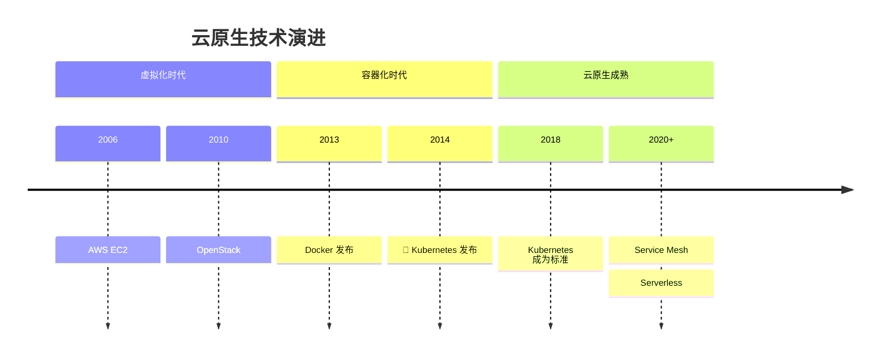
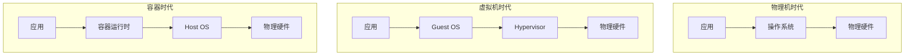
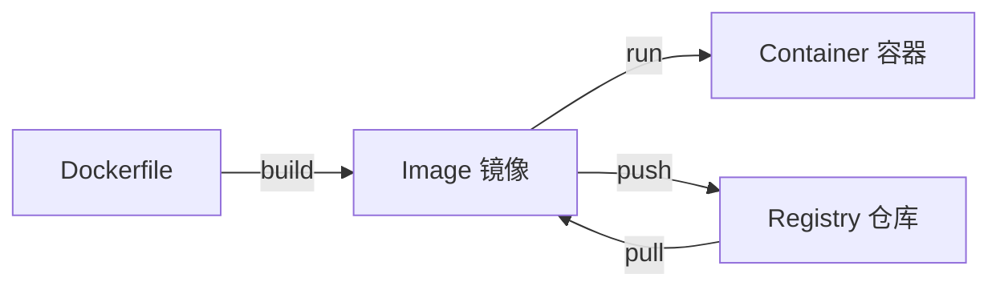
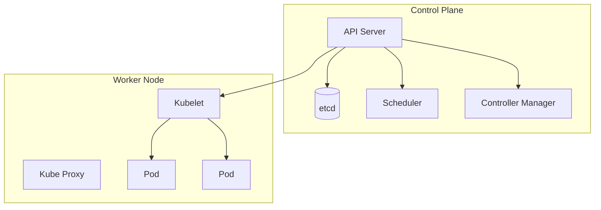
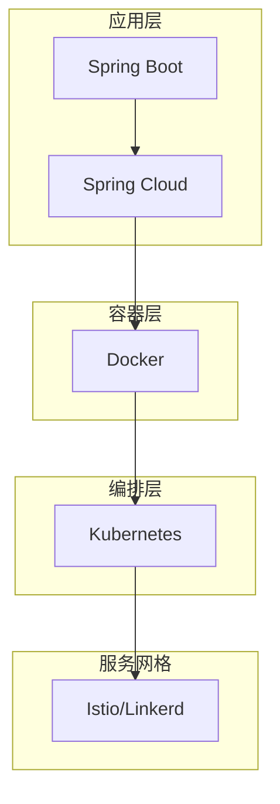

# 云原生基础设施

<p align="center">
  
  
  
</p>

---

## 📍 时间线定位



---

## 🎯 了解目标

- ✅ 理解从虚拟机到容器的演进
- ✅ 了解 Docker 的核心概念
- ✅ 认识 Kubernetes 的基本架构
- ✅ 掌握 Java 应用容器化最佳实践

---

## 📖 章节摘要

云原生（Cloud Native）改变了应用的构建、部署和运行方式。Docker 和 Kubernetes 成为事实标准，Java 应用也需要适应这一变革。

---

## 1. 从虚拟机到容器

### 1.1 演进对比



### 1.2 容器的优势

| 维度 | 虚拟机 | 容器 |
|------|--------|------|
| 启动时间 | 分钟级 | 秒级 |
| 资源占用 | GB 级 | MB 级 |
| 隔离性 | 强（完整 OS） | 较弱（共享内核） |
| 密度 | 低 | 高 |

---

## 2. Docker 基础

### 2.1 核心概念



### 2.2 Java 应用 Dockerfile

```dockerfile
# 基础 Dockerfile
FROM eclipse-temurin:17-jre
WORKDIR /app
COPY target/myapp.jar app.jar
EXPOSE 8080
ENTRYPOINT ["java", "-jar", "app.jar"]
```

```dockerfile
# 优化版：多阶段构建
FROM eclipse-temurin:17-jdk AS builder
WORKDIR /app
COPY . .
RUN ./mvnw package -DskipTests

FROM eclipse-temurin:17-jre
WORKDIR /app
COPY --from=builder /app/target/*.jar app.jar
EXPOSE 8080
ENTRYPOINT ["java", "-jar", "app.jar"]
```

### 2.3 JVM 容器化优化

```dockerfile
# 容器感知的 JVM 参数
FROM eclipse-temurin:17-jre
ENV JAVA_OPTS="-XX:+UseContainerSupport \
               -XX:MaxRAMPercentage=75.0 \
               -XX:InitialRAMPercentage=50.0"
ENTRYPOINT ["sh", "-c", "java $JAVA_OPTS -jar app.jar"]
```

**关键参数**：

| 参数 | 作用 |
|------|------|
| `-XX:+UseContainerSupport` | 容器 CPU/内存感知（JDK 10+默认开启） |
| `-XX:MaxRAMPercentage=75.0` | 堆内存占容器内存的百分比 |
| `-XX:+UseG1GC` | 推荐使用 G1 垃圾收集器 |

---

## 3. Kubernetes 基础

### 3.1 核心组件



### 3.2 核心资源

```yaml
# Deployment: 管理 Pod 的声明式更新
apiVersion: apps/v1
kind: Deployment
metadata:
  name: myapp
spec:
  replicas: 3
  selector:
    matchLabels:
      app: myapp
  template:
    metadata:
      labels:
        app: myapp
    spec:
      containers:
      - name: myapp
        image: myapp:1.0.0
        ports:
        - containerPort: 8080
        resources:
          requests:
            cpu: "250m"
            memory: "512Mi"
          limits:
            cpu: "1"
            memory: "1Gi"
        readinessProbe:
          httpGet:
            path: /actuator/health
            port: 8080
          initialDelaySeconds: 30
        livenessProbe:
          httpGet:
            path: /actuator/health
            port: 8080
          initialDelaySeconds: 60

---
# Service: 服务发现和负载均衡
apiVersion: v1
kind: Service
metadata:
  name: myapp
spec:
  selector:
    app: myapp
  ports:
  - port: 80
    targetPort: 8080
  type: ClusterIP
```

### 3.3 Spring Cloud Kubernetes

```java
// 使用 Kubernetes 原生服务发现
@SpringBootApplication
@EnableDiscoveryClient
public class MyApplication {
    public static void main(String[] args) {
        SpringApplication.run(MyApplication.class, args);
    }
}

// 直接使用 Kubernetes Service 名称
@FeignClient(name = "user-service")
public interface UserClient {
    @GetMapping("/users/{id}")
    User findById(@PathVariable Long id);
}
```

```yaml
# application.yml
spring:
  cloud:
    kubernetes:
      discovery:
        enabled: true
      config:
        enabled: true
```

---

## 4. 代码演进示例

### 4.1 部署方式演进

```bash
# ========== 传统部署 ==========
# 1. 打包 WAR
mvn package

# 2. 部署到 Tomcat
cp target/myapp.war $TOMCAT_HOME/webapps/

# 3. 重启 Tomcat
$TOMCAT_HOME/bin/shutdown.sh
$TOMCAT_HOME/bin/startup.sh

# ========== Spring Boot ==========
# 1. 打包可执行 JAR
mvn package

# 2. 直接运行
java -jar target/myapp.jar

# ========== Docker ==========
# 1. 构建镜像
docker build -t myapp:1.0.0 .

# 2. 运行容器
docker run -p 8080:8080 myapp:1.0.0

# ========== Kubernetes ==========
# 1. 应用配置
kubectl apply -f deployment.yaml

# 2. 滚动更新
kubectl set image deployment/myapp myapp=myapp:1.0.1
```

---

## 5. 技术关联分析

### 5.1 云原生技术栈



### 5.2 Java 应用云原生挑战

| 挑战 | 说明 |
|------|------|
| 启动时间 | JVM 预热慢 |
| 内存占用 | 比 Go/Rust 大 |
| 镜像大小 | JRE 占用空间 |

**解决方案**：
- GraalVM Native Image
- jlink 定制 JRE
- CDS（Class Data Sharing）

---

## 6. 演进规律总结

### 6.1 从有状态到无状态

```
有状态应用 → 无状态应用 + 外部存储

应用本身无状态，便于水平扩展。
```

### 6.2 基础设施即代码

```
手动配置 → YAML 声明式配置

所有配置版本化，可追溯、可复现。
```

---

## 7. 特殊元素

### 📝 版本迁移要点：传统部署 → 容器化

1. **配置外部化**：使用环境变量或 ConfigMap
2. **日志标准输出**：输出到 stdout/stderr
3. **健康检查**：实现 /health 端点
4. **优雅关闭**：处理 SIGTERM 信号
5. **资源限制**：设置合理的 CPU/内存限制

### 💼 面试考点

**Q1: Docker 和虚拟机的区别？**

答：
- Docker 共享宿主机内核，虚拟机有独立 Guest OS
- Docker 启动秒级，虚拟机启动分钟级
- Docker 资源占用 MB 级，虚拟机 GB 级

**Q2: Kubernetes 的 Pod 是什么？**

答：Pod 是 K8s 最小的调度单位，包含一个或多个容器，共享网络和存储，通常一个 Pod 运行一个应用。

---

## 📚 参考资料

- [Docker Documentation](https://docs.docker.com/)
- [Kubernetes Documentation](https://kubernetes.io/docs/)
- [Spring Cloud Kubernetes](https://spring.io/projects/spring-cloud-kubernetes)

---

<p align="center">
  ⬅️ <a href="./02-响应式编程崛起.md">上一篇：响应式编程崛起</a> |
  🏠 <a href="../../">返回目录</a> |
  <a href="../06-JDK17-21时代/01-现代语言特性.md">下一篇：现代语言特性</a> ➡️
</p>

