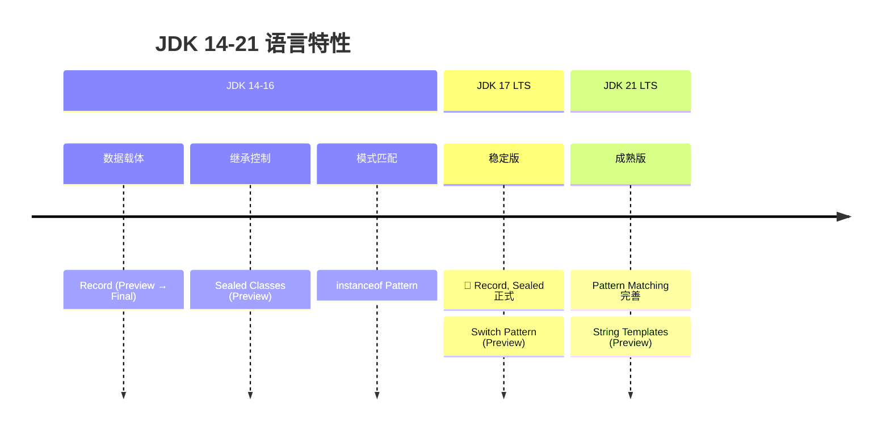

# 现代语言特性

<p align="center">
  
  
  
</p>

---

## 📍 时间线定位



---

## 🎯 学习目标

- ✅ 掌握 Record 类的语法与使用场景
- ✅ 理解 Sealed Classes 的设计目的
- ✅ 了解 Pattern Matching 的演进与应用
- ✅ 认识这些特性对框架的影响

---

## 📖 章节摘要

JDK 14-21 带来了大量语言改进，让 Java 代码更加简洁、安全。Record 简化了数据载体，Sealed Classes 控制继承，Pattern Matching 让类型检查更优雅。

---

## 1. Record 类

### 1.1 传统 POJO 的痛点

```java
// 传统 POJO：大量样板代码
public class User {
    private final String name;
    private final int age;
    
    public User(String name, int age) {
        this.name = name;
        this.age = age;
    }
    
    public String getName() { return name; }
    public int getAge() { return age; }
    
    @Override
    public boolean equals(Object o) {
        if (this == o) return true;
        if (o == null || getClass() != o.getClass()) return false;
        User user = (User) o;
        return age == user.age && Objects.equals(name, user.name);
    }
    
    @Override
    public int hashCode() {
        return Objects.hash(name, age);
    }
    
    @Override
    public String toString() {
        return "User{name='" + name + "', age=" + age + "}";
    }
}
```

### 1.2 Record 语法

```java
// JDK 16+: Record 一行搞定
public record User(String name, int age) {}

// 自动生成：
// - 私有 final 字段
// - 全参构造函数
// - getter 方法（name(), age()）
// - equals(), hashCode(), toString()

// 使用
User user = new User("Alice", 30);
System.out.println(user.name());  // Alice
System.out.println(user);         // User[name=Alice, age=30]
```

### 1.3 Record 高级用法

```java
// 紧凑构造函数（参数验证）
public record User(String name, int age) {
    public User {
        Objects.requireNonNull(name, "name cannot be null");
        if (age < 0) throw new IllegalArgumentException("age cannot be negative");
    }
}

// 静态方法和实例方法
public record Point(int x, int y) {
    // 静态工厂
    public static Point origin() {
        return new Point(0, 0);
    }
    
    // 实例方法
    public double distanceFromOrigin() {
        return Math.sqrt(x * x + y * y);
    }
}

// 实现接口
public record User(String name, int age) implements Comparable<User> {
    @Override
    public int compareTo(User other) {
        return Integer.compare(this.age, other.age);
    }
}
```

### 1.4 Record 限制

```java
// ❌ 不能继承其他类（隐式继承 java.lang.Record）
// ❌ 不能声明实例字段（只有组件字段）
// ❌ 字段自动是 final（不可变）
// ✅ 可以实现接口
// ✅ 可以有静态字段和方法
```

---

## 2. Sealed Classes

### 2.1 设计目的

```java
// 问题：如何限制哪些类可以继承？
// 传统方式：final 或 package-private

// Sealed Classes：精确控制继承
public sealed class Shape 
    permits Circle, Rectangle, Triangle {
}

// 必须是 final、sealed 或 non-sealed
public final class Circle extends Shape {
    private final double radius;
}

public sealed class Rectangle extends Shape 
    permits Square {
    private final double width, height;
}

public final class Square extends Rectangle {
}

// non-sealed 开放继承
public non-sealed class Triangle extends Shape {
}
```

### 2.2 与 Pattern Matching 结合

```java
// Sealed + Pattern Matching = 穷尽性检查
public double area(Shape shape) {
    return switch (shape) {
        case Circle c -> Math.PI * c.radius() * c.radius();
        case Rectangle r -> r.width() * r.height();
        case Triangle t -> 0.5 * t.base() * t.height();
        // 编译器知道所有可能的子类，无需 default
    };
}
```

---

## 3. Pattern Matching

### 3.1 instanceof Pattern（JDK 16）

```java
// ========== 传统方式 ==========
if (obj instanceof String) {
    String s = (String) obj;
    System.out.println(s.length());
}

// ========== Pattern Matching ==========
if (obj instanceof String s) {
    System.out.println(s.length());  // 直接使用 s
}

// 配合条件
if (obj instanceof String s && s.length() > 5) {
    System.out.println(s);
}
```

### 3.2 Switch Pattern（JDK 21）

```java
// 传统 switch
String format(Object obj) {
    if (obj instanceof Integer i) {
        return String.format("int %d", i);
    } else if (obj instanceof Double d) {
        return String.format("double %f", d);
    } else if (obj instanceof String s) {
        return String.format("String %s", s);
    }
    return obj.toString();
}

// Pattern Matching switch
String format(Object obj) {
    return switch (obj) {
        case Integer i -> String.format("int %d", i);
        case Double d -> String.format("double %f", d);
        case String s -> String.format("String %s", s);
        case null -> "null";
        default -> obj.toString();
    };
}
```

### 3.3 Record Pattern（JDK 21）

```java
record Point(int x, int y) {}
record Line(Point start, Point end) {}

// 解构 Record
void printPoint(Object obj) {
    if (obj instanceof Point(int x, int y)) {
        System.out.println("x=" + x + ", y=" + y);
    }
}

// 嵌套解构
void printLine(Object obj) {
    if (obj instanceof Line(Point(int x1, int y1), Point(int x2, int y2))) {
        System.out.println("Line from (" + x1 + "," + y1 + ") to (" + x2 + "," + y2 + ")");
    }
}

// Switch 中使用
String describe(Object obj) {
    return switch (obj) {
        case Point(int x, int y) when x == y -> "对角点";
        case Point(int x, int y) -> "点 (" + x + ", " + y + ")";
        case Line(Point p1, Point p2) -> "线段";
        default -> "未知";
    };
}
```

---

## 4. 其他改进

### 4.1 Text Blocks（JDK 15）

```java
// 传统多行字符串
String json = "{\n" +
              "  \"name\": \"Alice\",\n" +
              "  \"age\": 30\n" +
              "}";

// Text Blocks
String json = """
    {
      "name": "Alice",
      "age": 30
    }
    """;
```

### 4.2 Switch 表达式（JDK 14）

```java
// 传统 switch
int numLetters;
switch (day) {
    case MONDAY:
    case FRIDAY:
    case SUNDAY:
        numLetters = 6;
        break;
    case TUESDAY:
        numLetters = 7;
        break;
    // ...
}

// Switch 表达式
int numLetters = switch (day) {
    case MONDAY, FRIDAY, SUNDAY -> 6;
    case TUESDAY -> 7;
    case THURSDAY, SATURDAY -> 8;
    case WEDNESDAY -> 9;
};
```

---

## 5. 代码演进示例

```java
// ========== JDK 8 写法 ==========
public class User {
    private final String name;
    private final int age;
    // 构造函数、getter、equals、hashCode、toString...
}

public void process(Object obj) {
    if (obj instanceof User) {
        User user = (User) obj;
        if (user.getAge() > 18) {
            System.out.println(user.getName());
        }
    }
}

// ========== JDK 21 写法 ==========
public record User(String name, int age) {}

public void process(Object obj) {
    if (obj instanceof User(String name, int age) && age > 18) {
        System.out.println(name);
    }
}
```

---

## 6. 技术关联分析

### 6.1 对框架的影响

| 特性 | 框架影响 |
|------|----------|
| Record | JSON 序列化库适配、JPA 考虑支持 |
| Sealed | 领域建模更精确 |
| Pattern | 减少类型检查样板代码 |

### 6.2 与 Lombok 的对比

| 维度 | Record | Lombok |
|------|--------|--------|
| 定位 | 不可变数据载体 | 通用代码生成 |
| 依赖 | 语言原生 | 需要依赖 |
| 灵活性 | 受限 | 灵活 |
| IDE 支持 | 完美 | 需要插件 |

---

## 7. 演进规律总结

### 7.1 减少样板代码

```
手写 POJO → Lombok → Record

语言层面解决重复代码问题。
```

### 7.2 增强类型安全

```
if-instanceof-cast → Pattern Matching

类型检查和绑定一步完成，更安全。
```

---

## 8. 特殊元素

### 💼 面试考点

**Q1: Record 和普通类的区别？**

答：
- Record 隐式继承 java.lang.Record，不能继承其他类
- Record 字段隐式 final，不可变
- Record 自动生成 equals/hashCode/toString
- Record 没有默认无参构造函数

**Q2: Sealed Classes 的应用场景？**

答：
- 精确控制继承层次
- 配合 switch pattern matching 实现穷尽性检查
- 代数数据类型建模

---

## 📚 参考资料

- [JEP 395: Records](https://openjdk.org/jeps/395)
- [JEP 409: Sealed Classes](https://openjdk.org/jeps/409)
- [JEP 441: Pattern Matching for switch](https://openjdk.org/jeps/441)

---

<p align="center">
  ⬅️ <a href="../05-JDK9-11时代/03-云原生基础设施.md">上一篇：云原生基础设施</a> |
  🏠 <a href="../../README.md">返回目录</a> |
  <a href="./02-虚拟线程革命.md">下一篇：虚拟线程革命</a> ➡️
</p>

