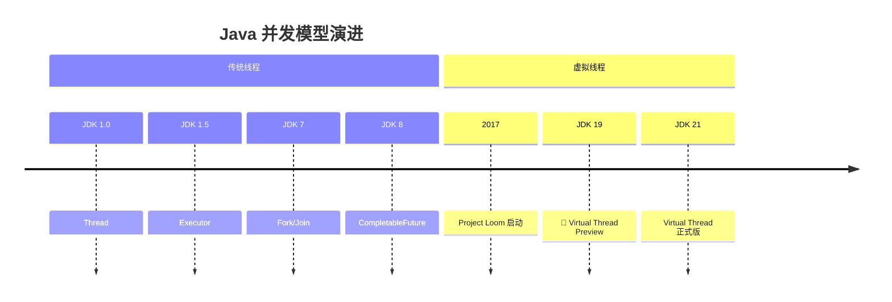
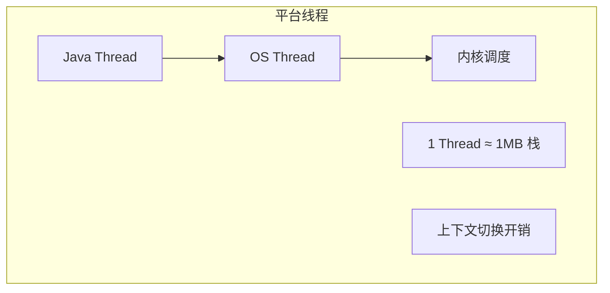
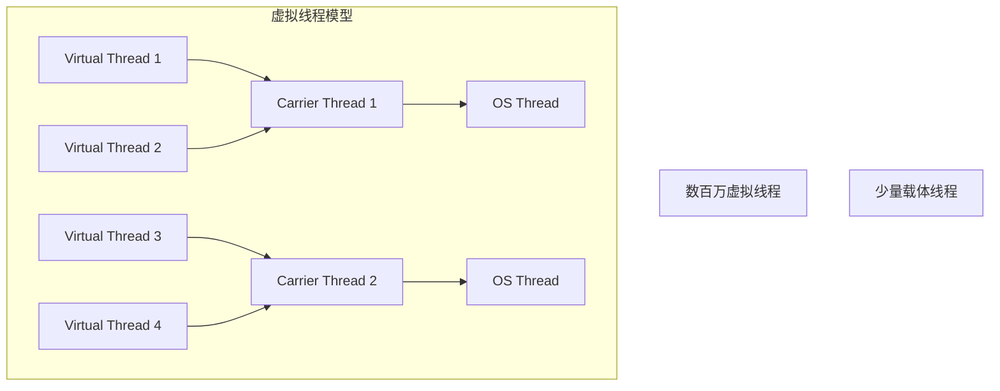
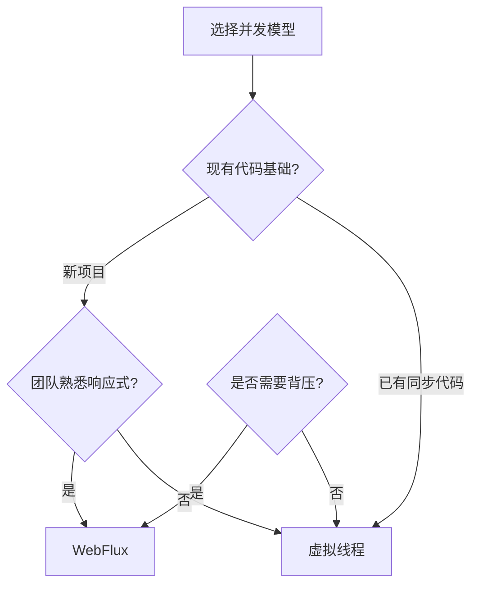

# 虚拟线程革命

<p align="center">
  
  
  
</p>

---

## 📍 时间线定位



---

## 🎯 学习目标

- ✅ 理解传统线程模型的瓶颈
- ✅ 掌握虚拟线程的核心原理
- ✅ 了解虚拟线程与响应式编程的对比
- ✅ 认识虚拟线程对框架的影响

---

## 📖 章节摘要

虚拟线程（Virtual Threads）是 Java 并发编程的重大革新。它让开发者可以用简单的同步代码实现高并发，无需响应式编程的复杂性。

---

## 1. 传统线程模型的问题

### 1.1 平台线程的成本



**问题**：
- 每个线程约 1MB 栈内存
- 操作系统线程数量有限（通常几千）
- 上下文切换开销大

### 1.2 高并发的困境

```java
// 传统方式：每个请求一个线程
// 10000 并发 = 10000 线程 ≈ 10GB 内存

public void handleRequest(Request request) {
    User user = userService.findById(request.getUserId());  // I/O 阻塞
    Order order = orderService.create(user, request);       // I/O 阻塞
    emailService.sendConfirmation(order);                   // I/O 阻塞
}

// 线程大部分时间在等待 I/O，浪费资源
```

### 1.3 之前的解决方案

| 方案 | 优点 | 缺点 |
|------|------|------|
| 线程池 | 控制线程数量 | 不能突破线程上限 |
| 异步回调 | 非阻塞 | 回调地狱 |
| CompletableFuture | 链式调用 | 代码复杂 |
| 响应式（WebFlux） | 高并发 | 学习成本高、调试难 |

---

## 2. 虚拟线程原理

### 2.1 基本概念



- **虚拟线程**：轻量级线程，由 JVM 调度
- **载体线程**：实际的平台线程，执行虚拟线程的代码
- **挂载/卸载**：虚拟线程阻塞时从载体线程卸载，恢复时重新挂载

### 2.2 工作原理

```java
// 虚拟线程遇到阻塞 I/O 时
// 1. 保存栈到堆内存
// 2. 从载体线程卸载
// 3. 载体线程执行其他虚拟线程
// 4. I/O 完成后，虚拟线程重新挂载

// 这一切对开发者透明！
```

---

## 3. 虚拟线程使用

### 3.1 创建虚拟线程

```java
// 方式 1: Thread.ofVirtual()
Thread vThread = Thread.ofVirtual().start(() -> {
    System.out.println("Running in virtual thread");
});

// 方式 2: Thread.startVirtualThread()
Thread vThread = Thread.startVirtualThread(() -> {
    System.out.println("Running in virtual thread");
});

// 方式 3: 虚拟线程执行器
ExecutorService executor = Executors.newVirtualThreadPerTaskExecutor();
executor.submit(() -> {
    System.out.println("Running in virtual thread");
});
```

### 3.2 实际应用示例

```java
// 传统方式：线程池限制并发数
ExecutorService executor = Executors.newFixedThreadPool(200);

// 虚拟线程：每个请求一个虚拟线程，无需担心数量
try (var executor = Executors.newVirtualThreadPerTaskExecutor()) {
    IntStream.range(0, 10_000).forEach(i -> {
        executor.submit(() -> {
            // 每个任务一个虚拟线程
            User user = userService.findById(i);    // 阻塞时自动让出
            Order order = orderService.create(user); // 阻塞时自动让出
            return order;
        });
    });
}
```

### 3.3 Spring Boot 集成

```yaml
# Spring Boot 3.2+
spring:
  threads:
    virtual:
      enabled: true  # 开启虚拟线程
```

```java
// Tomcat 自动使用虚拟线程处理请求
@RestController
public class UserController {
    
    @GetMapping("/users/{id}")
    public User getUser(@PathVariable Long id) {
        // 可以放心使用阻塞代码
        return userService.findById(id);
    }
}
```

---

## 4. 代码演进示例

```java
// ========== 传统同步（简单但不支持高并发）==========
public List<User> getUsers(List<Long> ids) {
    List<User> users = new ArrayList<>();
    for (Long id : ids) {
        users.add(userService.findById(id));  // 串行阻塞
    }
    return users;
}

// ========== CompletableFuture（复杂）==========
public CompletableFuture<List<User>> getUsers(List<Long> ids) {
    List<CompletableFuture<User>> futures = ids.stream()
        .map(id -> CompletableFuture.supplyAsync(
            () -> userService.findById(id), executor))
        .toList();
    
    return CompletableFuture.allOf(futures.toArray(new CompletableFuture[0]))
        .thenApply(v -> futures.stream()
            .map(CompletableFuture::join)
            .toList());
}

// ========== 响应式（更复杂）==========
public Flux<User> getUsers(List<Long> ids) {
    return Flux.fromIterable(ids)
        .flatMap(id -> userService.findById(id))
        .collectList();
}

// ========== 虚拟线程（简单且高并发）==========
public List<User> getUsers(List<Long> ids) throws Exception {
    try (var executor = Executors.newVirtualThreadPerTaskExecutor()) {
        List<Future<User>> futures = ids.stream()
            .map(id -> executor.submit(() -> userService.findById(id)))
            .toList();
        
        return futures.stream()
            .map(f -> f.get())  // 简单的阻塞等待
            .toList();
    }
}
```

---

## 5. 虚拟线程 vs 响应式

### 5.1 对比分析

| 维度 | 虚拟线程 | 响应式（WebFlux） |
|------|----------|-------------------|
| 编程模型 | 同步阻塞 | 异步非阻塞 |
| 代码复杂度 | 低 | 高 |
| 调试难度 | 正常堆栈 | 异步堆栈难追踪 |
| 学习曲线 | 低 | 高 |
| 生态成熟度 | 新兴 | 成熟 |
| CPU 密集型 | 不适合 | 不适合 |
| I/O 密集型 | 适合 | 适合 |

### 5.2 选择建议



---

## 6. 技术关联分析

### 6.1 框架支持

| 框架 | 支持版本 | 说明 |
|------|----------|------|
| Spring Boot | 3.2+ | 配置开启即可 |
| Tomcat | 10.1+ | 自动适配 |
| JDBC | - | 需要支持虚拟线程的驱动 |
| Hibernate | 6.2+ | 支持 |

### 6.2 注意事项

```java
// ⚠️ 虚拟线程的限制

// 1. synchronized 会阻塞载体线程（Pinning）
synchronized (lock) {
    // 此时虚拟线程无法从载体线程卸载
    blockingOperation();  // 不推荐
}

// 推荐使用 ReentrantLock
lock.lock();
try {
    blockingOperation();  // 可以正常卸载
} finally {
    lock.unlock();
}

// 2. ThreadLocal 可能消耗大量内存
// 每个虚拟线程都有独立的 ThreadLocal 副本
```

---

## 7. 演进规律总结

### 7.1 简化高并发

```
线程池（复杂）→ 响应式（更复杂）→ 虚拟线程（简单）

最终回归简单的同步编程模型。
```

### 7.2 透明优化

```
显式异步 → 隐式异步

开发者写同步代码，JVM 自动优化并发。
```

---

## 8. 特殊元素

### 👤 关键人物：Ron Pressler

Ron Pressler 是 Project Loom 的技术负责人，推动了虚拟线程从概念到实现。

### 💼 面试考点

**Q1: 虚拟线程和平台线程的区别？**

答：
- 虚拟线程由 JVM 调度，平台线程由 OS 调度
- 虚拟线程栈内存小（KB级），平台线程大（MB级）
- 虚拟线程可以创建数百万个，平台线程受 OS 限制

**Q2: 虚拟线程会取代响应式编程吗？**

答：不完全取代。虚拟线程简化了 I/O 密集型场景，但响应式仍有优势：
- 背压机制
- 流式数据处理
- 成熟的操作符生态

**Q3: 什么是 Pinning？**

答：虚拟线程在执行 synchronized 块或 native 方法时无法从载体线程卸载，称为 Pinning。应该使用 `ReentrantLock` 替代 `synchronized`。

### 🤔 争议与反思

虚拟线程是否会取代响应式？

> 💡 **观点**：虚拟线程简化了大多数场景，但响应式在流处理、背压等场景仍有独特价值。未来可能是两者共存。

---

## 📚 参考资料

- [JEP 444: Virtual Threads](https://openjdk.org/jeps/444)
- [Project Loom](https://openjdk.org/projects/loom/)
- [Virtual Threads - Spring Blog](https://spring.io/blog/2022/10/11/embracing-virtual-threads)

---

<p align="center">
  ⬅️ <a href="./01-现代语言特性.md">上一篇：现代语言特性</a> |
  🏠 <a href="../../README.md">返回目录</a> |
  <a href="./03-GraalVM与Native.md">下一篇：GraalVM与Native</a> ➡️
</p>

