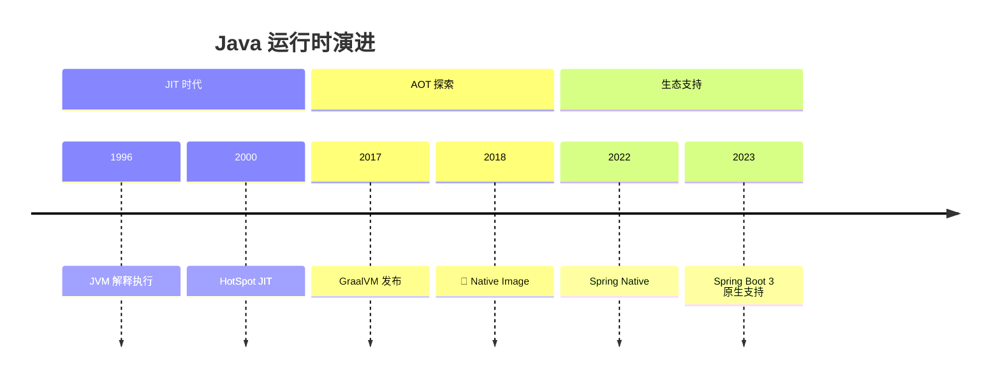
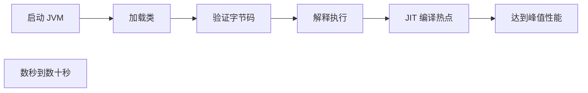
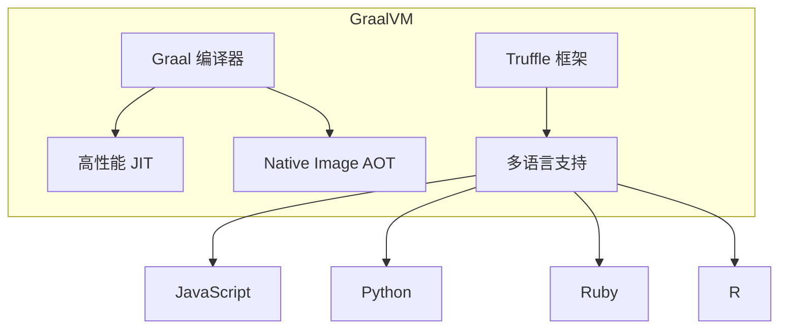
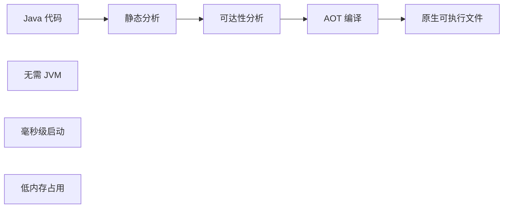
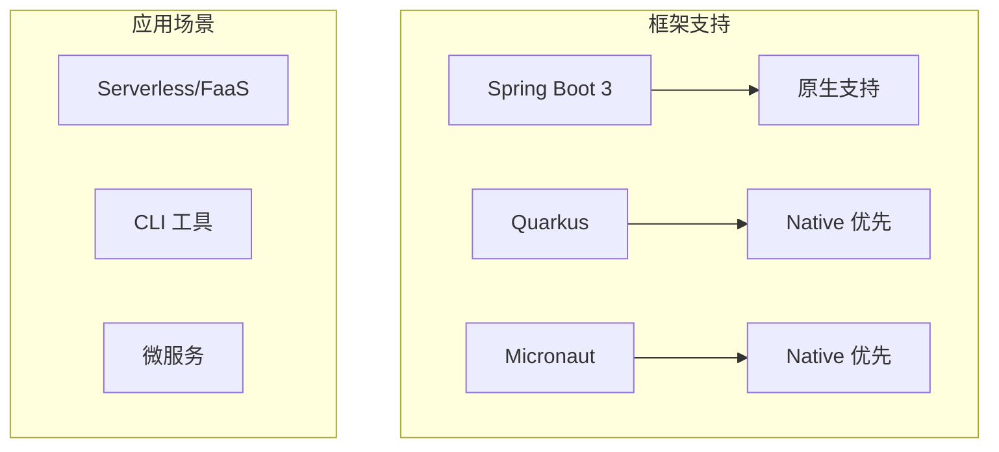

# GraalVM 与 Native Image

<p align="center">
  
  
  
</p>

---

## 📍 时间线定位



---

## 🎯 学习目标

- ✅ 理解 JVM 启动时间和内存问题
- ✅ 了解 GraalVM 和 Native Image 的原理
- ✅ 掌握 Spring Native 的基本使用
- ✅ 认识 Native Image 的适用场景与限制

---

## 📖 章节摘要

GraalVM Native Image 通过 AOT（Ahead-of-Time）编译将 Java 应用编译为原生可执行文件，实现毫秒级启动和极低内存占用，非常适合云原生和 Serverless 场景。

---

## 1. JVM 的挑战

### 1.1 启动时间问题



**问题**：
- 类加载和验证耗时
- JIT 需要预热才能达到峰值性能
- 对短生命周期应用不友好

### 1.2 内存占用

| 组件 | 典型占用 |
|------|----------|
| 堆内存 | 根据应用配置 |
| 元空间 | 数十 MB |
| JIT 编译缓存 | 数十 MB |
| 线程栈 | 每线程 1MB |

### 1.3 云原生场景的挑战

```
Serverless/FaaS:
- 冷启动惩罚
- 按内存计费

Kubernetes:
- 资源限制
- 快速扩缩容
```

---

## 2. GraalVM 简介

### 2.1 GraalVM 是什么



### 2.2 Native Image 原理



**AOT vs JIT**：

| 特性 | JIT | AOT (Native Image) |
|------|-----|-----|
| 编译时机 | 运行时 | 构建时 |
| 启动时间 | 慢（秒级） | 快（毫秒级） |
| 内存占用 | 高 | 低 |
| 峰值性能 | 更高（运行时优化） | 略低 |
| 文件大小 | JAR + JRE | 单一可执行文件 |

---

## 3. Native Image 使用

### 3.1 基本使用

```bash
# 安装 GraalVM
sdk install java 21-graal

# 安装 native-image 工具
gu install native-image

# 编译 Native Image
native-image -jar myapp.jar

# 运行
./myapp
```

### 3.2 Spring Boot 3 Native

```xml
<!-- pom.xml -->
<parent>
    <groupId>org.springframework.boot</groupId>
    <artifactId>spring-boot-starter-parent</artifactId>
    <version>3.2.0</version>
</parent>

<build>
    <plugins>
        <plugin>
            <groupId>org.graalvm.buildtools</groupId>
            <artifactId>native-maven-plugin</artifactId>
        </plugin>
    </plugins>
</build>
```

```bash
# 构建 Native 镜像
mvn -Pnative native:compile

# 运行
./target/myapp
```

### 3.3 效果对比

```
传统 JVM:
- 启动时间: 2-5 秒
- 内存占用: 200-500 MB
- 镜像大小: 300+ MB（含 JRE）

Native Image:
- 启动时间: 50-100 毫秒
- 内存占用: 50-100 MB
- 镜像大小: 50-100 MB
```

---

## 4. Native Image 的限制

### 4.1 反射限制

```java
// 动态反射在 Native Image 中需要配置
Class<?> clazz = Class.forName("com.example.User");
Object obj = clazz.getDeclaredConstructor().newInstance();

// 需要在 reflect-config.json 中声明
// 或使用 @RegisterReflectionForBinding 注解
```

```json
// META-INF/native-image/reflect-config.json
[
  {
    "name": "com.example.User",
    "allDeclaredConstructors": true,
    "allPublicMethods": true
  }
]
```

### 4.2 其他限制

| 限制 | 说明 |
|------|------|
| 反射 | 需要显式配置 |
| 动态代理 | 需要配置 |
| JNI | 需要配置 |
| 序列化 | 需要配置 |
| 类加载 | 不支持动态类加载 |

### 4.3 框架适配

```java
// Spring 使用 Hint 系统适配
@Configuration
@ImportRuntimeHints(MyRuntimeHints.class)
public class MyConfig {
}

public class MyRuntimeHints implements RuntimeHintsRegistrar {
    @Override
    public void registerHints(RuntimeHints hints, ClassLoader classLoader) {
        hints.reflection().registerType(User.class,
            MemberCategory.INVOKE_DECLARED_CONSTRUCTORS,
            MemberCategory.INVOKE_PUBLIC_METHODS);
    }
}
```

---

## 5. 代码演进示例

```dockerfile
# ========== 传统 JVM 镜像 ==========
FROM eclipse-temurin:17-jre
COPY target/myapp.jar app.jar
ENTRYPOINT ["java", "-jar", "app.jar"]
# 镜像大小: ~300MB, 启动时间: ~3s

# ========== Native Image ==========
FROM gcr.io/distroless/base
COPY target/myapp myapp
ENTRYPOINT ["./myapp"]
# 镜像大小: ~80MB, 启动时间: ~0.1s
```

---

## 6. 技术关联分析

### 6.1 Native Image 生态



### 6.2 选择建议

| 场景 | 推荐 |
|------|------|
| 长期运行服务 | JVM（JIT 优化更好） |
| Serverless | Native Image |
| CLI 工具 | Native Image |
| 资源受限环境 | Native Image |
| 需要动态特性 | JVM |

---

## 7. 演进规律总结

### 7.1 编译时 vs 运行时

```
运行时优化（JIT）→ 编译时优化（AOT）

将更多工作移到编译期，减少运行时开销。
```

### 7.2 通用性 vs 专用性

```
通用 JVM → 专用原生镜像

根据场景选择最合适的运行方式。
```

---

## 8. 特殊元素

### 🏛️ 技术考古：GraalVM 起源

| 时间 | 事件 |
|------|------|
| 2011 | Oracle Labs 启动 Graal 项目 |
| 2017 | GraalVM 首次公开发布 |
| 2019 | GraalVM 19.0 发布 |
| 2022 | GraalVM 成为 OpenJDK 的一部分 |

### 📝 版本迁移要点：JVM → Native

1. **检查反射使用**：配置 reflect-config.json
2. **检查动态代理**：配置 proxy-config.json
3. **检查资源文件**：配置 resource-config.json
4. **运行测试**：在 Native 模式下测试
5. **性能调优**：可能需要调整配置

### 💼 面试考点

**Q1: JIT 和 AOT 的区别？**

答：
- JIT：运行时编译热点代码，可以进行运行时优化
- AOT：构建时编译所有代码，启动快但无法进行运行时优化

**Q2: Native Image 适合什么场景？**

答：
- Serverless/FaaS（冷启动敏感）
- CLI 工具（需要快速启动）
- 容器化微服务（资源限制）
- 边缘计算（资源受限）

---

## 📚 参考资料

- [GraalVM Documentation](https://www.graalvm.org/docs/)
- [Spring Native Documentation](https://docs.spring.io/spring-boot/docs/current/reference/html/native-image.html)
- [Quarkus Native Guide](https://quarkus.io/guides/building-native-image)

---

<p align="center">
  ⬅️ <a href="./02-虚拟线程革命.md">上一篇：虚拟线程革命</a> |
  🏠 <a href="../../README.md">返回目录</a> |
  <a href="../07-总结与展望/01-并发模型演进专题.md">下一篇：并发模型演进专题</a> ➡️
</p>

