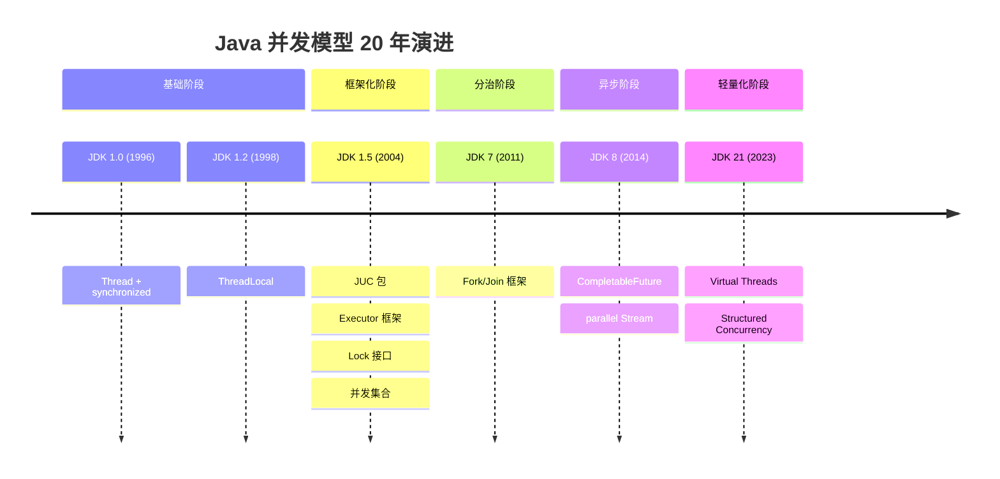

# 并发模型演进专题

<p align="center">
  
  
  
</p>

---

## 📍 完整演进时间线



---

## 🎯 了解目标

- ✅ 全面回顾 Java 并发模型的演进历程
- ✅ 理解每个阶段的设计动机与解决的问题
- ✅ 掌握各种并发模型的适用场景
- ✅ 建立完整的并发编程知识体系

---

## 1. 基础阶段：Thread + synchronized

### 1.1 JDK 1.0 原始模型

```java
// 最原始的并发方式
public class Counter {
    private int count = 0;
    
    public synchronized void increment() {
        count++;
    }
    
    public synchronized int getCount() {
        return count;
    }
}

// 创建线程
Thread thread = new Thread(() -> {
    counter.increment();
});
thread.start();
thread.join();  // 等待完成
```

### 1.2 局限性

| 问题 | 影响 |
|------|------|
| 每个任务一个线程 | 资源浪费 |
| synchronized 粒度粗 | 并发度低 |
| wait/notify 易出错 | 容易死锁 |
| 无法获取返回值 | Runnable 无返回值 |

---

## 2. 框架化阶段：JUC 包

### 2.1 Executor 框架

```java
// 线程池管理
ExecutorService executor = Executors.newFixedThreadPool(10);

// 提交任务
Future<String> future = executor.submit(() -> {
    return fetchData();
});

// 获取结果
String result = future.get();

executor.shutdown();
```

### 2.2 Lock 与并发集合

```java
// 更灵活的锁
Lock lock = new ReentrantLock();
lock.tryLock(1, TimeUnit.SECONDS);

// 线程安全集合
ConcurrentHashMap<String, Integer> map = new ConcurrentHashMap<>();
BlockingQueue<Task> queue = new LinkedBlockingQueue<>();
```

### 2.3 解决的问题

| 特性 | 解决的问题 |
|------|-----------|
| 线程池 | 线程复用，控制数量 |
| Callable/Future | 获取异步结果 |
| Lock | 可中断、可超时、公平锁 |
| 并发集合 | 线程安全的高效集合 |

---

## 3. 分治阶段：Fork/Join

### 3.1 工作窃取

```java
// Fork/Join 分治计算
public class SumTask extends RecursiveTask<Long> {
    private final long[] array;
    private final int start, end;
    
    @Override
    protected Long compute() {
        if (end - start <= THRESHOLD) {
            // 直接计算
            return computeSequentially();
        }
        
        int mid = (start + end) / 2;
        SumTask left = new SumTask(array, start, mid);
        SumTask right = new SumTask(array, mid, end);
        
        left.fork();  // 异步执行左半部分
        Long rightResult = right.compute();  // 当前线程计算右半部分
        Long leftResult = left.join();  // 等待左半部分结果
        
        return leftResult + rightResult;
    }
}

// 使用
ForkJoinPool pool = ForkJoinPool.commonPool();
Long result = pool.invoke(new SumTask(array, 0, array.length));
```

### 3.2 适用场景

- CPU 密集型计算
- 可分解的大任务
- 递归问题

---

## 4. 异步阶段：CompletableFuture

### 4.1 异步编排

```java
// 链式异步操作
CompletableFuture<String> future = CompletableFuture
    .supplyAsync(() -> fetchUser(userId))
    .thenApply(user -> fetchOrders(user))
    .thenApply(orders -> formatResult(orders))
    .exceptionally(e -> "Error: " + e.getMessage());

// 组合多个异步操作
CompletableFuture<Void> all = CompletableFuture.allOf(
    fetchUserAsync(1L),
    fetchUserAsync(2L),
    fetchUserAsync(3L)
);

// 任意一个完成
CompletableFuture<Object> any = CompletableFuture.anyOf(
    fetchFromSource1(),
    fetchFromSource2()
);
```

### 4.2 parallel Stream

```java
// 并行流处理
List<String> results = users.parallelStream()
    .filter(u -> u.getAge() > 18)
    .map(User::getName)
    .collect(Collectors.toList());
```

---

## 5. 轻量化阶段：Virtual Threads

### 5.1 虚拟线程

```java
// 创建百万级虚拟线程
try (var executor = Executors.newVirtualThreadPerTaskExecutor()) {
    IntStream.range(0, 1_000_000).forEach(i -> {
        executor.submit(() -> {
            Thread.sleep(1000);  // 模拟 I/O
            return i;
        });
    });
}
```

### 5.2 结构化并发（预览）

```java
// JDK 21 结构化并发
try (var scope = new StructuredTaskScope.ShutdownOnFailure()) {
    Future<User> user = scope.fork(() -> fetchUser(id));
    Future<Orders> orders = scope.fork(() -> fetchOrders(id));
    
    scope.join();           // 等待所有子任务
    scope.throwIfFailed();  // 传播异常
    
    return new UserProfile(user.resultNow(), orders.resultNow());
}
```

---

## 6. 代码演进对比

```java
// ========== JDK 1.0: 原始 Thread ==========
List<Thread> threads = new ArrayList<>();
for (int i = 0; i < 10; i++) {
    Thread t = new Thread(new MyTask(i));
    threads.add(t);
    t.start();
}
for (Thread t : threads) {
    t.join();
}

// ========== JDK 1.5: Executor ==========
ExecutorService executor = Executors.newFixedThreadPool(10);
List<Future<Result>> futures = new ArrayList<>();
for (int i = 0; i < 10; i++) {
    futures.add(executor.submit(new MyCallable(i)));
}
for (Future<Result> f : futures) {
    Result r = f.get();
}
executor.shutdown();

// ========== JDK 8: CompletableFuture ==========
List<CompletableFuture<Result>> futures = IntStream.range(0, 10)
    .mapToObj(i -> CompletableFuture.supplyAsync(() -> process(i)))
    .toList();
    
CompletableFuture.allOf(futures.toArray(new CompletableFuture[0]))
    .thenRun(() -> System.out.println("All done"));

// ========== JDK 21: Virtual Threads ==========
try (var executor = Executors.newVirtualThreadPerTaskExecutor()) {
    List<Future<Result>> futures = IntStream.range(0, 10)
        .mapToObj(i -> executor.submit(() -> process(i)))
        .toList();
    
    futures.forEach(f -> {
        try { f.get(); } catch (Exception e) { }
    });
}
```

---

## 7. 模型对比总结

| 模型 | 适用场景 | 复杂度 | 性能特点 |
|------|----------|:------:|----------|
| Thread + synchronized | 简单场景 | 低 | 资源消耗大 |
| Executor + Future | 通用场景 | 中 | 线程池复用 |
| Fork/Join | CPU 密集型分治 | 高 | 工作窃取 |
| CompletableFuture | 异步编排 | 高 | 非阻塞组合 |
| Virtual Thread | I/O 密集型高并发 | 低 | 轻量级线程 |

---

## 8. 与其他语言对比

| 语言 | 并发模型 | 特点 |
|------|----------|------|
| Java | Thread → Virtual Thread | 演进渐进 |
| Go | Goroutine | 原生轻量级 |
| Kotlin | Coroutine | 协程 |
| Rust | async/await | 零成本抽象 |
| JavaScript | Event Loop + async | 单线程异步 |

---

## 9. 面试考点汇总

| 考点 | 关键知识 |
|------|----------|
| synchronized vs Lock | Lock 更灵活：可中断、超时、公平 |
| ConcurrentHashMap | JDK 7 分段锁，JDK 8 CAS + synchronized |
| 线程池参数 | 核心数、最大数、队列、拒绝策略 |
| Fork/Join | 工作窃取算法 |
| CompletableFuture | thenApply/thenCompose/thenCombine |
| Virtual Thread | 载体线程、Pinning |

---

## 10. 演进规律

### 10.1 从手动到框架

```
手动 Thread → Executor 框架 → 虚拟线程

将线程管理交给框架/运行时，开发者专注业务。
```

### 10.2 从重量级到轻量级

```
OS 线程（MB）→ 虚拟线程（KB）

资源消耗不断降低，并发能力不断提升。
```

### 10.3 从复杂到简单

```
回调地狱 → CompletableFuture → 虚拟线程同步代码

最终回归简单的同步编程模型。
```

---

## 📚 参考资料

- [Java Concurrency in Practice](https://jcip.net/)
- [JEP 444: Virtual Threads](https://openjdk.org/jeps/444)
- [JEP 453: Structured Concurrency](https://openjdk.org/jeps/453)

---

<p align="center">
  ⬅️ <a href="../06-JDK17-21时代/03-GraalVM与Native.md">上一篇：GraalVM与Native</a> |
  🏠 <a href="../../README.md">返回目录</a> |
  <a href="./02-演进规律与未来展望.md">下一篇：演进规律与未来展望</a> ➡️
</p>

