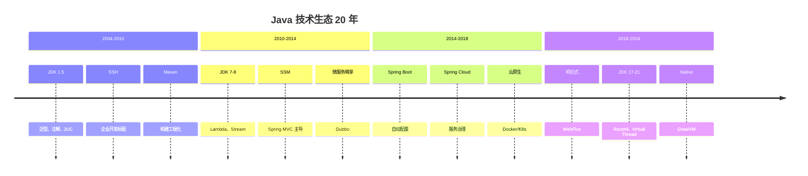
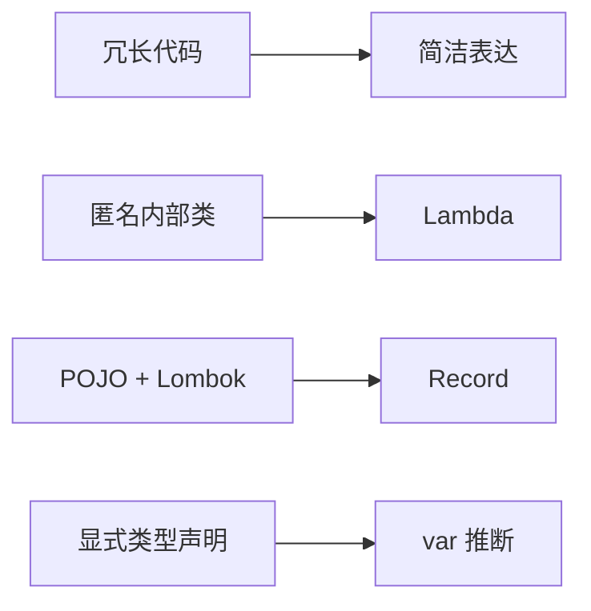
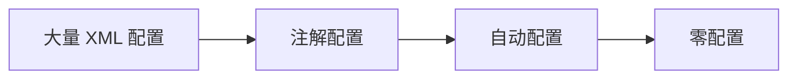
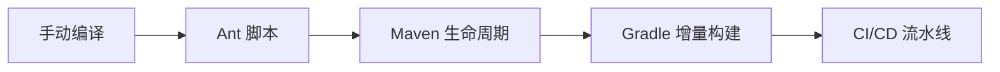
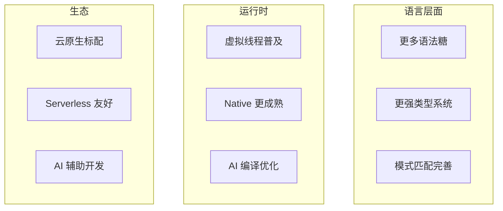

# 演进规律与未来展望

<p align="center">
  
  
  
</p>

---

## 📍 系列回顾



---

## 🎯 学习目标

- ✅ 总结 Java 技术演进的核心规律
- ✅ 理解技术选型的哲学思考
- ✅ 展望 Java 生态的未来发展
- ✅ 建立持续学习的方法论

---

## 1. 语言特性演进规律

### 1.1 简洁化



**代码行数的减少**：

| 功能 | JDK 7 | JDK 21 |
|------|-------|--------|
| 事件处理 | 5 行 | 1 行 |
| 数据类 | 50 行 | 1 行 |
| 集合创建 | 3 行 | 1 行 |

### 1.2 声明式

```
命令式（怎么做）→ 声明式（要什么）

for 循环 → Stream API
XML 配置 → 注解 → 约定
手动事务 → @Transactional
```

### 1.3 安全性

```
运行时检查 → 编译时检查

原始集合 → 泛型（类型安全）
null 返回 → Optional
开放继承 → Sealed Classes
```

---

## 2. 框架演进规律

### 2.1 约定优于配置



| 时期 | 配置量 | 示例 |
|------|--------|------|
| Spring 1.x | 大量 XML | applicationContext.xml |
| Spring 2.5 | XML + 注解 | @Autowired |
| Spring Boot | 少量 YAML | application.yml |

### 2.2 侵入性降低

```
继承框架类 → 实现框架接口 → 使用注解 → POJO

Struts Action 继承 → Spring MVC 注解 → 函数式 Handler
```

### 2.3 生态标准化

```
私有 API → 行业规范 → 统一抽象

Hibernate API → JPA 规范 → Spring Data
各家日志 → SLF4J → Logback
```

---

## 3. 工程化演进规律

### 3.1 自动化程度



### 3.2 部署方式

| 时期 | 部署方式 | 启动时间 |
|------|----------|----------|
| 2000s | WAR + Tomcat | 分钟级 |
| 2014+ | JAR 独立运行 | 秒级 |
| 2018+ | Docker 容器 | 秒级 |
| 2022+ | Native Image | 毫秒级 |

---

## 4. 并发模型演进规律

### 4.1 线程模型轻量化

```
OS 线程 → 线程池 → 虚拟线程

资源消耗：MB → 复用 → KB
```

### 4.2 编程模型简化

```
回调地狱 → 链式调用 → 同步代码

Callback → CompletableFuture → Virtual Thread
```

---

## 5. 技术选型哲学

### 5.1 没有银弹

> **No Silver Bullet** - 没有一种技术能解决所有问题。

| 场景 | 推荐技术 |
|------|----------|
| 传统 CRUD | Spring MVC |
| 高并发 API | WebFlux / Virtual Thread |
| 简单 ORM | MyBatis |
| 复杂领域模型 | JPA/Hibernate |
| 快速启动 | Native Image |
| 峰值性能 | JVM + JIT |

### 5.2 适度超前

```
太保守：技术债务累积
太激进：踩坑风险高
适度超前：保持竞争力
```

**建议**：
- 核心业务：稳定版本
- 新项目：最新 LTS
- 试验项目：预览特性

### 5.3 跟随社区

```
关注：Spring 官方博客、JEP 列表、大厂技术博客
参与：开源项目、技术社区
```

---

## 6. Java 生态未来展望

### 6.1 进行中的项目

| 项目 | 目标 | 预期 |
|------|------|------|
| Valhalla | 值类型、泛型特化 | 性能提升 |
| Panama | 外部函数和内存 | 替代 JNI |
| Amber | 语言特性增强 | 开发效率 |
| Loom | 虚拟线程、结构化并发 | 并发简化 |

### 6.2 技术趋势预测



---

## 7. 持续学习方法论

### 7.1 学习路径

```
基础 → 框架 → 原理 → 源码 → 实践

不要跳过基础，原理比 API 更重要。
```

### 7.2 保持更新

| 资源 | 频率 | 内容 |
|------|------|------|
| JEP 列表 | 每月 | 语言新特性 |
| Spring 博客 | 每周 | 框架更新 |
| InfoQ/掘金 | 每天 | 技术文章 |
| 官方文档 | 需要时 | 权威参考 |

### 7.3 实践检验

```
看 → 练 → 用 → 教

最好的学习是输出，写博客、做分享。
```

---

## 8. 全系列总结

### 8.1 核心收获

通过本系列，你应该已经了解：

1. **语言特性**：从泛型到虚拟线程的 20 年演进
2. **框架生态**：从 SSH 到 Spring Boot 的技术更迭
3. **工程化**：从 Ant 到 Kubernetes 的部署革命
4. **并发模型**：从 Thread 到 Virtual Thread 的简化之路

### 8.2 思维模式

- **历史视角**：理解技术为什么这样设计
- **演进思维**：看到技术发展的趋势
- **权衡意识**：理解技术取舍的原因
- **实用主义**：选择适合场景的技术

### 8.3 最终反思

> **技术在不断演进，但核心原则不变**：
> - 简洁优于复杂
> - 明确优于隐晦
> - 组合优于继承
> - 约定优于配置

---

## 🤔 最终思考：技术人如何跟进技术演进

1. **不要焦虑**：不必追每一个新技术
2. **掌握原理**：原理通用，API 会变
3. **关注趋势**：了解技术方向比细节更重要
4. **实践为王**：动手做才能真正掌握
5. **保持好奇**：技术的乐趣在于探索

---

## 📚 推荐资源

### 书籍
- 《Effective Java》
- 《Java Concurrency in Practice》
- 《Spring in Action》

### 网站
- [OpenJDK](https://openjdk.org/)
- [Spring.io](https://spring.io/)
- [Baeldung](https://www.baeldung.com/)

### 社区
- GitHub
- Stack Overflow
- 各大技术博客平台

---

<p align="center">
  🎉 <strong>恭喜你完成了 Java 技术生态演进系列！</strong> 🎉
</p>

<p align="center">
  ⬅️ <a href="./01-并发模型演进专题.md">上一篇：并发模型演进专题</a> |
  🏠 <a href="../../README.md">返回目录</a>
</p>

