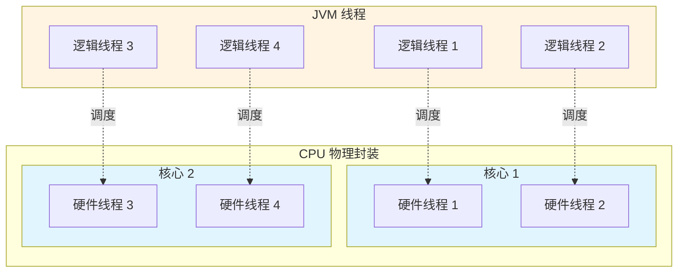
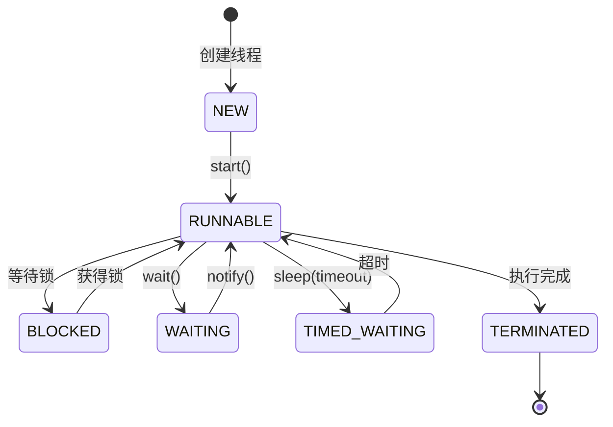
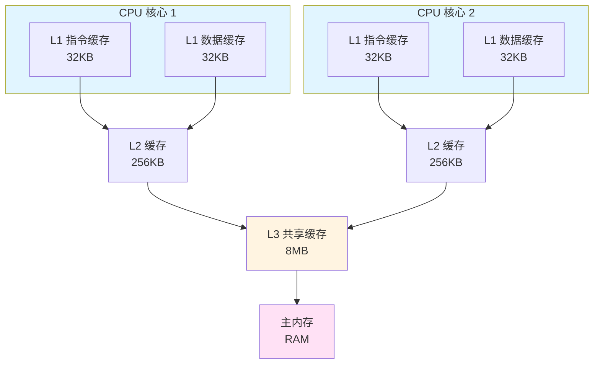
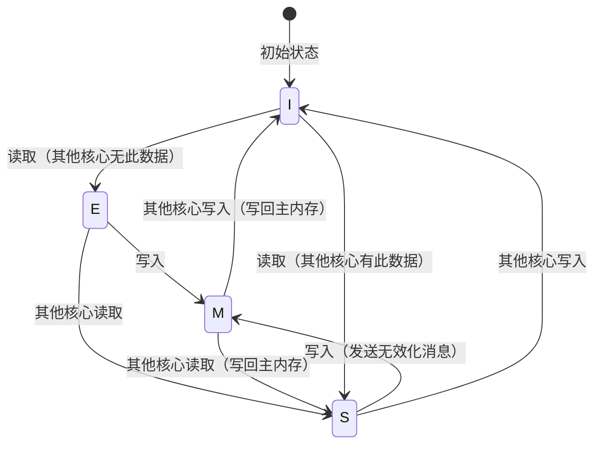
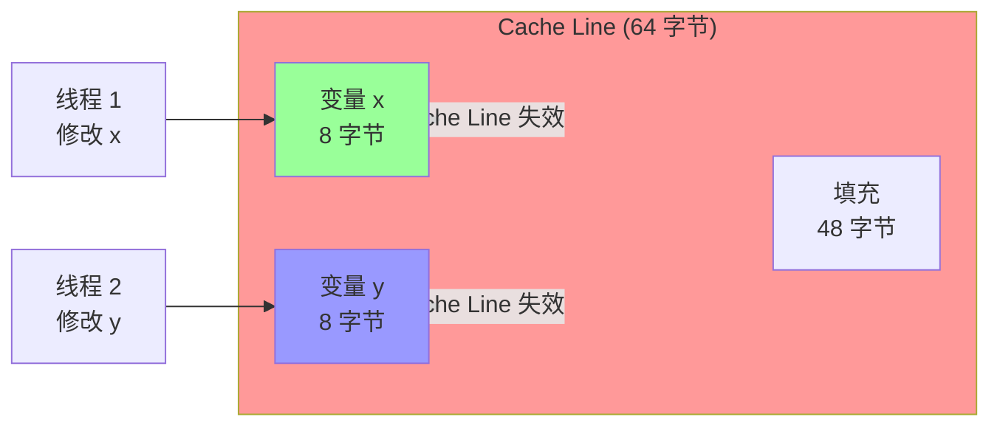
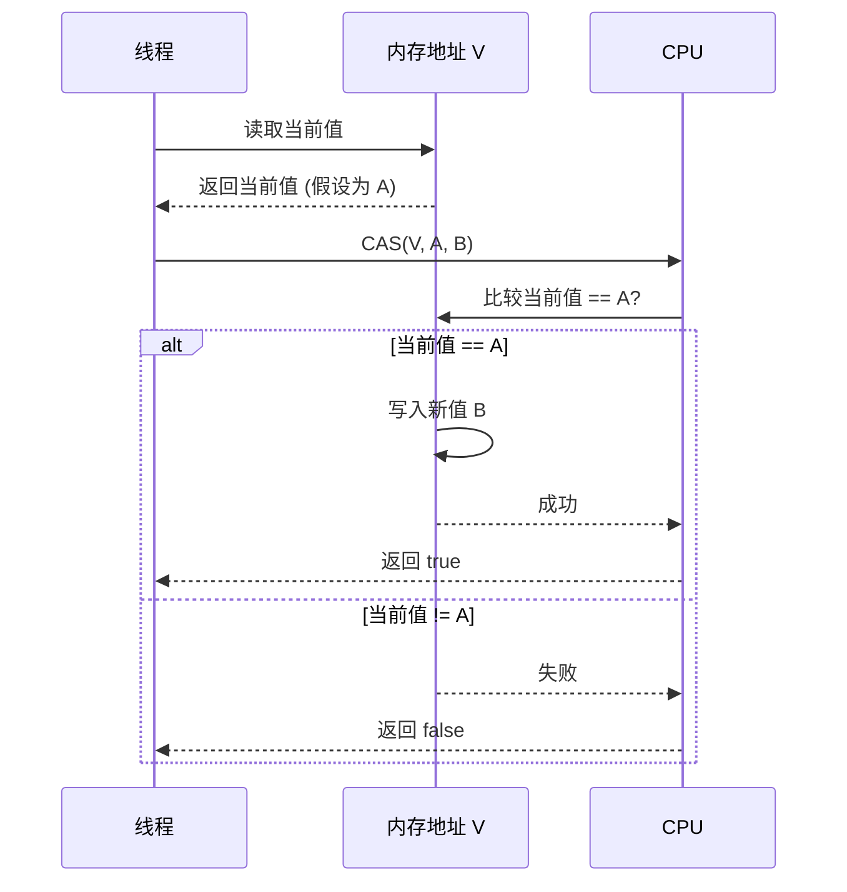
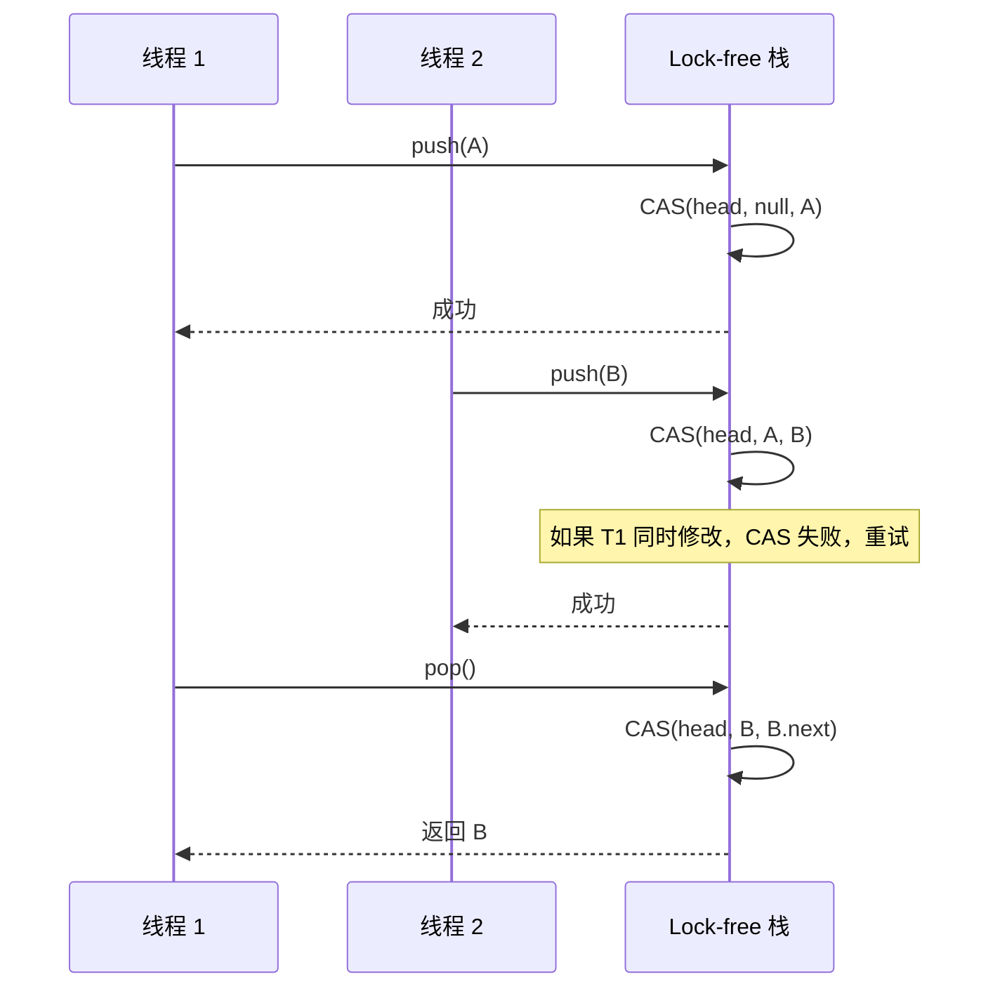
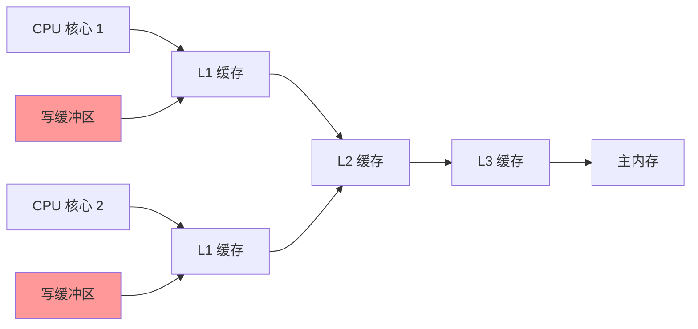
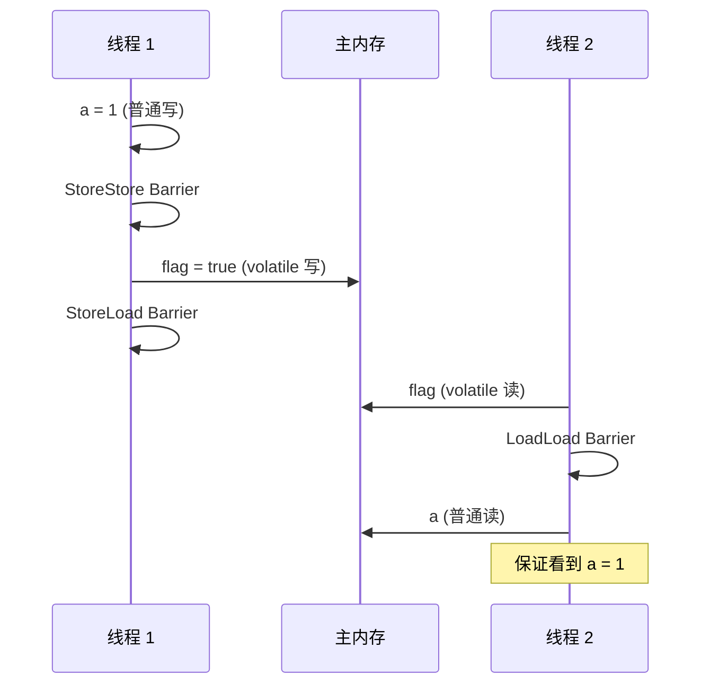

# 一文讲清楚Java多线程与同步

<p align="center">
  
  
  
</p>

---

## 🎯 了解目标

- ✅ 理解逻辑线程与硬件线程的区别
- ✅ 掌握 CPU 缓存系统与 Java 程序的关系
- ✅ 深入理解伪共享问题及其解决方案
- ✅ 掌握原子操作与 CAS 机制的底层原理
- ✅ 理解 Lock-free 编程模式
- ✅ 深入理解内存屏障与指令重排序
- ✅ 掌握各种同步原语的使用场景与性能特点

---

## 📖 章节摘要

本文将从多线程的基础概念开始，深入探讨 CPU 缓存系统、伪共享问题、原子操作、CAS 机制、Lock-free 编程、内存屏障等核心概念。每个概念都会从 Java 代码示例开始，逐步深入到字节码、JVM 实现和 CPU 指令级分析，帮助开发者全面理解 Java 多线程编程的底层原理。

---

## 1. 多线程基础概念

### 1.1 线程的概念

多线程编程是现代软件开发中的一项关键技术。在多线程编程中，开发者可以将复杂的任务分解为多个独立的线程，使其并行执行，从而充分利用多核处理器的优势。

**什么是线程？**

线程是一个执行上下文，它包含诸多状态数据：每个线程有自己的执行流、调用栈、错误码、信号掩码、私有数据。在 Java 中，线程由 `Thread` 类表示，每个线程都有独立的程序计数器（PC Register）和虚拟机栈（VM Stack）。

#### 1.1.1 执行流

一个任务里被依次执行的指令会形成一个指令序列（IP 寄存器值的历史记录），这个指令序列就是一个指令流，每个线程会有自己的执行流。

考虑下面的代码：

```java
public class CalcExample {
    public int calc(int a, int b, char op) {
        int c = 0;
        if (op == '+')
            c = a + b;
        else if (op == '-')
            c = a - b;
        else if (op == '*')
            c = a * b;
        else if (op == '/')
            c = a / b;
        else
            System.out.println("invalid operation");
        return c;
    }
}
```

`calc` 方法被编译成字节码指令，一行 Java 代码对应一个或多个字节码指令，在一个线程里执行 `calc`，这些字节码指令会被依次执行。但是，被执行的指令序列跟代码顺序可能不完全一致，代码中的分支、跳转等语句，以及编译器对指令重排、处理器乱序执行会影响指令的真正执行顺序。

#### 1.1.2 逻辑线程 vs 硬件线程

线程可以进一步区分为逻辑线程和硬件线程。

**逻辑线程**

程序上的线程是一个逻辑上的概念，也叫任务、软线程、逻辑线程。线程的执行逻辑由代码描述，比如编写一个函数实现对一个整型数组的元素求和：

```java
public class SumExample {
    public int sum(int[] a) {
        int x = 0;
        for (int i = 0; i < a.length; ++i) 
            x += a[i];
        return x;
    }
}
```

这个函数的逻辑很简单，它没有再调用其他函数（更复杂的功能逻辑可以在函数里调用其他函数）。我们可以在一个线程里调用这个函数对某数组求和；也可以把 `sum` 设置为某线程的入口函数，每个线程都会有一个入口函数，线程从入口函数开始执行。`sum` 函数描述了逻辑，即要做什么以及怎么做，偏设计；但它没有描述物质，即没有描述这个事情由谁做，事情最终需要派发到实体去完成。

**硬件线程**

与逻辑线程对应的是硬件线程，这是逻辑线程被执行的物质基础。

芯片设计领域，一个硬件线程通常指为执行指令序列而配套的硬件单元，一个 CPU 可能有多个核心，然后核心还可能支持超线程，1 个核心的 2 个超线程复用一些硬件。从软件的视角来看，无须区分是真正的 Core 和超出来的 VCore，基本上可以认为是 2 个独立的执行单元，每个执行单元是一个逻辑 CPU，从软件的视角看 CPU 只需关注逻辑 CPU。一个软件线程由哪个 CPU/核心去执行，以及何时执行，不归应用程序员管，它由操作系统决定，操作系统中的调度系统负责此项工作。



### 1.2 线程、核心、函数的关系

我们用一个例子来阐述线程、核心和函数之间的关系。

假设有遛狗、扫地两类工作要做：

- **遛狗**就是为狗系上绳子然后牵着它在小区里溜达一圈，这句话就描述了遛狗的逻辑，即对应到函数定义，它是一个对应到设计的静态的概念。
- 每项工作，最终需要人去做，人就对应到硬件：CPU/Core/VCore，是任务被完成的物质基础。

那什么对应软件线程？**任务拆分**。

**一个例子**

假设现在有 2 条狗需要遛、3 个房间需要打扫。可以把遛狗拆成 2 个任务，一个任务是遛小狗，另一个任务是遛大狗；打扫房间拆分成 3 个任务，每个房间一个任务。这样就有 5 个任务，可以创建 5 个线程，每个线程执行一个任务。

```java
public class TaskExample {
    // 遛狗函数（逻辑）
    public void walkDog(String dogName) {
        System.out.println("Walking " + dogName);
        // 遛狗的具体逻辑
    }
    
    // 扫地函数（逻辑）
    public void cleanRoom(int roomNumber) {
        System.out.println("Cleaning room " + roomNumber);
        // 扫地的具体逻辑
    }
    
    public void executeTasks() {
        // 创建多个线程执行任务
        Thread t1 = new Thread(() -> walkDog("小狗"));
        Thread t2 = new Thread(() -> walkDog("大狗"));
        Thread t3 = new Thread(() -> cleanRoom(1));
        Thread t4 = new Thread(() -> cleanRoom(2));
        Thread t5 = new Thread(() -> cleanRoom(3));
        
        t1.start();
        t2.start();
        t3.start();
        t4.start();
        t5.start();
        
        // 等待所有线程完成
        try {
            t1.join();
            t2.join();
            t3.join();
            t4.join();
            t5.join();
        } catch (InterruptedException e) {
            Thread.currentThread().interrupt();
        }
    }
}
```

**关系总结**：

| 概念 | 对应 | 说明 |
|------|------|------|
| **函数** | 逻辑 | 描述"做什么"和"怎么做"，是静态的设计 |
| **线程** | 任务拆分 | 将工作分解为多个可并行执行的任务 |
| **核心** | 硬件 | 实际执行任务的物理单元 |

**线程生命周期**

在 Java 中，线程有以下几种状态：

```java
public enum Thread.State {
    NEW,           // 新建：线程被创建但尚未启动
    RUNNABLE,      // 可运行：线程正在 JVM 中执行
    BLOCKED,       // 阻塞：线程等待监视器锁
    WAITING,       // 等待：线程无限期等待另一个线程执行特定操作
    TIMED_WAITING, // 定时等待：线程在指定时间内等待
    TERMINATED     // 终止：线程已退出
}
```



---

## 2. CPU 缓存系统与 Java 程序

在了解了多线程的基础概念后，你可能会问：为什么编写多线程程序时，需要了解 CPU 缓存系统？

**关键原因**：

1. **性能影响**：多线程程序的性能很大程度上取决于 CPU 缓存的使用效率。不了解缓存系统，很难写出高性能的并发程序。

2. **可见性问题**：多线程环境下的可见性问题（一个线程修改了变量，另一个线程看不到最新值）与 CPU 缓存密切相关。

3. **伪共享问题**：这是多线程编程中一个常见的性能陷阱，只有理解了 CPU 缓存系统，才能理解并解决伪共享问题。

4. **同步原语的选择**：理解缓存系统有助于我们理解为什么 `volatile`、`synchronized` 等同步原语需要内存屏障，以及它们如何影响性能。

**本章将深入探讨**：
- CPU 多级缓存的结构和工作原理
- Cache Line（缓存行）的概念
- MESI 协议如何保证多核缓存一致性
- Java 程序如何与 CPU 缓存交互

这些知识将为后续章节（伪共享、内存屏障等）打下坚实的基础。

### 2.1 CPU 多级缓存结构

现代 CPU 为了提高性能，采用了多级缓存结构。通常包括 L1 缓存（指令缓存和数据缓存）、L2 缓存、L3 缓存（共享缓存）。



**缓存层次**：

| 缓存级别 | 大小 | 延迟 | 位置 |
|---------|------|------|------|
| L1 缓存 | 32KB（指令）+ 32KB（数据） | ~1ns | 每个核心独立 |
| L2 缓存 | 256KB ~ 1MB | ~3ns | 每个核心独立 |
| L3 缓存 | 8MB ~ 32MB | ~12ns | 所有核心共享 |
| 主内存 | GB 级别 | ~100ns | 系统共享 |

### 2.2 Cache Line（缓存行）

CPU 从内存读取数据时，不是按字节读取，而是按**缓存行（Cache Line）**读取。缓存行是 CPU 缓存的最小单位，通常是 64 字节。

```java
public class CacheLineExample {
    // 假设这两个变量在同一个 Cache Line 中
    private volatile long x = 0;
    private volatile long y = 0;  // x 和 y 可能在同一 Cache Line
    
    public void updateX() {
        x++;  // 修改 x 会导致整个 Cache Line 失效
    }
    
    public void updateY() {
        y++;  // 修改 y 也会导致整个 Cache Line 失效
    }
}
```

**为什么是 64 字节？**

- 平衡缓存容量和命中率
- 大多数数据结构的大小在 64 字节以内
- 减少缓存行之间的冲突

### 2.3 MESI 协议与缓存一致性

MESI 协议是保证多核 CPU 缓存一致性的协议。MESI 代表四种缓存行状态：

| 状态 | 全称 | 说明 |
|------|------|------|
| **M** | Modified（修改） | 缓存行已被修改，与主内存不一致，其他核心的缓存无效 |
| **E** | Exclusive（独占） | 缓存行只存在于当前核心的缓存中，与主内存一致 |
| **S** | Shared（共享） | 缓存行存在于多个核心的缓存中，与主内存一致 |
| **I** | Invalid（无效） | 缓存行无效，需要从主内存重新加载 |



**MESI 协议的工作流程**：

1. **读取操作**：
   - 如果缓存行状态为 M、E 或 S，直接从缓存读取
   - 如果状态为 I，从主内存读取，并可能将其他核心的缓存行状态改为 S

2. **写入操作**：
   - 如果缓存行状态为 E 或 M，直接写入缓存
   - 如果状态为 S，需要先发送无效化消息给其他核心，将它们的缓存行状态改为 I，然后才能写入
   - 如果状态为 I，需要先从主内存加载，然后写入

### 2.4 Java 程序与缓存交互

Java 程序运行在 JVM 上，JVM 将 Java 对象存储在堆内存中。当线程访问对象时，数据会经过以下路径：

```
Java 对象（堆内存） → 主内存 → L3 缓存 → L2 缓存 → L1 缓存 → CPU 寄存器
```

```java
public class CacheInteractionExample {
    private int value = 0;  // 存储在堆内存中
    
    public void increment() {
        value++;  // 这个操作涉及：
        // 1. 从 L1 缓存读取 value（如果缓存命中）
        // 2. 在 CPU 寄存器中执行 +1 操作
        // 3. 将结果写回 L1 缓存
        // 4. 根据 MESI 协议，可能需要同步到其他核心的缓存
    }
}
```

**缓存一致性问题的 Java 示例**：

```java
public class CacheCoherencyExample {
    private static int shared = 0;  // 共享变量
    
    public static void main(String[] args) throws InterruptedException {
        Thread t1 = new Thread(() -> {
            for (int i = 0; i < 1000000; i++) {
                shared++;  // 线程 1 修改共享变量
            }
        });
        
        Thread t2 = new Thread(() -> {
            for (int i = 0; i < 1000000; i++) {
                shared++;  // 线程 2 修改共享变量
            }
        });
        
        t1.start();
        t2.start();
        t1.join();
        t2.join();
        
        // 结果可能不是 2000000，因为：
        // 1. 两个线程可能在不同的 CPU 核心上运行
        // 2. 每个核心都有自己的 L1 缓存
        // 3. 缓存一致性协议可能导致性能下降
        System.out.println("Final value: " + shared);
    }
}
```

---

## 3. 伪共享问题详解

### 3.1 什么是伪共享

**伪共享（False Sharing）**是指多个线程访问同一个 Cache Line 中的不同变量，导致 Cache Line 频繁失效，从而严重影响性能的问题。

**伪共享的产生原因**：

1. CPU 以 Cache Line（64 字节）为单位从内存读取数据
2. 如果两个变量在同一个 Cache Line 中，修改其中一个变量会导致整个 Cache Line 失效
3. 其他核心需要重新从主内存加载这个 Cache Line



### 3.2 伪共享的 Java 示例

```java
public class FalseSharingExample {
    // 这两个变量可能在同一个 Cache Line 中
    private volatile long x = 0;
    private volatile long y = 0;
    
    public static void main(String[] args) throws InterruptedException {
        FalseSharingExample example = new FalseSharingExample();
        
        long start = System.nanoTime();
        
        Thread t1 = new Thread(() -> {
            for (int i = 0; i < 100_000_000; i++) {
                example.x++;  // 线程 1 只修改 x
            }
        });
        
        Thread t2 = new Thread(() -> {
            for (int i = 0; i < 100_000_000; i++) {
                example.y++;  // 线程 2 只修改 y
            }
        });
        
        t1.start();
        t2.start();
        t1.join();
        t2.join();
        
        long end = System.nanoTime();
        System.out.println("Time: " + (end - start) / 1_000_000 + " ms");
    }
}
```

**性能问题分析**：

1. 线程 1 修改 `x` 时，会导致包含 `x` 和 `y` 的 Cache Line 失效
2. 线程 2 的缓存中的这个 Cache Line 被标记为 Invalid
3. 线程 2 修改 `y` 时，需要重新从主内存加载 Cache Line
4. 两个线程频繁地使对方的缓存失效，导致性能急剧下降

### 3.3 伪共享的性能测试

```java
public class FalseSharingBenchmark {
    // 测试类：包含两个 volatile 变量，可能在同一 Cache Line
    static class TestData {
        volatile long x = 0;
        volatile long y = 0;
    }
    
    // 优化类：使用 Padding 避免伪共享
    static class OptimizedData {
        volatile long x = 0;
        private long p1, p2, p3, p4, p5, p6, p7;  // Padding
        volatile long y = 0;
        private long p8, p9, p10, p11, p12, p13, p14, p15;  // Padding
    }
    
    public static void main(String[] args) throws InterruptedException {
        // 测试伪共享情况
        TestData data1 = new TestData();
        long time1 = benchmark(data1);
        
        // 测试优化后情况
        OptimizedData data2 = new OptimizedData();
        long time2 = benchmark(data2);
        
        System.out.println("False Sharing Time: " + time1 + " ms");
        System.out.println("Optimized Time: " + time2 + " ms");
        System.out.println("Speedup: " + (double) time1 / time2 + "x");
    }
    
    private static long benchmark(Object data) throws InterruptedException {
        long start = System.nanoTime();
        
        Thread t1 = new Thread(() -> {
            for (int i = 0; i < 100_000_000; i++) {
                if (data instanceof TestData) {
                    ((TestData) data).x++;
                } else {
                    ((OptimizedData) data).x++;
                }
            }
        });
        
        Thread t2 = new Thread(() -> {
            for (int i = 0; i < 100_000_000; i++) {
                if (data instanceof TestData) {
                    ((TestData) data).y++;
                } else {
                    ((OptimizedData) data).y++;
                }
            }
        });
        
        t1.start();
        t2.start();
        t1.join();
        t2.join();
        
        return (System.nanoTime() - start) / 1_000_000;
    }
}
```

**典型结果**：
- 伪共享情况：~5000 ms
- 优化后情况：~500 ms
- 性能提升：约 10 倍

### 3.4 解决方案

#### 方案 1：空间换时间（Padding）

通过添加填充字段，让两个变量分布在不同的 Cache Line 中：

```java
public class PaddingSolution {
    // 方案 1：手动 Padding
    private volatile long x = 0;
    private long p1, p2, p3, p4, p5, p6, p7;  // 56 字节填充
    private volatile long y = 0;
    
    // 确保 x 和 y 不在同一个 Cache Line（64 字节）
    // x (8) + padding (56) = 64 字节，y 在下一个 Cache Line
}
```

#### 方案 2：@Contended 注解（JDK 8+）

Java 8 引入了 `@Contended` 注解，JVM 会自动添加填充：

```java
import jdk.internal.vm.annotation.Contended;

public class ContendedSolution {
    @Contended  // JVM 会自动添加填充，避免伪共享
    private volatile long x = 0;
    
    @Contended
    private volatile long y = 0;
}
```

**注意**：`@Contended` 注解在 `jdk.internal.vm.annotation` 包中，需要添加 JVM 参数才能生效：

```bash
-XX:-RestrictContended
```

#### 方案 3：分离热点数据

将经常被不同线程修改的变量分离到不同的对象中：

```java
public class SeparationSolution {
    // 将热点数据分离到不同的对象
    private static class Counter {
        volatile long value = 0;
    }
    
    private final Counter counter1 = new Counter();  // 线程 1 使用
    private final Counter counter2 = new Counter();  // 线程 2 使用
    
    public void increment1() {
        counter1.value++;
    }
    
    public void increment2() {
        counter2.value++;
    }
}
```

### 3.5 性能优化建议

| 场景 | 推荐方案 | 说明 |
|------|---------|------|
| JDK 8+ | `@Contended` | 最简单，JVM 自动处理 |
| JDK 7 及以下 | 手动 Padding | 需要计算填充大小 |
| 对象分离 | 分离热点数据 | 适合复杂场景 |

---

## 4. 原子操作与 CAS 机制

### 4.1 原子操作的概念

**原子操作**是指不可被中断的一个或一系列操作。在多线程环境中，原子操作保证操作的完整性，不会被其他线程干扰。

**非原子操作的示例**：

```java
public class NonAtomicExample {
    private int count = 0;
    
    public void increment() {
        count++;  // 这不是原子操作！
        // 实际上包含三个步骤：
        // 1. 读取 count 的值到寄存器
        // 2. 将寄存器中的值加 1
        // 3. 将结果写回 count
        // 在多线程环境下，这三个步骤可能被其他线程打断
    }
}
```

**问题演示**：

```java
public class RaceConditionExample {
    private static int count = 0;
    
    public static void main(String[] args) throws InterruptedException {
        Thread t1 = new Thread(() -> {
            for (int i = 0; i < 100000; i++) {
                count++;  // 非原子操作
            }
        });
        
        Thread t2 = new Thread(() -> {
            for (int i = 0; i < 100000; i++) {
                count++;  // 非原子操作
            }
        });
        
        t1.start();
        t2.start();
        t1.join();
        t2.join();
        
        // 结果可能不是 200000
        System.out.println("Count: " + count);
    }
}
```

### 4.2 AtomicInteger 使用示例

Java 提供了 `java.util.concurrent.atomic` 包，包含各种原子类：

```java
import java.util.concurrent.atomic.AtomicInteger;

public class AtomicExample {
    private AtomicInteger count = new AtomicInteger(0);
    
    public void increment() {
        count.incrementAndGet();  // 原子操作
    }
    
    public int getCount() {
        return count.get();
    }
    
    public static void main(String[] args) throws InterruptedException {
        AtomicExample example = new AtomicExample();
        
        Thread t1 = new Thread(() -> {
            for (int i = 0; i < 100000; i++) {
                example.increment();
            }
        });
        
        Thread t2 = new Thread(() -> {
            for (int i = 0; i < 100000; i++) {
                example.increment();
            }
        });
        
        t1.start();
        t2.start();
        t1.join();
        t2.join();
        
        // 结果一定是 200000
        System.out.println("Count: " + example.getCount());
    }
}
```

### 4.3 CAS（Compare-And-Swap）原理

**CAS** 是一种无锁算法，通过比较并交换来实现原子操作。

**CAS 操作包含三个参数**：
- **内存地址 V**
- **期望值 A**（旧值）
- **新值 B**

**CAS 操作流程**：
1. 读取内存地址 V 的当前值
2. 比较当前值是否等于期望值 A
3. 如果相等，将新值 B 写入内存地址 V
4. 如果不相等，操作失败，可以重试



### 4.4 CAS 的 Java 实现

```java
import java.util.concurrent.atomic.AtomicInteger;

public class CASExample {
    private AtomicInteger value = new AtomicInteger(0);
    
    public void increment() {
        int oldValue;
        int newValue;
        do {
            oldValue = value.get();           // 1. 读取当前值
            newValue = oldValue + 1;          // 2. 计算新值
            // 3. CAS 操作：如果 value == oldValue，则设置为 newValue
        } while (!value.compareAndSet(oldValue, newValue));
        // 如果 CAS 失败（value 已被其他线程修改），重试
    }
    
    // 实际上，AtomicInteger.incrementAndGet() 内部就是这样实现的
    public void incrementSimple() {
        value.incrementAndGet();  // 内部使用 CAS
    }
}
```

### 4.5 CAS 的 JVM 实现分析

`AtomicInteger` 的底层实现使用了 `Unsafe` 类：

```java
// AtomicInteger 的部分源码（简化版）
public class AtomicInteger {
    private static final Unsafe unsafe = Unsafe.getUnsafe();
    private static final long valueOffset;  // value 字段的内存偏移量
    
    private volatile int value;
    
    static {
        try {
            valueOffset = unsafe.objectFieldOffset
                (AtomicInteger.class.getDeclaredField("value"));
        } catch (Exception ex) { throw new Error(ex); }
    }
    
    public final boolean compareAndSet(int expect, int update) {
        // 调用 Unsafe 的 compareAndSwapInt 方法
        return unsafe.compareAndSwapInt(this, valueOffset, expect, update);
    }
}
```

**Unsafe.compareAndSwapInt 的 JVM 实现**（HotSpot 源码，C++）：

```cpp
// hotspot/src/share/vm/prims/unsafe.cpp
UNSAFE_ENTRY(jboolean, Unsafe_CompareAndSwapInt(
    JNIEnv *env, jobject unsafe, jobject obj, jlong offset, jint e, jint x))
{
    oop p = JNIHandles::resolve(obj);
    jint* addr = (jint*)index_oop_from_field_offset_long(p, offset);
    return (jint)(Atomic::cmpxchg(x, addr, e)) == e;
}
UNSAFE_END
```

### 4.6 CAS 的 CPU 指令级分析

在 x86/x64 架构上，CAS 操作对应 `CMPXCHG` 指令：

```assembly
; CMPXCHG 指令的伪代码
; CMPXCHG dest, src
; 如果 EAX == dest，则 dest = src，并设置 ZF = 1
; 否则，EAX = dest，并设置 ZF = 0

mov eax, expected_value  ; 将期望值加载到 EAX 寄存器
lock cmpxchg [memory_address], new_value  ; 原子比较并交换
; lock 前缀确保操作的原子性
```

**CMPXCHG 指令的工作流程**：

1. 将期望值加载到 EAX 寄存器
2. 比较 EAX 与内存地址的值
3. 如果相等，将新值写入内存地址，设置 ZF（零标志位）= 1
4. 如果不相等，将内存地址的值加载到 EAX，设置 ZF = 0

**LOCK 前缀的作用**：
- 确保指令的原子性
- 在多核系统中，LOCK 前缀会锁定内存总线或缓存行
- 防止其他 CPU 核心同时访问同一内存地址

### 4.7 ABA 问题

**ABA 问题**是指 CAS 操作中，值从 A 变成 B 再变回 A，CAS 仍然会成功，但实际上值已经被修改过。

**ABA 问题示例**：

```java
public class ABAProblem {
    private AtomicReference<String> ref = new AtomicReference<>("A");
    
    public static void main(String[] args) throws InterruptedException {
        ABAProblem example = new ABAProblem();
        
        Thread t1 = new Thread(() -> {
            String value = example.ref.get();
            // 模拟一些耗时操作
            try {
                Thread.sleep(1000);
            } catch (InterruptedException e) {
                Thread.currentThread().interrupt();
            }
            // 尝试将 A 改为 C
            // 但此时值可能已经是 A（从 B 变回 A）
            boolean success = example.ref.compareAndSet("A", "C");
            System.out.println("Thread 1 CAS: " + success);
        });
        
        Thread t2 = new Thread(() -> {
            // 将 A 改为 B
            example.ref.compareAndSet("A", "B");
            // 立即将 B 改回 A
            example.ref.compareAndSet("B", "A");
        });
        
        t1.start();
        Thread.sleep(100);
        t2.start();
        t1.join();
        t2.join();
    }
}
```

### 4.8 ABA 问题的解决方案

#### 方案 1：版本号（Version Number）

使用版本号来检测值是否被修改过：

```java
import java.util.concurrent.atomic.AtomicStampedReference;

public class VersionNumberSolution {
    private AtomicStampedReference<String> ref = 
        new AtomicStampedReference<>("A", 0);  // 初始值 "A"，版本号 0
    
    public void update() {
        String oldValue = ref.getReference();
        int oldStamp = ref.getStamp();
        
        // 模拟耗时操作
        try {
            Thread.sleep(1000);
        } catch (InterruptedException e) {
            Thread.currentThread().interrupt();
        }
        
        // CAS 操作：同时比较值和版本号
        boolean success = ref.compareAndSet(
            oldValue, "C",  // 期望值和新值
            oldStamp, oldStamp + 1  // 期望版本号和新版本号
        );
        
        if (success) {
            System.out.println("Update successful");
        } else {
            System.out.println("Update failed: value or version changed");
        }
    }
}
```

#### 方案 2：AtomicStampedReference

Java 提供了 `AtomicStampedReference` 类，内部使用版本号：

```java
import java.util.concurrent.atomic.AtomicStampedReference;

public class AtomicStampedExample {
    private AtomicStampedReference<Integer> ref = 
        new AtomicStampedReference<>(100, 0);
    
    public void update(int newValue) {
        int[] stampHolder = new int[1];
        Integer currentValue = ref.get(stampHolder);
        int currentStamp = stampHolder[0];
        
        // 尝试更新，同时检查版本号
        if (ref.compareAndSet(currentValue, newValue, currentStamp, currentStamp + 1)) {
            System.out.println("Updated successfully");
        } else {
            System.out.println("Update failed: value was modified");
        }
    }
}
```

---

## 5. Lock-free 编程模式

### 5.1 Lock-free 的概念

**Lock-free（无锁）**是一种并发编程技术，它不使用传统的锁机制（如 `synchronized` 或 `ReentrantLock`），而是使用原子操作（如 CAS）来实现线程安全。

**Lock-free vs Lock-based 对比**：

| 特性 | Lock-based | Lock-free |
|------|-----------|-----------|
| **阻塞** | 可能阻塞线程 | 不会阻塞线程 |
| **死锁风险** | 可能死锁 | 不会死锁 |
| **性能** | 上下文切换开销 | 无上下文切换 |
| **实现复杂度** | 相对简单 | 相对复杂 |
| **适用场景** | 一般并发场景 | 高并发、低延迟场景 |

### 5.2 Lock-free 栈实现

```java
import java.util.concurrent.atomic.AtomicReference;

public class LockFreeStack<T> {
    private static class Node<T> {
        final T value;
        Node<T> next;
        
        Node(T value) {
            this.value = value;
        }
    }
    
    private AtomicReference<Node<T>> head = new AtomicReference<>();
    
    public void push(T value) {
        Node<T> newHead = new Node<>(value);
        Node<T> oldHead;
        do {
            oldHead = head.get();
            newHead.next = oldHead;
            // CAS 操作：如果 head == oldHead，则设置为 newHead
        } while (!head.compareAndSet(oldHead, newHead));
    }
    
    public T pop() {
        Node<T> oldHead;
        Node<T> newHead;
        do {
            oldHead = head.get();
            if (oldHead == null) {
                return null;  // 栈为空
            }
            newHead = oldHead.next;
            // CAS 操作：如果 head == oldHead，则设置为 newHead
        } while (!head.compareAndSet(oldHead, newHead));
        return oldHead.value;
    }
}
```

**Lock-free 栈的操作流程**：



### 5.3 Lock-free 队列实现

```java
import java.util.concurrent.atomic.AtomicReference;

public class LockFreeQueue<T> {
    private static class Node<T> {
        final T value;
        volatile Node<T> next;
        
        Node(T value) {
            this.value = value;
        }
    }
    
    private final AtomicReference<Node<T>> head = new AtomicReference<>();
    private final AtomicReference<Node<T>> tail = new AtomicReference<>();
    
    public LockFreeQueue() {
        Node<T> dummy = new Node<>(null);
        head.set(dummy);
        tail.set(dummy);
    }
    
    public void enqueue(T value) {
        Node<T> newNode = new Node<>(value);
        Node<T> currentTail;
        Node<T> currentTailNext;
        
        while (true) {
            currentTail = tail.get();
            currentTailNext = currentTail.next;
            
            // 检查 tail 是否仍然指向最后一个节点
            if (currentTail == tail.get()) {
                if (currentTailNext == null) {
                    // tail 确实指向最后一个节点，尝试链接新节点
                    if (currentTail.next.compareAndSet(null, newNode)) {
                        // 成功链接，尝试更新 tail
                        tail.compareAndSet(currentTail, newNode);
                        return;
                    }
                } else {
                    // tail 没有指向最后一个节点，帮助其他线程完成操作
                    tail.compareAndSet(currentTail, currentTailNext);
                }
            }
        }
    }
    
    public T dequeue() {
        Node<T> currentHead;
        Node<T> currentHeadNext;
        
        while (true) {
            currentHead = head.get();
            Node<T> currentTail = tail.get();
            currentHeadNext = currentHead.next;
            
            if (currentHead == head.get()) {
                if (currentHead == currentTail) {
                    // 队列为空或只有一个 dummy 节点
                    if (currentHeadNext == null) {
                        return null;  // 队列为空
                    }
                    // 帮助其他线程更新 tail
                    tail.compareAndSet(currentTail, currentHeadNext);
                } else {
                    // 队列不为空，尝试出队
                    if (head.compareAndSet(currentHead, currentHeadNext)) {
                        return currentHeadNext.value;
                    }
                }
            }
        }
    }
}
```

### 5.4 Lock-free 的字节码分析

让我们看看 CAS 操作在字节码层面的表现：

```java
// 源代码
public void increment() {
    value.compareAndSet(oldValue, newValue);
}
```

**编译后的字节码**（使用 `javap -c` 查看）：

```bytecode
public void increment();
  Code:
     0: aload_0
     1: getfield      #2  // Field value:Ljava/util/concurrent/atomic/AtomicInteger;
     4: iload_1        // 加载 oldValue
     5: iload_2        // 加载 newValue
     6: invokevirtual #3  // Method java/util/concurrent/atomic/AtomicInteger.compareAndSet:(II)Z
     9: pop
    10: return
```

**JVM 层面的实现**：
- `invokevirtual` 调用 `AtomicInteger.compareAndSet`
- 最终调用 `Unsafe.compareAndSwapInt`
- 在 HotSpot 中，这会生成 `lock cmpxchg` 指令

### 5.5 Lock-free 的性能优势

**性能测试对比**：

```java
public class LockFreePerformanceTest {
    private static final int ITERATIONS = 10_000_000;
    
    // Lock-based 实现
    private int lockBasedCounter = 0;
    private final Object lock = new Object();
    
    // Lock-free 实现
    private AtomicInteger lockFreeCounter = new AtomicInteger(0);
    
    public void testLockBased() throws InterruptedException {
        long start = System.nanoTime();
        
        Thread t1 = new Thread(() -> {
            for (int i = 0; i < ITERATIONS; i++) {
                synchronized (lock) {
                    lockBasedCounter++;
                }
            }
        });
        
        Thread t2 = new Thread(() -> {
            for (int i = 0; i < ITERATIONS; i++) {
                synchronized (lock) {
                    lockBasedCounter++;
                }
            }
        });
        
        t1.start();
        t2.start();
        t1.join();
        t2.join();
        
        long end = System.nanoTime();
        System.out.println("Lock-based: " + (end - start) / 1_000_000 + " ms");
    }
    
    public void testLockFree() throws InterruptedException {
        long start = System.nanoTime();
        
        Thread t1 = new Thread(() -> {
            for (int i = 0; i < ITERATIONS; i++) {
                lockFreeCounter.incrementAndGet();
            }
        });
        
        Thread t2 = new Thread(() -> {
            for (int i = 0; i < ITERATIONS; i++) {
                lockFreeCounter.incrementAndGet();
            }
        });
        
        t1.start();
        t2.start();
        t1.join();
        t2.join();
        
        long end = System.nanoTime();
        System.out.println("Lock-free: " + (end - start) / 1_000_000 + " ms");
    }
}
```

**典型性能差异**：
- Lock-based：~2000 ms（包含上下文切换开销）
- Lock-free：~500 ms（无上下文切换）
- 性能提升：约 4 倍

### 5.6 Lock-free 的适用场景

**适合使用 Lock-free 的场景**：
- 高并发、低延迟要求
- 竞争不激烈（CAS 重试次数少）
- 需要避免死锁
- 对性能要求极高

**不适合使用 Lock-free 的场景**：
- 竞争激烈（CAS 重试次数多，性能反而下降）
- 逻辑复杂（难以用 CAS 实现）
- 对代码可读性要求高

---

## 6. 内存屏障与指令重排序

### 6.1 指令重排序的概念

**指令重排序**是指编译器和 CPU 为了优化性能，在不改变单线程程序执行结果的前提下，重新安排指令的执行顺序。

**为什么需要指令重排序？**

现代 CPU 采用流水线技术，可以同时执行多条指令的不同阶段。如果指令之间存在数据依赖，会导致流水线停顿。通过重排序，可以充分利用流水线，提高性能。

**重排序的示例**：

```java
public class ReorderingExample {
    private int x = 0;
    private int y = 0;
    private boolean flag = false;
    
    // 线程 1
    public void writer() {
        x = 1;      // 1
        y = 2;      // 2
        flag = true; // 3
    }
    
    // 线程 2
    public void reader() {
        if (flag) {  // 4
            int a = x; // 5
            int b = y; // 6
        }
    }
}
```

**可能的执行顺序**（由于重排序）：
- 正常顺序：1 → 2 → 3 → 4 → 5 → 6
- 重排序后：2 → 3 → 1 → 4 → 5 → 6（线程 1 中 1 和 2 可能重排序）

### 6.2 指令重排序的问题

**单例模式的双重检查锁定问题**：

```java
public class Singleton {
    private static Singleton instance;
    
    public static Singleton getInstance() {
        if (instance == null) {  // 第一次检查
            synchronized (Singleton.class) {
                if (instance == null) {  // 第二次检查
                    instance = new Singleton();  // 问题在这里！
                }
            }
        }
        return instance;
    }
}
```

**问题分析**：

`new Singleton()` 实际上包含三个步骤：
1. 分配内存空间
2. 初始化对象
3. 将引用赋值给 `instance`

由于指令重排序，步骤 2 和 3 可能被重排序：
1. 分配内存空间
2. 将引用赋值给 `instance`（此时对象还未初始化！）
3. 初始化对象

如果线程 A 执行到步骤 2，此时 `instance` 不为 null，但对象还未初始化。线程 B 可能看到 `instance != null`，直接返回一个未完全初始化的对象。

**解决方案**：使用 `volatile` 关键字

```java
public class Singleton {
    private static volatile Singleton instance;  // 使用 volatile
    
    public static Singleton getInstance() {
        if (instance == null) {
            synchronized (Singleton.class) {
                if (instance == null) {
                    instance = new Singleton();
                }
            }
        }
        return instance;
    }
}
```

### 6.3 内存屏障的概念

**内存屏障（Memory Barrier）**，也称为内存栅栏（Memory Fence），是一种 CPU 指令，用于控制特定条件下的内存操作顺序和可见性。

**内存屏障的作用**：
- 确保某些内存操作的顺序
- 保证内存操作的可见性
- 防止指令重排序

**为什么需要内存屏障？**

现代 CPU 为了提高性能，会采用以下优化策略：
1. **指令重排序**：在不影响单线程执行结果的前提下，重新安排指令执行顺序
2. **写缓冲区**：CPU 写入数据时先写入缓冲区，异步刷新到内存
3. **多级缓存**：每个 CPU 核心都有自己的缓存，可能导致数据不一致

这些优化在单线程环境下没有问题，但在多线程环境下可能导致可见性和有序性问题。



### 6.4 内存屏障的类型

根据不同的分类标准，内存屏障可以分为不同类型：

**按作用范围分类**：

| 类型 | 说明 | 示例 |
|------|------|------|
| **LoadLoad 屏障** | 确保 Load1 在 Load2 之前执行 | `Load1; LoadLoad; Load2` |
| **StoreStore 屏障** | 确保 Store1 在 Store2 之前执行 | `Store1; StoreStore; Store2` |
| **LoadStore 屏障** | 确保 Load1 在 Store2 之前执行 | `Load1; LoadStore; Store2` |
| **StoreLoad 屏障** | 确保 Store1 在 Load2 之前执行 | `Store1; StoreLoad; Load2` |

**StoreLoad 屏障是最强的屏障**，它同时具备其他三种屏障的效果。

**按平台分类**：

| 平台 | 内存屏障指令 | 说明 |
|------|------------|------|
| **x86/x64** | `mfence`、`lfence`、`sfence` | Intel/AMD 架构 |
| **ARM** | `dmb`、`dsb`、`isb` | ARM 架构 |
| **PowerPC** | `sync`、`lwsync`、`isync` | PowerPC 架构 |

### 6.5 volatile 的内存屏障语义

在 JVM 中，`volatile` 关键字通过内存屏障来实现其语义。

**volatile 写操作的内存屏障**：

```java
// volatile 变量写操作
volatile int x = 1;

// 编译后的内存屏障（伪代码）
StoreStore Barrier  // 确保普通写操作在 volatile 写之前完成
x = 1;              // volatile 写
StoreLoad Barrier   // 确保 volatile 写对所有线程可见
```

**volatile 读操作的内存屏障**：

```java
// volatile 变量读操作
int y = x;  // x 是 volatile

// 编译后的内存屏障（伪代码）
LoadLoad Barrier   // 确保 volatile 读在其他读操作之前
int y = x;         // volatile 读
LoadStore Barrier  // 确保 volatile 读在其他写操作之前
```

**完整示例**：

```java
public class MemoryBarrierExample {
    private int a = 0;
    private volatile boolean flag = false;
    
    public void writer() {
        a = 1;          // 普通写操作
        // StoreStore Barrier（隐式）
        flag = true;    // volatile 写操作
        // StoreLoad Barrier（隐式）
    }
    
    public void reader() {
        if (flag) {     // volatile 读操作
            // LoadLoad Barrier（隐式）
            int x = a;  // 普通读操作
            // 保证看到 a = 1
        }
    }
}
```

**内存屏障的作用顺序**：



### 6.6 volatile 的字节码分析

让我们看看 `volatile` 在字节码层面的表现：

```java
public class VolatileExample {
    private volatile int x = 0;
    
    public void write() {
        x = 1;
    }
    
    public int read() {
        return x;
    }
}
```

**编译后的字节码**（使用 `javap -c -v` 查看）：

```bytecode
public void write();
  Code:
     0: aload_0
     1: iconst_1
     2: putfield      #2  // Field x:I
     5: return
      
  // 注意：volatile 字段的 putfield 指令会设置 ACC_VOLATILE 标志

public int read();
  Code:
     0: aload_0
     1: getfield      #2  // Field x:I
     4: ireturn
      
  // volatile 字段的 getfield 指令也会设置 ACC_VOLATILE 标志
```

**JVM 层面的处理**：
- JVM 识别到 `ACC_VOLATILE` 标志
- 在 `putfield` 和 `getfield` 指令执行时插入内存屏障
- 在 x86 架构上，`volatile` 写会插入 `mfence` 指令

### 6.7 volatile 的 JVM 实现分析

在 HotSpot JVM 中，`volatile` 的内存屏障插入在模板解释器和 JIT 编译器中处理：

**模板解释器**（`templateInterpreter_x86.cpp`）：

```cpp
// volatile 字段写入的模板
void TemplateTable::putfield_or_static(int bytecode) {
    // ... 省略其他代码 ...
    
    if (is_volatile) {
        // 插入 StoreStore 屏障
        __ membar(Assembler::StoreStore);
        // 执行写入操作
        __ movl(Address(obj, offset), rax);
        // 插入 StoreLoad 屏障
        __ membar(Assembler::StoreLoad);
    } else {
        // 普通字段写入，不需要内存屏障
        __ movl(Address(obj, offset), rax);
    }
}
```

**JIT 编译器**（C2 编译器）：
- 在 IR（中间表示）层面识别 `volatile` 访问
- 在代码生成阶段插入内存屏障指令
- 根据目标平台生成相应的 CPU 指令

### 6.8 volatile 的 CPU 指令级分析

在 x86/x64 架构上，`volatile` 写操作会生成 `mfence` 指令：

```assembly
; volatile int x = 1; 对应的汇编代码

mov    DWORD PTR [rsp+0x4], 0x1  ; 将 1 写入 x 的内存地址
mfence                            ; 内存屏障指令
```

**mfence 指令的作用**：
- 确保所有在 `mfence` 之前的存储操作完成
- 确保所有在 `mfence` 之后的加载操作能看到之前存储的结果
- 防止指令重排序

**不同架构的内存屏障指令**：

| 架构 | 指令 | 说明 |
|------|------|------|
| x86/x64 | `mfence` | 全内存屏障 |
| x86/x64 | `lfence` | 加载屏障 |
| x86/x64 | `sfence` | 存储屏障 |
| ARM | `dmb` | 数据内存屏障 |
| ARM | `dsb` | 数据同步屏障 |

### 6.9 synchronized 的内存屏障语义

`synchronized` 关键字也会插入内存屏障：

**monitorenter（获取锁）**：
- 相当于 LoadLoad + LoadStore 屏障
- 确保锁获取操作在后续操作之前完成

**monitorexit（释放锁）**：
- 相当于 StoreStore + StoreLoad 屏障
- 确保锁释放操作在之前操作之后完成

```java
public class SynchronizedBarrier {
    private int x = 0;
    
    public synchronized void increment() {
        // LoadLoad + LoadStore Barrier（获取锁时）
        x++;
        // StoreStore + StoreLoad Barrier（释放锁时）
    }
}
```

### 6.10 final 的内存屏障语义

`final` 字段的写入也会插入内存屏障：

```java
public class FinalBarrier {
    private final int x;
    
    public FinalBarrier(int value) {
        x = value;  // final 字段写入
        // StoreStore Barrier（确保 final 字段写入在对象引用可见之前完成）
    }
}
```

**final 字段的重排序规则**：
- 在构造函数中对 final 字段的写入，与随后把这个被构造对象的引用赋值给一个引用变量，这两个操作之间不能重排序
- 初次读一个包含 final 字段的对象引用，与随后初次读这个 final 字段，这两个操作之间不能重排序

---

## 7. 同步原语综合实践

### 7.1 synchronized 使用与原理

**synchronized 的使用**：

```java
public class SynchronizedExample {
    private int count = 0;
    private final Object lock = new Object();
    
    // 方法级同步
    public synchronized void increment1() {
        count++;
    }
    
    // 代码块同步
    public void increment2() {
        synchronized (lock) {
            count++;
        }
    }
}
```

**synchronized 的原理**：
- 基于 JVM 的 `monitorenter` 和 `monitorexit` 指令
- 使用对象头中的 Mark Word 存储锁信息
- 支持锁升级：偏向锁 → 轻量级锁 → 重量级锁

### 7.2 ReentrantLock 使用与原理

**ReentrantLock 的使用**：

```java
import java.util.concurrent.locks.ReentrantLock;

public class ReentrantLockExample {
    private int count = 0;
    private final ReentrantLock lock = new ReentrantLock();
    
    public void increment() {
        lock.lock();  // 显式获取锁
        try {
            count++;
        } finally {
            lock.unlock();  // 必须在 finally 中释放锁
        }
    }
    
    // 尝试获取锁，避免阻塞
    public boolean tryIncrement() {
        if (lock.tryLock()) {
            try {
                count++;
                return true;
            } finally {
                lock.unlock();
            }
        }
        return false;
    }
}
```

**ReentrantLock 的原理**：
- 基于 AQS（AbstractQueuedSynchronizer）
- 支持公平锁和非公平锁
- 支持可中断的锁获取
- 支持超时获取锁

### 7.3 volatile 使用与原理

**volatile 的使用**：

```java
public class VolatileUsageExample {
    private volatile boolean shutdown = false;
    
    public void shutdown() {
        shutdown = true;  // volatile 写，立即对所有线程可见
    }
    
    public void doWork() {
        while (!shutdown) {  // volatile 读，从主内存读取最新值
            // 执行工作
        }
    }
}
```

**volatile 的原理**：
- 通过内存屏障实现可见性和有序性
- 不保证原子性（复合操作仍需同步）
- 性能优于 `synchronized`

### 7.4 Atomic 类使用与原理

**Atomic 类的使用**：

```java
import java.util.concurrent.atomic.AtomicInteger;
import java.util.concurrent.atomic.AtomicLong;
import java.util.concurrent.atomic.AtomicReference;

public class AtomicExample {
    private AtomicInteger count = new AtomicInteger(0);
    private AtomicLong sum = new AtomicLong(0);
    private AtomicReference<String> ref = new AtomicReference<>("initial");
    
    public void increment() {
        count.incrementAndGet();  // 原子递增
    }
    
    public void add(long value) {
        sum.addAndGet(value);  // 原子加法
    }
    
    public void update(String newValue) {
        String oldValue;
        do {
            oldValue = ref.get();
        } while (!ref.compareAndSet(oldValue, newValue));  // CAS 更新
    }
}
```

**Atomic 类的原理**：
- 基于 CAS 操作
- 使用 `Unsafe` 类直接操作内存
- 无锁实现，性能高

### 7.5 同步原语对比

| 特性 | synchronized | ReentrantLock | volatile | Atomic 类 |
|------|:------------:|:-------------:|:--------:|:---------:|
| **原子性** | ✅ | ✅ | ❌（单变量读写是原子的） | ✅ |
| **可见性** | ✅ | ✅ | ✅ | ✅ |
| **有序性** | ✅ | ✅ | ✅ | ✅ |
| **可重入** | ✅ | ✅ | N/A | N/A |
| **公平锁** | ❌ | ✅ | N/A | N/A |
| **可中断** | ❌ | ✅ | N/A | N/A |
| **超时获取** | ❌ | ✅ | N/A | N/A |
| **性能** | 中等 | 中等 | 高 | 高 |
| **使用复杂度** | 低 | 中 | 低 | 低 |

### 7.6 综合案例：高性能计数器

```java
import java.util.concurrent.atomic.LongAdder;

public class HighPerformanceCounter {
    // 使用 LongAdder 实现高性能计数器
    // LongAdder 内部使用分段锁，减少竞争
    private final LongAdder counter = new LongAdder();
    
    public void increment() {
        counter.increment();
    }
    
    public long get() {
        return counter.sum();
    }
    
    public void reset() {
        counter.reset();
    }
}
```

**LongAdder 的优势**：
- 内部使用多个 Cell 数组，减少竞争
- 在高并发场景下性能优于 `AtomicLong`
- 适合统计场景，不适合需要精确值的场景

### 7.7 综合案例：无锁数据结构

```java
import java.util.concurrent.atomic.AtomicReference;

public class LockFreeLinkedList<T> {
    private static class Node<T> {
        final T value;
        volatile Node<T> next;
        
        Node(T value) {
            this.value = value;
        }
    }
    
    private final AtomicReference<Node<T>> head = new AtomicReference<>();
    
    public void add(T value) {
        Node<T> newNode = new Node<>(value);
        Node<T> currentHead;
        do {
            currentHead = head.get();
            newNode.next = currentHead;
        } while (!head.compareAndSet(currentHead, newNode));
    }
    
    public T remove() {
        Node<T> currentHead;
        Node<T> newHead;
        do {
            currentHead = head.get();
            if (currentHead == null) {
                return null;
            }
            newHead = currentHead.next;
        } while (!head.compareAndSet(currentHead, newHead));
        return currentHead.value;
    }
}
```

### 7.8 性能优化建议

**选择同步原语的建议**：

1. **简单场景**：使用 `synchronized`
   - 代码简单，JVM 自动优化
   - 不需要高级特性

2. **需要高级特性**：使用 `ReentrantLock`
   - 需要公平锁、可中断、超时等特性

3. **单变量可见性**：使用 `volatile`
   - 只需要保证可见性，不需要原子性

4. **原子操作**：使用 `Atomic` 类
   - 简单的原子操作，性能要求高

5. **高并发统计**：使用 `LongAdder`
   - 统计场景，允许最终一致性

6. **无锁数据结构**：使用 CAS + 自旋
   - 高并发、低延迟场景

**性能优化原则**：
- 减少锁的粒度
- 避免不必要的同步
- 使用无锁数据结构
- 避免伪共享
- 合理使用 `volatile`

---

## 总结

本文深入探讨了 Java 多线程与同步的核心概念：

1. **多线程基础**：理解了逻辑线程与硬件线程的区别，以及线程、核心、函数的关系
2. **CPU 缓存系统**：掌握了 Cache Line、MESI 协议等底层原理
3. **伪共享问题**：了解了伪共享的产生原因和解决方案
4. **原子操作与 CAS**：深入理解了 CAS 机制的 JVM 实现和 CPU 指令级实现
5. **Lock-free 编程**：掌握了无锁编程模式和适用场景
6. **内存屏障**：理解了指令重排序和内存屏障的作用机制
7. **同步原语**：掌握了各种同步原语的使用场景和性能特点

通过从 Java 代码到字节码、从 JVM 实现到 CPU 指令的层层深入，我们全面理解了 Java 多线程编程的底层原理。这些知识将帮助我们在实际开发中做出更好的技术选择，编写出高性能、线程安全的并发程序。

---

<p align="center">
  <a href="../">⬅️ 返回系列目录</a>
  &nbsp;&nbsp;|&nbsp;&nbsp;
  <a href="../../">⬅️ 返回博客主站</a>
</p>


