# JDK 21 内存模型全面解析

<p align="center">
  
  
  
</p>

---

## 🎯 了解目标

- ✅ 理解 JVM 内存区域的划分和作用
- ✅ 掌握对象在内存中的布局结构
- ✅ 了解垃圾回收的基本原理和算法
- ✅ 理解 Java 内存模型（JMM）与并发编程的关系
- ✅ 认识 JDK 21 在内存管理方面的新特性

---

## 📖 章节摘要

本文将从零开始，深入介绍 JDK 21 的 JVM 内存模型。我们将从内存区域的划分开始，逐步深入到对象布局、垃圾回收机制，最后探讨 Java 内存模型（JMM）与并发编程的关系。文章面向初学者，使用大量图表和代码示例帮助理解。

---

## 🎮 交互式可视化工具

为了更好地理解 JVM 内存模型和垃圾收集器的工作原理，我们提供了一个**交互式可视化工具**：

<p align="center">
  <a href="../tools/index.html" target="_blank">
    <strong>🚀 打开可视化工具 →</strong>
  </a>
</p>

**工具功能**：
- ✅ 实时可视化内存区域（堆、栈、方法区）
- ✅ 支持 6 种垃圾收集器切换（Serial、Parallel、CMS、G1、ZGC、Shenandoah）
- ✅ 对象分配和引用关系可视化
- ✅ GC 过程逐步演示（标记、复制、清除、整理）
- ✅ 多线程场景模拟

---

## 1. JVM 内存区域概览

### 1.1 运行时数据区

Java 虚拟机在执行 Java 程序的过程中会把它所管理的内存划分为若干个不同的数据区域。这些区域有各自的用途，以及创建和销毁的时间。

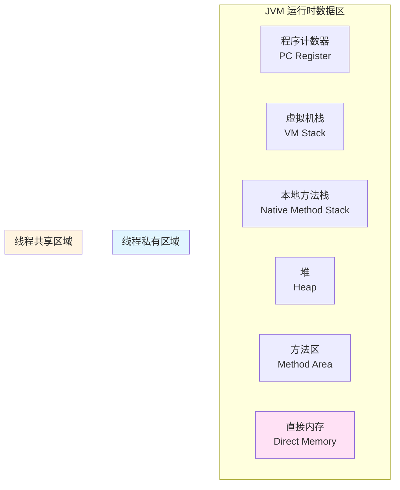

### 1.2 各区域详细说明

#### 程序计数器（Program Counter Register）

**作用**：
- 记录当前线程执行的字节码指令地址
- 线程私有，每个线程都有独立的程序计数器

**特点**：
- 唯一不会发生 `OutOfMemoryError` 的区域
- 如果执行的是 Java 方法，计数器记录的是虚拟机字节码指令地址
- 如果执行的是 Native 方法，计数器值为空（Undefined）

```java
public class CounterExample {
    public static void main(String[] args) {
        int a = 1;        // PC: 0
        int b = 2;        // PC: 1
        int c = a + b;    // PC: 2
        System.out.println(c); // PC: 3
    }
}
```

#### 虚拟机栈（VM Stack）

**作用**：
- 存储局部变量表、操作数栈、动态链接、方法出口等信息
- 每个方法执行时都会创建一个栈帧（Stack Frame）

**栈帧结构**：

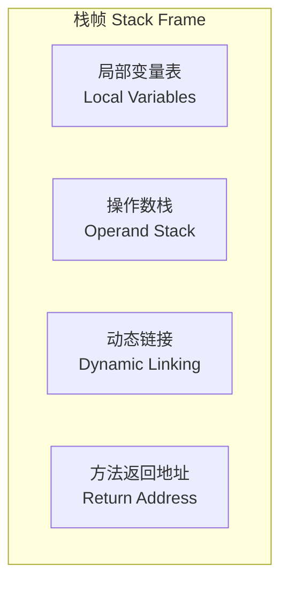

**局部变量表**：
- 存储方法参数和局部变量
- 基本数据类型（boolean、byte、char、short、int、float、long、double）直接存储值
- 引用类型存储对象引用（reference）

```java
public void method(int param) {
    int localVar = 10;           // 局部变量
    String str = "Hello";         // 引用类型
    Object obj = new Object();    // 对象引用
}
```

**异常情况**：
- `StackOverflowError`：线程请求的栈深度大于虚拟机允许的深度
- `OutOfMemoryError`：虚拟机栈可以动态扩展，但扩展时无法申请到足够的内存

#### 本地方法栈（Native Method Stack）

**作用**：
- 为 Native 方法服务
- 与虚拟机栈类似，但服务于 Native 方法

**特点**：
- 有些虚拟机（如 HotSpot）将本地方法栈和虚拟机栈合二为一

#### 堆（Heap）

**作用**：
- 存放对象实例和数组
- 所有线程共享
- 是垃圾回收的主要区域

**堆的划分**：

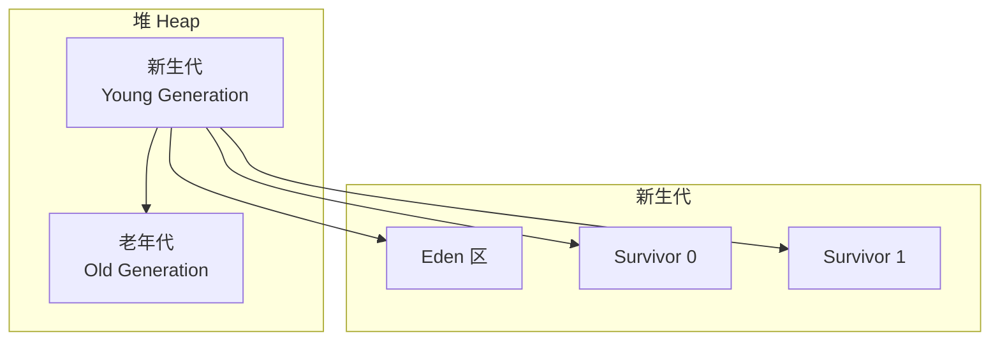

**新生代（Young Generation）**：
- **Eden 区**：新对象首先分配在这里
- **Survivor 区**：经过一次 GC 后存活的对象会移动到 Survivor 区
- 默认比例：Eden : Survivor0 : Survivor1 = 8:1:1

**老年代（Old Generation）**：
- 长期存活的对象会晋升到老年代
- 默认晋升年龄：15（可通过 `-XX:MaxTenuringThreshold` 调整）

**堆的参数设置**：

```bash
# 设置堆初始大小
-Xms512m

# 设置堆最大大小
-Xmx2g

# 设置新生代大小
-Xmn1g

# 设置 Eden 和 Survivor 的比例
-XX:SurvivorRatio=8
```

**异常情况**：
- `OutOfMemoryError: Java heap space`：堆内存不足

#### 方法区（Method Area）

**作用**：
- 存储已被虚拟机加载的类型信息、常量、静态变量、即时编译器编译后的代码缓存等

**JDK 版本变化**：

| JDK 版本 | 实现方式 | 位置 |
|---------|---------|------|
| JDK 6 及之前 | 永久代（PermGen） | 堆内存中 |
| JDK 7 | 永久代（部分移除） | 堆内存中 |
| JDK 8+ | 元空间（Metaspace） | 本地内存中 |

**元空间（Metaspace）**：
- 使用本地内存（Native Memory）
- 不再受 `-XX:MaxPermSize` 限制
- 可通过 `-XX:MetaspaceSize` 和 `-XX:MaxMetaspaceSize` 设置大小

```bash
# 设置元空间初始大小
-XX:MetaspaceSize=256m

# 设置元空间最大大小
-XX:MaxMetaspaceSize=512m
```

**存储内容**：
- 类的元数据（Class Metadata）
- 运行时常量池（Runtime Constant Pool）
- 静态变量
- 方法信息

**异常情况**：
- `OutOfMemoryError: Metaspace`：元空间内存不足

#### 运行时常量池（Runtime Constant Pool）

**作用**：
- 是方法区的一部分
- 存储编译期生成的各种字面量和符号引用

**字面量**：
- 文本字符串
- 被声明为 `final` 的常量值
- 基本数据类型的值

**符号引用**：
- 类和接口的全限定名
- 字段的名称和描述符
- 方法的名称和描述符

```java
public class ConstantPoolExample {
    // 字面量
    private static final String STR = "Hello World";
    private static final int NUM = 100;
    
    public void method() {
        String localStr = "Local String";  // 也会进入常量池
    }
}
```

#### 直接内存（Direct Memory）

**作用**：
- 不是虚拟机运行时数据区的一部分
- 使用 Native 函数库直接分配堆外内存
- 可以通过 `DirectByteBuffer` 操作

**特点**：
- 不受 Java 堆大小限制
- 受本机总内存限制
- 读写性能高（避免了 Java 堆和 Native 堆之间的数据复制）

```java
import java.nio.ByteBuffer;

public class DirectMemoryExample {
    public void allocateDirectMemory() {
        // 分配 1MB 直接内存
        ByteBuffer buffer = ByteBuffer.allocateDirect(1024 * 1024);
        
        // 使用直接内存
        buffer.put((byte) 1);
        buffer.flip();
        byte value = buffer.get();
        
        // 注意：直接内存的回收依赖于 Full GC 或 System.gc()
    }
}
```

**异常情况**：
- `OutOfMemoryError`：直接内存溢出（虽然不受堆大小限制，但受本机总内存限制）

---

## 2. 对象内存布局

### 2.1 对象的创建过程


**步骤详解**：

1. **检查类是否加载**：检查 `new` 指令的参数是否能在常量池中定位到类的符号引用，并检查这个符号引用代表的类是否已被加载、解析和初始化。

2. **分配内存**：
   - **指针碰撞**（Bump the Pointer）：如果堆内存规整，使用指针移动
   - **空闲列表**（Free List）：如果堆内存不规整，使用空闲列表

3. **初始化零值**：将分配到的内存空间（除对象头外）都初始化为零值。

4. **设置对象头**：设置对象的哈希码、GC 分代年龄、锁状态标志等信息。

5. **执行 init 方法**：执行类的构造函数，按照程序员的意愿初始化对象。

### 2.2 对象的内存布局

在 HotSpot 虚拟机中，对象在堆内存中的存储布局可以划分为三个部分：

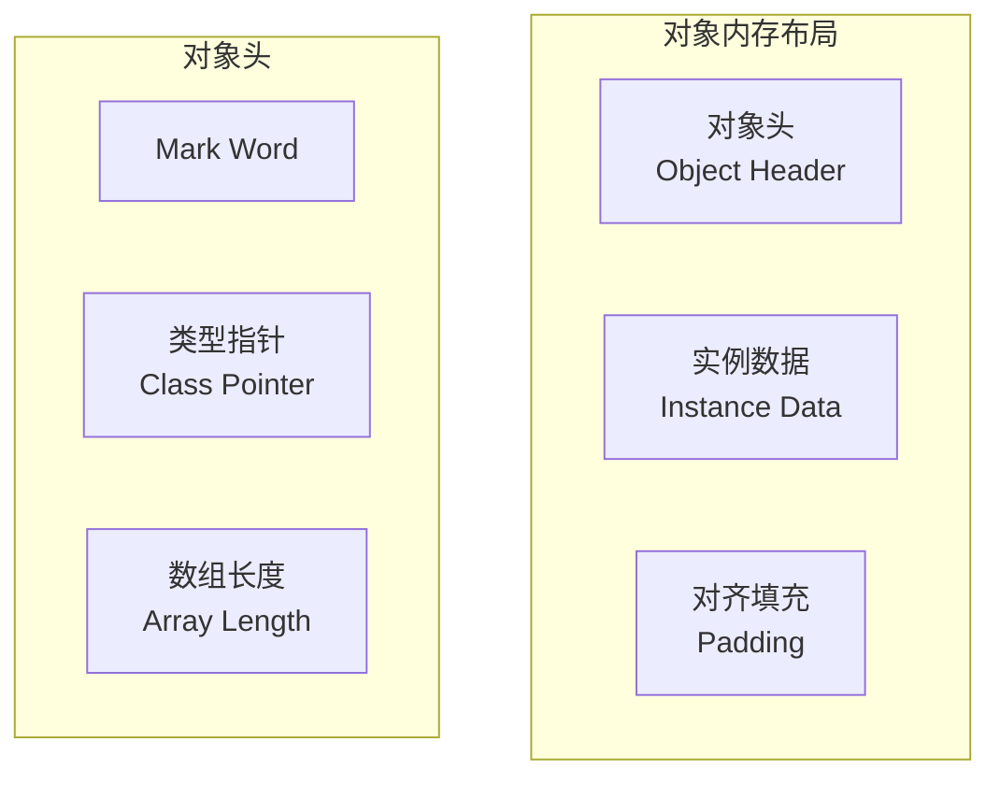

#### 对象头（Object Header）

**Mark Word**：
- 存储对象自身的运行时数据
- 哈希码（HashCode）、GC 分代年龄、锁状态标志、线程持有的锁、偏向线程 ID、偏向时间戳等
- 在 64 位 JVM 中，Mark Word 占 8 字节

**Mark Word 在不同状态下的存储内容**：

| 锁状态 | 25 bit | 31 bit | 1 bit | 4 bit | 1 bit | 2 bit |
|--------|--------|--------|-------|-------|-------|-------|
| 无锁 | unused | hashCode | unused | 分代年龄 | 0 | 01 |
| 偏向锁 | threadId(54 bit) + epoch(2 bit) | 分代年龄 | 1 | 01 |
| 轻量级锁 | 指向栈中锁记录的指针 | 00 |
| 重量级锁 | 指向互斥量的指针 | 10 |
| GC 标记 | 空 | 11 |

**类型指针（Class Pointer）**：
- 指向对象类型元数据的指针
- JVM 通过这个指针确定对象是哪个类的实例
- 在 64 位 JVM 中，类型指针占 8 字节（如果开启压缩指针，则占 4 字节）

**数组长度**（仅数组对象）：
- 如果对象是数组，对象头中还有一块用于记录数组长度的数据
- 占 4 字节

#### 实例数据（Instance Data）

**存储内容**：
- 对象真正存储的有效信息
- 各种类型的字段内容（包括从父类继承下来的）

**字段排列顺序**：
1. 相同宽度的字段总是被分配在一起
2. 父类中定义的变量会出现在子类之前
3. 如果 `CompactFields` 参数为 `true`（默认），子类的窄变量可能插入到父类变量的空隙中

```java
public class ObjectLayoutExample {
    // 对象头：Mark Word (8 bytes) + Class Pointer (4 bytes) = 12 bytes
    
    private int id;           // 4 bytes
    private long timestamp;   // 8 bytes
    private byte flag;        // 1 byte
    private String name;      // 4 bytes (引用，压缩指针)
    
    // 实例数据：4 + 8 + 1 + 4 = 17 bytes
    // 对齐填充：3 bytes (使总大小为 8 的倍数)
    // 总大小：12 + 17 + 3 = 32 bytes
}
```

#### 对齐填充（Padding）

**作用**：
- 不是必然存在的，仅起占位符作用
- 确保对象大小是 8 字节的整数倍

**原因**：
- HotSpot 虚拟机的自动内存管理系统要求对象起始地址必须是 8 字节的整数倍
- 对象头部分已经是 8 字节的整数倍，如果实例数据部分不是，就需要对齐填充

### 2.3 对象大小计算示例

```java
public class SizeExample {
    // 对象头：12 bytes (Mark Word 8 + Class Pointer 4，压缩指针开启)
    
    private int a;        // 4 bytes
    private long b;       // 8 bytes
    private byte c;       // 1 byte
    private boolean d;   // 1 byte
    
    // 实例数据：4 + 8 + 1 + 1 = 14 bytes
    // 对齐填充：2 bytes (使总大小为 8 的倍数)
    // 总大小：12 + 14 + 2 = 28 bytes
    // 但实际会填充到 32 bytes（8 的倍数）
}
```

**使用工具查看对象大小**：

```java
import jdk.internal.vm.annotation.Contended;

public class ObjectSizeTool {
    public static void main(String[] args) {
        // 使用 JOL (Java Object Layout) 工具
        // 需要添加依赖：org.openjdk.jol:jol-core
        
        // 示例：查看对象布局
        // System.out.println(ClassLayout.parseInstance(new SizeExample()).toPrintable());
    }
}
```

### 2.4 对象的访问定位

Java 程序需要通过栈上的 reference 数据来操作堆上的具体对象。reference 类型在 Java 虚拟机规范中只规定了一个指向对象的引用，并没有定义这个引用应该通过什么方式去定位、访问堆中对象的具体位置。

**两种访问方式**：

#### 句柄访问

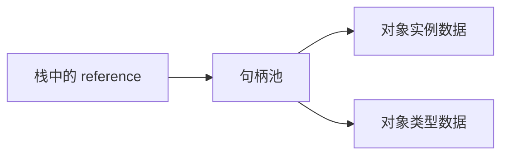

**优点**：
- reference 中存储的是稳定的句柄地址
- 对象被移动时，只需要改变句柄中的实例数据指针

**缺点**：
- 需要两次指针定位，访问速度较慢

#### 直接指针访问（HotSpot 采用）


**优点**：
- 访问速度快，只需要一次指针定位

**缺点**：
- 对象移动时需要修改 reference 的值

---

## 3. 垃圾回收机制

### 3.1 判断对象是否存活

#### 引用计数算法

**原理**：
- 给对象添加一个引用计数器
- 每当有一个地方引用它时，计数器值加 1
- 当引用失效时，计数器值减 1
- 任何时刻计数器为 0 的对象就是不可能再被使用的

**缺点**：
- 无法解决循环引用问题

```java
public class ReferenceCounting {
    public ReferenceCounting ref;
    
    public static void main(String[] args) {
        ReferenceCounting a = new ReferenceCounting();
        ReferenceCounting b = new ReferenceCounting();
        
        a.ref = b;
        b.ref = a;  // 循环引用
        
        a = null;
        b = null;
        
        // 如果使用引用计数，a 和 b 的计数器都不为 0
        // 但实际上它们已经不可能再被访问了
    }
}
```

#### 可达性分析算法

**原理**：
- 通过一系列称为 "GC Roots" 的根对象作为起始节点集
- 从这些节点开始，根据引用关系向下搜索
- 搜索过程所走过的路径称为 "引用链"（Reference Chain）
- 如果某个对象到 GC Roots 间没有任何引用链相连，则证明此对象是不可能再被使用的

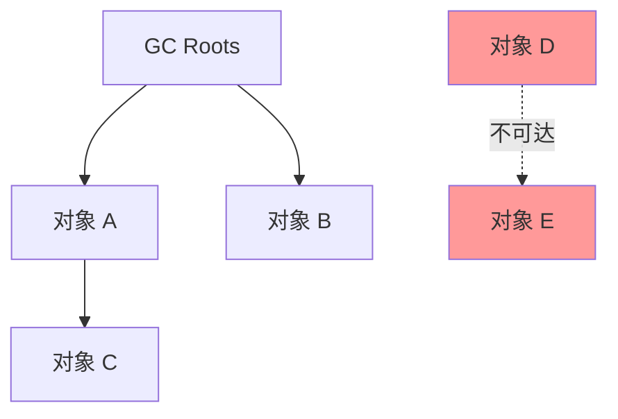

**GC Roots 包括**：
- 虚拟机栈（栈帧中的局部变量表）中引用的对象
- 方法区中类静态属性引用的对象
- 方法区中常量引用的对象
- 本地方法栈中 JNI（Native 方法）引用的对象
- Java 虚拟机内部的引用（如基本数据类型对应的 Class 对象、常驻异常对象等）
- 所有被同步锁（synchronized）持有的对象
- 反映 Java 虚拟机内部情况的 JMXBean、JVMTI 中注册的回调、本地代码缓存等

#### 引用类型

Java 对引用的概念进行了扩充，将引用分为强引用（Strongly Reference）、软引用（Soft Reference）、弱引用（Weak Reference）和虚引用（Phantom Reference）四种。

| 引用类型 | 被垃圾回收时间 | 用途 | 生存时间 |
|---------|---------------|------|---------|
| 强引用 | 从来不会 | 对象的一般状态 | JVM 停止运行时终止 |
| 软引用 | 当内存不足时 | 对象缓存 | 内存不足时终止 |
| 弱引用 | 正常垃圾回收时 | 对象缓存 | 垃圾回收后终止 |
| 虚引用 | 正常垃圾回收时 | 跟踪对象的垃圾回收 | 垃圾回收后终止 |

```java
import java.lang.ref.*;

public class ReferenceTypes {
    public static void main(String[] args) {
        // 强引用
        Object strongRef = new Object();
        
        // 软引用
        SoftReference<Object> softRef = new SoftReference<>(new Object());
        
        // 弱引用
        WeakReference<Object> weakRef = new WeakReference<>(new Object());
        
        // 虚引用
        ReferenceQueue<Object> queue = new ReferenceQueue<>();
        PhantomReference<Object> phantomRef = new PhantomReference<>(new Object(), queue);
    }
}
```

### 3.2 垃圾回收算法

#### 标记-清除算法（Mark-Sweep）

**过程**：
1. 标记：标记所有需要回收的对象
2. 清除：统一回收被标记的对象


**缺点**：
- 执行效率不稳定，如果堆中包含大量对象，标记和清除过程效率都不高
- 内存空间碎片化问题，标记清除后会产生大量不连续的内存碎片

#### 标记-复制算法（Mark-Copy）

**过程**：
1. 将可用内存按容量划分为大小相等的两块
2. 每次只使用其中的一块
3. 当这一块的内存用完了，就将还存活着的对象复制到另外一块上面
4. 再把已使用过的内存空间一次清理掉


**优点**：
- 实现简单，运行高效
- 不会产生内存碎片

**缺点**：
- 内存利用率低，可用内存缩小为原来的一半

**改进**（Appel 式回收）：
- 将新生代分为一块较大的 Eden 空间和两块较小的 Survivor 空间
- 每次分配内存只使用 Eden 和其中一块 Survivor
- 发生垃圾回收时，将 Eden 和 Survivor 中仍存活的对象一次性复制到另外一块 Survivor 空间上
- 默认比例：Eden : Survivor = 8:1

#### 标记-整理算法（Mark-Compact）

**过程**：
1. 标记：标记所有需要回收的对象
2. 整理：让所有存活的对象都向内存空间一端移动
3. 清理：直接清理掉边界以外的内存


**优点**：
- 不会产生内存碎片
- 内存利用率高

**缺点**：
- 移动存活对象需要更新所有引用这些对象的地方
- 移动对象需要暂停用户线程（Stop The World）

### 3.3 分代收集理论

**核心思想**：
- 根据对象存活周期的不同，将内存划分为几块
- 不同代采用不同的垃圾回收算法

**分代假设**：
1. **弱分代假设**：绝大多数对象都是朝生夕灭的
2. **强分代假设**：熬过越多次垃圾回收过程的对象就越难以消亡
3. **跨代引用假设**：跨代引用相对于同代引用来说仅占极少数

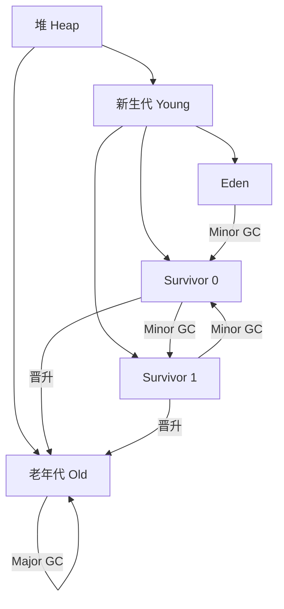

**Minor GC**：
- 发生在新生代的垃圾回收
- 频率高，速度快
- 使用标记-复制算法

**Major GC / Full GC**：
- 发生在老年代的垃圾回收
- 频率低，速度慢
- 通常使用标记-清除或标记-整理算法

### 3.4 经典垃圾收集器

#### Serial 收集器

**特点**：
- 单线程工作
- 进行垃圾回收时必须暂停其他所有工作线程（Stop The World）

**适用场景**：
- 客户端模式下的默认新生代收集器
- 内存资源受限、单核处理器或处理器核心数较少的环境

#### ParNew 收集器

**特点**：
- Serial 收集器的多线程并行版本
- 除了使用多条线程进行垃圾回收外，其余行为与 Serial 收集器完全一致

**适用场景**：
- 服务端模式下的新生代收集器
- 与 CMS 收集器配合使用

#### Parallel Scavenge 收集器

**特点**：
- 新生代收集器
- 使用标记-复制算法
- 关注吞吐量（Throughput）

**参数设置**：
```bash
# 设置最大垃圾回收停顿时间
-XX:MaxGCPauseMillis

# 设置吞吐量大小
-XX:GCTimeRatio
```

#### Serial Old 收集器

**特点**：
- Serial 收集器的老年代版本
- 单线程，使用标记-整理算法

#### Parallel Old 收集器

**特点**：
- Parallel Scavenge 收集器的老年代版本
- 多线程，使用标记-整理算法

#### CMS 收集器（Concurrent Mark Sweep）

**特点**：
- 以获取最短回收停顿时间为目标
- 使用标记-清除算法
- 并发收集，低停顿

**工作过程**：

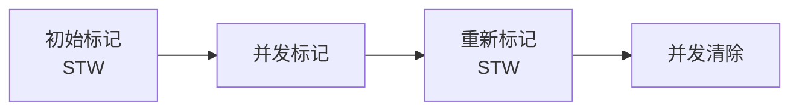

1. **初始标记**（Stop The World）：标记 GC Roots 能直接关联到的对象
2. **并发标记**：从 GC Roots 的直接关联对象开始遍历整个对象图
3. **重新标记**（Stop The World）：修正并发标记期间因用户程序继续运作而导致标记产生变动的那部分对象的标记记录
4. **并发清除**：清理删除标记阶段判断的已经死亡的对象

**缺点**：
- 对处理器资源敏感
- 无法处理"浮动垃圾"（Floating Garbage）
- 标记-清除算法会产生大量空间碎片

#### G1 收集器（Garbage First）

**特点**：
- 面向服务端应用的垃圾收集器
- 可以面向堆内存任何部分来组成回收集（Collection Set，CSet）进行回收
- 衡量标准不再是它属于哪个分代，而是哪块内存中存放的垃圾数量最多，回收收益最大

**堆内存布局**：

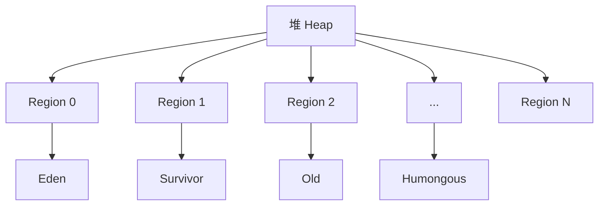

- 将堆内存划分为多个大小相等的独立区域（Region）
- 每个 Region 都可以根据需要，扮演新生代的 Eden 空间、Survivor 空间，或者老年代空间

**工作过程**：

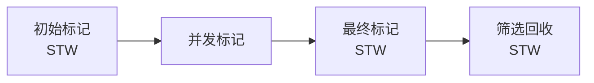

1. **初始标记**：标记 GC Roots 能直接关联到的对象
2. **并发标记**：从 GC Roots 开始对堆中对象进行可达性分析
3. **最终标记**：处理并发标记阶段遗留的少量 SATB 记录
4. **筛选回收**：对各个 Region 的回收价值和成本进行排序，根据用户期望的停顿时间来制定回收计划

**参数设置**：
```bash
# 启用 G1 收集器
-XX:+UseG1GC

# 设置最大 GC 停顿时间目标
-XX:MaxGCPauseMillis=200

# 设置堆使用率阈值，触发并发标记周期
-XX:InitiatingHeapOccupancyPercent=45
```

#### ZGC 收集器

**特点**（JDK 11 引入，JDK 15 正式发布）：
- 低延迟垃圾收集器
- 停顿时间不超过 10ms
- 支持 TB 级堆内存

**核心技术**：
- **着色指针**（Colored Pointer）
- **读屏障**（Load Barrier）

**JDK 21 新特性：分代 ZGC**：
- 引入分代收集，进一步提升性能
- 减少不必要的对象扫描

```bash
# 启用 ZGC
-XX:+UseZGC

# 启用分代 ZGC（JDK 21+）
-XX:+UseZGC -XX:+ZGenerational
```

#### Shenandoah 收集器

**特点**：
- 低延迟垃圾收集器
- 停顿时间与堆大小无关
- 使用连接矩阵（Connection Matrix）来维护跨 Region 的引用关系

```bash
# 启用 Shenandoah
-XX:+UseShenandoahGC
```

### 3.5 垃圾回收器选择

| 收集器 | 串行/并行/并发 | 新生代/老年代 | 算法 | 目标 | 适用场景 |
|--------|---------------|--------------|------|------|---------|
| Serial | 串行 | 新生代 | 复制 | 响应速度优先 | 单核、客户端 |
| ParNew | 并行 | 新生代 | 复制 | 响应速度优先 | 多核、配合 CMS |
| Parallel Scavenge | 并行 | 新生代 | 复制 | 吞吐量优先 | 后台运算 |
| Serial Old | 串行 | 老年代 | 标记-整理 | 响应速度优先 | 单核、客户端 |
| Parallel Old | 并行 | 老年代 | 标记-整理 | 吞吐量优先 | 后台运算 |
| CMS | 并发 | 老年代 | 标记-清除 | 响应速度优先 | 互联网、B/S |
| G1 | 并发 | 新生代+老年代 | 标记-整理+复制 | 响应速度优先 | 服务端、大堆 |
| ZGC | 并发 | 新生代+老年代 | 标记-整理 | 低延迟 | 大堆、低延迟 |
| Shenandoah | 并发 | 新生代+老年代 | 标记-整理 | 低延迟 | 大堆、低延迟 |

---

## 4. Java 内存模型（JMM）

### 4.1 JMM 概述

Java 内存模型（Java Memory Model，JMM）是用来屏蔽各种硬件和操作系统的内存访问差异，以实现让 Java 程序在各种平台下都能达到一致的内存访问效果。

**核心问题**：
- 在多线程环境下，如何保证可见性、有序性和原子性

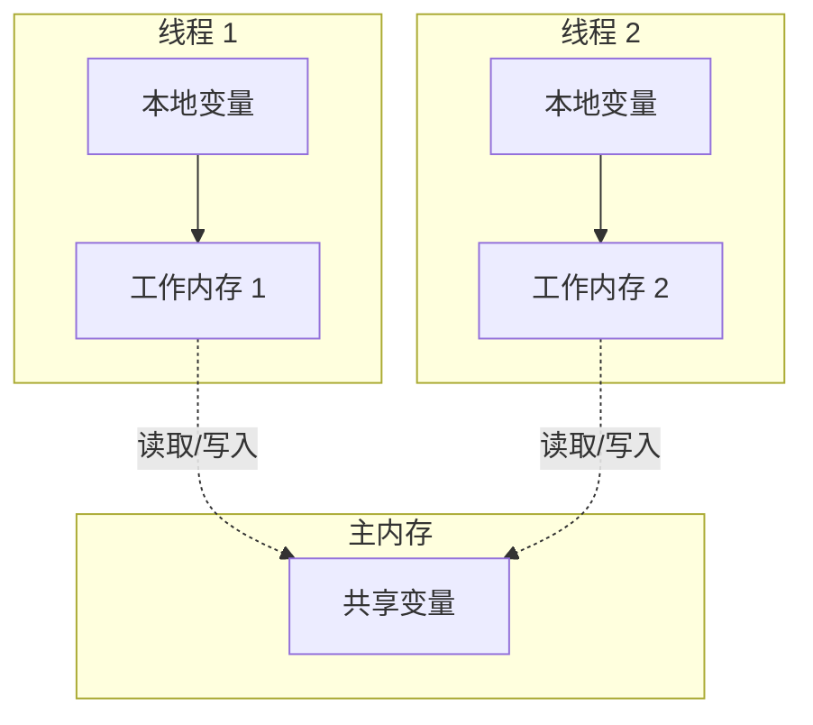

### 4.2 主内存与工作内存

**主内存（Main Memory）**：
- 所有变量都存储在主内存中
- 主内存是共享的，所有线程都可以访问

**工作内存（Working Memory）**：
- 每个线程都有自己的工作内存
- 工作内存中保存了该线程使用到的变量的主内存副本
- 线程对变量的所有操作都必须在工作内存中进行，不能直接读写主内存中的变量

**内存间交互操作**：

| 操作 | 作用域 | 说明 |
|------|--------|------|
| lock（锁定） | 主内存 | 把一个变量标识为一条线程独占的状态 |
| unlock（解锁） | 主内存 | 把一个处于锁定状态的变量释放出来 |
| read（读取） | 主内存 | 把一个变量的值从主内存传输到线程的工作内存中 |
| load（载入） | 工作内存 | 把 read 操作从主内存中得到的变量值放入工作内存的变量副本中 |
| use（使用） | 工作内存 | 把工作内存中一个变量的值传递给执行引擎 |
| assign（赋值） | 工作内存 | 把一个从执行引擎接收到的值赋给工作内存的变量 |
| store（存储） | 工作内存 | 把工作内存中一个变量的值传送到主内存中 |
| write（写入） | 主内存 | 把 store 操作从工作内存中得到的变量的值放入主内存的变量中 |

### 4.3 内存模型的三大特性

#### 原子性（Atomicity）

**定义**：
- 一个操作或多个操作要么全部执行并且执行的过程不会被任何因素打断，要么就都不执行

**Java 中的原子性**：
- 基本数据类型的访问读写是原子性的
- `synchronized` 块之间的操作是原子性的

```java
public class AtomicityExample {
    private int count = 0;
    
    // 非原子操作
    public void increment() {
        count++;  // 实际上包含：读取、修改、写入三个步骤
    }
    
    // 原子操作
    public synchronized void incrementAtomic() {
        count++;  // 在 synchronized 块中是原子的
    }
    
    // 使用原子类
    private AtomicInteger atomicCount = new AtomicInteger(0);
    
    public void incrementWithAtomic() {
        atomicCount.incrementAndGet();  // 原子操作
    }
}
```

#### 可见性（Visibility）

**定义**：
- 当一个线程修改了共享变量的值，其他线程能够立即看到这个修改

**问题示例**：

```java
public class VisibilityExample {
    private boolean flag = false;  // 共享变量
    
    public void writer() {
        flag = true;  // 线程 1 修改
    }
    
    public void reader() {
        while (!flag) {  // 线程 2 可能永远看不到 flag 的变化
            // 死循环
        }
    }
}
```

**解决方案**：

```java
public class VisibilitySolution {
    // 使用 volatile
    private volatile boolean flag = false;
    
    // 使用 synchronized
    private boolean flag2 = false;
    
    public synchronized void writer() {
        flag2 = true;
    }
    
    public synchronized void reader() {
        while (!flag2) {
            // ...
        }
    }
    
    // 使用 final
    private final boolean flag3 = false;  // final 变量在构造完成后可见
}
```

#### 有序性（Ordering）

**定义**：
- 程序执行的顺序按照代码的先后顺序执行

**问题**：指令重排序

```java
public class OrderingExample {
    private int a = 0;
    private boolean flag = false;
    
    public void writer() {
        a = 1;          // 1
        flag = true;    // 2
    }
    
    public void reader() {
        if (flag) {     // 3
            int i = a;  // 4
        }
    }
}
```

由于指令重排序，执行顺序可能变成：2 -> 3 -> 4 -> 1，导致 `i` 的值为 0。

**解决方案**：

```java
public class OrderingSolution {
    private int a = 0;
    private volatile boolean flag = false;  // volatile 禁止重排序
    
    public void writer() {
        a = 1;
        flag = true;
    }
    
    public void reader() {
        if (flag) {
            int i = a;  // 保证看到 a = 1
        }
    }
}
```

### 4.4 happens-before 关系

**定义**：
- 如果操作 A happens-before 操作 B，那么操作 A 的执行结果对操作 B 可见

**规则**：

1. **程序顺序规则**：在一个线程内，按照控制流顺序，书写在前面的操作 happens-before 书写在后面的操作

2. **管程锁定规则**：一个 unlock 操作 happens-before 后面对同一个锁的 lock 操作

3. **volatile 变量规则**：对一个 volatile 变量的写操作 happens-before 后面对这个变量的读操作

4. **线程启动规则**：Thread 对象的 `start()` 方法调用 happens-before 此线程的每一个动作

5. **线程终止规则**：线程中的所有操作 happens-before 对此线程的终止检测

6. **线程中断规则**：对线程 `interrupt()` 方法的调用 happens-before 被中断线程的代码检测到中断事件的发生

7. **对象终结规则**：一个对象的初始化完成（构造函数执行结束）happens-before 它的 `finalize()` 方法的开始

8. **传递性**：如果 A happens-before B，且 B happens-before C，那么 A happens-before C

```java
public class HappensBeforeExample {
    private int x = 0;
    private volatile boolean flag = false;
    
    public void writer() {
        x = 42;        // 1
        flag = true;   // 2 (volatile 写)
    }
    
    public void reader() {
        if (flag) {    // 3 (volatile 读)
            int y = x; // 4 (保证看到 x = 42)
        }
    }
}
```

### 4.5 volatile 关键字

**作用**：
- 保证可见性
- 禁止指令重排序

**实现原理**：
- 使用内存屏障（Memory Barrier）

```java
public class VolatileExample {
    private volatile boolean shutdown = false;
    
    public void shutdown() {
        shutdown = true;  // volatile 写，立即刷新到主内存
    }
    
    public void doWork() {
        while (!shutdown) {  // volatile 读，从主内存读取最新值
            // 工作
        }
    }
}
```

**volatile 与 synchronized 的区别**：

| 特性 | volatile | synchronized |
|------|----------|--------------|
| 原子性 | 不保证（对单个变量的读写是原子的） | 保证 |
| 可见性 | 保证 | 保证 |
| 有序性 | 保证（禁止重排序） | 保证 |
| 性能 | 较高 | 较低 |

### 4.6 内存屏障详解

#### 4.6.1 什么是内存屏障

**内存屏障（Memory Barrier）**，也称为内存栅栏（Memory Fence），是一种 CPU 指令，用于控制特定条件下的内存操作顺序和可见性。

**作用**：
- 确保某些内存操作的顺序
- 保证内存操作的可见性
- 防止指令重排序

**为什么需要内存屏障**：

现代 CPU 为了提高性能，会采用以下优化策略：
1. **指令重排序**：在不影响单线程执行结果的前提下，重新安排指令执行顺序
2. **写缓冲区**：CPU 写入数据时先写入缓冲区，异步刷新到内存
3. **多级缓存**：每个 CPU 核心都有自己的缓存，可能导致数据不一致

这些优化在单线程环境下没有问题，但在多线程环境下可能导致可见性和有序性问题。

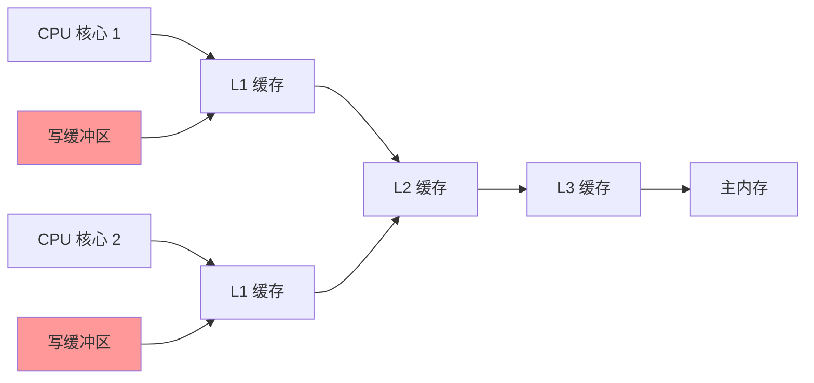

#### 4.6.2 内存屏障的类型

根据不同的分类标准，内存屏障可以分为不同类型：

**按作用范围分类**：

| 类型 | 说明 | 示例 |
|------|------|------|
| **LoadLoad 屏障** | 确保 Load1 在 Load2 之前执行 | `Load1; LoadLoad; Load2` |
| **StoreStore 屏障** | 确保 Store1 在 Store2 之前执行 | `Store1; StoreStore; Store2` |
| **LoadStore 屏障** | 确保 Load1 在 Store2 之前执行 | `Load1; LoadStore; Store2` |
| **StoreLoad 屏障** | 确保 Store1 在 Load2 之前执行 | `Store1; StoreLoad; Load2` |

**StoreLoad 屏障是最强的屏障**，它同时具备其他三种屏障的效果。

**按平台分类**：

| 平台 | 内存屏障指令 | 说明 |
|------|------------|------|
| **x86/x64** | `mfence`、`lfence`、`sfence` | Intel/AMD 架构 |
| **ARM** | `dmb`、`dsb`、`isb` | ARM 架构 |
| **PowerPC** | `sync`、`lwsync`、`isync` | PowerPC 架构 |

#### 4.6.3 volatile 的内存屏障语义

在 JVM 中，`volatile` 关键字通过内存屏障来实现其语义。

**volatile 写操作的内存屏障**：

```java
// volatile 变量写操作
volatile int x = 1;

// 编译后的内存屏障（伪代码）
StoreStore Barrier  // 确保普通写操作在 volatile 写之前完成
x = 1;              // volatile 写
StoreLoad Barrier   // 确保 volatile 写对所有线程可见
```

**volatile 读操作的内存屏障**：

```java
// volatile 变量读操作
int y = x;  // x 是 volatile

// 编译后的内存屏障（伪代码）
LoadLoad Barrier   // 确保 volatile 读在其他读操作之前
int y = x;         // volatile 读
LoadStore Barrier  // 确保 volatile 读在其他写操作之前
```

**完整示例**：

```java
public class MemoryBarrierExample {
    private int a = 0;
    private volatile boolean flag = false;
    
    public void writer() {
        a = 1;          // 普通写操作
        // StoreStore Barrier（隐式）
        flag = true;    // volatile 写操作
        // StoreLoad Barrier（隐式）
    }
    
    public void reader() {
        if (flag) {     // volatile 读操作
            // LoadLoad Barrier（隐式）
            int x = a;  // 普通读操作
            // 保证看到 a = 1
        }
    }
}
```

**内存屏障的作用顺序**：

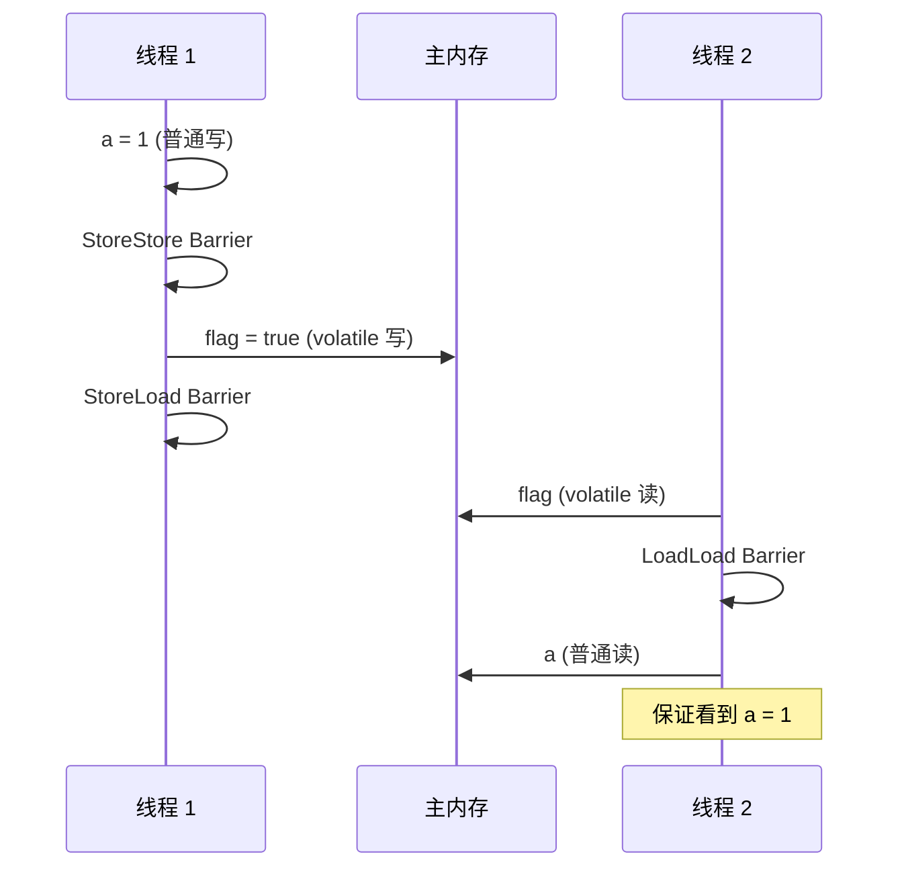

#### 4.6.4 synchronized 的内存屏障语义

`synchronized` 关键字也会插入内存屏障：

**monitorenter（获取锁）**：
- 相当于 LoadLoad + LoadStore 屏障
- 确保锁获取操作在后续操作之前完成

**monitorexit（释放锁）**：
- 相当于 StoreStore + StoreLoad 屏障
- 确保锁释放操作在之前操作之后完成

```java
public class SynchronizedBarrier {
    private int x = 0;
    
    public synchronized void increment() {
        // LoadLoad + LoadStore Barrier（获取锁时）
        x++;
        // StoreStore + StoreLoad Barrier（释放锁时）
    }
}
```

#### 4.6.5 final 的内存屏障语义

`final` 字段的写入也会插入内存屏障：

```java
public class FinalBarrier {
    private final int x;
    
    public FinalBarrier(int value) {
        x = value;  // final 字段写入
        // StoreStore Barrier（确保 final 字段写入在对象引用可见之前完成）
    }
}
```

**final 字段的重排序规则**：
- 在构造函数中对 final 字段的写入，与随后把这个被构造对象的引用赋值给一个引用变量，这两个操作之间不能重排序
- 初次读一个包含 final 字段的对象引用，与随后初次读这个 final 字段，这两个操作之间不能重排序

#### 4.6.6 内存屏障的性能影响

**性能开销**：

| 屏障类型 | 相对开销 | 说明 |
|---------|---------|------|
| LoadLoad | 低 | 通常只需要等待缓存加载完成 |
| StoreStore | 低 | 通常只需要等待写缓冲区刷新 |
| LoadStore | 中 | 需要等待加载和存储操作 |
| StoreLoad | 高 | 需要刷新写缓冲区并等待加载完成 |

**优化建议**：
- 避免不必要的 volatile 使用
- 使用 `java.util.concurrent` 包中的原子类，它们内部已经优化了内存屏障的使用
- 合理使用 `final` 关键字，编译器可以优化 final 字段的内存屏障

#### 4.6.7 实际应用场景

**场景 1：单例模式（双重检查锁定）**

```java
public class Singleton {
    private static volatile Singleton instance;
    
    public static Singleton getInstance() {
        if (instance == null) {
            synchronized (Singleton.class) {
                if (instance == null) {
                    instance = new Singleton();
                    // StoreStore Barrier：确保对象初始化完成
                    // StoreLoad Barrier：确保 instance 引用对所有线程可见
                }
            }
        }
        // LoadLoad Barrier：确保 instance 引用在其他操作之前读取
        return instance;
    }
}
```

**场景 2：状态标志**

```java
public class Worker {
    private volatile boolean shutdown = false;
    
    public void shutdown() {
        shutdown = true;  // StoreStore + StoreLoad Barrier
    }
    
    public void work() {
        while (!shutdown) {  // LoadLoad + LoadStore Barrier
            // 工作
        }
    }
}
```

**场景 3：发布-订阅模式**

```java
public class Publisher {
    private volatile int data = 0;
    
    public void publish(int value) {
        data = value;  // StoreStore + StoreLoad Barrier
    }
}

public class Subscriber {
    private Publisher publisher;
    
    public void subscribe() {
        int value = publisher.data;  // LoadLoad + LoadStore Barrier
        // 保证读取到最新的值
    }
}
```

### 4.7 双重检查锁定（Double-Checked Locking）

**问题代码**：

```java
public class Singleton {
    private static Singleton instance;
    
    public static Singleton getInstance() {
        if (instance == null) {  // 第一次检查
            synchronized (Singleton.class) {
                if (instance == null) {  // 第二次检查
                    instance = new Singleton();  // 问题：可能发生重排序
                }
            }
        }
        return instance;
    }
}
```

**问题**：
- `new Singleton()` 可能被重排序为：分配内存 -> 设置引用 -> 初始化对象
- 如果线程 A 执行到设置引用后，线程 B 可能看到未完全初始化的对象

**解决方案**：

```java
public class Singleton {
    // 使用 volatile
    private static volatile Singleton instance;
    
    public static Singleton getInstance() {
        if (instance == null) {
            synchronized (Singleton.class) {
                if (instance == null) {
                    instance = new Singleton();
                }
            }
        }
        return instance;
    }
}

// 或者使用静态内部类
public class Singleton {
    private static class Holder {
        private static final Singleton INSTANCE = new Singleton();
    }
    
    public static Singleton getInstance() {
        return Holder.INSTANCE;
    }
}
```

---

## 5. JDK 21 内存相关新特性

### 5.1 分代 ZGC

**背景**：
- ZGC 在 JDK 11 引入，JDK 15 正式发布
- 主要面向大堆内存和低延迟场景
- JDK 21 引入分代收集，进一步提升性能

**改进**：
- 将堆分为新生代和老年代
- 新生代使用更频繁的收集，老年代使用较少频率的收集
- 减少不必要的对象扫描

```bash
# 启用分代 ZGC
-XX:+UseZGC -XX:+ZGenerational
```

**性能提升**：
- 减少 GC 停顿时间
- 提高吞吐量
- 降低内存分配延迟

### 5.2 虚拟线程对内存的影响

**背景**：
- JDK 19 引入虚拟线程（预览），JDK 21 正式发布
- 虚拟线程是轻量级线程，由 JVM 管理

**内存影响**：
- 虚拟线程栈大小：初始约 200 字节，可动态扩展
- 平台线程栈大小：通常 1MB（可通过 `-Xss` 调整）
- 可以创建数百万个虚拟线程，而不会耗尽内存

```java
import java.util.concurrent.Executors;

public class VirtualThreadMemory {
    public static void main(String[] args) {
        // 创建虚拟线程
        try (var executor = Executors.newVirtualThreadPerTaskExecutor()) {
            for (int i = 0; i < 1_000_000; i++) {
                executor.submit(() -> {
                    // 每个虚拟线程只需要很少的内存
                    System.out.println("Virtual thread: " + Thread.currentThread());
                });
            }
        }
    }
}
```

**内存优势**：
- 大幅减少线程栈内存占用
- 提高并发能力
- 减少上下文切换开销

### 5.3 其他内存相关改进

#### 字符串去重优化

**改进**：
- 进一步优化字符串去重机制
- 减少重复字符串的内存占用

#### 压缩指针优化

**改进**：
- 优化压缩指针（Compressed OOPs）的实现
- 提高大堆内存下的性能

#### 内存分配优化

**改进**：
- 优化对象分配路径
- 提高分配性能
- 减少分配延迟

---

## 6. 内存调优实践

### 6.1 堆内存调优

**参数设置**：

```bash
# 设置堆初始大小和最大大小
-Xms2g -Xmx4g

# 设置新生代大小
-Xmn1g

# 设置 Eden 和 Survivor 的比例
-XX:SurvivorRatio=8

# 设置晋升到老年代的年龄阈值
-XX:MaxTenuringThreshold=15
```

**调优建议**：
- 初始堆大小（-Xms）和最大堆大小（-Xmx）设置为相同值，避免动态扩展
- 新生代大小通常为堆的 1/3 到 1/4
- 根据应用特点调整 Survivor 比例

### 6.2 元空间调优

**参数设置**：

```bash
# 设置元空间初始大小
-XX:MetaspaceSize=256m

# 设置元空间最大大小
-XX:MaxMetaspaceSize=512m
```

**调优建议**：
- 根据应用加载的类数量设置合适的元空间大小
- 避免元空间频繁扩展和收缩

### 6.3 垃圾收集器选择

**选择建议**：

| 场景 | 推荐收集器 | 参数 |
|------|-----------|------|
| 小堆（< 4GB）、低延迟 | G1 | `-XX:+UseG1GC -XX:MaxGCPauseMillis=200` |
| 大堆（> 4GB）、极低延迟 | ZGC | `-XX:+UseZGC -XX:+ZGenerational` |
| 吞吐量优先 | Parallel | `-XX:+UseParallelGC` |
| 中等堆、平衡 | G1 | `-XX:+UseG1GC` |

### 6.4 内存问题诊断

**工具**：

1. **jmap**：生成堆转储文件
```bash
jmap -dump:format=b,file=heap.hprof <pid>
```

2. **jstat**：查看 GC 统计信息
```bash
jstat -gc <pid> 1000 10
```

3. **jconsole**：图形化监控工具

4. **VisualVM**：功能强大的分析工具

5. **Eclipse MAT**：堆转储分析工具

**常见问题**：

| 问题 | 症状 | 解决方案 |
|------|------|---------|
| 内存泄漏 | 堆内存持续增长 | 分析堆转储，找出泄漏对象 |
| GC 频繁 | GC 时间占比高 | 调整堆大小或收集器参数 |
| Full GC 频繁 | 老年代频繁回收 | 检查对象晋升策略 |
| 元空间溢出 | OutOfMemoryError: Metaspace | 增加元空间大小或检查类加载 |

---

## 7. 总结

### 7.1 核心要点回顾

1. **JVM 内存区域**：
   - 程序计数器、虚拟机栈、本地方法栈（线程私有）
   - 堆、方法区（线程共享）
   - 直接内存（堆外）

2. **对象内存布局**：
   - 对象头（Mark Word + 类型指针 + 数组长度）
   - 实例数据
   - 对齐填充

3. **垃圾回收**：
   - 判断对象存活：引用计数、可达性分析
   - 回收算法：标记-清除、标记-复制、标记-整理
   - 分代收集：新生代（Minor GC）、老年代（Major GC）
   - 收集器选择：根据场景选择合适的收集器

4. **Java 内存模型（JMM）**：
   - 主内存与工作内存
   - 三大特性：原子性、可见性、有序性
   - happens-before 关系
   - volatile 关键字的作用

5. **JDK 21 新特性**：
   - 分代 ZGC
   - 虚拟线程对内存的影响
   - 其他内存相关优化

### 7.2 学习路径建议

1. **基础阶段**：
   - 理解 JVM 内存区域的划分
   - 掌握对象在内存中的布局
   - 了解基本的垃圾回收概念

2. **进阶阶段**：
   - 深入理解垃圾回收算法
   - 掌握不同垃圾收集器的特点
   - 理解 Java 内存模型（JMM）

3. **实践阶段**：
   - 使用工具分析内存问题
   - 进行内存调优实践
   - 监控和诊断生产环境问题

### 7.3 进一步阅读

- 《深入理解 Java 虚拟机》（周志明）
- [OpenJDK 官方文档](https://openjdk.org/)
- [JEP 文档](https://openjdk.org/jeps/)
- [GC 调优指南](https://docs.oracle.com/en/java/javase/21/gctuning/)

---

## 📝 面试考点

### 常见问题与答案

#### 1. JVM 内存区域有哪些？各有什么作用？

**答案**：

JVM 内存区域主要分为以下几个部分：

**线程私有区域**：
- **程序计数器（PC Register）**：记录当前线程执行的字节码指令地址，是唯一不会发生 `OutOfMemoryError` 的区域
- **虚拟机栈（VM Stack）**：存储局部变量表、操作数栈、动态链接、方法出口等信息，每个方法对应一个栈帧
- **本地方法栈（Native Method Stack）**：为 Native 方法服务，与虚拟机栈类似

**线程共享区域**：
- **堆（Heap）**：存放对象实例和数组，是垃圾回收的主要区域，分为新生代和老年代
- **方法区（Method Area）**：存储类型信息、常量、静态变量、即时编译器编译后的代码缓存等，JDK 8+ 使用元空间（Metaspace）实现

**其他**：
- **直接内存（Direct Memory）**：堆外内存，可以通过 `DirectByteBuffer` 操作，不受 Java 堆大小限制

#### 2. 对象在内存中是如何存储的？

**答案**：

对象在堆内存中的存储布局分为三个部分：

1. **对象头（Object Header）**：
   - **Mark Word**（8 字节）：存储哈希码、GC 分代年龄、锁状态标志、线程持有的锁、偏向线程 ID 等
   - **类型指针**（4/8 字节）：指向对象类型元数据的指针，JVM 通过它确定对象是哪个类的实例
   - **数组长度**（4 字节，仅数组对象）：记录数组长度

2. **实例数据（Instance Data）**：
   - 对象真正存储的有效信息
   - 各种类型的字段内容（包括从父类继承下来的）
   - 字段排列顺序：相同宽度的字段分配在一起，父类变量在子类之前

3. **对齐填充（Padding）**：
   - 不是必然存在的，仅起占位符作用
   - 确保对象大小是 8 字节的整数倍

**示例**：
```java
public class ObjectLayout {
    private int a;        // 4 bytes
    private long b;       // 8 bytes
    private byte c;       // 1 byte
    // 对象头：12 bytes + 实例数据：13 bytes + 对齐填充：3 bytes = 28 bytes（实际填充到 32 bytes）
}
```

#### 3. 如何判断对象是否存活？

**答案**：

主要有两种算法：

**1. 引用计数算法**：
- 给对象添加一个引用计数器
- 每当有一个地方引用它时，计数器值加 1
- 当引用失效时，计数器值减 1
- 任何时刻计数器为 0 的对象就是不可能再被使用的
- **缺点**：无法解决循环引用问题

**2. 可达性分析算法**（Java 采用）：
- 通过一系列称为 "GC Roots" 的根对象作为起始节点集
- 从这些节点开始，根据引用关系向下搜索
- 搜索过程所走过的路径称为 "引用链"（Reference Chain）
- 如果某个对象到 GC Roots 间没有任何引用链相连，则证明此对象是不可能再被使用的

**GC Roots 包括**：
- 虚拟机栈（栈帧中的局部变量表）中引用的对象
- 方法区中类静态属性引用的对象
- 方法区中常量引用的对象
- 本地方法栈中 JNI（Native 方法）引用的对象
- Java 虚拟机内部的引用
- 所有被同步锁（synchronized）持有的对象

#### 4. 垃圾回收算法有哪些？各有什么优缺点？

**答案**：

**1. 标记-清除算法（Mark-Sweep）**：
- **过程**：标记所有需要回收的对象，然后统一回收被标记的对象
- **优点**：实现简单
- **缺点**：
  - 执行效率不稳定，如果堆中包含大量对象，标记和清除过程效率都不高
  - 内存空间碎片化问题，标记清除后会产生大量不连续的内存碎片

**2. 标记-复制算法（Mark-Copy）**：
- **过程**：将可用内存按容量划分为大小相等的两块，每次只使用其中的一块，当这一块的内存用完了，就将还存活着的对象复制到另外一块上面，再把已使用过的内存空间一次清理掉
- **优点**：实现简单，运行高效，不会产生内存碎片
- **缺点**：内存利用率低，可用内存缩小为原来的一半
- **改进**：Appel 式回收，将新生代分为 Eden 和两个 Survivor 区，比例 8:1:1

**3. 标记-整理算法（Mark-Compact）**：
- **过程**：标记所有需要回收的对象，让所有存活的对象都向内存空间一端移动，然后直接清理掉边界以外的内存
- **优点**：不会产生内存碎片，内存利用率高
- **缺点**：移动存活对象需要更新所有引用这些对象的地方，移动对象需要暂停用户线程（Stop The World）

#### 5. G1 收集器的工作原理是什么？

**答案**：

**G1（Garbage First）收集器**是面向服务端应用的垃圾收集器。

**核心特点**：
- 可以面向堆内存任何部分来组成回收集（Collection Set，CSet）进行回收
- 衡量标准不再是它属于哪个分代，而是哪块内存中存放的垃圾数量最多，回收收益最大

**堆内存布局**：
- 将堆内存划分为多个大小相等的独立区域（Region）
- 每个 Region 都可以根据需要，扮演新生代的 Eden 空间、Survivor 空间，或者老年代空间
- 还有一类特殊的 Humongous 区域，专门用来存储大对象

**工作过程**：
1. **初始标记**（Stop The World）：标记 GC Roots 能直接关联到的对象
2. **并发标记**：从 GC Roots 开始对堆中对象进行可达性分析
3. **最终标记**（Stop The World）：处理并发标记阶段遗留的少量 SATB 记录
4. **筛选回收**（Stop The World）：对各个 Region 的回收价值和成本进行排序，根据用户期望的停顿时间来制定回收计划

**优势**：
- 可预测的停顿时间模型
- 适合大堆内存（几十 GB 到上百 GB）
- 并发标记和并发回收，减少停顿时间

#### 6. Java 内存模型（JMM）是什么？

**答案**：

**Java 内存模型（Java Memory Model，JMM）**是用来屏蔽各种硬件和操作系统的内存访问差异，以实现让 Java 程序在各种平台下都能达到一致的内存访问效果。

**核心概念**：
- **主内存（Main Memory）**：所有变量都存储在主内存中，主内存是共享的，所有线程都可以访问
- **工作内存（Working Memory）**：每个线程都有自己的工作内存，工作内存中保存了该线程使用到的变量的主内存副本，线程对变量的所有操作都必须在工作内存中进行

**三大特性**：
1. **原子性**：一个操作或多个操作要么全部执行并且执行的过程不会被任何因素打断，要么就都不执行
2. **可见性**：当一个线程修改了共享变量的值，其他线程能够立即看到这个修改
3. **有序性**：程序执行的顺序按照代码的先后顺序执行

**happens-before 关系**：
- 如果操作 A happens-before 操作 B，那么操作 A 的执行结果对操作 B 可见
- 包括程序顺序规则、管程锁定规则、volatile 变量规则、线程启动规则、线程终止规则、线程中断规则、对象终结规则、传递性

#### 7. volatile 关键字的作用是什么？

**答案**：

`volatile` 关键字有两个主要作用：

**1. 保证可见性**：
- 当一个线程修改了 volatile 变量的值，这个新值会立即刷新到主内存
- 当其他线程读取 volatile 变量时，会从主内存读取最新值，而不是使用工作内存中的旧值

**2. 禁止指令重排序**：
- volatile 变量的读写操作前后会插入内存屏障
- 确保 volatile 写操作之前的操作不会被重排序到写操作之后
- 确保 volatile 读操作之后的操作不会被重排序到读操作之前

**实现原理**：
- 使用内存屏障（Memory Barrier）实现
- volatile 写操作：StoreStore Barrier + volatile 写 + StoreLoad Barrier
- volatile 读操作：LoadLoad Barrier + volatile 读 + LoadStore Barrier

**使用场景**：
- 状态标志（如 `shutdown` 标志）
- 双重检查锁定（单例模式）
- 独立观察（定期发布观察结果供程序内部使用）

**限制**：
- volatile 不保证原子性（对单个变量的读写是原子的，但复合操作如 `i++` 不是原子的）
- 不能替代 synchronized，volatile 只能保证可见性和有序性，不能保证原子性

#### 8. happens-before 关系有哪些规则？

**答案**：

happens-before 关系定义了 Java 内存模型中的可见性规则，主要包括以下规则：

1. **程序顺序规则**：在一个线程内，按照控制流顺序，书写在前面的操作 happens-before 书写在后面的操作

2. **管程锁定规则**：一个 unlock 操作 happens-before 后面对同一个锁的 lock 操作

3. **volatile 变量规则**：对一个 volatile 变量的写操作 happens-before 后面对这个变量的读操作

4. **线程启动规则**：Thread 对象的 `start()` 方法调用 happens-before 此线程的每一个动作

5. **线程终止规则**：线程中的所有操作 happens-before 对此线程的终止检测

6. **线程中断规则**：对线程 `interrupt()` 方法的调用 happens-before 被中断线程的代码检测到中断事件的发生

7. **对象终结规则**：一个对象的初始化完成（构造函数执行结束）happens-before 它的 `finalize()` 方法的开始

8. **传递性**：如果 A happens-before B，且 B happens-before C，那么 A happens-before C

**示例**：
```java
public class HappensBeforeExample {
    private int x = 0;
    private volatile boolean flag = false;
    
    public void writer() {
        x = 42;        // 1
        flag = true;   // 2 (volatile 写)
        // 根据程序顺序规则：1 happens-before 2
    }
    
    public void reader() {
        if (flag) {    // 3 (volatile 读)
            int y = x; // 4
            // 根据 volatile 变量规则：2 happens-before 3
            // 根据程序顺序规则：3 happens-before 4
            // 根据传递性：1 happens-before 4
            // 因此保证 y = 42
        }
    }
}
```

#### 9. 如何排查内存泄漏问题？

**答案**：

排查内存泄漏的步骤：

**1. 确认问题**：
- 观察堆内存使用情况，是否持续增长
- 观察 Full GC 频率，是否频繁发生
- 观察 GC 后内存回收情况，是否无法回收

**2. 生成堆转储文件**：
```bash
# 使用 jmap 生成堆转储
jmap -dump:format=b,file=heap.hprof <pid>

# 或者使用 JVM 参数自动生成
-XX:+HeapDumpOnOutOfMemoryError
-XX:HeapDumpPath=/path/to/heap.hprof
```

**3. 分析堆转储文件**：
- 使用 **Eclipse MAT（Memory Analyzer Tool）** 分析
- 使用 **VisualVM** 分析
- 使用 **jhat**（JDK 自带工具）分析

**4. 查找泄漏对象**：
- 查看占用内存最大的对象
- 查看对象引用关系
- 查找无法被 GC Roots 引用的对象（这些对象本应被回收）

**5. 定位泄漏原因**：
- 检查集合类（List、Map、Set）是否持续添加元素而不清理
- 检查监听器（Listener）是否注册但未注销
- 检查缓存是否无限增长
- 检查线程是否持有对象引用而不释放

**6. 修复问题**：
- 及时清理集合中的无用元素
- 及时注销监听器
- 使用弱引用（WeakReference）或软引用（SoftReference）
- 设置合理的缓存大小和过期策略

**工具推荐**：
- **jmap**：生成堆转储文件
- **jstat**：查看 GC 统计信息
- **jconsole**：图形化监控工具
- **VisualVM**：功能强大的分析工具
- **Eclipse MAT**：堆转储分析工具
- **Arthas**：阿里巴巴开源的 Java 诊断工具

#### 10. JDK 21 在内存管理方面有哪些新特性？

**答案**：

JDK 21 在内存管理方面的主要新特性：

**1. 分代 ZGC**：
- ZGC 在 JDK 11 引入，JDK 15 正式发布
- JDK 21 引入分代收集，进一步提升性能
- 将堆分为新生代和老年代
- 新生代使用更频繁的收集，老年代使用较少频率的收集
- 减少不必要的对象扫描
- 启用方式：`-XX:+UseZGC -XX:+ZGenerational`

**2. 虚拟线程对内存的影响**：
- JDK 19 引入虚拟线程（预览），JDK 21 正式发布
- 虚拟线程栈大小：初始约 200 字节，可动态扩展
- 平台线程栈大小：通常 1MB
- 可以创建数百万个虚拟线程，而不会耗尽内存
- 大幅减少线程栈内存占用，提高并发能力

**3. 其他内存相关优化**：
- **字符串去重优化**：进一步优化字符串去重机制，减少重复字符串的内存占用
- **压缩指针优化**：优化压缩指针（Compressed OOPs）的实现，提高大堆内存下的性能
- **内存分配优化**：优化对象分配路径，提高分配性能，减少分配延迟

**性能提升**：
- 减少 GC 停顿时间
- 提高吞吐量
- 降低内存分配延迟
- 提高大堆内存下的性能

#### 11. 内存屏障是什么？volatile 如何通过内存屏障实现？

**答案**：

**内存屏障（Memory Barrier）**，也称为内存栅栏（Memory Fence），是一种 CPU 指令，用于控制特定条件下的内存操作顺序和可见性。

**作用**：
- 确保某些内存操作的顺序
- 保证内存操作的可见性
- 防止指令重排序

**为什么需要内存屏障**：
现代 CPU 为了提高性能，会采用指令重排序、写缓冲区、多级缓存等优化策略。这些优化在单线程环境下没有问题，但在多线程环境下可能导致可见性和有序性问题。

**内存屏障类型**：
- **LoadLoad 屏障**：确保 Load1 在 Load2 之前执行
- **StoreStore 屏障**：确保 Store1 在 Store2 之前执行
- **LoadStore 屏障**：确保 Load1 在 Store2 之前执行
- **StoreLoad 屏障**：确保 Store1 在 Load2 之前执行（最强的屏障）

**volatile 的内存屏障语义**：

**volatile 写操作**：
```java
volatile int x = 1;
// 编译后：
// StoreStore Barrier  // 确保普通写操作在 volatile 写之前完成
// x = 1;              // volatile 写
// StoreLoad Barrier   // 确保 volatile 写对所有线程可见
```

**volatile 读操作**：
```java
int y = x;  // x 是 volatile
// 编译后：
// LoadLoad Barrier   // 确保 volatile 读在其他读操作之前
// int y = x;         // volatile 读
// LoadStore Barrier  // 确保 volatile 读在其他写操作之前
```

通过这些内存屏障，volatile 保证了可见性和有序性。

---

<p align="center">
  <strong>🎉 恭喜你完成了 JDK 21 内存模型的全面了解！</strong>
</p>

<p align="center">
  <a href="../">⬅️ 返回系列目录</a>
  &nbsp;&nbsp;|&nbsp;&nbsp;
  <a href="../../">⬅️ 返回博客主站</a>
</p>

