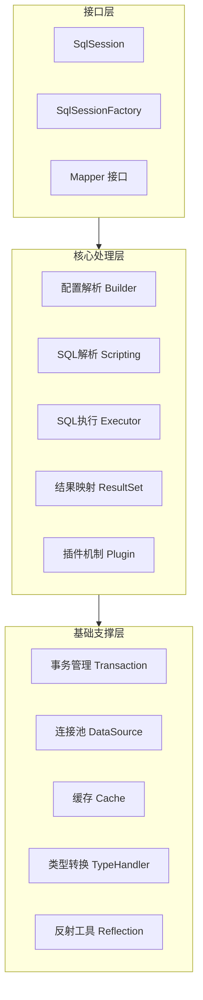
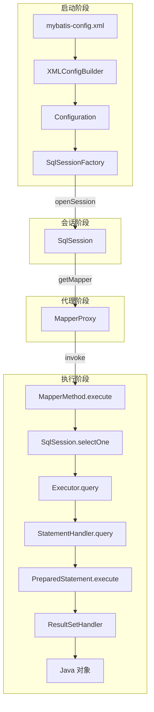
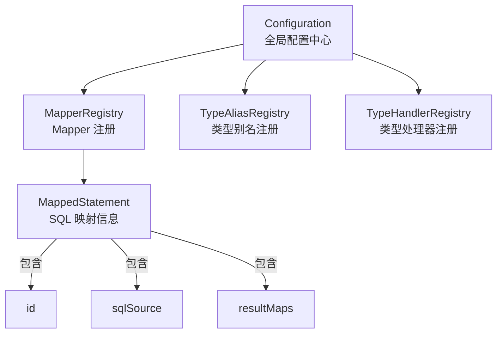
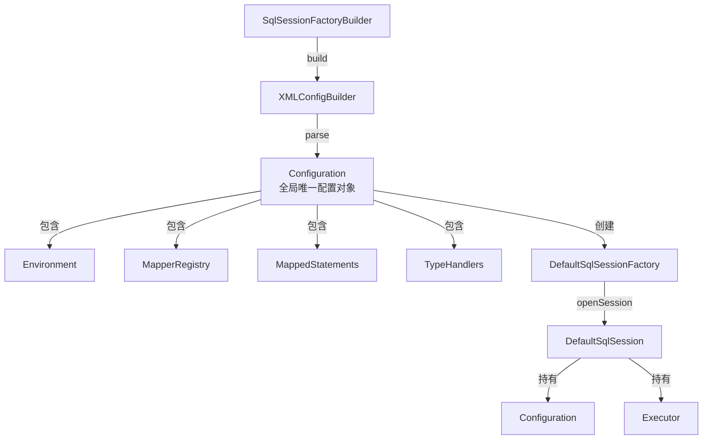
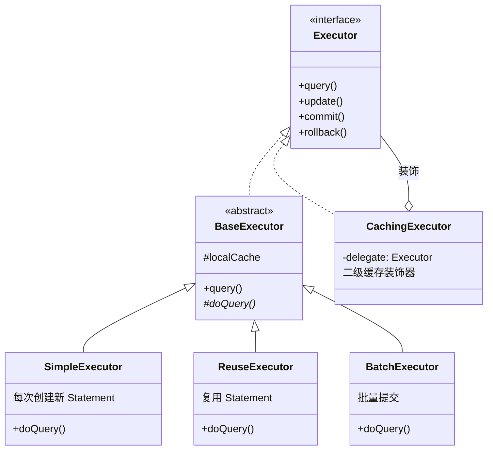

# MyBatis 全局架构概览

> 📊 **难度**：🔴 高级 | ⏱️ **阅读时间**：25 分钟
>
> 📝 **本章摘要**：从宏观层面认识 MyBatis 的整体架构，了解核心模块的职责和协作关系，建立对 MyBatis 源码的全局认知。

## 🎯 学习目标

学完本章后，你将能够：

- 理解 MyBatis 的整体架构设计
- 认识各核心模块及其职责
- 掌握从启动到执行 SQL 的完整流程
- 了解 MyBatis 采用的设计模式

---

## 第一层：宏观架构

### 1.1 整体架构图

MyBatis 的架构可以分为三层：**接口层**、**核心处理层**、**基础支撑层**。



**架构层次说明：**

| 层次 | 组件 | 职责 |
|------|------|------|
| **接口层** | SqlSession, SqlSessionFactory, Mapper | 对外提供 API |
| **核心处理层** | Builder, Scripting, Executor, ResultSet, Plugin | 核心业务逻辑 |
| **基础支撑层** | Transaction, DataSource, Cache, TypeHandler, Reflection | 基础设施支持 |

### 1.2 核心执行流程

从应用启动到执行 SQL，MyBatis 的核心流程如下：



**流程阶段说明：**

| 阶段 | 关键步骤 | 输出 |
|------|---------|------|
| **启动阶段** | 解析 XML 配置 | SqlSessionFactory |
| **会话阶段** | 创建会话 | SqlSession |
| **代理阶段** | 创建 Mapper 代理 | MapperProxy |
| **执行阶段** | 执行 SQL 并映射结果 | Java 对象 |

---

## 第二层：模块职责

### 2.1 核心模块一览

| 包名 | 模块 | 核心类 | 职责 |
|------|------|--------|------|
| `session` | 会话模块 | SqlSessionFactory, SqlSession | 对外提供 API，管理会话生命周期 |
| `binding` | 绑定模块 | MapperProxy, MapperMethod | Mapper 接口的动态代理 |
| `builder` | 构建模块 | XMLConfigBuilder, XMLMapperBuilder | 解析 XML 配置文件 |
| `mapping` | 映射模块 | MappedStatement, BoundSql | 存储 SQL 映射信息 |
| `executor` | 执行模块 | Executor, StatementHandler | 执行 SQL 语句 |
| `scripting` | 脚本模块 | SqlSource, SqlNode | 动态 SQL 解析 |
| `type` | 类型模块 | TypeHandler | Java 类型与 JDBC 类型转换 |
| `cache` | 缓存模块 | Cache | 一级/二级缓存 |
| `transaction` | 事务模块 | Transaction | 事务管理 |
| `datasource` | 数据源模块 | DataSource | 数据库连接池 |
| `plugin` | 插件模块 | Interceptor | 插件拦截机制 |
| `reflection` | 反射模块 | MetaObject, Reflector | 反射工具封装 |

### 2.2 模块协作关系



### 2.3 关键接口定义

#### SqlSessionFactory

```java
public interface SqlSessionFactory {
    SqlSession openSession();
    SqlSession openSession(boolean autoCommit);
    SqlSession openSession(ExecutorType execType);
    Configuration getConfiguration();
}
```

#### SqlSession

```java
public interface SqlSession {
    <T> T selectOne(String statement, Object parameter);
    <E> List<E> selectList(String statement, Object parameter);
    int insert(String statement, Object parameter);
    int update(String statement, Object parameter);
    int delete(String statement, Object parameter);
    <T> T getMapper(Class<T> type);
    void commit();
    void rollback();
    void close();
}
```

#### Executor

```java
public interface Executor {
    <E> List<E> query(MappedStatement ms, Object parameter, 
                      RowBounds rowBounds, ResultHandler resultHandler);
    int update(MappedStatement ms, Object parameter);
    void commit(boolean required);
    void rollback(boolean required);
    void close(boolean forceRollback);
}
```

---

## 第三层：源码深入

### 3.1 核心类关系图



### 3.2 Executor 继承体系



### 3.3 设计模式应用

MyBatis 源码中大量使用了经典设计模式：

| 设计模式 | 应用场景 | 核心类 |
|---------|---------|--------|
| **工厂模式** | 创建 SqlSession | SqlSessionFactory |
| **建造者模式** | 构建 Configuration | XMLConfigBuilder |
| **代理模式** | Mapper 接口代理 | MapperProxy |
| **模板方法** | Executor 执行流程 | BaseExecutor |
| **装饰器模式** | 二级缓存 | CachingExecutor |
| **策略模式** | 不同 Executor 实现 | SimpleExecutor/ReuseExecutor |
| **组合模式** | 动态 SQL 节点 | SqlNode |

### 3.4 Configuration 核心属性

```java
public class Configuration {
    // 环境配置（数据源、事务管理器）
    protected Environment environment;
    
    // Mapper 注册表
    protected final MapperRegistry mapperRegistry;
    
    // SQL 语句映射
    protected final Map<String, MappedStatement> mappedStatements;
    
    // 类型别名注册表
    protected final TypeAliasRegistry typeAliasRegistry;
    
    // 类型处理器注册表
    protected final TypeHandlerRegistry typeHandlerRegistry;
    
    // 拦截器链
    protected final InterceptorChain interceptorChain;
    
    // 对象工厂
    protected ObjectFactory objectFactory;
    
    // 反射工厂
    protected ReflectorFactory reflectorFactory;
    
    // ... 更多配置属性
}
```

---

## 总结

### 核心要点

1. **三层架构**：接口层、核心处理层、基础支撑层，职责分明
2. **Configuration**：全局配置中心，贯穿整个 MyBatis 生命周期
3. **执行流程**：配置解析 → 会话创建 → Mapper 代理 → SQL 执行 → 结果映射
4. **设计模式**：工厂、建造者、代理、模板方法、装饰器等模式的综合应用

### 下一步

接下来我们将深入**配置解析与启动**阶段，了解 MyBatis 是如何将 XML 配置转换为 Configuration 对象的。

---

| ⬅️ 上一章 | 🏠 目录 | 下一章 ➡️ |
|:----------|:------:|----------:|
| - | [返回目录](../../) | [配置解析与启动](../02-配置解析与启动/01-配置解析与启动.md) |
