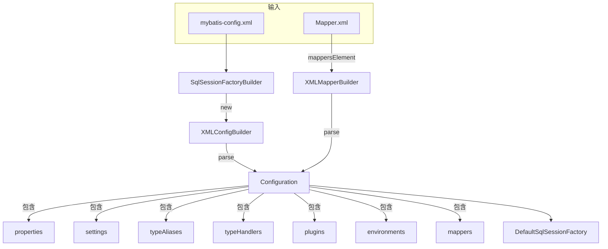
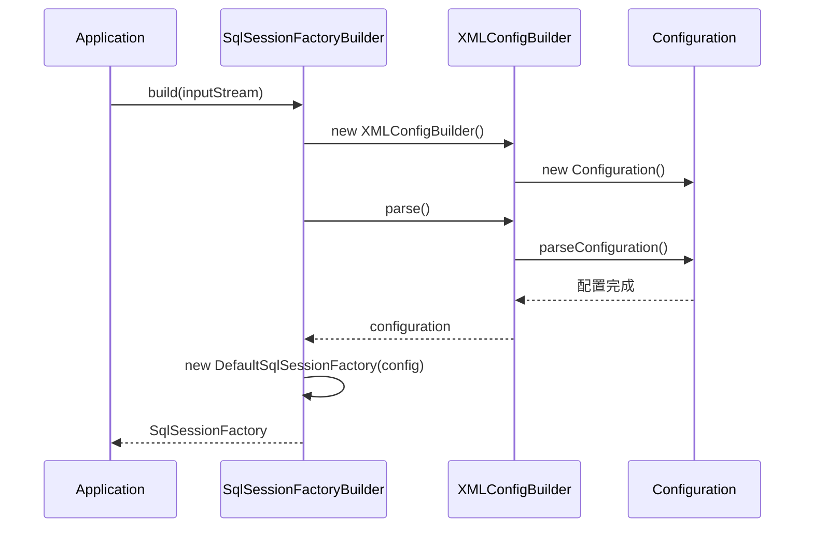

# 配置解析与启动流程

> 📊 **难度**：🔴 高级 | ⏱️ **阅读时间**：40 分钟
>
> 📝 **本章摘要**：深入分析 MyBatis 的启动流程，从 XML 配置文件解析到 Configuration 对象构建，再到 SqlSessionFactory 的创建。

## 🎯 学习目标

学完本章后，你将能够：

- 理解 MyBatis 启动时配置文件的解析顺序
- 掌握 XMLConfigBuilder 的核心解析逻辑
- 理解 Configuration 对象的构建过程
- 了解 Environment、TypeHandler 等组件的注册机制

---

## 第一层：宏观架构

### 1.1 启动流程全景图



**流程说明：**

| 步骤 | 组件 | 作用 |
|:----:|------|------|
| 1 | SqlSessionFactoryBuilder | 启动入口 |
| 2 | XMLConfigBuilder | 解析主配置文件 |
| 3 | XMLMapperBuilder | 解析 Mapper 文件 |
| 4 | Configuration | 汇总所有配置 |
| 5 | DefaultSqlSessionFactory | 最终产物 |

### 1.2 配置解析顺序

XMLConfigBuilder 按照特定顺序解析配置元素：

| 顺序 | 方法 | 解析内容 | 说明 |
|:----:|------|---------|------|
| 1 | `propertiesElement()` | properties | 属性配置（最先解析，供后续使用） |
| 2 | `settingsAsProperties()` | settings | 设置项 |
| 3 | `typeAliasesElement()` | typeAliases | 类型别名 |
| 4 | `pluginsElement()` | plugins | 插件 |
| 5 | `objectFactoryElement()` | objectFactory | 对象工厂 |
| 6 | `reflectorFactoryElement()` | reflectorFactory | 反射工厂 |
| 7 | `settingsElement()` | - | 应用设置到 Configuration |
| 8 | `environmentsElement()` | environments | 环境配置 |
| 9 | `databaseIdProviderElement()` | databaseIdProvider | 数据库厂商标识 |
| 10 | `typeHandlersElement()` | typeHandlers | 类型处理器 |
| 11 | `mappersElement()` | mappers | Mapper 映射（最后解析） |

---

## 第二层：模块职责

### 2.1 核心类职责

| 类名 | 职责 | 输入 | 输出 |
|------|------|------|------|
| `SqlSessionFactoryBuilder` | 启动入口，构建工厂 | InputStream/Reader | SqlSessionFactory |
| `XMLConfigBuilder` | 解析主配置文件 | XML 配置流 | Configuration |
| `XMLMapperBuilder` | 解析 Mapper 文件 | Mapper XML | MappedStatement |
| `Configuration` | 存储所有配置 | - | - |

### 2.2 时序图



### 2.3 关键配置项

#### mybatis-config.xml 示例

```xml
<?xml version="1.0" encoding="UTF-8" ?>
<!DOCTYPE configuration PUBLIC "-//mybatis.org//DTD Config 3.0//EN"
  "http://mybatis.org/dtd/mybatis-3-config.dtd">
<configuration>
    <!-- 1. 属性配置 -->
    <properties resource="db.properties"/>
    
    <!-- 2. 设置项 -->
    <settings>
        <setting name="cacheEnabled" value="true"/>
        <setting name="lazyLoadingEnabled" value="false"/>
        <setting name="mapUnderscoreToCamelCase" value="true"/>
    </settings>
    
    <!-- 3. 类型别名 -->
    <typeAliases>
        <package name="com.example.domain"/>
    </typeAliases>
    
    <!-- 4. 插件 -->
    <plugins>
        <plugin interceptor="com.example.plugin.MyPlugin"/>
    </plugins>
    
    <!-- 5. 环境配置 -->
    <environments default="development">
        <environment id="development">
            <transactionManager type="JDBC"/>
            <dataSource type="POOLED">
                <property name="driver" value="${db.driver}"/>
                <property name="url" value="${db.url}"/>
                <property name="username" value="${db.username}"/>
                <property name="password" value="${db.password}"/>
            </dataSource>
        </environment>
    </environments>
    
    <!-- 6. Mapper 映射 -->
    <mappers>
        <mapper resource="mapper/UserMapper.xml"/>
        <package name="com.example.mapper"/>
    </mappers>
</configuration>
```

---

## 第三层：源码深入

### 3.1 SqlSessionFactoryBuilder

入口类，提供多种构建方式：

```java
public class SqlSessionFactoryBuilder {

    // 核心构建方法
    public SqlSessionFactory build(InputStream inputStream, 
                                   String environment, 
                                   Properties properties) {
        try {
            // 1. 创建 XMLConfigBuilder
            XMLConfigBuilder parser = new XMLConfigBuilder(
                inputStream, environment, properties);
            
            // 2. 解析配置，构建 SqlSessionFactory
            return build(parser.parse());
        } catch (Exception e) {
            throw ExceptionFactory.wrapException("Error building SqlSession.", e);
        } finally {
            // 3. 关闭输入流
            try { if (inputStream != null) inputStream.close(); } 
            catch (IOException e) { /* ignore */ }
        }
    }

    // 用 Configuration 构建 SqlSessionFactory
    public SqlSessionFactory build(Configuration config) {
        return new DefaultSqlSessionFactory(config);
    }
}
```

### 3.2 XMLConfigBuilder.parse()

解析入口，只能调用一次：

```java
public class XMLConfigBuilder extends BaseBuilder {

    private boolean parsed;
    private final XPathParser parser;
    private String environment;

    public Configuration parse() {
        // 防止重复解析
        if (parsed) {
            throw new BuilderException(
                "Each XMLConfigBuilder can only be used once.");
        }
        parsed = true;
        
        // 解析 <configuration> 根节点
        parseConfiguration(parser.evalNode("/configuration"));
        return configuration;
    }
}
```

### 3.3 parseConfiguration() 核心方法

```java
private void parseConfiguration(XNode root) {
    try {
        // 1. 解析 <properties>，供后续变量替换使用
        propertiesElement(root.evalNode("properties"));
        
        // 2. 解析 <settings>，获取设置属性
        Properties settings = settingsAsProperties(root.evalNode("settings"));
        loadCustomVfsImpl(settings);
        loadCustomLogImpl(settings);
        
        // 3. 解析 <typeAliases>
        typeAliasesElement(root.evalNode("typeAliases"));
        
        // 4. 解析 <plugins>
        pluginsElement(root.evalNode("plugins"));
        
        // 5. 解析 <objectFactory>
        objectFactoryElement(root.evalNode("objectFactory"));
        
        // 6. 解析 <objectWrapperFactory>
        objectWrapperFactoryElement(root.evalNode("objectWrapperFactory"));
        
        // 7. 解析 <reflectorFactory>
        reflectorFactoryElement(root.evalNode("reflectorFactory"));
        
        // 8. 应用 settings 到 configuration
        settingsElement(settings);
        
        // 9. 解析 <environments>（在 objectFactory 之后）
        environmentsElement(root.evalNode("environments"));
        
        // 10. 解析 <databaseIdProvider>
        databaseIdProviderElement(root.evalNode("databaseIdProvider"));
        
        // 11. 解析 <typeHandlers>
        typeHandlersElement(root.evalNode("typeHandlers"));
        
        // 12. 解析 <mappers>（最后解析）
        mappersElement(root.evalNode("mappers"));
        
    } catch (Exception e) {
        throw new BuilderException(
            "Error parsing SQL Mapper Configuration. Cause: " + e, e);
    }
}
```

### 3.4 environmentsElement() 环境解析

```java
private void environmentsElement(XNode context) throws Exception {
    if (context == null) return;
    
    // 获取默认环境 ID
    if (environment == null) {
        environment = context.getStringAttribute("default");
    }
    
    // 遍历所有 <environment>
    for (XNode child : context.getChildren()) {
        String id = child.getStringAttribute("id");
        
        // 只解析指定的环境
        if (isSpecifiedEnvironment(id)) {
            // 解析事务管理器
            TransactionFactory txFactory = 
                transactionManagerElement(child.evalNode("transactionManager"));
            
            // 解析数据源
            DataSourceFactory dsFactory = 
                dataSourceElement(child.evalNode("dataSource"));
            DataSource dataSource = dsFactory.getDataSource();
            
            // 构建 Environment 对象
            Environment.Builder environmentBuilder = 
                new Environment.Builder(id)
                    .transactionFactory(txFactory)
                    .dataSource(dataSource);
            
            configuration.setEnvironment(environmentBuilder.build());
            break; // 只处理一个环境
        }
    }
}
```

### 3.5 mappersElement() Mapper 解析

```java
private void mappersElement(XNode context) throws Exception {
    if (context == null) return;
    
    for (XNode child : context.getChildren()) {
        if ("package".equals(child.getName())) {
            // 方式1：包扫描
            String mapperPackage = child.getStringAttribute("name");
            configuration.addMappers(mapperPackage);
            
        } else {
            String resource = child.getStringAttribute("resource");
            String url = child.getStringAttribute("url");
            String mapperClass = child.getStringAttribute("class");
            
            if (resource != null && url == null && mapperClass == null) {
                // 方式2：通过 resource 加载
                ErrorContext.instance().resource(resource);
                try (InputStream inputStream = 
                         Resources.getResourceAsStream(resource)) {
                    XMLMapperBuilder mapperParser = new XMLMapperBuilder(
                        inputStream, configuration, resource, 
                        configuration.getSqlFragments());
                    mapperParser.parse();
                }
                
            } else if (resource == null && url != null && mapperClass == null) {
                // 方式3：通过 URL 加载
                ErrorContext.instance().resource(url);
                try (InputStream inputStream = 
                         Resources.getUrlAsStream(url)) {
                    XMLMapperBuilder mapperParser = new XMLMapperBuilder(
                        inputStream, configuration, url, 
                        configuration.getSqlFragments());
                    mapperParser.parse();
                }
                
            } else if (resource == null && url == null && mapperClass != null) {
                // 方式4：通过 class 注册
                Class<?> mapperInterface = Resources.classForName(mapperClass);
                configuration.addMapper(mapperInterface);
                
            } else {
                throw new BuilderException(
                    "A mapper element may only specify a url, resource or class, " +
                    "but not more than one.");
            }
        }
    }
}
```

### 3.6 Configuration 核心结构

```java
public class Configuration {
    
    // ============ 环境相关 ============
    protected Environment environment;
    
    // ============ 注册表 ============
    protected final MapperRegistry mapperRegistry = new MapperRegistry(this);
    protected final TypeAliasRegistry typeAliasRegistry = new TypeAliasRegistry();
    protected final TypeHandlerRegistry typeHandlerRegistry = new TypeHandlerRegistry(this);
    protected final LanguageDriverRegistry languageRegistry = new LanguageDriverRegistry();
    
    // ============ SQL 映射 ============
    protected final Map<String, MappedStatement> mappedStatements = 
        new StrictMap<>("Mapped Statements");
    protected final Map<String, Cache> caches = 
        new StrictMap<>("Caches");
    protected final Map<String, ResultMap> resultMaps = 
        new StrictMap<>("Result Maps");
    protected final Map<String, ParameterMap> parameterMaps = 
        new StrictMap<>("Parameter Maps");
    protected final Map<String, KeyGenerator> keyGenerators = 
        new StrictMap<>("Key Generators");
    protected final Map<String, XNode> sqlFragments = 
        new StrictMap<>("XML fragments");
    
    // ============ 插件 ============
    protected final InterceptorChain interceptorChain = new InterceptorChain();
    
    // ============ 工厂 ============
    protected ObjectFactory objectFactory = new DefaultObjectFactory();
    protected ObjectWrapperFactory objectWrapperFactory = 
        new DefaultObjectWrapperFactory();
    protected ReflectorFactory reflectorFactory = new DefaultReflectorFactory();
    
    // ============ 设置项 ============
    protected boolean cacheEnabled = true;
    protected boolean lazyLoadingEnabled = false;
    protected boolean useGeneratedKeys = false;
    protected boolean mapUnderscoreToCamelCase = false;
    protected ExecutorType defaultExecutorType = ExecutorType.SIMPLE;
    protected Integer defaultStatementTimeout;
    // ... 更多设置项
}
```

---

## 总结

### 核心要点

1. **解析顺序**：properties 最先解析，mappers 最后解析，保证依赖关系
2. **单次解析**：XMLConfigBuilder 只能调用一次 `parse()`
3. **Configuration 中心化**：所有配置最终汇聚到 Configuration 对象
4. **多种 Mapper 加载方式**：支持 package、resource、url、class 四种方式

### 启动流程精简版

```
SqlSessionFactoryBuilder.build()
    └── new XMLConfigBuilder().parse()
            └── parseConfiguration()
                    ├── properties
                    ├── settings
                    ├── typeAliases
                    ├── plugins
                    ├── environments
                    ├── typeHandlers
                    └── mappers
    └── new DefaultSqlSessionFactory(configuration)
```

### 下一步

接下来我们将深入 **Mapper 代理机制**，了解 MyBatis 是如何通过动态代理实现接口与 SQL 映射的绑定的。

---

| ⬅️ 上一章 | 🏠 目录 | 下一章 ➡️ |
|:----------|:------:|----------:|
| [全局架构概览](../01-全局架构概览/01-MyBatis全局架构.md) | [返回目录](../../) | [Mapper 代理机制](../03-Mapper代理机制/01-Mapper代理机制.md) |

