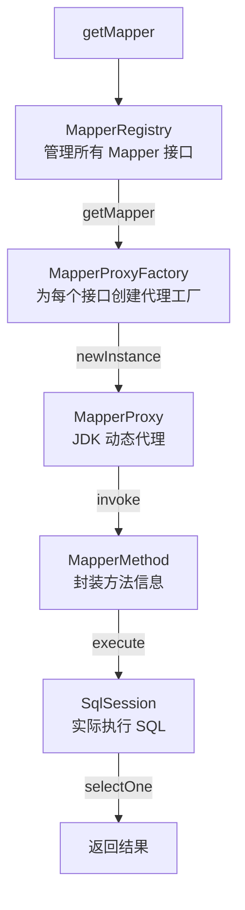
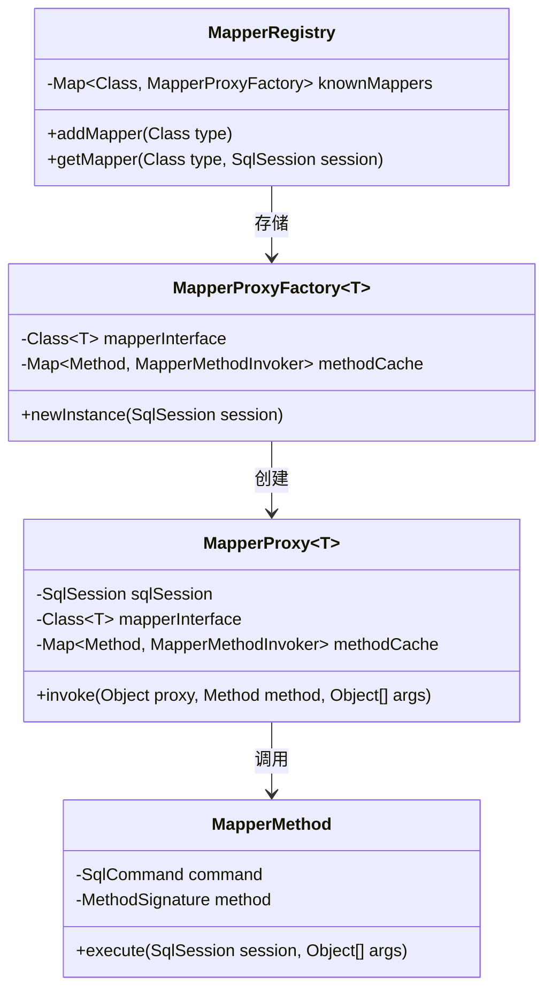
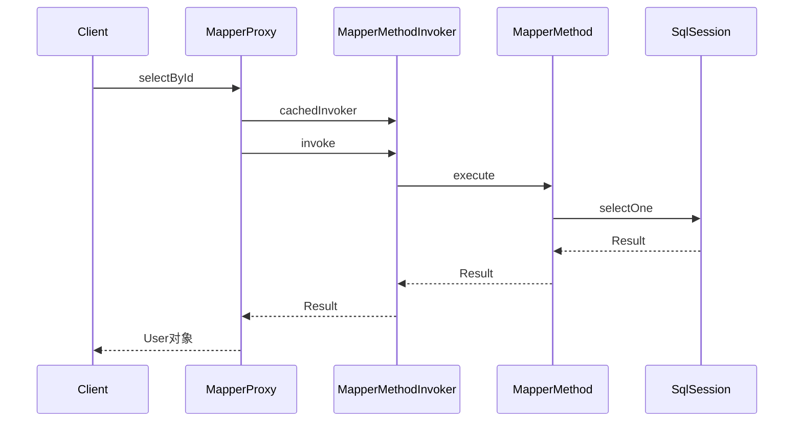

# Mapper 代理机制

> 📊 **难度**：🔴 高级 | ⏱️ **阅读时间**：35 分钟
>
> 📝 **本章摘要**：深入分析 MyBatis 的 Mapper 代理机制，了解接口方法调用是如何通过 JDK 动态代理转换为 SQL 执行的。

## 🎯 学习目标

学完本章后，你将能够：

- 理解 MyBatis 中 JDK 动态代理的应用
- 掌握 MapperRegistry、MapperProxyFactory、MapperProxy 的协作关系
- 深入理解 MapperMethod 的执行逻辑
- 了解接口方法参数的解析过程

---

## 第一层：宏观架构

### 1.1 代理机制全景图

当我们调用 `mapper.selectById(1)` 时，背后发生了什么？

```java
UserMapper mapper = sqlSession.getMapper(UserMapper.class);
User user = mapper.selectById(1);
```



**组件职责：**

| 组件 | 职责 |
|------|------|
| MapperRegistry | 管理所有 Mapper 接口 |
| MapperProxyFactory | 为每个 Mapper 接口创建代理工厂 |
| MapperProxy | JDK 动态代理，实现 InvocationHandler |
| MapperMethod | 封装方法信息，执行 SQL |
| SqlSession | 实际执行 SQL |

### 1.2 核心流程

| 步骤 | 调用 | 说明 |
|:----:|------|------|
| 1 | `sqlSession.getMapper(UserMapper.class)` | 获取 Mapper |
| 2 | `MapperRegistry.getMapper()` | 查找代理工厂 |
| 3 | `MapperProxyFactory.newInstance(sqlSession)` | 创建代理实例 |
| 4 | `Proxy.newProxyInstance(...)` | JDK 动态代理 |
| 5 | 返回代理对象 | 实现了 UserMapper 接口 |

---

## 第二层：模块职责

### 2.1 核心类职责

| 类名 | 职责 | 关键方法 |
|------|------|---------|
| `MapperRegistry` | Mapper 接口注册中心 | `addMapper()`, `getMapper()` |
| `MapperProxyFactory` | 代理工厂，创建代理实例 | `newInstance()` |
| `MapperProxy` | 代理执行器，实现 InvocationHandler | `invoke()` |
| `MapperMethod` | 方法执行器，封装 SQL 执行 | `execute()` |
| `MapperMethodInvoker` | 方法调用器接口 | `invoke()` |

### 2.2 类关系图



**核心属性说明：**

| 类 | 关键属性 | 说明 |
|---|---------|------|
| MapperRegistry | knownMappers | 存储 Mapper 接口与代理工厂的映射 |
| MapperProxyFactory | methodCache | 方法调用器缓存 |
| MapperProxy | sqlSession | 持有 SqlSession 引用 |
| MapperMethod | SqlCommand, MethodSignature | SQL 命令信息和方法签名 |

### 2.3 方法调用时序图



---

## 第三层：源码深入

### 3.1 MapperRegistry - Mapper 注册中心

```java
public class MapperRegistry {

    private final Configuration config;
    
    // 存储所有已注册的 Mapper 接口及其代理工厂
    private final Map<Class<?>, MapperProxyFactory<?>> knownMappers = new HashMap<>();

    // 注册 Mapper 接口
    public <T> void addMapper(Class<T> type) {
        if (type.isInterface()) {  // 必须是接口
            if (hasMapper(type)) {
                throw new BindingException("Type " + type + " is already known.");
            }
            boolean loadCompleted = false;
            try {
                // 创建代理工厂并存储
                knownMappers.put(type, new MapperProxyFactory<>(type));
                
                // 解析接口上的注解
                MapperAnnotationBuilder parser = 
                    new MapperAnnotationBuilder(config, type);
                parser.parse();
                loadCompleted = true;
            } finally {
                if (!loadCompleted) {
                    knownMappers.remove(type);
                }
            }
        }
    }

    // 获取 Mapper 代理对象
    @SuppressWarnings("unchecked")
    public <T> T getMapper(Class<T> type, SqlSession sqlSession) {
        // 获取代理工厂
        final MapperProxyFactory<T> mapperProxyFactory = 
            (MapperProxyFactory<T>) knownMappers.get(type);
        
        if (mapperProxyFactory == null) {
            throw new BindingException("Type " + type + " is not known.");
        }
        
        try {
            // 创建代理实例
            return mapperProxyFactory.newInstance(sqlSession);
        } catch (Exception e) {
            throw new BindingException("Error getting mapper instance.", e);
        }
    }
}
```

### 3.2 MapperProxyFactory - 代理工厂

```java
public class MapperProxyFactory<T> {

    private final Class<T> mapperInterface;
    
    // 方法缓存，避免重复创建 MapperMethodInvoker
    private final Map<Method, MapperMethodInvoker> methodCache = 
        new ConcurrentHashMap<>();

    public MapperProxyFactory(Class<T> mapperInterface) {
        this.mapperInterface = mapperInterface;
    }

    // 创建代理实例（核心方法）
    @SuppressWarnings("unchecked")
    protected T newInstance(MapperProxy<T> mapperProxy) {
        // 使用 JDK 动态代理创建代理对象
        return (T) Proxy.newProxyInstance(
            mapperInterface.getClassLoader(),   // 类加载器
            new Class[] { mapperInterface },     // 代理接口
            mapperProxy                          // 调用处理器
        );
    }

    public T newInstance(SqlSession sqlSession) {
        // 创建 MapperProxy（InvocationHandler）
        final MapperProxy<T> mapperProxy = new MapperProxy<>(
            sqlSession, 
            mapperInterface, 
            methodCache
        );
        return newInstance(mapperProxy);
    }
}
```

### 3.3 MapperProxy - 代理执行器

```java
public class MapperProxy<T> implements InvocationHandler, Serializable {

    private final SqlSession sqlSession;
    private final Class<T> mapperInterface;
    private final Map<Method, MapperMethodInvoker> methodCache;

    public MapperProxy(SqlSession sqlSession, Class<T> mapperInterface,
                       Map<Method, MapperMethodInvoker> methodCache) {
        this.sqlSession = sqlSession;
        this.mapperInterface = mapperInterface;
        this.methodCache = methodCache;
    }

    // 代理方法调用入口
    @Override
    public Object invoke(Object proxy, Method method, Object[] args) 
            throws Throwable {
        try {
            // Object 类方法直接调用（如 toString、hashCode）
            if (Object.class.equals(method.getDeclaringClass())) {
                return method.invoke(this, args);
            }
            // 其他方法通过缓存的 Invoker 执行
            return cachedInvoker(method).invoke(proxy, method, args, sqlSession);
        } catch (Throwable t) {
            throw ExceptionUtil.unwrapThrowable(t);
        }
    }

    // 获取或创建方法调用器（带缓存）
    private MapperMethodInvoker cachedInvoker(Method method) throws Throwable {
        try {
            return methodCache.computeIfAbsent(method, m -> {
                // 判断是否是 default 方法（Java 8+）
                if (!m.isDefault()) {
                    // 普通接口方法 → PlainMethodInvoker
                    return new PlainMethodInvoker(
                        new MapperMethod(mapperInterface, method, 
                                        sqlSession.getConfiguration())
                    );
                }
                // default 方法 → DefaultMethodInvoker
                try {
                    return new DefaultMethodInvoker(getMethodHandleJava9(method));
                } catch (Exception e) {
                    throw new RuntimeException(e);
                }
            });
        } catch (RuntimeException re) {
            Throwable cause = re.getCause();
            throw cause == null ? re : cause;
        }
    }

    // 普通方法调用器
    private static class PlainMethodInvoker implements MapperMethodInvoker {
        private final MapperMethod mapperMethod;

        public PlainMethodInvoker(MapperMethod mapperMethod) {
            this.mapperMethod = mapperMethod;
        }

        @Override
        public Object invoke(Object proxy, Method method, Object[] args, 
                            SqlSession sqlSession) throws Throwable {
            // 委托给 MapperMethod 执行
            return mapperMethod.execute(sqlSession, args);
        }
    }
}
```

### 3.4 MapperMethod - 方法执行器

```java
public class MapperMethod {

    private final SqlCommand command;      // SQL 命令信息
    private final MethodSignature method;  // 方法签名信息

    public MapperMethod(Class<?> mapperInterface, Method method, 
                        Configuration config) {
        this.command = new SqlCommand(config, mapperInterface, method);
        this.method = new MethodSignature(config, mapperInterface, method);
    }

    // 核心执行方法
    public Object execute(SqlSession sqlSession, Object[] args) {
        Object result;
        
        // 根据 SQL 类型分发执行
        switch (command.getType()) {
            case INSERT: {
                Object param = method.convertArgsToSqlCommandParam(args);
                result = rowCountResult(sqlSession.insert(command.getName(), param));
                break;
            }
            case UPDATE: {
                Object param = method.convertArgsToSqlCommandParam(args);
                result = rowCountResult(sqlSession.update(command.getName(), param));
                break;
            }
            case DELETE: {
                Object param = method.convertArgsToSqlCommandParam(args);
                result = rowCountResult(sqlSession.delete(command.getName(), param));
                break;
            }
            case SELECT:
                if (method.returnsVoid() && method.hasResultHandler()) {
                    // 返回 void，使用 ResultHandler
                    executeWithResultHandler(sqlSession, args);
                    result = null;
                } else if (method.returnsMany()) {
                    // 返回集合
                    result = executeForMany(sqlSession, args);
                } else if (method.returnsMap()) {
                    // 返回 Map
                    result = executeForMap(sqlSession, args);
                } else if (method.returnsCursor()) {
                    // 返回 Cursor
                    result = executeForCursor(sqlSession, args);
                } else {
                    // 返回单个对象
                    Object param = method.convertArgsToSqlCommandParam(args);
                    result = sqlSession.selectOne(command.getName(), param);
                    if (method.returnsOptional() && 
                        (result == null || !method.getReturnType().equals(result.getClass()))) {
                        result = Optional.ofNullable(result);
                    }
                }
                break;
            case FLUSH:
                result = sqlSession.flushStatements();
                break;
            default:
                throw new BindingException("Unknown execution method for: " + 
                                          command.getName());
        }
        
        // 空值检查
        if (result == null && method.getReturnType().isPrimitive() && 
            !method.returnsVoid()) {
            throw new BindingException("Mapper method '" + command.getName() +
                "' attempted to return null from a method with a primitive return type.");
        }
        return result;
    }

    // 查询多条记录
    private <E> Object executeForMany(SqlSession sqlSession, Object[] args) {
        List<E> result;
        Object param = method.convertArgsToSqlCommandParam(args);
        
        if (method.hasRowBounds()) {
            RowBounds rowBounds = method.extractRowBounds(args);
            result = sqlSession.selectList(command.getName(), param, rowBounds);
        } else {
            result = sqlSession.selectList(command.getName(), param);
        }
        
        // 转换结果类型
        if (!method.getReturnType().isAssignableFrom(result.getClass())) {
            if (method.getReturnType().isArray()) {
                return convertToArray(result);
            }
            return convertToDeclaredCollection(sqlSession.getConfiguration(), result);
        }
        return result;
    }
}
```

### 3.5 SqlCommand - SQL 命令信息

```java
public static class SqlCommand {
    
    private final String name;          // SQL ID（如 com.example.mapper.UserMapper.selectById）
    private final SqlCommandType type;  // SQL 类型（INSERT/UPDATE/DELETE/SELECT）

    public SqlCommand(Configuration configuration, Class<?> mapperInterface, 
                      Method method) {
        final String methodName = method.getName();
        final Class<?> declaringClass = method.getDeclaringClass();
        
        // 查找 MappedStatement
        MappedStatement ms = resolveMappedStatement(
            mapperInterface, methodName, declaringClass, configuration);
        
        if (ms == null) {
            if (method.getAnnotation(Flush.class) == null) {
                throw new BindingException(
                    "Invalid bound statement (not found): " + 
                    mapperInterface.getName() + "." + methodName);
            }
            name = null;
            type = SqlCommandType.FLUSH;
        } else {
            name = ms.getId();
            type = ms.getSqlCommandType();
        }
    }

    // 递归查找 MappedStatement
    private MappedStatement resolveMappedStatement(Class<?> mapperInterface, 
            String methodName, Class<?> declaringClass, Configuration configuration) {
        
        // 构建 statementId：接口全限定名.方法名
        String statementId = mapperInterface.getName() + "." + methodName;
        
        if (configuration.hasStatement(statementId)) {
            return configuration.getMappedStatement(statementId);
        }
        
        if (mapperInterface.equals(declaringClass)) {
            return null;
        }
        
        // 递归查找父接口
        for (Class<?> superInterface : mapperInterface.getInterfaces()) {
            if (declaringClass.isAssignableFrom(superInterface)) {
                MappedStatement ms = resolveMappedStatement(
                    superInterface, methodName, declaringClass, configuration);
                if (ms != null) {
                    return ms;
                }
            }
        }
        return null;
    }
}
```

### 3.6 MethodSignature - 方法签名解析

```java
public static class MethodSignature {

    private final boolean returnsMany;
    private final boolean returnsMap;
    private final boolean returnsVoid;
    private final boolean returnsCursor;
    private final boolean returnsOptional;
    private final Class<?> returnType;
    private final String mapKey;
    private final Integer resultHandlerIndex;
    private final Integer rowBoundsIndex;
    private final ParamNameResolver paramNameResolver;

    public MethodSignature(Configuration configuration, 
                          Class<?> mapperInterface, Method method) {
        // 解析返回类型
        Type resolvedReturnType = 
            TypeParameterResolver.resolveReturnType(method, mapperInterface);
        
        if (resolvedReturnType instanceof Class<?>) {
            this.returnType = (Class<?>) resolvedReturnType;
        } else if (resolvedReturnType instanceof ParameterizedType) {
            this.returnType = (Class<?>) 
                ((ParameterizedType) resolvedReturnType).getRawType();
        } else {
            this.returnType = method.getReturnType();
        }
        
        // 判断返回类型特征
        this.returnsVoid = void.class.equals(this.returnType);
        this.returnsMany = configuration.getObjectFactory()
            .isCollection(this.returnType) || this.returnType.isArray();
        this.returnsCursor = Cursor.class.equals(this.returnType);
        this.returnsOptional = Optional.class.equals(this.returnType);
        this.mapKey = getMapKey(method);
        this.returnsMap = this.mapKey != null;
        
        // 查找特殊参数位置
        this.rowBoundsIndex = getUniqueParamIndex(method, RowBounds.class);
        this.resultHandlerIndex = getUniqueParamIndex(method, ResultHandler.class);
        
        // 参数名解析器
        this.paramNameResolver = 
            new ParamNameResolver(configuration, method, mapperInterface);
    }

    // 将方法参数转换为 SQL 参数
    public Object convertArgsToSqlCommandParam(Object[] args) {
        return paramNameResolver.getNamedParams(args);
    }
}
```

---

## 总结

### 核心要点

1. **JDK 动态代理**：MapperProxy 实现 InvocationHandler，代理所有 Mapper 接口方法
2. **三级缓存结构**：
   - MapperRegistry 缓存 MapperProxyFactory
   - MapperProxyFactory 缓存 MapperMethodInvoker
   - MapperMethodInvoker 包装 MapperMethod
3. **方法分发**：MapperMethod.execute() 根据 SQL 类型分发到 SqlSession 的不同方法
4. **参数解析**：ParamNameResolver 处理 @Param 注解和参数名映射

### 代理调用链

```
mapper.selectById(1)
    └── MapperProxy.invoke()
            └── PlainMethodInvoker.invoke()
                    └── MapperMethod.execute()
                            └── SqlSession.selectOne()
```

### 下一步

接下来我们将深入 **SQL 执行流程**，了解 SqlSession 是如何将请求交给 Executor 执行的。

---

| ⬅️ 上一章 | 🏠 目录 | 下一章 ➡️ |
|:----------|:------:|----------:|
| [配置解析与启动](../02-配置解析与启动/01-配置解析与启动.md) | [返回目录](../../) | [SQL 执行流程](../04-SQL执行流程/01-SQL执行流程.md) |

