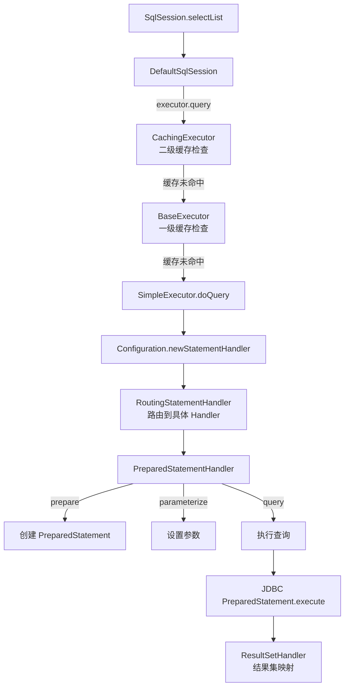
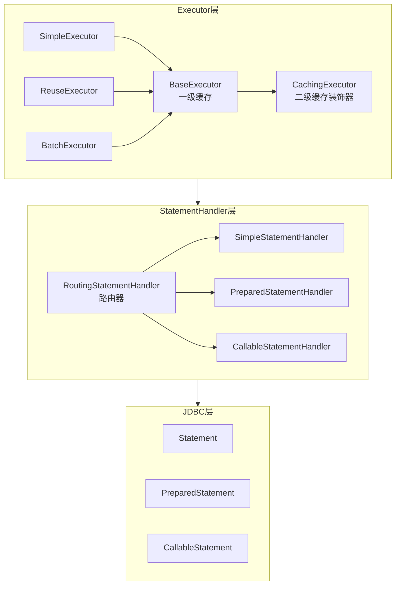

# SQL 执行流程

> 📊 **难度**：🔴 高级 | ⏱️ **阅读时间**：45 分钟
>
> 📝 **本章摘要**：深入分析 MyBatis 的 SQL 执行流程，从 SqlSession 到 Executor，再到 StatementHandler，最终执行 JDBC 操作的完整链路。

## 🎯 学习目标

学完本章后，你将能够：

- 理解 Executor 的三种实现及其适用场景
- 掌握 StatementHandler 的工作原理
- 了解参数处理和 SQL 预编译过程
- 理解一级缓存的实现机制

---

## 第一层：宏观架构

### 1.1 SQL 执行全景图



**执行流程说明：**

| 阶段 | 组件 | 操作 |
|------|------|------|
| 1 | DefaultSqlSession | 调用 executor.query() |
| 2 | CachingExecutor | 检查二级缓存 |
| 3 | BaseExecutor | 检查一级缓存 |
| 4 | SimpleExecutor | 执行 doQuery() |
| 5 | StatementHandler | prepare → parameterize → query |
| 6 | JDBC | PreparedStatement.execute() |
| 7 | ResultSetHandler | 结果集映射 |

### 1.2 核心组件协作



**层次说明：**

| 层 | 组件 | 说明 |
|---|------|------|
| **Executor 层** | Simple/Reuse/BatchExecutor | 继承 BaseExecutor，被 CachingExecutor 装饰 |
| **StatementHandler 层** | RoutingStatementHandler | 路由到具体的 StatementHandler |
| **JDBC 层** | Statement/PreparedStatement/CallableStatement | 底层 JDBC 操作 |

---

## 第二层：模块职责

### 2.1 Executor 三种实现

| 类型 | 类名 | 特点 | 适用场景 |
|------|------|------|---------|
| **简单** | `SimpleExecutor` | 每次执行创建新 Statement | 默认类型 |
| **复用** | `ReuseExecutor` | 复用 Statement | 重复 SQL 较多 |
| **批量** | `BatchExecutor` | 批量提交 | 批量插入/更新 |

### 2.2 StatementHandler 三种实现

| 类型 | 类名 | 对应 JDBC | 使用场景 |
|------|------|----------|---------|
| **简单** | `SimpleStatementHandler` | Statement | 无参数 SQL |
| **预编译** | `PreparedStatementHandler` | PreparedStatement | 带参数 SQL（默认） |
| **存储过程** | `CallableStatementHandler` | CallableStatement | 调用存储过程 |

### 2.3 四大核心对象

**MyBatis 四大对象：**

| 对象 | 职责 |
|------|------|
| **Executor** | 执行 SQL、管理缓存、管理事务 |
| **StatementHandler** | 处理 Statement、预编译 SQL |
| **ParameterHandler** | 设置参数、类型转换 |
| **ResultSetHandler** | 处理结果集、映射对象 |

---

## 第三层：源码深入

### 3.1 DefaultSqlSession.selectList()

```java
public class DefaultSqlSession implements SqlSession {

    private final Configuration configuration;
    private final Executor executor;

    @Override
    public <E> List<E> selectList(String statement, Object parameter, 
                                   RowBounds rowBounds) {
        try {
            // 1. 获取 MappedStatement
            MappedStatement ms = configuration.getMappedStatement(statement);
            
            // 2. 委托给 Executor 执行
            return executor.query(ms, 
                                  wrapCollection(parameter), 
                                  rowBounds, 
                                  Executor.NO_RESULT_HANDLER);
        } catch (Exception e) {
            throw ExceptionFactory.wrapException(
                "Error querying database. Cause: " + e, e);
        } finally {
            ErrorContext.instance().reset();
        }
    }
}
```

### 3.2 BaseExecutor.query() - 一级缓存

```java
public abstract class BaseExecutor implements Executor {

    // 一级缓存（本地缓存）
    protected PerpetualCache localCache;
    
    @Override
    public <E> List<E> query(MappedStatement ms, Object parameter, 
                             RowBounds rowBounds, ResultHandler resultHandler) 
            throws SQLException {
        
        // 1. 获取 BoundSql（包含 SQL 和参数映射）
        BoundSql boundSql = ms.getBoundSql(parameter);
        
        // 2. 创建缓存 Key
        CacheKey key = createCacheKey(ms, parameter, rowBounds, boundSql);
        
        // 3. 执行查询
        return query(ms, parameter, rowBounds, resultHandler, key, boundSql);
    }

    @Override
    public <E> List<E> query(MappedStatement ms, Object parameter, 
                             RowBounds rowBounds, ResultHandler resultHandler,
                             CacheKey key, BoundSql boundSql) throws SQLException {
        
        // 检查是否需要清空缓存
        if (queryStack == 0 && ms.isFlushCacheRequired()) {
            clearLocalCache();
        }
        
        List<E> list;
        try {
            queryStack++;
            
            // 1. 先查一级缓存
            list = resultHandler == null 
                ? (List<E>) localCache.getObject(key) 
                : null;
            
            if (list != null) {
                // 缓存命中，处理存储过程的输出参数
                handleLocallyCachedOutputParameters(ms, key, parameter, boundSql);
            } else {
                // 2. 缓存未命中，查数据库
                list = queryFromDatabase(ms, parameter, rowBounds, 
                                        resultHandler, key, boundSql);
            }
        } finally {
            queryStack--;
        }
        
        // 延迟加载处理
        if (queryStack == 0) {
            for (DeferredLoad deferredLoad : deferredLoads) {
                deferredLoad.load();
            }
            deferredLoads.clear();
            
            // 如果缓存作用域是 STATEMENT，清空缓存
            if (configuration.getLocalCacheScope() == LocalCacheScope.STATEMENT) {
                clearLocalCache();
            }
        }
        return list;
    }

    // 从数据库查询
    private <E> List<E> queryFromDatabase(MappedStatement ms, Object parameter,
                                          RowBounds rowBounds, ResultHandler resultHandler,
                                          CacheKey key, BoundSql boundSql) 
            throws SQLException {
        
        List<E> list;
        
        // 先占位，防止循环依赖
        localCache.putObject(key, EXECUTION_PLACEHOLDER);
        
        try {
            // 调用子类的 doQuery 方法
            list = doQuery(ms, parameter, rowBounds, resultHandler, boundSql);
        } finally {
            localCache.removeObject(key);
        }
        
        // 放入缓存
        localCache.putObject(key, list);
        
        return list;
    }

    // 由子类实现
    protected abstract <E> List<E> doQuery(MappedStatement ms, Object parameter,
                                           RowBounds rowBounds, ResultHandler resultHandler,
                                           BoundSql boundSql) throws SQLException;
}
```

### 3.3 SimpleExecutor.doQuery()

```java
public class SimpleExecutor extends BaseExecutor {

    @Override
    public <E> List<E> doQuery(MappedStatement ms, Object parameter,
                               RowBounds rowBounds, ResultHandler resultHandler,
                               BoundSql boundSql) throws SQLException {
        
        Statement stmt = null;
        try {
            Configuration configuration = ms.getConfiguration();
            
            // 1. 创建 StatementHandler
            StatementHandler handler = configuration.newStatementHandler(
                wrapper, ms, parameter, rowBounds, resultHandler, boundSql);
            
            // 2. 准备 Statement（获取连接、创建 Statement、设置参数）
            stmt = prepareStatement(handler, ms.getStatementLog());
            
            // 3. 执行查询
            return handler.query(stmt, resultHandler);
            
        } finally {
            closeStatement(stmt);
        }
    }

    // 准备 Statement
    private Statement prepareStatement(StatementHandler handler, Log statementLog) 
            throws SQLException {
        
        Statement stmt;
        
        // 1. 获取数据库连接
        Connection connection = getConnection(statementLog);
        
        // 2. 创建 Statement
        stmt = handler.prepare(connection, transaction.getTimeout());
        
        // 3. 设置参数
        handler.parameterize(stmt);
        
        return stmt;
    }
}
```

### 3.4 Configuration.newStatementHandler()

```java
public class Configuration {

    public StatementHandler newStatementHandler(Executor executor,
                                                MappedStatement mappedStatement,
                                                Object parameterObject,
                                                RowBounds rowBounds,
                                                ResultHandler resultHandler,
                                                BoundSql boundSql) {
        
        // 创建 RoutingStatementHandler（路由器）
        StatementHandler statementHandler = new RoutingStatementHandler(
            executor, mappedStatement, parameterObject, 
            rowBounds, resultHandler, boundSql);
        
        // 应用插件（拦截器链）
        return (StatementHandler) interceptorChain
            .pluginAll(statementHandler);
    }
}
```

### 3.5 RoutingStatementHandler - 路由器

```java
public class RoutingStatementHandler implements StatementHandler {

    private final StatementHandler delegate;

    public RoutingStatementHandler(Executor executor, 
                                   MappedStatement ms,
                                   Object parameter,
                                   RowBounds rowBounds,
                                   ResultHandler resultHandler,
                                   BoundSql boundSql) {
        
        // 根据 StatementType 选择具体的 Handler
        switch (ms.getStatementType()) {
            case STATEMENT:
                delegate = new SimpleStatementHandler(
                    executor, ms, parameter, rowBounds, resultHandler, boundSql);
                break;
            case PREPARED:
                delegate = new PreparedStatementHandler(
                    executor, ms, parameter, rowBounds, resultHandler, boundSql);
                break;
            case CALLABLE:
                delegate = new CallableStatementHandler(
                    executor, ms, parameter, rowBounds, resultHandler, boundSql);
                break;
            default:
                throw new ExecutorException("Unknown statement type: " + 
                                           ms.getStatementType());
        }
    }

    // 所有方法委托给具体 Handler
    @Override
    public Statement prepare(Connection connection, Integer transactionTimeout) 
            throws SQLException {
        return delegate.prepare(connection, transactionTimeout);
    }

    @Override
    public void parameterize(Statement statement) throws SQLException {
        delegate.parameterize(statement);
    }

    @Override
    public <E> List<E> query(Statement statement, ResultHandler resultHandler) 
            throws SQLException {
        return delegate.query(statement, resultHandler);
    }
}
```

### 3.6 PreparedStatementHandler - 核心执行器

```java
public class PreparedStatementHandler extends BaseStatementHandler {

    // 准备 Statement
    @Override
    protected Statement instantiateStatement(Connection connection) 
            throws SQLException {
        
        String sql = boundSql.getSql();
        
        // 处理自动生成主键
        if (mappedStatement.getKeyGenerator() instanceof Jdbc3KeyGenerator) {
            String[] keyColumnNames = mappedStatement.getKeyColumns();
            if (keyColumnNames == null) {
                return connection.prepareStatement(sql, 
                    Statement.RETURN_GENERATED_KEYS);
            } else {
                return connection.prepareStatement(sql, keyColumnNames);
            }
        }
        
        // 普通 PreparedStatement
        if (mappedStatement.getResultSetType() == ResultSetType.DEFAULT) {
            return connection.prepareStatement(sql);
        } else {
            return connection.prepareStatement(sql, 
                mappedStatement.getResultSetType().getValue(),
                ResultSet.CONCUR_READ_ONLY);
        }
    }

    // 设置参数
    @Override
    public void parameterize(Statement statement) throws SQLException {
        // 委托给 ParameterHandler
        parameterHandler.setParameters((PreparedStatement) statement);
    }

    // 执行查询
    @Override
    public <E> List<E> query(Statement statement, ResultHandler resultHandler) 
            throws SQLException {
        
        PreparedStatement ps = (PreparedStatement) statement;
        
        // 执行 SQL
        ps.execute();
        
        // 处理结果集
        return resultSetHandler.handleResultSets(ps);
    }

    // 执行更新
    @Override
    public int update(Statement statement) throws SQLException {
        PreparedStatement ps = (PreparedStatement) statement;
        
        // 执行 SQL
        ps.execute();
        
        // 获取影响行数
        int rows = ps.getUpdateCount();
        
        // 处理自动生成主键
        Object parameterObject = boundSql.getParameterObject();
        KeyGenerator keyGenerator = mappedStatement.getKeyGenerator();
        keyGenerator.processAfter(executor, mappedStatement, ps, parameterObject);
        
        return rows;
    }
}
```

### 3.7 DefaultParameterHandler - 参数处理

```java
public class DefaultParameterHandler implements ParameterHandler {

    private final TypeHandlerRegistry typeHandlerRegistry;
    private final MappedStatement mappedStatement;
    private final Object parameterObject;
    private final BoundSql boundSql;
    private final Configuration configuration;

    @Override
    public void setParameters(PreparedStatement ps) {
        
        // 获取参数映射列表
        List<ParameterMapping> parameterMappings = 
            boundSql.getParameterMappings();
        
        if (parameterMappings != null) {
            for (int i = 0; i < parameterMappings.size(); i++) {
                ParameterMapping parameterMapping = parameterMappings.get(i);
                
                // 只处理 IN 和 INOUT 参数
                if (parameterMapping.getMode() != ParameterMode.OUT) {
                    Object value;
                    String propertyName = parameterMapping.getProperty();
                    
                    // 获取参数值
                    if (boundSql.hasAdditionalParameter(propertyName)) {
                        value = boundSql.getAdditionalParameter(propertyName);
                    } else if (parameterObject == null) {
                        value = null;
                    } else if (typeHandlerRegistry.hasTypeHandler(
                               parameterObject.getClass())) {
                        value = parameterObject;
                    } else {
                        MetaObject metaObject = 
                            configuration.newMetaObject(parameterObject);
                        value = metaObject.getValue(propertyName);
                    }
                    
                    // 获取 TypeHandler
                    TypeHandler typeHandler = parameterMapping.getTypeHandler();
                    JdbcType jdbcType = parameterMapping.getJdbcType();
                    
                    if (value == null && jdbcType == null) {
                        jdbcType = configuration.getJdbcTypeForNull();
                    }
                    
                    try {
                        // 使用 TypeHandler 设置参数
                        typeHandler.setParameter(ps, i + 1, value, jdbcType);
                    } catch (TypeException | SQLException e) {
                        throw new TypeException(
                            "Could not set parameters for mapping: " + 
                            parameterMapping + ". Cause: " + e, e);
                    }
                }
            }
        }
    }
}
```

### 3.8 CacheKey - 缓存键生成

```java
public class BaseExecutor implements Executor {

    @Override
    public CacheKey createCacheKey(MappedStatement ms, Object parameterObject,
                                   RowBounds rowBounds, BoundSql boundSql) {
        
        CacheKey cacheKey = new CacheKey();
        
        // 1. MappedStatement ID
        cacheKey.update(ms.getId());
        
        // 2. 分页参数
        cacheKey.update(rowBounds.getOffset());
        cacheKey.update(rowBounds.getLimit());
        
        // 3. SQL 语句
        cacheKey.update(boundSql.getSql());
        
        // 4. 参数值
        List<ParameterMapping> parameterMappings = boundSql.getParameterMappings();
        TypeHandlerRegistry typeHandlerRegistry = 
            ms.getConfiguration().getTypeHandlerRegistry();
        
        for (ParameterMapping parameterMapping : parameterMappings) {
            if (parameterMapping.getMode() != ParameterMode.OUT) {
                Object value;
                String propertyName = parameterMapping.getProperty();
                
                if (boundSql.hasAdditionalParameter(propertyName)) {
                    value = boundSql.getAdditionalParameter(propertyName);
                } else if (parameterObject == null) {
                    value = null;
                } else if (typeHandlerRegistry.hasTypeHandler(
                           parameterObject.getClass())) {
                    value = parameterObject;
                } else {
                    MetaObject metaObject = 
                        configuration.newMetaObject(parameterObject);
                    value = metaObject.getValue(propertyName);
                }
                cacheKey.update(value);
            }
        }
        
        // 5. Environment ID
        if (configuration.getEnvironment() != null) {
            cacheKey.update(configuration.getEnvironment().getId());
        }
        
        return cacheKey;
    }
}
```

---

## 总结

### 核心要点

1. **Executor 职责**：管理缓存、协调 StatementHandler、事务管理
2. **一级缓存**：基于 SqlSession 的本地缓存，默认开启
3. **StatementHandler**：负责 Statement 的创建、参数设置、SQL 执行
4. **参数处理**：通过 ParameterHandler 和 TypeHandler 完成类型转换

### SQL 执行流程精简版

```
SqlSession.selectList()
    └── Executor.query()
            ├── 检查一级缓存
            └── doQuery()
                    └── StatementHandler
                            ├── prepare()      → 创建 PreparedStatement
                            ├── parameterize() → 设置参数
                            └── query()        → 执行 SQL
                                    └── ResultSetHandler.handleResultSets()
```

### 下一步

接下来我们将深入 **结果集映射**，了解 MyBatis 是如何将 ResultSet 转换为 Java 对象的。

---

| ⬅️ 上一章 | 🏠 目录 | 下一章 ➡️ |
|:----------|:------:|----------:|
| [Mapper 代理机制](../03-Mapper代理机制/01-Mapper代理机制.md) | [返回目录](../../) | [结果集映射](../05-结果集映射/01-结果集映射.md) |

