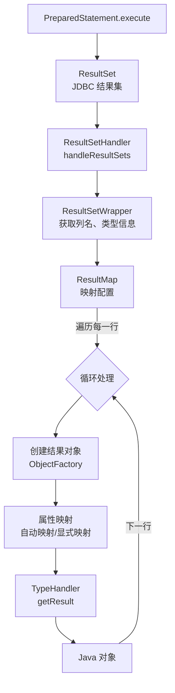
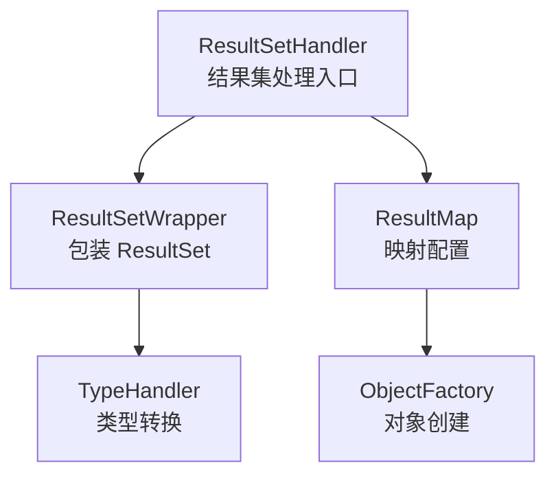
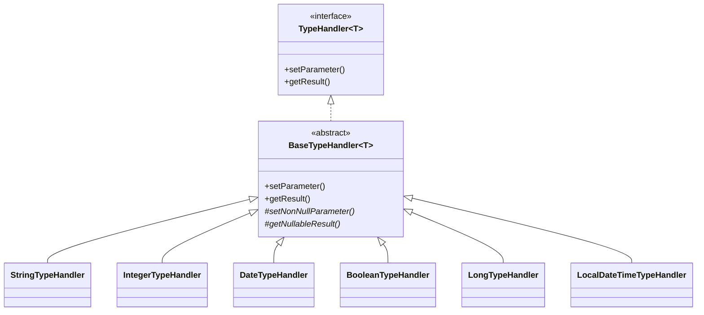

# 结果集映射

> 📊 **难度**：🔴 高级 | ⏱️ **阅读时间**：35 分钟
>
> 📝 **本章摘要**：深入分析 MyBatis 的结果集映射机制，了解如何将 JDBC ResultSet 转换为 Java 对象，掌握 TypeHandler 和自动映射的工作原理。

## 🎯 学习目标

学完本章后，你将能够：

- 理解 ResultSetHandler 的核心处理逻辑
- 掌握 TypeHandler 的类型转换机制
- 了解自动映射（AutoMapping）的实现原理
- 理解 ResultMap 的嵌套查询和嵌套结果映射

---

## 第一层：宏观架构

### 1.1 结果映射全景图



**处理流程说明：**

| 步骤 | 组件 | 操作 |
|:----:|------|------|
| 1 | ResultSet | JDBC 结果集 |
| 2 | ResultSetHandler | 处理结果集入口 |
| 3 | ResultSetWrapper | 获取列名、类型信息 |
| 4 | ResultMap | 读取映射配置 |
| 5 | ObjectFactory | 创建结果对象 |
| 6 | TypeHandler | 类型转换 |
| 7 | Java 对象 | 最终结果 |

### 1.2 核心组件



**组件职责：**

| 组件 | 职责 |
|------|------|
| **ResultSetHandler** | 结果集处理入口 |
| **ResultSetWrapper** | 包装 ResultSet，获取元数据 |
| **ResultMap** | 存储映射配置 |
| **TypeHandler** | 类型转换 |
| **ObjectFactory** | 创建结果对象 |

---

## 第二层：模块职责

### 2.1 核心类职责

| 类名 | 职责 | 关键方法 |
|------|------|---------|
| `ResultSetHandler` | 结果集处理接口 | `handleResultSets()` |
| `DefaultResultSetHandler` | 默认实现 | `handleRowValues()` |
| `ResultSetWrapper` | ResultSet 包装器 | `getColumnNames()`, `getJdbcType()` |
| `ResultMap` | 映射配置 | 存储列-属性映射关系 |
| `TypeHandler` | 类型转换 | `getResult()` |
| `ObjectFactory` | 对象工厂 | `create()` |

### 2.2 映射方式对比

| 映射方式 | 配置 | 特点 | 性能 |
|---------|------|------|------|
| **自动映射** | 无需配置 | 列名匹配属性名 | 较好 |
| **ResultMap** | XML 配置 | 精确控制映射 | 最好 |
| **嵌套查询** | association/collection | N+1 问题 | 较差 |
| **嵌套结果** | resultMap 嵌套 | 一次查询 | 好 |

### 2.3 TypeHandler 体系



**常用 TypeHandler：**

| TypeHandler | Java 类型 | JDBC 类型 |
|-------------|----------|----------|
| StringTypeHandler | String | VARCHAR |
| IntegerTypeHandler | Integer | INTEGER |
| LongTypeHandler | Long | BIGINT |
| DateTypeHandler | Date | TIMESTAMP |
| LocalDateTimeTypeHandler | LocalDateTime | TIMESTAMP |

---

## 第三层：源码深入

### 3.1 DefaultResultSetHandler.handleResultSets()

```java
public class DefaultResultSetHandler implements ResultSetHandler {

    @Override
    public List<Object> handleResultSets(Statement stmt) throws SQLException {
        
        final List<Object> multipleResults = new ArrayList<>();

        int resultSetCount = 0;
        
        // 获取第一个 ResultSet
        ResultSetWrapper rsw = getFirstResultSet(stmt);

        // 获取 ResultMap 列表
        List<ResultMap> resultMaps = mappedStatement.getResultMaps();
        int resultMapCount = resultMaps.size();
        
        validateResultMapsCount(rsw, resultMapCount);
        
        // 处理每个 ResultSet
        while (rsw != null && resultMapCount > resultSetCount) {
            ResultMap resultMap = resultMaps.get(resultSetCount);
            
            // 处理 ResultSet
            handleResultSet(rsw, resultMap, multipleResults, null);
            
            // 获取下一个 ResultSet
            rsw = getNextResultSet(stmt);
            cleanUpAfterHandlingResultSet();
            resultSetCount++;
        }

        // 处理多结果集的情况
        String[] resultSets = mappedStatement.getResultSets();
        if (resultSets != null) {
            while (rsw != null && resultSetCount < resultSets.length) {
                ResultMapping parentMapping = 
                    nextResultMaps.get(resultSets[resultSetCount]);
                if (parentMapping != null) {
                    String nestedResultMapId = parentMapping.getNestedResultMapId();
                    ResultMap resultMap = 
                        configuration.getResultMap(nestedResultMapId);
                    handleResultSet(rsw, resultMap, null, parentMapping);
                }
                rsw = getNextResultSet(stmt);
                cleanUpAfterHandlingResultSet();
                resultSetCount++;
            }
        }

        return collapseSingleResultList(multipleResults);
    }
}
```

### 3.2 handleRowValues() - 核心行处理

```java
public void handleRowValues(ResultSetWrapper rsw, ResultMap resultMap,
                           ResultHandler<?> resultHandler, 
                           RowBounds rowBounds,
                           ResultMapping parentMapping) throws SQLException {
    
    // 是否有嵌套结果映射
    if (resultMap.hasNestedResultMaps()) {
        ensureNoRowBounds();
        checkResultHandler();
        // 处理嵌套结果映射
        handleRowValuesForNestedResultMap(rsw, resultMap, resultHandler, 
                                         rowBounds, parentMapping);
    } else {
        // 处理简单结果映射
        handleRowValuesForSimpleResultMap(rsw, resultMap, resultHandler, 
                                         rowBounds, parentMapping);
    }
}

// 处理简单结果映射
private void handleRowValuesForSimpleResultMap(ResultSetWrapper rsw,
                                               ResultMap resultMap,
                                               ResultHandler<?> resultHandler,
                                               RowBounds rowBounds,
                                               ResultMapping parentMapping) 
        throws SQLException {
    
    DefaultResultContext<Object> resultContext = new DefaultResultContext<>();
    ResultSet resultSet = rsw.getResultSet();
    
    // 跳过分页偏移量
    skipRows(resultSet, rowBounds);
    
    // 遍历结果集
    while (shouldProcessMoreRows(resultContext, rowBounds) && 
           !resultSet.isClosed() && resultSet.next()) {
        
        // 解析鉴别器
        ResultMap discriminatedResultMap = 
            resolveDiscriminatedResultMap(resultSet, resultMap, null);
        
        // 获取一行数据并映射为对象
        Object rowValue = getRowValue(rsw, discriminatedResultMap, null);
        
        // 存储结果
        storeObject(resultHandler, resultContext, rowValue, 
                   parentMapping, resultSet);
    }
}
```

### 3.3 getRowValue() - 单行映射

```java
private Object getRowValue(ResultSetWrapper rsw, ResultMap resultMap,
                          String columnPrefix) throws SQLException {
    
    final ResultLoaderMap lazyLoader = new ResultLoaderMap();
    
    // 1. 创建结果对象
    Object rowValue = createResultObject(rsw, resultMap, lazyLoader, columnPrefix);
    
    if (rowValue != null && !hasTypeHandlerForResultObject(rsw, resultMap.getType())) {
        
        // 2. 创建 MetaObject 用于设置属性
        final MetaObject metaObject = configuration.newMetaObject(rowValue);
        
        boolean foundValues = this.useConstructorMappings;
        
        // 3. 自动映射
        if (shouldApplyAutomaticMappings(resultMap, false)) {
            foundValues = applyAutomaticMappings(rsw, resultMap, 
                                                 metaObject, columnPrefix) 
                          || foundValues;
        }
        
        // 4. 属性映射
        foundValues = applyPropertyMappings(rsw, resultMap, 
                                           metaObject, lazyLoader, columnPrefix)
                      || foundValues;
        
        foundValues = lazyLoader.size() > 0 || foundValues;
        
        rowValue = foundValues || configuration.isReturnInstanceForEmptyRow() 
            ? rowValue 
            : null;
    }
    return rowValue;
}
```

### 3.4 createResultObject() - 创建结果对象

```java
private Object createResultObject(ResultSetWrapper rsw, ResultMap resultMap,
                                  ResultLoaderMap lazyLoader, 
                                  String columnPrefix) throws SQLException {
    
    this.useConstructorMappings = false;
    final List<Class<?>> constructorArgTypes = new ArrayList<>();
    final List<Object> constructorArgs = new ArrayList<>();
    
    // 1. 创建结果对象
    Object resultObject = createResultObject(rsw, resultMap, constructorArgTypes,
                                            constructorArgs, columnPrefix);
    
    if (resultObject != null && !hasTypeHandlerForResultObject(rsw, resultMap.getType())) {
        
        // 2. 获取属性映射
        final List<ResultMapping> propertyMappings = resultMap.getPropertyResultMappings();
        
        for (ResultMapping propertyMapping : propertyMappings) {
            // 3. 检查是否需要延迟加载
            if (propertyMapping.getNestedQueryId() != null && 
                propertyMapping.isLazy()) {
                
                // 创建代理对象支持延迟加载
                resultObject = configuration.getProxyFactory()
                    .createProxy(resultObject, lazyLoader, configuration,
                                objectFactory, constructorArgTypes, constructorArgs);
                break;
            }
        }
    }
    
    this.useConstructorMappings = resultObject != null && 
                                   !constructorArgTypes.isEmpty();
    return resultObject;
}

// 使用构造器或对象工厂创建对象
private Object createResultObject(ResultSetWrapper rsw, ResultMap resultMap,
                                  List<Class<?>> constructorArgTypes,
                                  List<Object> constructorArgs,
                                  String columnPrefix) throws SQLException {
    
    final Class<?> resultType = resultMap.getType();
    final MetaClass metaType = MetaClass.forClass(resultType, reflectorFactory);
    final List<ResultMapping> constructorMappings = 
        resultMap.getConstructorResultMappings();

    // 情况1：有 TypeHandler，直接转换
    if (hasTypeHandlerForResultObject(rsw, resultType)) {
        return createPrimitiveResultObject(rsw, resultMap, columnPrefix);
    }
    
    // 情况2：有构造器映射
    if (!constructorMappings.isEmpty()) {
        return createParameterizedResultObject(rsw, resultType, constructorMappings,
                                              constructorArgTypes, constructorArgs, 
                                              columnPrefix);
    }
    
    // 情况3：有默认构造器或自动映射构造器
    if (resultType.isInterface() || metaType.hasDefaultConstructor()) {
        return objectFactory.create(resultType);
    }
    
    // 情况4：尝试自动映射构造器
    if (shouldApplyAutomaticMappings(resultMap, false)) {
        return createByConstructorSignature(rsw, resultMap, columnPrefix, resultType,
                                           constructorArgTypes, constructorArgs);
    }
    
    throw new ExecutorException("Do not know how to create an instance of " + resultType);
}
```

### 3.5 applyAutomaticMappings() - 自动映射

```java
private boolean applyAutomaticMappings(ResultSetWrapper rsw, ResultMap resultMap,
                                       MetaObject metaObject, 
                                       String columnPrefix) throws SQLException {
    
    // 获取未映射的列名
    List<UnMappedColumnAutoMapping> autoMapping = 
        createAutomaticMappings(rsw, resultMap, metaObject, columnPrefix);
    
    boolean foundValues = false;
    
    if (!autoMapping.isEmpty()) {
        for (UnMappedColumnAutoMapping mapping : autoMapping) {
            // 使用 TypeHandler 获取值
            final Object value = mapping.typeHandler.getResult(
                rsw.getResultSet(), mapping.column);
            
            if (value != null) {
                foundValues = true;
            }
            
            if (value != null || (configuration.isCallSettersOnNulls() && 
                                  !mapping.primitive)) {
                // 设置属性值
                metaObject.setValue(mapping.property, value);
            }
        }
    }
    return foundValues;
}

// 创建自动映射
private List<UnMappedColumnAutoMapping> createAutomaticMappings(
        ResultSetWrapper rsw, ResultMap resultMap,
        MetaObject metaObject, String columnPrefix) throws SQLException {
    
    final String mapKey = resultMap.getId() + ":" + columnPrefix;
    List<UnMappedColumnAutoMapping> autoMapping = autoMappingsCache.get(mapKey);
    
    if (autoMapping == null) {
        autoMapping = new ArrayList<>();
        
        // 获取所有未映射的列名
        final List<String> unmappedColumnNames = 
            rsw.getUnmappedColumnNames(resultMap, columnPrefix);
        
        for (String columnName : unmappedColumnNames) {
            // 列名转属性名
            String propertyName = columnName;
            if (columnPrefix != null && !columnPrefix.isEmpty()) {
                if (columnName.toUpperCase(Locale.ENGLISH)
                              .startsWith(columnPrefix)) {
                    propertyName = columnName.substring(columnPrefix.length());
                } else {
                    continue;
                }
            }
            
            // 驼峰转换
            final String property = metaObject.findProperty(propertyName,
                configuration.isMapUnderscoreToCamelCase());
            
            if (property != null && metaObject.hasSetter(property)) {
                if (resultMap.getMappedProperties().contains(property)) {
                    continue; // 已显式映射，跳过
                }
                
                // 获取属性类型
                final Class<?> propertyType = metaObject.getSetterType(property);
                
                if (typeHandlerRegistry.hasTypeHandler(propertyType, 
                                                       rsw.getJdbcType(columnName))) {
                    // 获取 TypeHandler
                    final TypeHandler<?> typeHandler = 
                        rsw.getTypeHandler(propertyType, columnName);
                    
                    autoMapping.add(new UnMappedColumnAutoMapping(
                        columnName, property, typeHandler, 
                        propertyType.isPrimitive()));
                }
            }
        }
        autoMappingsCache.put(mapKey, autoMapping);
    }
    return autoMapping;
}
```

### 3.6 TypeHandler.getResult() - 类型转换

```java
public abstract class BaseTypeHandler<T> extends TypeReference<T> 
        implements TypeHandler<T> {

    @Override
    public T getResult(ResultSet rs, String columnName) throws SQLException {
        try {
            return getNullableResult(rs, columnName);
        } catch (Exception e) {
            throw new ResultMapException(
                "Error attempting to get column '" + columnName + 
                "' from result set. Cause: " + e, e);
        }
    }

    @Override
    public T getResult(ResultSet rs, int columnIndex) throws SQLException {
        try {
            return getNullableResult(rs, columnIndex);
        } catch (Exception e) {
            throw new ResultMapException(
                "Error attempting to get column #" + columnIndex + 
                " from result set. Cause: " + e, e);
        }
    }

    // 子类实现具体的类型转换
    public abstract T getNullableResult(ResultSet rs, String columnName) 
            throws SQLException;
    public abstract T getNullableResult(ResultSet rs, int columnIndex) 
            throws SQLException;
}

// 示例：StringTypeHandler
public class StringTypeHandler extends BaseTypeHandler<String> {

    @Override
    public String getNullableResult(ResultSet rs, String columnName) 
            throws SQLException {
        return rs.getString(columnName);
    }

    @Override
    public String getNullableResult(ResultSet rs, int columnIndex) 
            throws SQLException {
        return rs.getString(columnIndex);
    }
}

// 示例：LocalDateTimeTypeHandler
public class LocalDateTimeTypeHandler extends BaseTypeHandler<LocalDateTime> {

    @Override
    public LocalDateTime getNullableResult(ResultSet rs, String columnName) 
            throws SQLException {
        Timestamp timestamp = rs.getTimestamp(columnName);
        return getLocalDateTime(timestamp);
    }

    private static LocalDateTime getLocalDateTime(Timestamp timestamp) {
        if (timestamp != null) {
            return timestamp.toLocalDateTime();
        }
        return null;
    }
}
```

### 3.7 ResultMap 结构

```java
public class ResultMap {
    
    private Configuration configuration;
    private String id;                           // ResultMap ID
    private Class<?> type;                       // 结果类型
    private List<ResultMapping> resultMappings;  // 所有映射
    private List<ResultMapping> idResultMappings;     // ID 映射
    private List<ResultMapping> constructorResultMappings; // 构造器映射
    private List<ResultMapping> propertyResultMappings;    // 属性映射
    private Set<String> mappedColumns;           // 已映射的列
    private Set<String> mappedProperties;        // 已映射的属性
    private Discriminator discriminator;         // 鉴别器
    private boolean hasNestedResultMaps;         // 是否有嵌套 ResultMap
    private boolean hasNestedQueries;            // 是否有嵌套查询
    private Boolean autoMapping;                 // 是否自动映射
}

public class ResultMapping {
    
    private Configuration configuration;
    private String property;         // Java 属性名
    private String column;           // 数据库列名
    private Class<?> javaType;       // Java 类型
    private JdbcType jdbcType;       // JDBC 类型
    private TypeHandler<?> typeHandler;  // 类型处理器
    private String nestedResultMapId;    // 嵌套 ResultMap ID
    private String nestedQueryId;        // 嵌套查询 ID
    private Set<String> notNullColumns;
    private String columnPrefix;
    private List<ResultFlag> flags;      // 标志（ID、CONSTRUCTOR）
    private boolean lazy;                // 是否延迟加载
}
```

---

## 总结

### 核心要点

1. **ResultSetHandler**：负责将 ResultSet 转换为 Java 对象列表
2. **TypeHandler**：负责 JDBC 类型与 Java 类型之间的转换
3. **自动映射**：根据列名自动匹配属性名（支持驼峰转换）
4. **ResultMap**：显式配置列与属性的映射关系

### 结果映射流程精简版

```
ResultSetHandler.handleResultSets()
    └── handleRowValuesForSimpleResultMap()
            └── while (resultSet.next()) {
                    getRowValue()
                        ├── createResultObject()  → 创建对象
                        ├── applyAutomaticMappings() → 自动映射
                        └── applyPropertyMappings()  → 属性映射
                            └── TypeHandler.getResult() → 类型转换
                }
```

### 性能建议

1. **优先使用 ResultMap**：显式映射比自动映射更高效
2. **避免嵌套查询**：N+1 查询问题，使用嵌套结果映射代替
3. **合理使用延迟加载**：按需加载关联对象
4. **注册自定义 TypeHandler**：特殊类型需要自定义处理器

---

## 系列完结 🎉

恭喜你完成了 MyBatis 源码深度解析系列的学习！

通过这 5 篇文章，你应该已经掌握了：

- ✅ MyBatis 整体架构和核心组件
- ✅ 配置文件解析和 Configuration 构建
- ✅ Mapper 接口的动态代理实现
- ✅ SQL 执行的完整流程
- ✅ 结果集到 Java 对象的映射机制

继续深入探索 MyBatis 的更多特性吧！

---

| ⬅️ 上一章 | 🏠 目录 | 下一章 ➡️ |
|:----------|:------:|----------:|
| [SQL 执行流程](../04-SQL执行流程/01-SQL执行流程.md) | [返回目录](../../) | 🎉 系列完结 |

