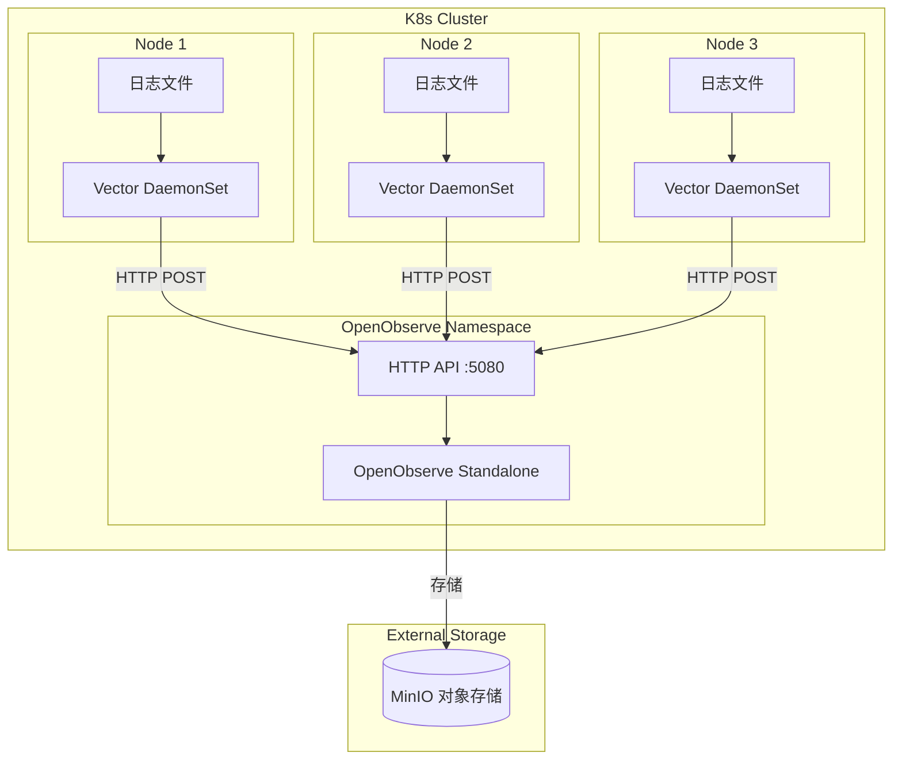
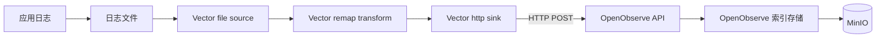
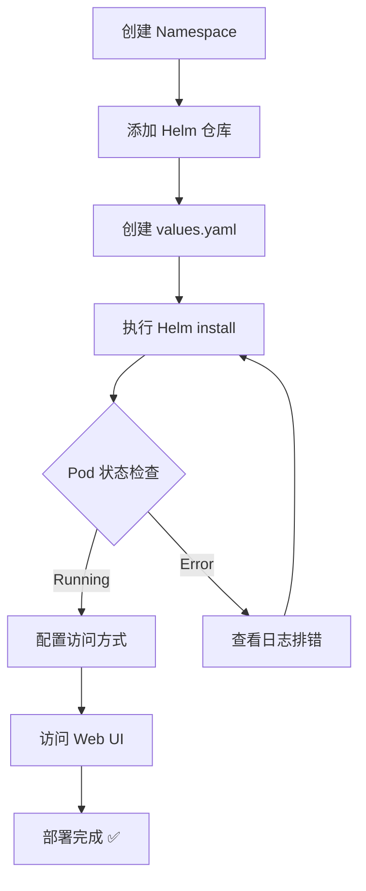

# 架构设计与 OpenObserve 部署

> 📊 **难度**：🟡 进阶 | ⏱️ **阅读时间**：25 分钟
>
> 📝 **本章摘要**：介绍 OpenObserve + Vector 的整体架构设计，并通过 Helm 在 Kubernetes 上部署 OpenObserve Standalone 模式。

---

## 🎯 学习目标

学完本章后，你将能够：

- 理解 OpenObserve + Vector 的日志采集架构
- 了解 OpenObserve 的核心特性
- 在 Kubernetes 上部署 OpenObserve Standalone 模式
- 配置 OpenObserve 的基础参数

---

## 📋 前置要求

- 🔧 **Kubernetes 集群**：已运行的 K8s 集群（Minikube、Kind、EKS、GKE 等）
- ⎈ **Helm 3.x**：已安装 Helm 包管理器
- 🖥️ **kubectl**：已配置集群访问权限

---

## 🏗️ 整体架构概述

### 架构图



### 组件职责

| 组件 | 职责 | 部署方式 |
|------|------|---------|
| **OpenObserve** | 日志存储、索引、查询、可视化 | Deployment (Standalone) |
| **Vector** | 日志采集、解析、转发 | DaemonSet (每节点一个) |
| **MinIO** | 对象存储后端 | 外部服务（后续博客详解） |

### 数据流向



---

## 📦 OpenObserve 简介

### 什么是 OpenObserve？

[OpenObserve](https://openobserve.ai/) 是一个云原生的可观测性平台，支持日志、指标、链路追踪的统一存储与分析。

### 核心特性

| 特性 | 说明 |
|------|------|
| **高性能** | 基于 Rust 开发，资源消耗低 |
| **统一平台** | Logs、Metrics、Traces 三合一 |
| **低成本存储** | 支持 S3/MinIO 等对象存储 |
| **易于部署** | 单二进制文件，支持 Helm |
| **兼容性** | 兼容 Elasticsearch API |

### Standalone vs HA 模式

| 模式 | 适用场景 | 特点 |
|------|---------|------|
| **Standalone** | 开发测试、小规模生产 | 单节点，部署简单 |
| **HA** | 大规模生产环境 | 多节点，高可用 |

本教程使用 **Standalone 模式**，适合入门学习和中小规模场景。

---

## 🚀 部署步骤

### 步骤 1：创建 Namespace

```bash
kubectl create namespace openobserve
```

**✅ 检查点：** 执行 `kubectl get ns openobserve` 确认 Namespace 已创建。

---

### 步骤 2：添加 Helm 仓库

```bash
# 添加 OpenObserve Helm 仓库
helm repo add openobserve https://charts.openobserve.ai

# 更新仓库索引
helm repo update
```

**✅ 检查点：** 执行 `helm search repo openobserve` 应显示可用的 chart：

```
NAME                            CHART VERSION   APP VERSION
openobserve/openobserve         x.x.x           x.x.x
```

---

### 步骤 3：创建 values.yaml

创建 `openobserve-values.yaml` 文件：

```yaml
# OpenObserve Standalone 部署配置
# 文件：openobserve-values.yaml

# 副本数（Standalone 模式为 1）
replicaCount: 1

# 镜像配置
image:
  repository: public.ecr.aws/zinclabs/openobserve
  pullPolicy: IfNotPresent
  # tag: "latest"  # 使用 chart 默认版本

# 服务配置
service:
  type: ClusterIP
  port: 5080

# 资源限制
resources:
  requests:
    cpu: "256m"
    memory: "512Mi"
  limits:
    cpu: "1"
    memory: "2Gi"

# 认证配置
auth:
  # 初始管理员账户
  ZO_ROOT_USER_EMAIL: "admin@example.com"      # 请替换为实际邮箱
  ZO_ROOT_USER_PASSWORD: "your-secure-password" # 请替换为强密码

# 存储配置（本地存储，生产环境建议使用 MinIO/S3）
persistence:
  enabled: true
  size: 10Gi
  storageClass: ""  # 使用默认 StorageClass

# 数据保留配置
config:
  ZO_DATA_DIR: "/data"
  ZO_HTTP_PORT: "5080"
  ZO_TELEMETRY: "false"  # 禁用遥测

# 探针配置
livenessProbe:
  enabled: true
  initialDelaySeconds: 30
  periodSeconds: 10

readinessProbe:
  enabled: true
  initialDelaySeconds: 5
  periodSeconds: 5
```

**配置说明：**

| 配置项 | 说明 |
|--------|------|
| `replicaCount` | Standalone 模式固定为 1 |
| `ZO_ROOT_USER_EMAIL` | 管理员登录邮箱 |
| `ZO_ROOT_USER_PASSWORD` | 管理员密码（请使用强密码） |
| `persistence.size` | 数据存储大小 |
| `resources` | Pod 资源限制 |

---

### 步骤 4：执行 Helm 安装

```bash
helm install openobserve openobserve/openobserve \
  --namespace openobserve \
  -f openobserve-values.yaml
```

**✅ 检查点：** 等待 Pod 就绪：

```bash
kubectl get pods -n openobserve -w
```

预期输出：

```
NAME                           READY   STATUS    RESTARTS   AGE
openobserve-xxxxxxxxx-xxxxx    1/1     Running   0          2m
```

---

### 步骤 5：验证部署状态

```bash
# 查看 Pod 状态
kubectl get pods -n openobserve

# 查看 Service
kubectl get svc -n openobserve

# 查看 Pod 日志
kubectl logs -n openobserve -l app.kubernetes.io/name=openobserve --tail=50
```

**✅ 检查点：** 日志中应包含 `Starting OpenObserve` 或类似启动成功信息。

---

### 步骤 6：配置访问

#### 方式 1：端口转发（开发测试）

```bash
kubectl port-forward svc/openobserve 5080:5080 -n openobserve
```

然后访问：`http://localhost:5080`

#### 方式 2：Ingress（生产环境）

创建 Ingress 资源（可选）：

```yaml
# openobserve-ingress.yaml
apiVersion: networking.k8s.io/v1
kind: Ingress
metadata:
  name: openobserve-ingress
  namespace: openobserve
  annotations:
    nginx.ingress.kubernetes.io/proxy-body-size: "100m"
spec:
  ingressClassName: nginx
  rules:
  - host: openobserve.your-domain.com  # 请替换为实际域名
    http:
      paths:
      - path: /
        pathType: Prefix
        backend:
          service:
            name: openobserve
            port:
              number: 5080
```

---

### 部署流程图



---

## 🌐 访问 OpenObserve

### 登录 Web UI

1. 打开浏览器访问 `http://localhost:5080`（或 Ingress 域名）
2. 使用配置的管理员账户登录：
   - **邮箱**：`admin@example.com`（values.yaml 中配置）
   - **密码**：`your-secure-password`（values.yaml 中配置）

### Web UI 功能

| 功能 | 说明 |
|------|------|
| **Logs** | 日志搜索与分析 |
| **Streams** | 数据流管理 |
| **Dashboards** | 可视化仪表板 |
| **Alerts** | 告警规则配置 |
| **Ingestion** | 数据接入配置 |

---

## ⚙️ 配置详解

### API 端点

| 端点 | 用途 | 示例 |
|------|------|------|
| `/api/{org}/{stream}/_json` | JSON 日志写入 | `/api/default/logs/_json` |
| `/api/{org}/{stream}/_bulk` | Bulk 批量写入 | `/api/default/logs/_bulk` |
| `/api/{org}/_search` | 日志搜索 | POST 查询 |

### 存储配置（MinIO）

> 💡 **注意**：MinIO 的详细配置将在后续博客中介绍。

简要配置示例：

```yaml
config:
  ZO_S3_SERVER_URL: "http://minio.minio:9000"
  ZO_S3_ACCESS_KEY: "your-access-key"
  ZO_S3_SECRET_KEY: "your-secret-key"
  ZO_S3_BUCKET_NAME: "openobserve"
  ZO_S3_REGION_NAME: "us-east-1"
```

---

## 总结

本章我们完成了：

1. ✅ 了解了 OpenObserve + Vector 的整体架构
2. ✅ 理解了各组件的职责和数据流向
3. ✅ 通过 Helm 部署了 OpenObserve Standalone 模式
4. ✅ 验证了部署状态并访问了 Web UI

下一章我们将部署 Vector DaemonSet，配置日志采集并发送到 OpenObserve。

---

| ⬅️ 上一章 | 🏠 目录 | 下一章 ➡️ |
|:----------|:------:|----------:|
| - | [返回目录](../../) | [Vector DaemonSet 配置与部署](../02-Vector部署/01-DaemonSet配置与部署.md) |

