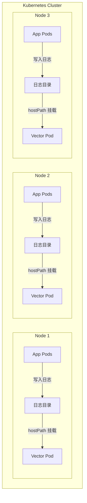
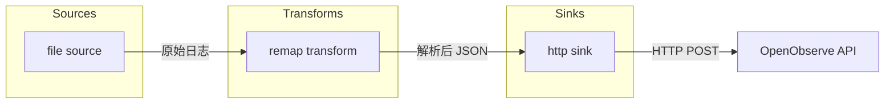

# Vector DaemonSet 配置与部署

> 📊 **难度**：🟡 进阶 | ⏱️ **阅读时间**：30 分钟
>
> 📝 **本章摘要**：通过 Helm 部署 Vector DaemonSet，详细解析 Sources、Transforms、Sinks 配置，实现节点日志采集并发送到 OpenObserve。

---

## 🎯 学习目标

学完本章后，你将能够：

- 理解 Vector DaemonSet 的工作原理
- 通过 Helm 部署 Vector 到 Kubernetes
- 配置 file source 采集节点日志
- 使用 remap transform 解析 JSON 日志
- 配置 http sink 发送数据到 OpenObserve

---

## 📋 前置要求

- ✅ OpenObserve 已部署并运行（上一章内容）
- 🔧 节点上存在日志文件（`/var/logs/` 目录）
- ⎈ Helm 3.x 已安装

---

## 📦 Vector 简介

### 什么是 Vector？

[Vector](https://vector.dev/) 是由 Datadog 开发的高性能可观测性数据管道，用于采集、转换和路由日志、指标和链路追踪数据。

### 核心特性

| 特性 | 说明 |
|------|------|
| **高性能** | 基于 Rust 开发，内存安全、性能卓越 |
| **可靠性** | 支持端到端确认、磁盘缓冲 |
| **灵活性** | 丰富的 Sources、Transforms、Sinks |
| **VRL** | Vector Remap Language，强大的数据转换语言 |

### 与其他工具对比

| 工具 | 语言 | 内存占用 | 特点 |
|------|------|---------|------|
| **Vector** | Rust | 低 | 高性能、现代化 |
| **Fluentd** | Ruby | 中 | 插件生态丰富 |
| **Filebeat** | Go | 低 | Elastic 生态 |
| **Logstash** | Java | 高 | 功能强大但较重 |

---

## 🏗️ DaemonSet 架构

### 节点分布图



### DaemonSet 工作原理

| 特性 | 说明 |
|------|------|
| **每节点一个 Pod** | Kubernetes 自动在每个节点部署一个 Vector Pod |
| **hostPath 挂载** | 将节点的 `/var/logs` 挂载到 Pod 内 |
| **本地采集** | 每个 Vector Pod 只采集本节点的日志 |
| **自动扩缩** | 节点增减时自动调整 Pod 数量 |

---

## 🚀 部署步骤

### 步骤 1：添加 Vector Helm 仓库

```bash
# 添加 Vector Helm 仓库
helm repo add vector https://helm.vector.dev

# 更新仓库索引
helm repo update
```

**✅ 检查点：** 执行 `helm search repo vector` 应显示可用的 chart：

```
NAME                    CHART VERSION   APP VERSION
vector/vector           x.x.x           x.x.x
```

---

### 步骤 2：创建 values.yaml

创建 `vector-values.yaml` 文件：

```yaml
# Vector DaemonSet 部署配置
# 文件：vector-values.yaml

# 部署角色：Agent（DaemonSet 模式）
role: Agent

# 自定义配置
customConfig:
  # 数据目录
  data_dir: /var/lib/vector

  # API 配置（用于健康检查和调试）
  api:
    enabled: true
    address: 127.0.0.1:8686
    playground: false

  # ==================== Sources ====================
  # 数据来源配置
  sources:
    # 应用日志采集
    application_logs:
      type: "file"
      # 包含的日志路径
      include:
        - "/var/logs/**/*.log"
      # 排除的日志路径
      exclude:
        - "/var/logs/xxl-job-admin/**/*.log"  # 排除特定应用
      # 忽略超过 24 小时的旧日志
      ignore_older_secs: 86400
      # 从文件末尾开始读取（首次启动）
      read_from: "beginning"

  # ==================== Transforms ====================
  # 数据转换配置
  transforms:
    # JSON 解析转换
    parse_json:
      type: "remap"
      inputs:
        - "application_logs"
      # VRL 脚本：解析 JSON 格式日志
      source: |-
        . = parse_json!(string!(.message))

  # ==================== Sinks ====================
  # 数据输出配置
  sinks:
    # 发送到 OpenObserve
    openobserve:
      type: "http"
      inputs:
        - "parse_json"
      # OpenObserve API 地址
      # 格式：http://<service>.<namespace>:<port>/api/<org>/<stream>/_json
      uri: "http://openobserve.openobserve:5080/api/default/application/_json"
      method: "post"
      # 认证配置
      auth:
        strategy: "basic"
        user: "admin@example.com"        # 请替换为实际用户名
        password: "your-secure-password"  # 请替换为实际密码
      # 编码配置
      encoding:
        codec: "json"
        timestamp_format: "rfc3339"
      # 禁用健康检查（OpenObserve 不需要）
      healthcheck:
        enabled: false
      # 批量发送配置
      batch:
        max_bytes: 10485760  # 10MB
        timeout_secs: 5
      # 请求配置
      request:
        retry_max_duration_secs: 30

# ==================== Pod 配置 ====================
# 资源限制
resources:
  requests:
    cpu: "100m"
    memory: "128Mi"
  limits:
    cpu: "500m"
    memory: "512Mi"

# 容忍度（允许在所有节点运行）
tolerations:
  - operator: Exists

# hostPath 挂载配置
extraVolumes:
  - name: var-logs
    hostPath:
      path: /var/logs
      type: DirectoryOrCreate

extraVolumeMounts:
  - name: var-logs
    mountPath: /var/logs
    readOnly: true
```

---

### 步骤 3：执行 Helm 安装

```bash
helm install vector vector/vector \
  --namespace openobserve \
  -f vector-values.yaml
```

**✅ 检查点：** 查看 DaemonSet 状态：

```bash
kubectl get daemonset -n openobserve
```

预期输出（假设 3 节点集群）：

```
NAME     DESIRED   CURRENT   READY   UP-TO-DATE   AVAILABLE   NODE SELECTOR   AGE
vector   3         3         3       3            3           <none>          2m
```

---

### 步骤 4：验证 Pod 状态

```bash
# 查看所有 Vector Pod
kubectl get pods -n openobserve -l app.kubernetes.io/name=vector -o wide

# 查看 Pod 日志
kubectl logs -n openobserve -l app.kubernetes.io/name=vector --tail=50
```

**✅ 检查点：** 日志中应包含类似信息：

```
INFO vector::sources::file: Starting file source...
INFO vector::sinks::http: Healthcheck passed.
```

---

## ⚙️ 配置详解

### 数据流程图



### Sources 配置详解

#### file source

```yaml
sources:
  application_logs:
    type: "file"                    # 源类型：文件
    include:
      - "/var/logs/**/*.log"        # 递归匹配所有 .log 文件
    exclude:
      - "/var/logs/xxl-job-admin/**/*.log"  # 排除特定目录
    ignore_older_secs: 86400        # 忽略 24 小时前的日志
    read_from: "beginning"          # 首次启动从文件开头读取
```

| 配置项 | 说明 | 默认值 |
|--------|------|--------|
| `type` | 源类型 | - |
| `include` | 包含的文件路径（支持 glob） | - |
| `exclude` | 排除的文件路径 | `[]` |
| `ignore_older_secs` | 忽略旧文件的秒数 | 无限制 |
| `read_from` | 首次读取位置：`beginning` 或 `end` | `end` |

---

### Transforms 配置详解

#### remap transform

```yaml
transforms:
  parse_json:
    type: "remap"                   # 转换类型：VRL 重映射
    inputs:
      - "application_logs"          # 输入源
    source: |-
      . = parse_json!(string!(.message))
```

**VRL 语法解析：**

```
. = parse_json!(string!(.message))
│   │           │       └── 获取 message 字段
│   │           └── 转换为字符串（确保类型安全）
│   └── 解析 JSON（! 表示失败时中止）
└── 将解析结果赋值给根对象
```

**示例转换：**

输入（原始日志）：
```json
{
  "message": "{\"level\":\"INFO\",\"time\":\"2025-01-28\",\"msg\":\"Hello\"}"
}
```

输出（解析后）：
```json
{
  "level": "INFO",
  "time": "2025-01-28",
  "msg": "Hello"
}
```

---

### Sinks 配置详解

#### http sink

```yaml
sinks:
  openobserve:
    type: "http"                    # 输出类型：HTTP
    inputs:
      - "parse_json"                # 输入源（transform 输出）
    uri: "http://openobserve.openobserve:5080/api/default/application/_json"
    method: "post"
    auth:
      strategy: "basic"
      user: "admin@example.com"     # 请替换为实际用户名
      password: "your-secure-password"  # 请替换为实际密码
    encoding:
      codec: "json"
      timestamp_format: "rfc3339"
    healthcheck:
      enabled: false
```

**OpenObserve API URI 格式：**

```
http://<service>.<namespace>:<port>/api/<org>/<stream>/_json
         │          │         │         │       │
         │          │         │         │       └── 数据流名称
         │          │         │         └── 组织名称（默认 default）
         │          │         └── 服务端口
         │          └── Kubernetes Namespace
         └── Kubernetes Service 名称
```

| 配置项 | 说明 |
|--------|------|
| `uri` | OpenObserve API 端点 |
| `auth.strategy` | 认证策略：`basic`、`bearer` |
| `encoding.codec` | 编码格式：`json`、`text` |
| `healthcheck.enabled` | 是否启用健康检查 |
| `batch.max_bytes` | 批量发送最大字节数 |
| `batch.timeout_secs` | 批量发送超时时间 |

---

## 📄 完整配置文件

以下是完整的 `vector-values.yaml`，带有详细注释：

```yaml
# =============================================================================
# Vector DaemonSet 完整配置
# 用途：采集 Kubernetes 节点日志并发送到 OpenObserve
# =============================================================================

# 部署角色
# - Agent: DaemonSet 模式（每节点一个 Pod）
# - Aggregator: Deployment 模式（集中处理）
role: Agent

# =============================================================================
# Vector 核心配置
# =============================================================================
customConfig:
  # 数据持久化目录
  data_dir: /var/lib/vector

  # Vector API 配置
  api:
    enabled: true           # 启用 API（用于健康检查）
    address: 127.0.0.1:8686 # 监听地址
    playground: false       # 禁用调试界面

  # ---------------------------------------------------------------------------
  # Sources：数据来源
  # ---------------------------------------------------------------------------
  sources:
    application_logs:
      type: "file"
      include:
        - "/var/logs/**/*.log"           # 采集所有 .log 文件
      exclude:
        - "/var/logs/xxl-job-admin/**/*.log"  # 排除特定应用
      ignore_older_secs: 86400           # 忽略 24 小时前的文件
      read_from: "beginning"             # 从文件开头读取

  # ---------------------------------------------------------------------------
  # Transforms：数据转换
  # ---------------------------------------------------------------------------
  transforms:
    parse_json:
      type: "remap"
      inputs:
        - "application_logs"
      source: |-
        # 将 message 字段解析为 JSON 并展开
        . = parse_json!(string!(.message))

  # ---------------------------------------------------------------------------
  # Sinks：数据输出
  # ---------------------------------------------------------------------------
  sinks:
    openobserve:
      type: "http"
      inputs:
        - "parse_json"
      uri: "http://openobserve.openobserve:5080/api/default/application/_json"
      method: "post"
      auth:
        strategy: "basic"
        user: "admin@example.com"         # ⚠️ 请替换为实际用户名
        password: "your-secure-password"  # ⚠️ 请替换为实际密码
      encoding:
        codec: "json"
        timestamp_format: "rfc3339"
      healthcheck:
        enabled: false
      # 批量配置
      batch:
        max_bytes: 10485760   # 10MB
        timeout_secs: 5
      # 重试配置
      request:
        retry_max_duration_secs: 30

# =============================================================================
# Kubernetes Pod 配置
# =============================================================================

# 资源限制
resources:
  requests:
    cpu: "100m"
    memory: "128Mi"
  limits:
    cpu: "500m"
    memory: "512Mi"

# 容忍度：允许在所有节点运行（包括 master）
tolerations:
  - operator: Exists

# 挂载节点日志目录
extraVolumes:
  - name: var-logs
    hostPath:
      path: /var/logs
      type: DirectoryOrCreate

extraVolumeMounts:
  - name: var-logs
    mountPath: /var/logs
    readOnly: true
```

---

## ✅ 验证数据流

### 1. 检查 Vector 日志

```bash
kubectl logs -n openobserve -l app.kubernetes.io/name=vector --tail=100 | grep -E "(INFO|WARN|ERROR)"
```

### 2. 生成测试日志

在任意节点上创建测试日志：

```bash
# 进入节点或在 Pod 中执行
echo '{"level":"INFO","msg":"Test log from Vector","time":"2025-01-28T10:00:00Z"}' >> /var/logs/test.log
```

### 3. 在 OpenObserve 查询

1. 访问 OpenObserve Web UI
2. 进入 **Logs** 页面
3. 选择 **Stream**: `application`
4. 搜索：`msg:Test`

---

## 总结

本章我们完成了：

1. ✅ 理解了 Vector DaemonSet 的工作原理
2. ✅ 通过 Helm 部署了 Vector Agent
3. ✅ 详细解析了 Sources、Transforms、Sinks 配置
4. ✅ 验证了日志数据流转

下一章我们将进行端到端验证，并学习常见问题的排查方法。

---

| ⬅️ 上一章 | 🏠 目录 | 下一章 ➡️ |
|:----------|:------:|----------:|
| [架构设计与 OpenObserve 部署](../01-OpenObserve部署/01-架构设计与部署.md) | [返回目录](../../) | [验证与排错指南](../03-集成排错/01-验证与排错指南.md) |

