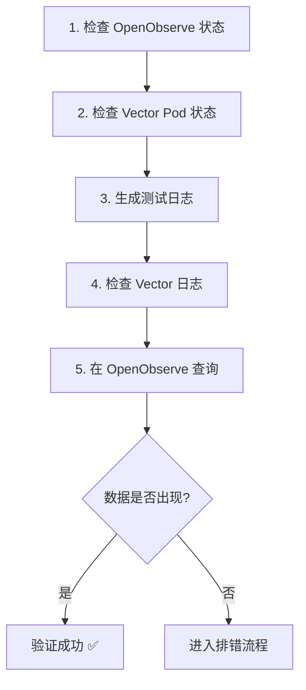
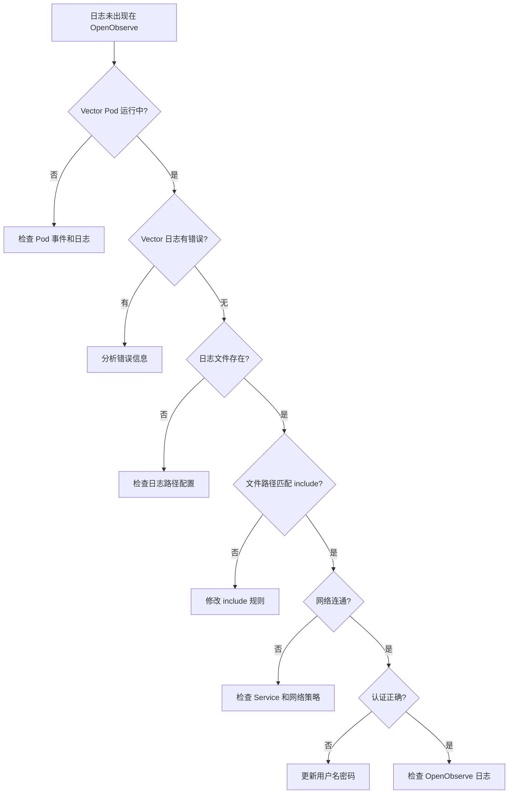

# 集成验证与排错指南

> 📊 **难度**：🟡 进阶 | ⏱️ **阅读时间**：20 分钟
>
> 📝 **本章摘要**：进行端到端的日志采集验证，学习常见问题的排查方法和性能调优建议。

---

## 🎯 学习目标

学完本章后，你将能够：

- 进行端到端的日志采集验证
- 排查 Vector Pod 启动和运行问题
- 诊断日志采集和发送失败的原因
- 了解性能调优的关键参数

---

## ✅ 端到端验证

### 验证步骤概览



### 步骤 1：检查 OpenObserve 状态

```bash
# 检查 Pod 状态
kubectl get pods -n openobserve -l app.kubernetes.io/name=openobserve

# 检查 Service
kubectl get svc -n openobserve

# 测试 API 连通性
kubectl run curl-test --rm -it --image=curlimages/curl --restart=Never -- \
  curl -s -o /dev/null -w "%{http_code}" \
  http://openobserve.openobserve:5080/healthz
```

**✅ 检查点：** 
- Pod 状态为 `Running`
- HTTP 响应码为 `200`

---

### 步骤 2：检查 Vector Pod 状态

```bash
# 检查 DaemonSet 状态
kubectl get daemonset -n openobserve -l app.kubernetes.io/name=vector

# 检查所有 Vector Pod
kubectl get pods -n openobserve -l app.kubernetes.io/name=vector -o wide

# 检查 Pod 事件
kubectl describe pod -n openobserve -l app.kubernetes.io/name=vector | grep -A 10 Events
```

**✅ 检查点：**
- DaemonSet READY 数量等于节点数
- 所有 Pod 状态为 `Running`
- 无异常事件

---

### 步骤 3：生成测试日志

```bash
# 方法 1：在节点上直接创建（需要 SSH 到节点）
echo '{"level":"INFO","msg":"E2E Test Log","timestamp":"2025-01-28T12:00:00Z","source":"test"}' \
  >> /var/logs/e2e-test.log

# 方法 2：通过 DaemonSet Pod 创建
kubectl exec -n openobserve $(kubectl get pods -n openobserve -l app.kubernetes.io/name=vector -o jsonpath='{.items[0].metadata.name}') -- \
  sh -c 'echo "{\"level\":\"INFO\",\"msg\":\"E2E Test\",\"time\":\"$(date -Iseconds)\"}" >> /var/logs/e2e-test.log'
```

---

### 步骤 4：检查 Vector 日志

```bash
# 查看最近日志
kubectl logs -n openobserve -l app.kubernetes.io/name=vector --tail=100

# 过滤关键信息
kubectl logs -n openobserve -l app.kubernetes.io/name=vector --tail=200 | \
  grep -E "(INFO|WARN|ERROR|e2e-test)"
```

**✅ 检查点：** 应看到类似日志：

```
INFO vector::sources::file: Starting file source
INFO vector::sinks::http: Request successful
```

---

### 步骤 5：在 OpenObserve 查询

1. 访问 OpenObserve Web UI
2. 进入 **Logs** 页面
3. 选择 **Stream**: `application`
4. 设置时间范围：**Last 15 minutes**
5. 搜索：`msg:"E2E Test"`

**✅ 检查点：** 应看到测试日志记录。

---

### 验证检查清单

| 序号 | 检查项 | 命令/操作 | 预期结果 |
|:----:|--------|----------|---------|
| 1 | OpenObserve Pod | `kubectl get pods -n openobserve` | Running |
| 2 | Vector DaemonSet | `kubectl get ds -n openobserve` | READY = 节点数 |
| 3 | 网络连通性 | `curl healthz` | HTTP 200 |
| 4 | Vector 日志 | `kubectl logs` | 无 ERROR |
| 5 | 数据查询 | OpenObserve UI | 数据可见 |

---

## 🔧 常见问题排错

### 排错决策树



---

### 问题 1：Vector Pod 未运行

**症状：**
```
NAME           DESIRED   CURRENT   READY   UP-TO-DATE   AVAILABLE
vector         3         3         0       3            0
```

**排查步骤：**

```bash
# 查看 Pod 状态
kubectl get pods -n openobserve -l app.kubernetes.io/name=vector

# 查看 Pod 详情
kubectl describe pod -n openobserve -l app.kubernetes.io/name=vector

# 查看 Pod 日志
kubectl logs -n openobserve -l app.kubernetes.io/name=vector
```

**常见原因及解决方案：**

| 原因 | 解决方案 |
|------|---------|
| 镜像拉取失败 | 检查镜像名称和网络；配置镜像拉取 Secret |
| 资源不足 | 降低 resources.requests |
| 卷挂载失败 | 检查 hostPath 是否存在 |
| 配置错误 | 验证 values.yaml 语法 |

---

### 问题 2：日志未被采集

**症状：** Vector 运行正常，但 OpenObserve 无数据。

**排查步骤：**

```bash
# 1. 检查日志文件是否存在
kubectl exec -n openobserve <vector-pod> -- ls -la /var/logs/

# 2. 检查 Vector 内部指标
kubectl exec -n openobserve <vector-pod> -- \
  curl -s http://127.0.0.1:8686/metrics | grep vector_

# 3. 检查 file source 状态
kubectl logs -n openobserve <vector-pod> | grep "file source"
```

**常见原因及解决方案：**

| 原因 | 解决方案 |
|------|---------|
| 路径不匹配 | 检查 `include` glob 模式 |
| 文件被 exclude | 移除错误的 exclude 规则 |
| 文件过旧 | 调整 `ignore_older_secs` |
| 权限问题 | 检查 hostPath 挂载权限 |

**验证 glob 模式：**

```bash
# 在 Vector Pod 内测试路径匹配
kubectl exec -n openobserve <vector-pod> -- \
  find /var/logs -name "*.log" -type f 2>/dev/null
```

---

### 问题 3：数据未到达 OpenObserve

**症状：** Vector 采集到日志，但发送失败。

**排查步骤：**

```bash
# 1. 检查 Vector sink 日志
kubectl logs -n openobserve <vector-pod> | grep -E "(sink|http|error)"

# 2. 测试网络连通性
kubectl exec -n openobserve <vector-pod> -- \
  curl -v http://openobserve.openobserve:5080/healthz

# 3. 测试 API 认证
kubectl exec -n openobserve <vector-pod> -- \
  curl -u "admin@example.com:your-password" \
  -X POST http://openobserve.openobserve:5080/api/default/test/_json \
  -H "Content-Type: application/json" \
  -d '[{"msg":"test"}]'
```

**常见错误及解决方案：**

| 错误信息 | 原因 | 解决方案 |
|---------|------|---------|
| `Connection refused` | Service 不存在或端口错误 | 检查 Service 名称和端口 |
| `401 Unauthorized` | 认证失败 | 更新 user/password |
| `404 Not Found` | API 路径错误 | 检查 uri 格式 |
| `Request timeout` | 网络问题或 OpenObserve 过载 | 检查网络策略；增加资源 |

---

### 问题 4：JSON 解析失败

**症状：** Vector 日志显示 `parse_json` 失败。

**错误示例：**

```
WARN transform{component_kind="transform" component_id=parse_json}: 
  vector::transforms::remap: Remap error. error="function call error: 
  unable to parse json: expected value at line 1 column 1"
```

**排查步骤：**

```bash
# 查看原始日志格式
kubectl exec -n openobserve <vector-pod> -- \
  head -5 /var/logs/your-app.log
```

**解决方案：**

1. **非 JSON 日志**：修改 transform 或移除 JSON 解析

```yaml
transforms:
  add_metadata:
    type: "remap"
    inputs: ["application_logs"]
    source: |-
      # 保留原始消息，添加元数据
      .raw_message = .message
      .source = "vector"
```

2. **JSON 格式错误**：修复应用日志输出

3. **使用容错解析**：

```yaml
source: |-
  # 尝试解析 JSON，失败则保留原始消息
  parsed, err = parse_json(.message)
  if err == null {
    . = parsed
  }
```

---

## 📊 日志与监控

### Vector 内部指标

Vector 暴露 Prometheus 格式的指标：

```bash
# 获取 Vector 指标
kubectl exec -n openobserve <vector-pod> -- \
  curl -s http://127.0.0.1:8686/metrics
```

**关键指标：**

| 指标 | 说明 |
|------|------|
| `vector_component_received_events_total` | 接收的事件数 |
| `vector_component_sent_events_total` | 发送的事件数 |
| `vector_component_errors_total` | 错误数 |
| `vector_buffer_events` | 缓冲区事件数 |

### OpenObserve 健康检查

```bash
# 健康检查端点
curl http://openobserve.openobserve:5080/healthz

# API 状态
curl -u "admin@example.com:password" \
  http://openobserve.openobserve:5080/api/default/_streams
```

---

## ⚡ 性能调优建议

### Vector 配置优化

| 配置项 | 说明 | 建议值 |
|--------|------|--------|
| `batch.max_bytes` | 批量大小 | 5-10 MB |
| `batch.timeout_secs` | 批量超时 | 5-10 秒 |
| `request.concurrency` | 并发请求数 | 根据目标承受能力 |
| `buffer.type` | 缓冲类型 | `disk`（生产）/ `memory`（测试） |

**高吞吐量配置示例：**

```yaml
sinks:
  openobserve:
    # ... 其他配置 ...
    batch:
      max_bytes: 10485760    # 10MB
      max_events: 10000      # 最大事件数
      timeout_secs: 5
    buffer:
      type: disk
      max_size: 268435488    # 256MB
    request:
      concurrency: 10
      rate_limit_num: 100
      rate_limit_duration_secs: 1
```

### 资源配置建议

| 场景 | CPU | 内存 |
|------|-----|------|
| 小型（< 100 logs/s） | 100m | 128Mi |
| 中型（100-1000 logs/s） | 500m | 512Mi |
| 大型（> 1000 logs/s） | 1000m | 1Gi |

---

## ❓ 常见问题 FAQ

| 问题 | 解答 |
|------|------|
| **Vector Pod 重启循环** | 检查 OOM 或配置错误；增加内存限制或简化配置 |
| **日志延迟过高** | 减小 `batch.timeout_secs`；增加 `concurrency` |
| **磁盘空间不足** | 设置 `buffer.max_size`；配置 `ignore_older_secs` |
| **部分日志丢失** | 启用 `disk` buffer；检查 `acknowledgements` |
| **CPU 使用过高** | 简化 transform 逻辑；增加 `batch.timeout_secs` |
| **内存持续增长** | 检查 buffer 配置；设置内存限制 |
| **认证突然失败** | OpenObserve 密码可能已更新；检查 Secret 同步 |
| **Stream 不存在** | OpenObserve 会自动创建；检查 API 路径拼写 |

---

## 总结

本章我们完成了：

1. ✅ 端到端的日志采集验证流程
2. ✅ 常见问题的诊断方法（排错决策树）
3. ✅ 4 类典型问题的详细排查步骤
4. ✅ 性能调优的关键参数和建议

至此，OpenObserve + Vector 的 Kubernetes 日志采集系列完成。你已经掌握了：

- 整体架构设计
- OpenObserve Standalone 部署
- Vector DaemonSet 配置
- 端到端验证与排错

---

## 🔗 后续学习

- **MinIO 存储配置**：生产环境的对象存储后端（后续博客）
- **告警配置**：基于日志的告警规则
- **Dashboard 构建**：可视化日志分析仪表板

---

| ⬅️ 上一章 | 🏠 目录 | 下一章 ➡️ |
|:----------|:------:|----------:|
| [Vector DaemonSet 配置与部署](../02-Vector部署/01-DaemonSet配置与部署.md) | [返回目录](../../) | - |

