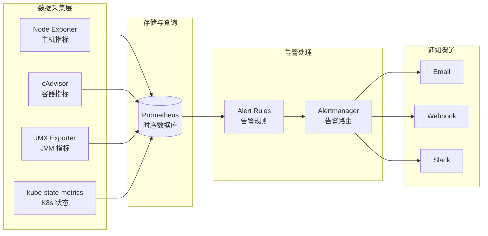
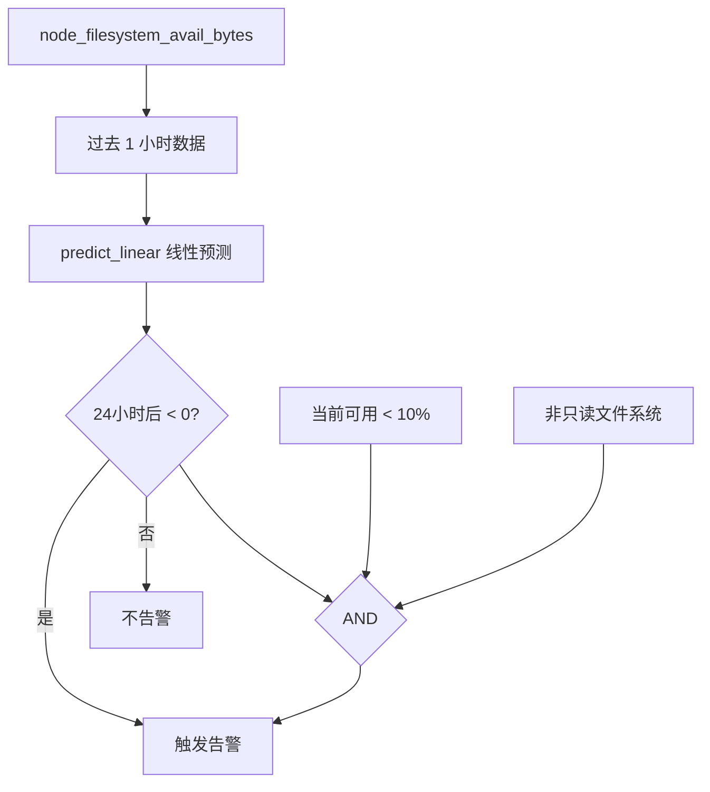
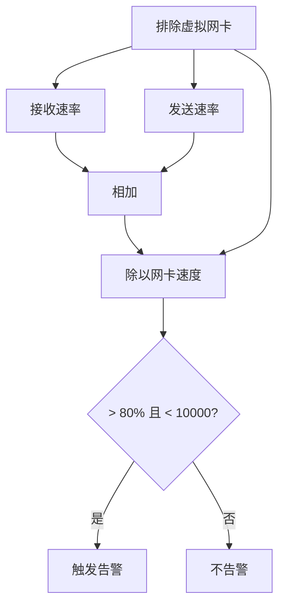
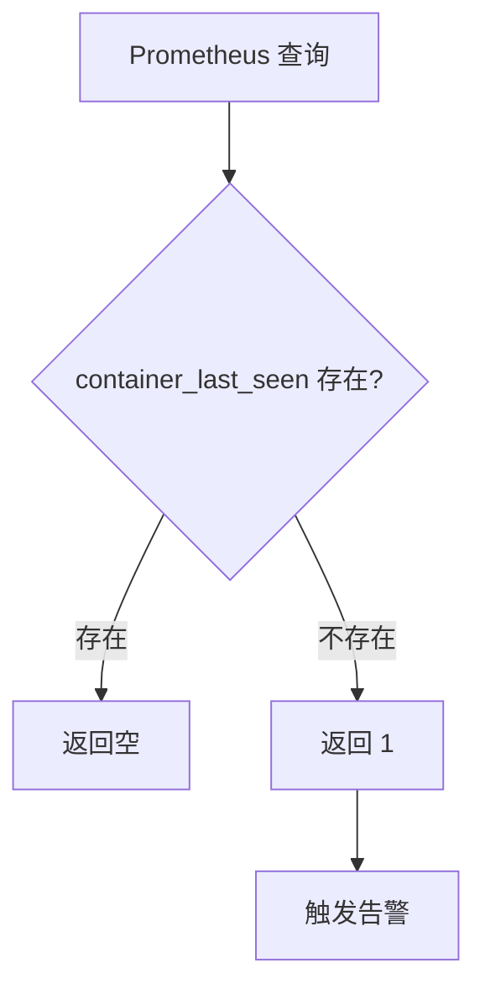
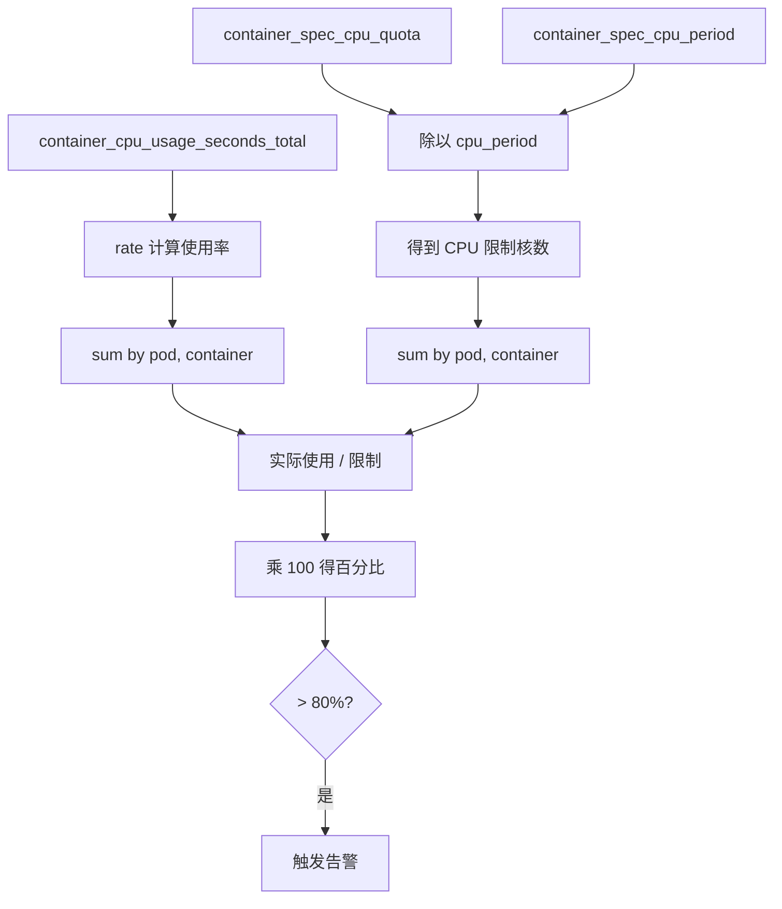
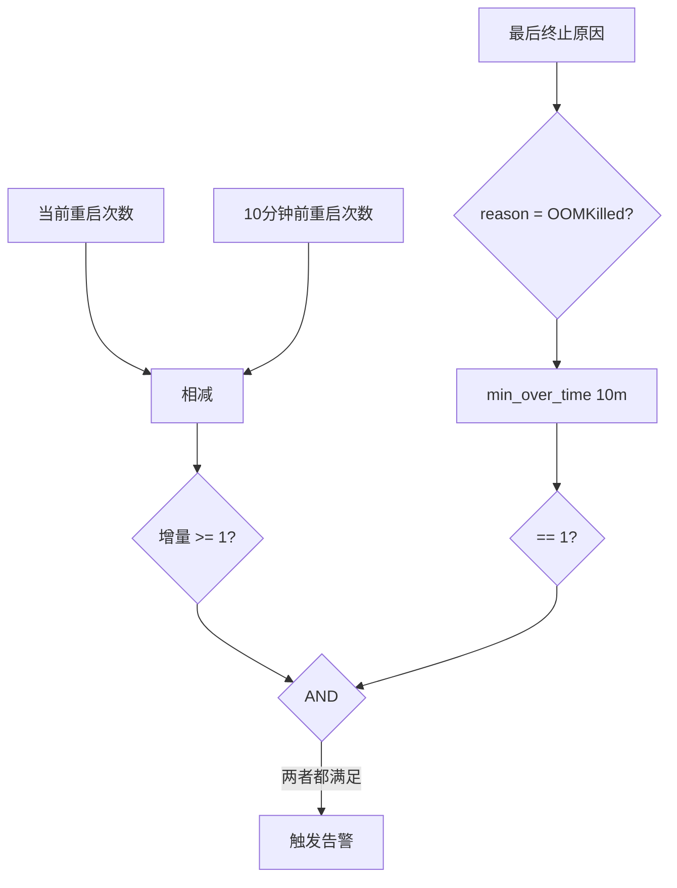

# Prometheus 常用告警规则深度解析

> 📊 **难度**：🟡 进阶 | ⏱️ **阅读时间**：45 分钟
>
> 📝 **本章摘要**：深入解析 24 条常用 Prometheus 告警规则，涵盖主机、容器、JVM、Kubernetes 等监控维度，详解 PromQL 表达式设计原理与调优建议。

---

## 🎯 学习目标

学完本章后，你将能够：

- 理解 Prometheus 告警规则的基本结构（alert、expr、for、labels、annotations）
- 掌握 24 条常用告警规则的 PromQL 表达式
- 理解 `rate()`、`predict_linear()`、`on() group_left()` 等核心函数
- 能够根据实际场景调整告警阈值
- 了解各指标的数据来源（Node Exporter、cAdvisor、JMX Exporter 等）

---

## 📋 告警速查表

| 序号 | 告警名称 | 分类 | 阈值 | 级别 | 持续时间 |
|:----:|---------|------|------|:----:|:--------:|
| 1 | HostOutOfMemory | 主机-内存 | < 10% 可用 | ⚠️ | 2m |
| 2 | HostOomKillDetected | 主机-内存 | > 0 次 | ⚠️ | 0m |
| 3 | HostHighCpuLoad | 主机-CPU | > 80% | ⚠️ | 10m |
| 4 | HostContextSwitchingHigh | 主机-CPU | > 2x 日均 | ⚠️ | 0m |
| 5 | HostOutOfDiskSpace | 主机-磁盘 | < 10% 可用 | ⚠️ | 2m |
| 6 | HostOutOfInodes | 主机-磁盘 | < 10% 可用 | ⚠️ | 2m |
| 7 | HostDiskWillFillIn24Hours | 主机-磁盘 | 预测 24h 内满 | ⚠️ | 2m |
| 8 | HostUnusualDiskReadRate | 主机-磁盘 | > 50 MB/s | ⚠️ | 5m |
| 9 | HostUnusualDiskWriteRate | 主机-磁盘 | > 50 MB/s | ⚠️ | 2m |
| 10 | HostUnusualDiskReadLatency | 主机-磁盘 | > 100ms | ⚠️ | 2m |
| 11 | HostUnusualDiskWriteLatency | 主机-磁盘 | > 100ms | ⚠️ | 2m |
| 12 | HostUnusualDiskIo | 主机-磁盘 | > 50% IO 时间 | ⚠️ | 5m |
| 13 | HostUnusualNetworkThroughputIn | 主机-网络 | > 100 MB/s | ⚠️ | 5m |
| 14 | HostUnusualNetworkThroughputOut | 主机-网络 | > 100 MB/s | ⚠️ | 5m |
| 15 | HostNetworkInterfaceSaturated | 主机-网络 | > 80% 带宽 | ⚠️ | 1m |
| 16 | ContainerKilled | 容器-生命周期 | 消失 > 60s | ⚠️ | 0m |
| 17 | ContainerAbsent | 容器-生命周期 | 缺失 > 5m | ⚠️ | 5m |
| 18 | ContainerHighCpuUtilization | 容器-资源 | > 80% | ⚠️ | 2m |
| 19 | ContainerHighMemoryUsage | 容器-资源 | > 80% | ⚠️ | 2m |
| 20 | ContainerVolumeUsage | 容器-资源 | > 80% | ⚠️ | 2m |
| 21 | ContainerHighThrottleRate | 容器-资源 | > 25% | ⚠️ | 5m |
| 22 | ContainerLowCpuUtilization | 容器-优化 | < 20% | ℹ️ | 7d |
| 23 | ContainerLowMemoryUsage | 容器-优化 | < 20% | ℹ️ | 7d |
| 24 | JvmMemoryFillingUp | JVM | > 80% 堆内存 | ⚠️ | 2m |
| 25 | KubernetesContainerOomKiller | K8s | OOM 重启 | ⚠️ | 0m |

---

## 🏗️ 监控架构概览



**Exporter 与指标对照：**

| Exporter | 指标前缀 | 监控对象 |
|----------|---------|---------|
| Node Exporter | `node_*` | 主机 CPU、内存、磁盘、网络 |
| cAdvisor | `container_*` | 容器资源使用 |
| JMX Exporter | `jvm_*` | JVM 内存、GC |
| kube-state-metrics | `kube_*` | K8s 资源状态 |

---

## 📦 主机监控告警

### 内存告警

#### HostOutOfMemory

| 属性 | 值 |
|------|-----|
| **级别** | warning |
| **持续时间** | 2m |
| **阈值** | 可用内存 < 10% |
| **指标来源** | Node Exporter |

**PromQL 表达式：**

```promql
(
  node_memory_MemAvailable_bytes 
  / node_memory_MemTotal_bytes 
  * 100 < 10
) 
* on(instance) group_left(nodename) 
  node_uname_info{nodename=~".+"}
```

**表达式解析：**

1. **`node_memory_MemAvailable_bytes`**：当前可用内存（包括 free + buffers + cached）
2. **`node_memory_MemTotal_bytes`**：总内存
3. **`* 100 < 10`**：计算百分比并判断是否小于 10%
4. **`on(instance) group_left(nodename)`**：通过 `instance` 标签关联 `node_uname_info`，将主机名 `nodename` 添加到结果中

**💡 调优提示：** 生产环境建议将阈值调整为 15-20%，给系统预留更多缓冲空间。

---

#### HostOomKillDetected

| 属性 | 值 |
|------|-----|
| **级别** | warning |
| **持续时间** | 0m |
| **阈值** | 检测到 OOM Kill |
| **指标来源** | Node Exporter |

**PromQL 表达式：**

```promql
(
  increase(node_vmstat_oom_kill[1m]) > 0
) 
* on(instance) group_left(nodename) 
  node_uname_info{nodename=~".+"}
```

**表达式解析：**

1. **`node_vmstat_oom_kill`**：系统 OOM Killer 触发次数（Counter 类型）
2. **`increase(...[1m])`**：计算 1 分钟内的增量
3. **`> 0`**：只要有增量就触发告警

**💡 调优提示：** 此告警触发意味着系统内存严重不足，应立即排查内存泄漏或扩容。

---

### CPU 告警

#### HostHighCpuLoad

| 属性 | 值 |
|------|-----|
| **级别** | warning |
| **持续时间** | 10m |
| **阈值** | CPU 使用率 > 80% |
| **指标来源** | Node Exporter |

**PromQL 表达式：**

```promql
(
  sum by (instance) (
    avg by (mode, instance) (
      rate(node_cpu_seconds_total{mode!="idle"}[2m])
    )
  ) > 0.8
) 
* on(instance) group_left(nodename) 
  node_uname_info{nodename=~".+"}
```

**表达式解析：**

1. **`node_cpu_seconds_total{mode!="idle"}`**：排除空闲时间的 CPU 使用时间
2. **`rate(...[2m])`**：计算 2 分钟内的每秒增长率
3. **`avg by (mode, instance)`**：按 CPU 模式和实例计算平均值
4. **`sum by (instance)`**：汇总所有非空闲模式的 CPU 使用率
5. **`> 0.8`**：大于 80%（0.8）触发告警

**💡 调优提示：** 持续时间设为 10m 可避免短暂峰值触发告警；批处理服务器可适当提高阈值至 90%。

---

#### HostContextSwitchingHigh

| 属性 | 值 |
|------|-----|
| **级别** | warning |
| **持续时间** | 0m |
| **阈值** | 上下文切换 > 2 倍日均值 |
| **指标来源** | Node Exporter |

**PromQL 表达式：**

```promql
(
  rate(node_context_switches_total[15m])
  / count without(mode,cpu) (node_cpu_seconds_total{mode="idle"})
) 
/ (
  rate(node_context_switches_total[1d])
  / count without(mode,cpu) (node_cpu_seconds_total{mode="idle"})
) > 2
```

**表达式解析：**

1. **`node_context_switches_total`**：系统上下文切换总次数
2. **`rate(...[15m])` vs `rate(...[1d])`**：比较 15 分钟和 1 天的速率
3. **`count without(mode,cpu)`**：计算 CPU 核心数，用于标准化
4. **`> 2`**：当前速率超过日均 2 倍时告警

**💡 调优提示：** 此告警依赖历史数据，新部署的系统可能误报；阈值可根据应用特性调整。

---

### 磁盘告警

#### 空间与 Inode

##### HostOutOfDiskSpace

| 属性 | 值 |
|------|-----|
| **级别** | warning |
| **持续时间** | 2m |
| **阈值** | 磁盘可用空间 < 10% |
| **指标来源** | Node Exporter |

**PromQL 表达式：**

```promql
(
  (node_filesystem_avail_bytes * 100) 
  / node_filesystem_size_bytes < 10 
  and ON (instance, device, mountpoint) 
  node_filesystem_readonly == 0
) 
* on(instance) group_left(nodename) 
  node_uname_info{nodename=~".+"}
```

**表达式解析：**

1. **`node_filesystem_avail_bytes`**：文件系统可用空间
2. **`node_filesystem_size_bytes`**：文件系统总大小
3. **`and ... node_filesystem_readonly == 0`**：排除只读文件系统
4. **`ON (instance, device, mountpoint)`**：按实例、设备、挂载点匹配

**💡 调优提示：** 建议配合 `--collector.filesystem.ignored-mount-points=^/(sys|proc|dev|run)($|/)` 排除虚拟文件系统。

---

##### HostOutOfInodes

| 属性 | 值 |
|------|-----|
| **级别** | warning |
| **持续时间** | 2m |
| **阈值** | Inode 可用 < 10% |
| **指标来源** | Node Exporter |

**PromQL 表达式：**

```promql
(
  node_filesystem_files_free{fstype!="msdosfs"} 
  / node_filesystem_files{fstype!="msdosfs"} 
  * 100 < 10 
  and ON (instance, device, mountpoint) 
  node_filesystem_readonly == 0
) 
* on(instance) group_left(nodename) 
  node_uname_info{nodename=~".+"}
```

**表达式解析：**

1. **`node_filesystem_files_free`**：可用 Inode 数量
2. **`node_filesystem_files`**：总 Inode 数量
3. **`{fstype!="msdosfs"}`**：排除 FAT 文件系统（无 Inode 概念）

**💡 调优提示：** Inode 耗尽常见于大量小文件场景（如邮件服务器、缓存目录），注意清理临时文件。

---

##### HostDiskWillFillIn24Hours

| 属性 | 值 |
|------|-----|
| **级别** | warning |
| **持续时间** | 2m |
| **阈值** | 预测 24 小时内磁盘将满 |
| **指标来源** | Node Exporter |

**PromQL 表达式：**

```promql
(
  (node_filesystem_avail_bytes * 100) / node_filesystem_size_bytes < 10 
  and ON (instance, device, mountpoint) 
  predict_linear(node_filesystem_avail_bytes{fstype!~"tmpfs"}[1h], 24 * 3600) < 0 
  and ON (instance, device, mountpoint) 
  node_filesystem_readonly == 0
) 
* on(instance) group_left(nodename) 
  node_uname_info{nodename=~".+"}
```

**表达式解析：**



1. **`predict_linear(...[1h], 24 * 3600)`**：基于过去 1 小时的数据，预测 24 小时（86400 秒）后的值
2. **`< 0`**：预测值小于 0 意味着磁盘将被填满
3. **组合条件**：当前已低于 10% + 预测将满 + 非只读

**💡 调优提示：** 此告警可提前预警，建议结合日志轮转、清理策略使用。

---

#### 读写速率

##### HostUnusualDiskReadRate

| 属性 | 值 |
|------|-----|
| **级别** | warning |
| **持续时间** | 5m |
| **阈值** | 磁盘读取 > 50 MB/s |
| **指标来源** | Node Exporter |

**PromQL 表达式：**

```promql
(
  sum by (instance) (
    rate(node_disk_read_bytes_total[2m])
  ) / 1024 / 1024 > 50
) 
* on(instance) group_left(nodename) 
  node_uname_info{nodename=~".+"}
```

**表达式解析：**

1. **`node_disk_read_bytes_total`**：磁盘读取的总字节数（Counter）
2. **`rate(...[2m])`**：计算 2 分钟内的每秒读取速率
3. **`/ 1024 / 1024`**：转换为 MB/s
4. **`sum by (instance)`**：汇总所有磁盘

**💡 调优提示：** SSD 环境可适当提高阈值；数据库服务器需根据实际 IO 模式调整。

---

##### HostUnusualDiskWriteRate

| 属性 | 值 |
|------|-----|
| **级别** | warning |
| **持续时间** | 2m |
| **阈值** | 磁盘写入 > 50 MB/s |
| **指标来源** | Node Exporter |

**PromQL 表达式：**

```promql
(
  sum by (instance) (
    rate(node_disk_written_bytes_total[2m])
  ) / 1024 / 1024 > 50
) 
* on(instance) group_left(nodename) 
  node_uname_info{nodename=~".+"}
```

**表达式解析：**

1. **`node_disk_written_bytes_total`**：磁盘写入的总字节数
2. 其他逻辑与读取速率相同

**💡 调优提示：** 持续高写入可能导致磁盘寿命缩短（尤其 SSD），需关注写放大问题。

---

#### 读写延迟

##### HostUnusualDiskReadLatency

| 属性 | 值 |
|------|-----|
| **级别** | warning |
| **持续时间** | 2m |
| **阈值** | 读延迟 > 100ms |
| **指标来源** | Node Exporter |

**PromQL 表达式：**

```promql
(
  rate(node_disk_read_time_seconds_total[1m]) 
  / rate(node_disk_reads_completed_total[1m]) > 0.1 
  and rate(node_disk_reads_completed_total[1m]) > 0
) 
* on(instance) group_left(nodename) 
  node_uname_info{nodename=~".+"}
```

**表达式解析：**

1. **`node_disk_read_time_seconds_total`**：读操作总耗时
2. **`node_disk_reads_completed_total`**：完成的读操作次数
3. **两者相除**：得到每次读操作的平均延迟
4. **`> 0.1`**：大于 100ms（0.1 秒）
5. **`and ... > 0`**：确保有读操作发生，避免除零

**💡 调优提示：** HDD 正常延迟约 10-20ms，SSD 约 0.1-1ms；超过 100ms 通常表示磁盘故障或过载。

---

##### HostUnusualDiskWriteLatency

| 属性 | 值 |
|------|-----|
| **级别** | warning |
| **持续时间** | 2m |
| **阈值** | 写延迟 > 100ms |
| **指标来源** | Node Exporter |

**PromQL 表达式：**

```promql
(
  rate(node_disk_write_time_seconds_total[1m]) 
  / rate(node_disk_writes_completed_total[1m]) > 0.1 
  and rate(node_disk_writes_completed_total[1m]) > 0
) 
* on(instance) group_left(nodename) 
  node_uname_info{nodename=~".+"}
```

**表达式解析：** 与读延迟逻辑相同，监控写操作延迟。

**💡 调优提示：** 写延迟高可能与 fsync 频率、RAID 写惩罚有关。

---

#### IO 性能

##### HostUnusualDiskIo

| 属性 | 值 |
|------|-----|
| **级别** | warning |
| **持续时间** | 5m |
| **阈值** | IO 时间 > 50% |
| **指标来源** | Node Exporter |

**PromQL 表达式：**

```promql
(
  rate(node_disk_io_time_seconds_total[1m]) > 0.5
) 
* on(instance) group_left(nodename) 
  node_uname_info{nodename=~".+"}
```

**表达式解析：**

1. **`node_disk_io_time_seconds_total`**：磁盘处于 IO 状态的总时间
2. **`rate(...[1m])`**：每秒中花在 IO 上的时间比例
3. **`> 0.5`**：超过 50% 时间在做 IO

**💡 调优提示：** 建议调整 Alertmanager 的 `repeat_interval` 为每日或每周，避免频繁告警。

---

### 网络告警

#### HostUnusualNetworkThroughputIn

| 属性 | 值 |
|------|-----|
| **级别** | warning |
| **持续时间** | 5m |
| **阈值** | 入流量 > 100 MB/s |
| **指标来源** | Node Exporter |

**PromQL 表达式：**

```promql
(
  sum by (instance) (
    rate(node_network_receive_bytes_total[2m])
  ) / 1024 / 1024 > 100
) 
* on(instance) group_left(nodename) 
  node_uname_info{nodename=~".+"}
```

**表达式解析：**

1. **`node_network_receive_bytes_total`**：网卡接收的总字节数
2. **`rate(...[2m])`**：计算每秒接收速率
3. **`/ 1024 / 1024`**：转换为 MB/s

**💡 调优提示：** 千兆网卡理论最大约 125 MB/s，万兆约 1.25 GB/s，根据实际带宽调整。

---

#### HostUnusualNetworkThroughputOut

| 属性 | 值 |
|------|-----|
| **级别** | warning |
| **持续时间** | 5m |
| **阈值** | 出流量 > 100 MB/s |
| **指标来源** | Node Exporter |

**PromQL 表达式：**

```promql
(
  sum by (instance) (
    rate(node_network_transmit_bytes_total[2m])
  ) / 1024 / 1024 > 100
) 
* on(instance) group_left(nodename) 
  node_uname_info{nodename=~".+"}
```

**表达式解析：** 与入流量逻辑相同，监控发送流量。

**💡 调优提示：** 文件服务器、CDN 节点可能需要更高阈值。

---

#### HostNetworkInterfaceSaturated

| 属性 | 值 |
|------|-----|
| **级别** | warning |
| **持续时间** | 1m |
| **阈值** | 网卡带宽使用 > 80% |
| **指标来源** | Node Exporter |

**PromQL 表达式：**

```promql
(
  (
    rate(node_network_receive_bytes_total{device!~"^tap.*|^vnet.*|^veth.*|^tun.*"}[1m]) 
    + rate(node_network_transmit_bytes_total{device!~"^tap.*|^vnet.*|^veth.*|^tun.*"}[1m])
  ) 
  / node_network_speed_bytes{device!~"^tap.*|^vnet.*|^veth.*|^tun.*"} > 0.8 < 10000
) 
* on(instance) group_left(nodename) 
  node_uname_info{nodename=~".+"}
```

**表达式解析：**



1. **`{device!~"^tap.*|^vnet.*|^veth.*|^tun.*"}`**：排除虚拟网卡（tap、vnet、veth、tun）
2. **`node_network_speed_bytes`**：网卡协商速度
3. **`> 0.8 < 10000`**：使用率超过 80% 但小于 10000（排除异常值）

**💡 调优提示：** 虚拟网卡的速度指标可能不准确，建议通过正则排除。

---

## 🐳 容器监控告警

### 生命周期告警

#### ContainerKilled

| 属性 | 值 |
|------|-----|
| **级别** | warning |
| **持续时间** | 0m |
| **阈值** | 容器消失 > 60 秒 |
| **指标来源** | cAdvisor |

**PromQL 表达式：**

```promql
time() - container_last_seen{pod!=""} > 60
```

**表达式解析：**

1. **`container_last_seen`**：容器最后被观测到的时间戳
2. **`time()`**：当前时间戳
3. **`time() - container_last_seen > 60`**：超过 60 秒未被观测到

**💡 调优提示：** 在动态编排环境（如 K8s 滚动更新）中，此告警可能频繁触发，建议结合部署状态判断。

---

#### ContainerAbsent

| 属性 | 值 |
|------|-----|
| **级别** | warning |
| **持续时间** | 5m |
| **阈值** | 容器指标完全消失 |
| **指标来源** | cAdvisor |

**PromQL 表达式：**

```promql
absent(container_last_seen)
```

**表达式解析：**



1. **`absent()`**：当指标完全不存在时返回 1
2. 用于检测 cAdvisor 是否正常采集容器指标

**💡 调优提示：** 此告警通常意味着 cAdvisor 故障或容器运行时异常。

---

### 资源使用告警

#### ContainerHighCpuUtilization

| 属性 | 值 |
|------|-----|
| **级别** | warning |
| **持续时间** | 2m |
| **阈值** | CPU 使用率 > 80% |
| **指标来源** | cAdvisor |

**PromQL 表达式：**

```promql
(
  sum(rate(container_cpu_usage_seconds_total{container!=""}[5m])) by (pod, container) 
  / sum(container_spec_cpu_quota{container!=""}/container_spec_cpu_period{container!=""}) by (pod, container) 
  * 100
) > 80
```

**表达式解析：**



1. **`container_cpu_usage_seconds_total`**：容器 CPU 使用时间
2. **`container_spec_cpu_quota / container_spec_cpu_period`**：容器 CPU 限制（核数）
3. **计算公式**：`(实际使用 / CPU 限制) * 100`

**💡 调优提示：** 确保容器设置了 CPU limits，否则分母可能为 0 导致异常。

---

#### ContainerHighMemoryUsage

| 属性 | 值 |
|------|-----|
| **级别** | warning |
| **持续时间** | 2m |
| **阈值** | 内存使用 > 80% |
| **指标来源** | cAdvisor |

**PromQL 表达式：**

```promql
(
  sum(container_memory_working_set_bytes{name!=""}) BY (instance, name) 
  / sum(container_spec_memory_limit_bytes > 0) BY (instance, name) 
  * 100
) > 80
```

**表达式解析：**

1. **`container_memory_working_set_bytes`**：容器工作集内存（不含可回收缓存）
2. **`container_spec_memory_limit_bytes > 0`**：过滤有内存限制的容器
3. **计算公式**：`(工作集内存 / 内存限制) * 100`

**💡 调优提示：** working_set 比 RSS 更能反映实际内存压力，接近限制时可能触发 OOM。

---

#### ContainerVolumeUsage

| 属性 | 值 |
|------|-----|
| **级别** | warning |
| **持续时间** | 2m |
| **阈值** | 卷 Inode 使用 > 80% |
| **指标来源** | cAdvisor |

**PromQL 表达式：**

```promql
(
  1 - (
    sum(container_fs_inodes_free{name!=""}) BY (instance) 
    / sum(container_fs_inodes_total) BY (instance)
  )
) * 100 > 80
```

**表达式解析：**

1. **`container_fs_inodes_free`**：容器文件系统可用 Inode
2. **`container_fs_inodes_total`**：总 Inode
3. **`1 - (free/total)`**：计算使用率

**💡 调优提示：** 容器内大量小文件可能快速耗尽 Inode，注意清理临时文件。

---

#### ContainerHighThrottleRate

| 属性 | 值 |
|------|-----|
| **级别** | warning |
| **持续时间** | 5m |
| **阈值** | CPU 节流 > 25% |
| **指标来源** | cAdvisor |

**PromQL 表达式：**

```promql
sum(increase(container_cpu_cfs_throttled_periods_total{container!=""}[5m])) by (container, pod, namespace) 
/ sum(increase(container_cpu_cfs_periods_total[5m])) by (container, pod, namespace) 
> ( 25 / 100 )
```

**表达式解析：**

1. **`container_cpu_cfs_throttled_periods_total`**：被节流的 CFS 周期数
2. **`container_cpu_cfs_periods_total`**：总 CFS 周期数
3. **节流率**：被节流周期 / 总周期
4. **`> 0.25`**：超过 25% 的时间被节流

**💡 调优提示：** 高节流率意味着 CPU limits 设置过低，应用性能受限，考虑提高 limits。

---

### 资源优化告警

#### ContainerLowCpuUtilization

| 属性 | 值 |
|------|-----|
| **级别** | info |
| **持续时间** | 7d |
| **阈值** | CPU 使用率 < 20%（持续 7 天） |
| **指标来源** | cAdvisor |

**PromQL 表达式：**

```promql
(
  sum(rate(container_cpu_usage_seconds_total{container!=""}[5m])) by (pod, container) 
  / sum(container_spec_cpu_quota{container!=""}/container_spec_cpu_period{container!=""}) by (pod, container) 
  * 100
) < 20
```

**表达式解析：** 与 ContainerHighCpuUtilization 相同，但判断条件为 `< 20`。

**💡 调优提示：** 此告警用于资源优化，建议降低 CPU requests/limits 以节省成本。

---

#### ContainerLowMemoryUsage

| 属性 | 值 |
|------|-----|
| **级别** | info |
| **持续时间** | 7d |
| **阈值** | 内存使用 < 20%（持续 7 天） |
| **指标来源** | cAdvisor |

**PromQL 表达式：**

```promql
(
  sum(container_memory_working_set_bytes{name!=""}) BY (instance, name) 
  / sum(container_spec_memory_limit_bytes > 0) BY (instance, name) 
  * 100
) < 20
```

**表达式解析：** 与 ContainerHighMemoryUsage 相同，但判断条件为 `< 20`。

**💡 调优提示：** 持续低内存使用表明可以降低 memory limits，但需预留一定缓冲。

---

## ☕ JVM 监控告警

#### JvmMemoryFillingUp

| 属性 | 值 |
|------|-----|
| **级别** | warning |
| **持续时间** | 2m |
| **阈值** | 堆内存使用 > 80% |
| **指标来源** | JMX Exporter |

**PromQL 表达式：**

```promql
(
  sum by (instance)(jvm_memory_used_bytes{area="heap"}) 
  / sum by (instance)(jvm_memory_max_bytes{area="heap"})
) * 100 > 80
```

**表达式解析：**

1. **`jvm_memory_used_bytes{area="heap"}`**：JVM 堆内存已使用量
2. **`jvm_memory_max_bytes{area="heap"}`**：JVM 堆内存最大值（-Xmx）
3. **`sum by (instance)`**：按实例汇总（多个内存池）
4. **`* 100 > 80`**：使用率超过 80%

**💡 调优提示：** 
- 持续高于 80% 可能导致频繁 Full GC，影响应用性能
- 检查是否存在内存泄漏
- 考虑增加堆内存或优化对象生命周期

---

## ☸️ Kubernetes 告警

#### KubernetesContainerOomKiller

| 属性 | 值 |
|------|-----|
| **级别** | warning |
| **持续时间** | 0m |
| **阈值** | 10 分钟内因 OOM 重启 |
| **指标来源** | kube-state-metrics |

**PromQL 表达式：**

```promql
(
  kube_pod_container_status_restarts_total 
  - kube_pod_container_status_restarts_total offset 10m >= 1
) 
and ignoring (reason) 
min_over_time(
  kube_pod_container_status_last_terminated_reason{reason="OOMKilled"}[10m]
) == 1
```

**表达式解析：**



1. **`kube_pod_container_status_restarts_total`**：容器重启总次数
2. **`offset 10m`**：获取 10 分钟前的值
3. **相减 >= 1**：最近 10 分钟有重启
4. **`kube_pod_container_status_last_terminated_reason{reason="OOMKilled"}`**：最后终止原因是 OOM
5. **`min_over_time(...[10m]) == 1`**：10 分钟内该原因持续存在
6. **`and ignoring (reason)`**：忽略 reason 标签进行关联

**💡 调优提示：** 
- OOM 通常意味着内存 limits 设置过低
- 检查应用是否有内存泄漏
- 使用 `kubectl describe pod` 查看详细 OOM 信息

---

## 💡 调优建议汇总

### 主机监控

| 告警类型 | 调优建议 |
|---------|---------|
| **内存告警** | 生产环境阈值建议 15-20%；关注 swap 使用情况 |
| **CPU 告警** | 批处理服务器可提高至 90%；关注负载均衡 |
| **磁盘空间** | 配合日志轮转；设置定时清理任务 |
| **磁盘 IO** | SSD 环境提高阈值；关注 RAID 写惩罚 |
| **网络** | 根据实际带宽调整；排除虚拟网卡 |

### 容器监控

| 告警类型 | 调优建议 |
|---------|---------|
| **生命周期** | 动态环境结合部署状态；排除滚动更新场景 |
| **CPU 使用率** | 确保设置 limits；关注节流率 |
| **内存使用率** | 使用 working_set 而非 RSS；预留 OOM 缓冲 |
| **低利用率** | 定期审计资源配置；实施成本优化 |

### 阈值设置原则

1. **避免过于敏感**：设置合理的 `for` 持续时间
2. **分级告警**：warning → critical 分级处理
3. **环境差异**：开发/测试/生产使用不同阈值
4. **业务特性**：根据应用类型（Web/批处理/数据库）调整

---

## ❓ 常见问题 FAQ

### Q1: 为什么使用 `rate()` 而不是直接使用 Counter 值？

**A:** Counter 是单调递增的累计值，直接使用没有意义。`rate()` 计算的是每秒增长率，能反映当前的实际速率。例如 `node_cpu_seconds_total` 是累计的 CPU 时间，需要用 `rate()` 转换为 CPU 使用率。

### Q2: `on() group_left()` 是什么作用？

**A:** 这是 PromQL 的向量匹配语法：
- `on(instance)`：指定用于匹配的标签
- `group_left(nodename)`：从右侧向量（`node_uname_info`）中获取 `nodename` 标签添加到结果中

这样可以在告警中显示可读的主机名，而不仅是 IP 地址。

### Q3: `absent()` 什么时候会触发？

**A:** `absent()` 在指标完全不存在时返回 1。常见场景：
- Exporter 宕机
- 目标服务未启动
- 网络故障导致采集失败

### Q4: 为什么容器告警使用 `working_set` 而不是 `rss`？

**A:** 
- **RSS (Resident Set Size)**：包含所有驻留内存，包括共享库
- **Working Set**：实际在使用的内存，不含可回收的缓存

Kubernetes OOM Killer 基于 working_set 判断，因此监控 working_set 更能预测 OOM 风险。

### Q5: `predict_linear()` 的预测准确吗？

**A:** `predict_linear()` 使用简单线性回归，适合趋势稳定的场景。局限性：
- 无法预测突发变化
- 历史数据窗口（如 1h）影响预测结果
- 周期性波动可能导致误判

建议结合实际阈值（如 < 10%）使用，提高准确性。

### Q6: 如何避免告警风暴？

**A:** 几个策略：
1. **设置合理的 `for`**：避免瞬时波动触发
2. **使用 Alertmanager 分组**：相似告警合并
3. **设置 `repeat_interval`**：控制重复告警间隔
4. **使用抑制规则**：高优先级告警抑制低优先级

### Q7: 容器低利用率告警持续 7 天会不会太长？

**A:** 7 天是为了：
- 覆盖完整的业务周期（包含周末）
- 避免误判临时低负载
- 确保是真正的资源浪费

如果需要更快响应，可以调整为 3-5 天，但需接受更多误报。

### Q8: 如何为不同环境设置不同阈值？

**A:** 可以通过标签区分：

```promql
# 生产环境阈值 80%
(... > 80) and on(instance) label_match(env, "prod")

# 开发环境阈值 90%
(... > 90) and on(instance) label_match(env, "dev")
```

或者使用 Prometheus 的 recording rules 预处理不同环境的阈值。

---

## 总结

本文深入解析了 24 条常用 Prometheus 告警规则，涵盖：

| 维度 | 数量 | 核心关注点 |
|------|:----:|-----------|
| 主机监控 | 14 条 | 资源耗尽、性能异常、IO 瓶颈 |
| 容器监控 | 8 条 | 资源限制、生命周期、成本优化 |
| JVM 监控 | 1 条 | 堆内存压力 |
| K8s 监控 | 1 条 | OOM 重启 |

**核心 PromQL 技术：**

- `rate()` / `increase()`：Counter 到速率的转换
- `predict_linear()`：线性预测
- `on() group_left()`：向量匹配与标签合并
- `absent()`：指标缺失检测

建议根据实际业务场景调整告警阈值和持续时间，并结合 Alertmanager 实现告警分级、分组和抑制。

---

| ⬅️ 上一章 | 🏠 目录 | 下一章 ➡️ |
|:----------|:------:|----------:|
| - | [返回目录](../../) | - |

